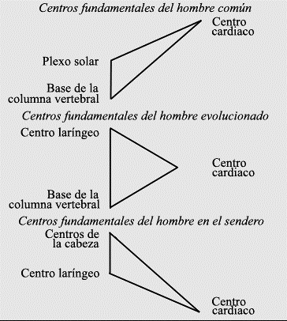

# CARTA IV

# EMPLEO DE LA PALABRA SAGRADA EN LA MEDITACIÓN

1. Postulados fundamentales.
2. Efecto creador de la Palabra Sagrada.
3. Efecto destructor de la Palabra Sagrada.
4. Pronunciación y empleo de la Palabra Sagrada.
5. Efecto de la Palabra Sagrada sobre los centros y cada uno de los cuerpos.

## 9 de junio de 1920.

<pin lang="es">49</pin> <pin lang="en">51</pin> El tema que vamos a tratar hoy es tan profundo y de importancia tan vital, que lógicamente puede desalentar su consideración. No importa lo que podamos decir respecto al tema, sólo lo tocaremos superficialmente y lo que quede sin decir será tanto que los datos impartidos constituirán una pequeña proporción.

### Postulados fundamentales.

Primeramente, deseo sentar ciertos postulados básicos, que aunque admitidos como conceptos mentales, quizás sean todavía demasiados profundos para ser fácilmente comprendidos.

Estos postulados son cinco -los cuales han sido extraídos de una cantidad increíblemente vasta, que les será imposible concebir. Están basados sobre ciertos hechos fundamentales (siete en total), que tampoco han podido ser totalmente comprendidos. H.P.B. trató tres de ellos al exponer los fundamentos de La Doctrina Secreta. Otros cuatro permanecen todavía ocultos, aunque el cuarto va surgiendo del estudio de la Psicología y de la ciencia mental. Los otros tres fundamentos emergerán durante las tres próximas rondas. Durante la ronda actual se comprenderá el cuarto fundamento.

Los referidos postulados son los siguientes:

1. Todo cuanto existe está basado en el sonido o en la Palabra.
2. Diferenciación es el resultado del sonido.
3. la Palabra tiene un efecto diferente en cada plano.
4. <pin lang="en">52</pin> De acuerdo a la nota de la Palabra o a la vibración del sonido, así será el trabajo de construcción o moldeamiento.
5. <pin lang="es">50</pin> La triple Palabra tiene siete claves, y éstas tienen sus propios subtonos.

En la captación de estos hechos básicos se halla oculta mucha luz sobre el empleo de la Palabra en la Meditación.

En la gran enunciación original de la Palabra Sagrada (los tres Alientos originales, con sus siete sonidos -un aliento para cada uno de los tres sistemas solares) la nota fue diferente y los sonidos se entonaron en diferentes claves.

En el primer sistema, se completó el Primer Aliento, la culminación fue la emisión en una nota majestuosa, la nota FA -nota básica del actual sistema y de la naturaleza manifestada. Esta nota es, y a ella se le debe agregar la segunda nota para este segundo sistema, la cual no ha sido plenamente enunciada ni completada, y solo lo estará al terminar el ciclo mayor. El Logos la está emitiendo ahora y si dejara de exhalaría, todo el sistema desaparecería en la oscuración, marcando el fin de la manifestación.

En el segundo sistema, el actual, no puede ser revelada la nota clave. Es uno de los secretos de la sexta iniciación y no debe ser divulgado.

En el tercer sistema, la tercera y final nota se agregará a las notas básicas del primero y segundo sistemas, y luego ¿Qué tendremos? Tendremos la tercera mayor de la Personalidad logoica, en toda su plenitud, una analogía de la tercera mayor del microcosmos -una nota por cada plano. Se dice que el Logos solar trabaja en los planos cósmicos para solucionar el problema de la mente cósmica, que actúa en Su sistema solar físico, y se halla polarizado en Su cuerpo astral, o emocional cósmico, y que está <pin lang="en">53</pin> desarrollando la mente cósmica. Como sucede en los planos del sistema solar lo mismo ocurre en el microcosmos. En la comprensión de esta analogía y su inteligente aplicación se halla la iluminación respecto al empleo de la Palabra Sagrada en la meditación.

|                    |                                  |
| ------------------ | -------------------------------- |
| El primer sistema  | corresponde al cuerpo físico.    |
| El segundo sistema | corresponde al cuerpo emocional. |
| El tercer sistema  | corresponde al cuerpo mental.    |

El estudio de la Palabra o Sonido, en la formación de los tres sistemas, ayudará a comprender su empleo en la construcción del vehículo intuitivo y en la purificación de la personalidad.

Ahora dividiremos en cuatro partes lo que tengo que decir, y trataré cada una por separado:

1. El efecto creador de la Palabra Sagrada.
2. El efecto destructor de la Palabra Sagrada.
3. <pin lang="es">51</pin> Su pronunciación y empleo
   1. en la meditación individual,
   2. en el trabajo grupal y de conjunto,
   3. para ciertos fines específicos.
4. Su efecto en los cuerpos y centros y su eficacia para alcanzar el alineamiento egoico.

## 20 de junio de 1920.

### El doble efecto de la Palabra Sagrada, constructivo y destructivo.

Vamos a continuar con el tema que consideramos ayer. Hemos dividido el tópico en cuatro partes y nos ocuparemos de las dos primeras, el efecto creador y destructivo de la Palabra. Sólo será posible dar pocas indicaciones generales, que permitan establecer una base para la aplicación inteligente de la ley.

Ante todo repetiré la conocida verdad de que los mundos son el efecto del sonido. Primero la vida, después la materia; luego <pin lang="en">54</pin> la materia es atraída a la vida para su manifestación y expresión y la ordenada configuración de esa materia en las formas necesarias. El sonido constituye el factor cohesivo, el impulso propulsor y el medio atrayente. El sonido, en sentido oculto y profundamente metafísico, significa lo que llamamos "la relación entre", siendo el intermediario creador, el tercer factor vinculador en el proceso de la manifestación, el akasha. En los planos más elevados es el agente de esa Gran Entidad que esgrime la ley cósmica de gravedad, en su relación con nuestro sistema solar mientras que en los planos inferiores se manifiesta como luz astral, siendo el gran agente reflector que fija y perpetúa, en su vibrante seno, el pasado, el presente y el futuro, o lo que denominamos Tiempo. En relación directa con el vehículo inferior se manifiesta como electricidad, prana y fluido magnético. Quizás obtengan una idea más clara y sencilla, si consideran al sonido como agente de la ley de atracción y repulsión.

### Los siete grandes Alientos.

El Logos, en su séptuple plenitud, al enunciar la Palabra Sagrada para crear el actual sistema solar, reunió, al inspirar, la materia necesaria para la manifestación, iniciando con el primer gran Aliento la evolución de esa materia,

Con el segundo gran Aliento se estableció la diferenciación y se implantó el segundo aspecto logoico.

Con el tercer gran Aliento se manifestó el aspecto actividad; <pin lang="es">52</pin> la materia se impregnó de esta facultad y la quíntupla evolución llegó a ser una posibilidad.

Con el cuarto gran Aliento algunas de las Jerarquías respondieron, y los grandes Constructores vieron el plan con mayor <pin lang="en">55</pin> claridad. Existe una relación definida entre el cuarto gran Aliento y la Cuarta Jerarquía creadora, o sea la Jerarquía de los Espíritus humanos. Esta cuarta nota del Logos tiene una significación especial para el Espíritu humano y produce un efecto singular en esta tierra y en este cuarto ciclo. La relatividad del mismo es tal, que resultaría difícil que pudieran comprender su efecto. Se manifiesta, hasta donde puedan captarlo, en la nota armónica del cuarto plano y rayo. Esta nota compenetra actualmente a los pueblos del mundo y lo ha hecho desde la cuarta raza raíz. Se demuestra en el esfuerzo que realiza la humanidad para comprender el ideal de armonía y de paz y en la aspiración mundial para lograrlo.

Este cuarto aliento es aplicable especialmente a la evolución humana. Por lo tanto tenemos que:

El primer subtono de la triple Palabra dio la primera nota vibratoria e inició el movimiento de las esferas, solares o atómicas. Personifica la Voluntad.

El segundo subtono de la triple Palabra implantó el segundo aspecto, y trajo al regente cósmico del rayo sintético a la manifestación. Señaló la dualidad o el amor reflejo.

El tercer subtono de la triple Palabra hizo posible nuestra quíntuple evolución. Es la nota básica de los cinco planos inferiores. Marcó la actividad o adaptabilidad.

El cuarto subtono de la triple Palabra es el sonido de la Jerarquía humana y podría denominarse el "grito del hombre".

Cada uno de los sonidos trajo directamente un rayo a la manifestación, con todo lo que éste contiene. Cada sonido se manifiesta particularmente en un plano, siendo la nota dominante de ese plano.

El quinto gran Aliento tiene su propio efecto peculiar, pues en su reverberación contiene la clave de todo -es el Aliento de Fuego. Creó una vibración similar a la del plano mental cósmico y <pin lang="en">56</pin> está íntimamente relacionado con el primer Aliento. Es la nota dominante (en términos técnicos musicales) del sistema solar, lo mismo que el tercer Aliento corresponde a la tercera mayor. Ésta es la nota del Logos. Cada aliento atrae hacia el Logos a alguna entidad que se halla en los niveles cósmicos para que se manifieste. La analogía del método puede verse en el microcosmos, cuando el Ego enuncia la nota egoica en los tres mundos y se prepara para manifestarse o venir a la encarnación. La nota atrae <pin lang="es">53</pin> alrededor de los átomos permanentes o núcleos, la materia adecuada para el propósito de su manifestación, estando a su vez animada por alguna entidad vital. Similarmente, los Señores cósmicos del Fuego, las grandes Entidades que dan forma a nuestro sistema solar, responden cuando se emite este quinto subtono. También los Señores de la Llama, dentro del sistema solar, respondieron cuando el microcosmos enunció el quinto subtono de la nota monádica y se involucraron en la evolución humana.

El sexto gran Aliento atrajo hacia sí a los Señores del misterioso Pentáculo, las esencias volátiles del plano emocional, la facultad del deseo revestida de materia, el aspecto acuoso de la vida logoica.

Al emitirse el séptimo subtono tuvo lugar la cristalización y la absoluta conformidad con la ley de acercamiento, dando por resultado el aspecto denso de la manifestación, el punto más profundo de la experiencia. En consecuencia, observarán a este respecto su relación con el Rayo de la Ley Ceremonial, uno de los grandes rayos constructores -rayo que amolda la materia, de acuerdo a fórmulas establecidas, para que adopten las formas deseadas.

Quizás se pregunten: ¿Por qué me he apartado aparentemente del tema? ¿Les parece que me he apartado y que estoy fuera del tema? Aclararé. El microcosmos solo tiene que repetir el trabajo del macrocosmos. El Espíritu o Mónada, en su propio plano, emite la nota (la nota jerárquica) y desciende a la encarnación. Dicha <pin lang="en">57</pin> nota es a la vez de atracción y de exhalación. La personalidad -reflejo de la mónada en el punto más denso de la evolución- está vinculada a la mónada por la fuerza atractiva de la Palabra Sagrada, emitida por su mónada, su nota y su subtono.

Pero la tarea de exhalación ya ha sido realizada. Es la involución. Prosigue la tarea progresiva de inhalarían o reabsorción en la fuente. *Cuándo la Personalidad encuentra por si misma (después de muchas vidas de esfuerzo y de búsqueda) su nota espiritual, con la clave y subtono correctos, ¿Cuál es el resultado? Concuerda con la nota monádica, vibra al mismo compás y también con el mismo color, encontrando finalmente la línea de menor resistencia, y la vida que la anima se libera y retorna a su propio plano.* Pero este descubrimiento es muy lento, y el hombre ha de buscar el acorde con paciencia y cuidado infinitos. Primero, descubre cuál es la tercera nota de la personalidad y la emite; el resultado es una vida armónica en los tres mundos. Luego encuentra la quinta dominante del Ego, la nota clave del acorde, y la emite al unísono con la nota de la Personalidad. El resultado es que se forma un vacío si puedo expresarlo así- y el hombre <pin lang="es">54</pin> liberado y el alma que lo anima (el triple espíritu más la mente y la experiencia), el Tres, completado con el Cuaternario y el Quinto, asciende hasta la Mónada. Es la ley de atracción demostrándose por el sonido. La unidad de sonido, color y ritmo atrae lo similar y análogo.

:::note Recuerda

Cuándo la Personalidad encuentra por si misma (después de muchas vidas de esfuerzo y de búsqueda) su nota espiritual, con la clave y subtono correctos, ¿Cuál es el resultado? Concuerda con la nota monádica, vibra al mismo compás y también con el mismo color, encontrando finalmente la línea de menor resistencia, y la vida que la anima se libera y retorna a su propio plano.

:::

Esto conduce al segundo de los factores que estamos considerando, el destructivo. Con la emancipación viene la ruptura de las cadenas, y con la liberación la abolición de las viejas formas; cuando se llega a dominar la materia se produce la liberación del espíritu. Por tanto, al emitir la Palabra Sagrada en su séptuple <pin lang="en">58</pin> sentido, el espíritu escapa de las formas desintegradas; primeramente en la exhalación se produce la atracción de la materia, luego, en la inhalación, se produce la gradual destrucción de las formas materiales, las cuales son abandonadas.

### La Meditación y la Palabra.

Hasta aquí he presentado el tema desde el punto de vista del sistema. Ahora lo aplicaré a la meditación y veremos su resultado. Cuando el hombre medita trata de realizar dos cosas:

1. La construcción de ideas, al hacer descender a los niveles concretos del plano mental las ideas abstractas y las intuiciones. Esto es lo que se puede llamar meditación con simiente.
2. El alineamiento del ego y la creación de un vacío entre el cerebro físico y el ego, que da por resultado la afluencia divina, la consiguiente destrucción de las formas y la subsiguiente liberación. Esto se puede llamar: meditación sin simiente.

En determinado periodo de la evolución ambas se fusionan en una, se prescinde de la simiente, entonces se crea el vacío, no tanto entre los vehículos superior e inferior, sino entre ellos y el plano intuitivo o de armonía.

Por consiguiente, al emitir la Palabra Sagrada en la meditación, el hombre debe ser capaz (si se la emite correctamente) de realizar el trabajo creador y el trabajo destructor, como lo hace el Logos. Esto será un reflejo del proceso cósmico en el microcosmos. Atraerá a su cuerpo materia más refinada y expulsara la mas burda. Creará formas mentales que atraerán hacia si materia más refinada y rechazarán las de vibración inferior. Deberá emitir la <pin lang="en">59</pin> Palabra de manera que el alineamiento se produzca automáticamente, y el necesario vacío creado dará por resultado una afluencia desde arriba. Todos estos efectos pueden producirse cuando la Palabra es entonada correctamente, de modo que en cada meditación el <pin lang="es">55</pin> hombre debe estar más alineado, dispersar alguna materia de baja vibración de uno u otro de sus cuerpos, ensanchar el canal y así proporcionar un vehículo más adecuado para recibir la iluminación desde niveles superiores.

Pero, hasta que no pueda hacerlo correctamente, el efecto producido por la emisión de la Palabra es muy insignificante, afortunadamente para aquel que la emplea. Al estudiar los siete grandes Alientos y el efecto de los mismos en cada plano, el estudiante descubrirá mucho de lo que puede ocurrir en los distintos subplanos de cada plano, especialmente en relación con su propio desarrollo. Al estudiar la nota básica del sistema solar (que se estabilizó en el primer sistema) se descubrirá mucho sobre el empleo de la Palabra en el plano físico. Esta indicación es digna de consideración. En el esfuerzo por hallar la nota de este sistema solar, la de amor y sabiduría, el estudiante establecerá la comunicación necesaria entre el plano emocional o de deseos, y el intuitivo, y descubrirá el secreto del plano emocional. Cuando se estudie la Palabra en los planos mentales y el efecto que produce al construir formas, se descubrirá la clave para erigir el Templo de Salomón y el estudiante desarrollará las facultades del cuerpo causal y conseguirá, finalmente, liberarse de los tres mundos. No obstante, debe recordar que primeramente ha de encontrar la nota de su personalidad y luego la egoica, antes de que pueda entonar el acorde monádico. Una vez que haya hecho esto, habrá pronunciado su propia triple Palabra, y será un creador inteligente animado por el amor. Entonces habrá alcanzado la meta.

## 21 de junio de 1920.

### <pin lang="en">60</pin> Algunas indicaciones prácticas.

Esta tarde quisiera aclarar que no es posible, prudente ni adecuado, darles las diferentes claves en que se puede entonar la Palabra Sagrada; sólo puedo indicarles los principios generales. Cada ser humano y cada unidad de conciencia, es tan diferente de las demás, que la necesidad individual sólo puede ser satisfecha cuando el instructor ha desarrollado plenamente la conciencia causal, y el estudiante ha alcanzado un punto en que está dispuesto a "saber, osar y callar". Los peligros del mal empleo de la Palabra son tan grandes, que sólo nos atrevemos a dar ideas básicas y principios fundamentales, dejando que el aspirante desarrolle por si solo los puntos indispensables a su propio desenvolvimiento, practique los experimentos necesarios y descubra, por sí mismo, lo que le hace falta. Únicamente lo que se obtiene por el propio esfuerzo, en dura lucha y amarga experiencia, es de valor permanente y duradero. Sólo cuando el discípulo -en virtud <pin lang="es">56</pin> de sus fracasos, sus éxitos, sus victorias, dificultosamente obtenidas, y las amargas horas que siguen a la derrota-, se ajuste a las condiciones internas, el empleo de la Palabra será de valor científico y experimental. Su falta de voluntad lo defiende, en gran parte, del mal uso de la Palabra, mientras que sus esfuerzos para amar, lo llevan, con el tiempo, a entonarla correctamente. Sólo lo que conocemos por nosotros mismos, se convierte en facultad inherente. Las afirmaciones de un instructor, por muy sabio que sea, no son más que conceptos mentales, hasta que forman parte experimentalmente de la vida del hombre. Por eso sólo puedo señalar el camino y dar indicaciones generales, lo demás debe descubrirlo el que estudia la meditación.

#### <pin lang="en">61</pin> Pronunciación y empleo de La Palabra en La meditación individual.

Ahora seré más práctico. Hablaré para el hombre que se halla en el sendero de probación, que puede por lo tanto captar intelectualmente lo que debe ser realizado y comprende aproximadamente el lugar que ocupa en la evolución y el trabajo a efectuar, si aspira a atravesar algún día el portal de la Iniciación. En consecuencia, lo que diré servirá de enseñanza a la mayoría de quienes estudian estas cartas... El estudiante que emprende la meditación procurará ajustarse a las reglas establecidas. Daré algunas indicaciones preliminares:

El aspirante ha de retirarse diariamente a un lugar tranquilo, donde esté a cubierto de interferencias e interrupciones. Si es posible, lo hará todos los días en el mismo sitio, porque así construirá una especie de cascarón a su alrededor que le servirá de protección, estableciéndose más fácilmente contactos elevados. La materia de ese lugar, es decir, la materia del espacio que lo rodea, se sintonizará con determinada vibración (la propia vibración del hombre, alcanzada en consecutivas meditaciones), lo cual le facilitará el comenzar con una vibración más elevada, eliminando así el largo proceso preliminar de sintonización.

El aspirante adoptará una postura en que pueda llegar a ser inconsciente de su cuerpo físico. No existe una regla fija para ello, porque hay que tener en cuenta que el cuerpo físico puede estar impedido y endurecido o lisiado. Se ha de buscar una postura cómoda, más una actitud alerta y atenta. La pereza y laxitud no conducen a nada. La postura más adecuada para la mayoría es sentarse en el suelo con las piernas cruzadas, apoyándose sobre algo que sostenga la columna vertebral. En los momentos de meditación más intensa y cuando el aspirante es muy práctico y sus centros se están despertando rápidamente (quizás ya con el <pin lang="en">62</pin> fuego interno palpitando en la base de la columna vertebral), la espalda debe mantenerse erguida, sin apoyo. La cabeza no debe echarse <pin lang="es">57</pin> hacia atrás, a fin de evitar tensión, sino estar derecha o con la barbilla ligeramente caída. Si se procede así desaparecerá la rigidez, característica de muchos, y el vehículo inferior quedará relajado. Los ojos deben estar cerrados y las manos cruzadas sobre las piernas. Luego, el aspirante observará si su respiración es regular, constante y uniforme. Después relajará todo el cuerpo, manteniendo la mente positiva y el vehículo físico dócil y obediente.

Luego procurará visualizar los tres cuerpos y después de haber decidido si la meditación se hará en la cabeza o en el corazón (más adelante trataré este punto), entonces retraerá su conciencia allí y se enfocará en cualquiera de los centros. Al hacerlo debe considerar deliberadamente que él es un Hijo de Dios que retorna al Padre; que es Dios mismo que busca Su conciencia; un creador que trata de crear; el aspecto inferior de la Deidad, que trata de alinearse con lo superior. Después entonará tres veces la Palabra Sagrada, emitiéndola suavemente la primera vez, afectando así al vehículo mental; más fuerte la segunda vez, estabilizando el vehículo emocional, y aún más fuerte la tercera y última vez, actuando sobre el vehículo físico. El efecto sobre los tres cuerpos será triple. Si es entonada correctamente, manteniendo firme el centro de la conciencia en cualquiera de los centros elegidos, los efectos serán los siguientes:

En los niveles mentales:

1. Establecer contacto con el centro coronario, haciéndolo vibrar. Aquietar así la mente inferior.
2. <pin lang="en">63</pin> Vincularse con el Ego en mayor o menor grado, pero siempre, hasta cierto punto, por medio del átomo permanente.
3. Expulsar partículas de materia tosca y construir otras más refinadas.

En los niveles emocionales:

1. Estabilizar definitivamente el cuerpo emocional por medio del átomo permanente, estableciendo contacto con el centro cardiaco y activándolo.
2. Expulsar materia burda, haciendo más incoloro el cuerpo emocional o de deseos, a fin de que refleje con más exactitud lo superior.
3. Originar urna repentina afluencia de sentimientos, desde los niveles atómicos del plano emocional al intuitivo, por conducto del canal atmico que existe entre ambos. Dicha afluencia se precipitará hacia arriba y despejará el canal.

En los planos físicos:

1. El efecto será muy similar, pero se sentirá principalmente en el cuerpo etérico, estimulando la afluencia divina.
2. <pin lang="es">58</pin> Irá más allá de la periferia del cuerpo y creará un cascarón que servirá de protección. Rechazará los factores discordantes que puedan existir en el medio ambiente inmediato.

## 22 de junio de 1920.

### El acorde logoico y la analogía.

Proseguiremos ahora estudiando el empleo de la Palabra Sagrada en su aplicación grupal y para ciertos fines determinados. Hemos estudiado brevemente como emplea la Palabra <pin lang="en">64</pin> el individuo que empieza a meditar, **cuyo efecto consiste principalmente en la purificación, estabilización y centralización**. Esto es todo lo que se puede lograr hasta que el estudiante llegue a la etapa donde se le permite emitir la nota en uno de los subtonos egoicos. En la nota egoica tenemos la misma secuencia que en la nota logoica. ¿Cuál era ésta? Un acorde séptuple cuyos puntos importantes, en nuestra etapa actual de desenvolvimiento, son:

1. La nota básica.
2. La tercera mayor.
3. La dominante o quinta.
4. La séptima final. 

Aquí puedo dar un indicio de acuerdo con la analogía. Existe una íntima relación entre la nota quinta o dominante, y el quinto principio, Manas o Mente, y para este sistema solar (aunque no para el primero o tercero) existe una interesante respuesta entre el quinto plano de la mente y la dominante, y entre el sexto plano de las emociones y la tercera mayor. A este respecto, desde algunos puntos de vista, el vehículo emocional constituye un tercer vehículo para la conciencia, contando el físico denso y el vehículo de prana o vitalidad eléctrica, como dos unidades. Nada más puedo decir, porque todo cambia y se interpenetra; pero aquí he dado mucho tema para reflexionar.

En la nota egoica, como dije anteriormente, tenemos una secuencia similar, pues es en su propio plano un reflejo del Logos. Por lo tanto tenemos la nota básica del físico, la tercera del emocional, la quinta de los niveles causales. Una vez que el hombre domina la clave y ha encontrado el propio subtono, entonces entona la Palabra Sagrada con exactitud y alcanza el fin deseado. Su alineamiento será perfecto, sus cuerpos serán puros, el canal <pin lang="en">65</pin> estará libre de obstrucciones y será posible alcanzar la inspiración superior. Ésta es la finalidad de la verdadera meditación, la cual puede alcanzarse mediante el correcto empleo de la Palabra Sagrada. Mientras tanto, debido a que no se tiene un Instructor y a los defectos del estudiante, lo único posible es entonar la Palabra como mejor se pueda sabiendo que no se corre ningún <pin lang="es">59</pin> peligro cuando hay sinceridad de propósito, pudiéndose obtener ciertos resultados, tales como protección, aquietamiento y corrección.

### Empleo grupal de la Palabra.

El efecto de la Palabra empleada en forma grupal se intensifica, siempre que los grupos estén constituidos correctamente; pero se anula y neutraliza si el grupo contiene elementos indeseables. En consecuencia, es necesario comprobar ciertas cosas antes de que un grupo pueda emplear la Palabra adecuadamente:

1. Es conveniente que el grupo esté formado por individuos del mismo rayo o de un rayo complementario.
2. Es deseable que la Palabra sea entonada en el mismo tono o por lo menos armónicamente. Si así se hace, el efecto vibratorio es de gran alcance y ocurrirán ciertas reacciones.

¿Cuáles son, por consiguiente, los resultados, cuando la Palabra en entonada en forma correcta por un grupo de individuos debidamente fusionados?

1. Se establece una fuerte corriente que llega al discípulo, o al Maestro responsable del grupo, permitiendo armonizar al grupo con la Hermandad y despejar el canal para trasmitir la enseñanza.
2. Se crea un vacío, algo similar al que debe existir entre el Ego y la Personalidad, pero en este caso entre el grupo y Quienes actúan desde el aspecto interno,
3. <pin lang="en">66</pin> Da por resultado también, si las condiciones son correctas, la vinculación con los grupos egoicos de las personalidades implicadas, una estimulación de los cuerpos causales y la conexión entre los tres grupos -el inferior, el superior y la Hermandad- para formar un triángulo destinado a la transmisión de fuerza.
4. Tiene un efecto definido sobre los vehículos físicos del grupo inferior, e intensifica la vibración de los cuerpos emocionales, expulsando las vibraciones opuestas y armonizándolas con el ritmo superior. Esto trae como resultado el equilibrio, estimula la mente inferior, no obstante crea al mismo tiempo un vinculo con la mente superior que, al penetrar, estabiliza a la mente concreta inferior.
5. Atrae la atención de ciertos devas o ángeles, que trabajan con los cuerpos de los hombres, permitiéndoles efectuar ese trabajo con mayor exactitud y establecer contactos que más tarde serán útiles.
6. Crea una envoltura protectora alrededor del grupo, que (en forma transitoria) lo protege de toda perturbación, <pin lang="es">60</pin> permitiendo a los componentes del grupo trabajar con mayor facilidad de acuerdo con la Ley, y ayuda a los Instructores internos a hallar la línea de menor resistencia entre Ellos mismos y quienes buscan Su instrucción.
7. Ayuda en el trabajo de la evolución. Por ínfima que sea esta ayuda, todo esfuerzo que contribuye a la libre actuación de la ley, que actúa en cualquier forma sobre la materia para un mayor refinamiento, que estimula la vibración y facilita el contacto entre lo superior y lo inferior, es un instrumento en manos del Logos para la aceleración de Su plan.

<pin lang="en">67</pin> He descrito aquí brevemente algunos de los efectos incidentales al entonar al unísono la Palabra. Más adelante, a medida que se comprendan las reglas de la meditación ocultista y se apliquen experimentalmente, se estudiarán tales efectos. A medida que la raza desarrolle la clarividencia, esos efectos podrán ser clasificados y comprobados. Las formas geométricas creadas por el individuo y por el grupo, al entonar la Palabra, podrán ser entonces registradas y observadas. La eliminación de individuos en algunos grupos y su asignación a otros más adecuados será efectuada mediante la juiciosa consideración del trabajo que han realizado. Más adelante, a medida que los individuos desarrollen la conciencia superior, deberá elegirse a los custodios de los grupos -no sólo por su realización espiritual y su capacidad intelectual, sino por su habilidad de ver internamente- y así ayudar a los miembros y al grupo a formar y desarrollar los planes correctos.

### Grupos para fines específicos.

Más adelante se formarán grupos para fines específicos, lo cuales me lleva al tercer punto, el empleo de la Palabra para alcanzar ciertos objetivos.

Enumeraré algunos de los fines que los grupos deberán perseguir al formarse, y mediante el empleo de la Palabra Sagrada, conjuntamente con la verdadera meditación ocultista, lograr ciertos resultados. No ha llegado el momento aún para ello; por lo tanto es innecesario describirlos detalladamente; no obstante, sí las cosas progresan como es de desear, ustedes mismos lo verán desarrollarse en sus vidas. Así se formarán grupos:

1. Destinados a trabajar sobre el cuerpo emocional, a fin de desarrollarlo, subyugarlo y purificarlo.
2. Con el objetivo de desarrollar la mente, fortalecer el equilibrio y establecer contacto con la mente superior.
3. <pin lang="en">68</pin> Dedicados a la curación del cuerpo físico.
4. <pin lang="es">61</pin> Con el propósito de efectuar el alineamiento y despejar el canal entre lo superior y lo inferior.
5. Para el tratamiento de la obsesión y las enfermedades mentales.
6. Cuya tarea consistirá en estudiar las reacciones que se producen al pronunciar la Palabra, registrar y clasificar las consiguientes formas geométricas, observar sus efectos en los miembros de los grupos y en las entidades foráneas que atrae en virtud de su fuerza atractiva. Tales grupos deberán ser algo avanzados, capaces de hacer investigaciones clarividentes.
7. Cuyo trabajo específico será establecer contacto con los devas y colaborar con ellos de acuerdo con la ley. Esto se facilitará mucha cuando el séptimo rayo entre en actividad.
8. Dedicados a trabajar definida y científicamente sobre las leyes de los rayos, a estudiar el color y el sonido y sus efectos grupal e individual y su interrelación. Éste debe ser necesariamente en grupo selecto, en el cual sólo se permitirá tomar parte a aquellos espiritualmente avanzados y a los que estén próximos a recibir la iniciación. Recuerden que tales grupos, en el plano físico, son la manifestación inevitable de los grupos internos de aspirantes, estudiantes, discípulos e iniciados.
9. Que trabajan definidamente bajo algún Maestro y de acuerdo con cierto procedimiento establecido por Él. Los miembros de estos grupos serán, por lo tanto, elegidos por el Maestro.
10. Que trabajan específicamente en uno de los tres grandes sectores, que procurarán, bajo un experta guía, influir <pin lang="en">69</pin> política y religiosamente en el mundo de los hombres y acelerar el proceso de la evolución de acuerdo con las directivas del sector del Señor de la Civilización. Algunos de estos grupos actuarán en las Iglesias, otros en la Masonería y aun otros estarán vinculados con dirigentes iniciados de las grandes organizaciones. Al considerar esto recuerden que, a medida que el tiempo avanza, el mundo es más mental, de ahí la acrecentada expansión de este trabajo.
11. Algunos trabajarán totalmente en lo que podemos denominar el trabajo preparatorio para los futuros habitantes.
12. Dedicados a solucionar problemas, y serán formados para resolver los problemas sociales, económicos, políticos y religiosos y estudiar los efectos de la meditación, del color y del sonido.
13. Otros se ocuparán de la educación infantil, del entrenamiento individual de la gente, de guiar a las personas en <pin lang="es">62</pin> el sendero de probación y del desenvolvimiento de las facultades superiores.
14. Más adelante, cuando el Gran Señor, Cristo, reaparezca con Sus Maestros, se establecerán unos pocos grupos esotéricos, formados por miembros entrenados de otros grupos que (por graduación y derecho kármico) serán entrenados para el discipulado y la primera iniciación. Habrá siete de estos grupos o centros, formados para dar entrenamiento definidamente ocultista... Sólo ingresarán aquellos cuya capacidad vibratoria sea adecuada.

He dado bastante material para considerar hoy y dejaremos para mañana el estudio del cuarto punto.

## 23 de junio de 1920.

<pin lang="en">70</pin> Están en lo cierto al considerar que las condiciones actuales no son deseables. El mundo entero avanza rápidamente hacia una crisis reconstructiva, aunque al observador le parezca destructiva. En todas partes se están destruyendo las antiguas formas, aunque no se haya realizado el trabajo totalmente. Sin embargo, se ha efectuado bastante como para poder erigir la estructura del nuevo edificio. Mediante la serenidad y la firme adhesión al deber inmediato se simplificará el trabajo a realizar.

Hoy vamos a tratar los efectos de la Palabra sobre los diversos centros en cada cuerpo, y su utilidad en el alineamiento de los cuerpos con el vehículo causal. Éste fue nuestro cuarto punto. Los dos primeros están íntimamente relacionados, porque la Palabra Sagrada, enunciada adecuadamente, actúa sobre los diversos cuerpos, por mediación de los centros y sus contrapartes astral y mental. Algunos de los efectos como, por ejemplo, la eliminación de la materia indeseable y la construcción de la nueva, así como el efecto protector de la Palabra y su acto de estabilización y purificación, ya los hemos tratado. Ahora concentraremos mayormente la atención en los centros y en el resultado obtenido sobre los mismos, al entonar la Palabra.

### Los siete centros y la Palabra Sagrada.

Como de costumbre dividiremos nuestras ideas en varios subtítulos. Las clasificaciones tienen sus ventajas, sistematizan el conocimiento, contribuyendo a la ordenada disposición del cuerpo mental, y facilitan la memoria por medio de la visual.

1. Enumeración de los centros y comentarios sobre los mismos.
2. Crecimiento y desenvolvimiento de los centros.
3. Efecto de la meditación sobre los centros.
4. Interrelación de los centros en el trabajo de alineamiento.

<pin lang="es">63</pin> <pin lang="en">71</pin> Ante todo diré que debo abstenerme de dar cierta información que parece ser la natural consecuencia y el corolario de lo que voy a impartir. Los peligros que encierra el desarrollo irreflexivo de los centros es demasiado grande para aventurarnos a dar instrucciones plenas y detalladas. Tratamos de desarrollar Maestros de Compasión, dispensadores del amor en el Universo. No tratamos de desarrollar Maestros en las Artes Negras ni especialistas en la autoexpresión despiadada, a expensas de los no iniciados. Ciertos hechos ya han sido dados y pueden ser impartidos. Este conocimiento conducirá al desarrollo de la intuición e inspirará, a quienes buscan la luz, a realizar un mayor esfuerzo. Otros deberán ser reservados, porque serian armas muy peligrosas en manos de los inescrupulosos. Por lo tanto, si les parece que lo impartido sólo es suficiente para despertar interés, sepan que ésa, precisamente, es mi intención. Cuando se haya desarrollado suficientemente el interés de ustedes y el de todos los aspirantes, nada les será vedado.

#### 1. Enumeración de los centros.

Los centros físicos, como bien saben, son:

1. La base de la columna vertebral.
2. El plexo solar.
3. El bazo.
4. El corazón.
5. La garganta.
6. La glándula pineal.
7. El cuerpo pituitario

Esta enumeración es correcta, pero, basado en hechos que impartí anteriormente, daré otra clasificación relacionada con el sistema solar. Estos siete centros pueden reducirse a cinco si eliminamos el bazo y contamos como uno los dos de la cabeza. Los cinco <pin lang="en">72</pin> centros así especificados son aplicables a nuestra quíntuple evolución, en este segundo sistema solar.

En el anterior sistema solar se desarrollaron los tres centros inferiores, con los cuales nada tiene que hacer el ocultista; constituyen la base del desenvolvimiento del cuaternario inferior antes de la individualización, pero ya han sido trascendidas, y el fuego divino debe enfocarse en otros centros más elevados.

#### El bazo

El bazo, el tercer centro, tiene una finalidad específica y su analogía en el tercer aspecto o actividad, y en el tercer rayo o Rayo de Actividad (adaptabilidad), siendo la base de todas las <pin lang="es">64</pin> actividades fundamentales del microcosmos y las consecuentes adaptaciones de éste al medio ambiente, a sus necesidades y al macrocosmos. Controla los procesos selectivos del microcosmos; toma la tuerza vibratoria y la energía del macrocosmos y la trasmuta para uso del microcosmos. Podemos denominarlo el órgano de transmutación, y cuando sus funciones sean mejor comprendidas se verá que proporciona el eslabón magnético entre el consciente y reflexivo triple hombre y sus vehículos inferiores, considerando a éstos como el no-yo, animados por entidades que los conforman. Su propósito consiste en que la fuerza de la vida establezca contacto con estas entidades.

En su contraparte emocional, el bazo es el órgano de la vitalidad emocional, con la misma finalidad de proporcionar un vínculo. En el plano mental llena en cierta manera idéntico objetivo, sólo que en este caso, por mediación del mismo, las formas mentales son vitalizadas mediante la voluntad energetizadora. Por consiguiente, fuera de estas indicaciones generales, no trataré con mayor amplitud dicho centro. Pocos poseen la facultad de <pin lang="en">73</pin> estimularlo por medio de la Palabra, y tampoco es deseable hacerlo. Se desarrolla normalmente si el aspirante progresa como una totalidad: si su cuerpo físico recibe una dosis adecuada de fuerza vital del sol, si su cuerpo emocional es impulsado por elevados deseos y se abre a la influencia de fuerza que desciende de los niveles causal e intuitivo, y si su vida mental es intensa, vibrante y está animada por una fuerte voluntad. Entonces el bazo, con sus contrapartes internas, progresará y estará en condiciones saludables.

Por lo tanto, no trataremos dicho centro en estas cartas.

:::note Recuerda

El bazo se desarrolla normalmente si el aspirante progresa como una totalidad: si su cuerpo físico recibe una dosis adecuada de fuerza vital del sol, si su cuerpo emocional es impulsado por elevados deseos y se abre a la influencia de fuerza que desciende de los niveles causal e intuitivo, y si su vida mental es intensa, vibrante y está animada por una fuerte voluntad. Entonces el bazo, con sus contrapartes internas, progresará y estará en condiciones saludables.

:::

#### Los centros fundamentales.

Los tres centros fundamentales y de vital importancia desde el punto de vista del hombre medio, polarizado en su cuerpo emocional y que vive la vida normal del hombre mundano, son:

1. La base de la columna vertebral.
2. El plexo solar.
3. El centro cardiaco.

<pin lang="en">74</pin> Los tres centros principales para el individuo que se acerca al Sendero de Probación y para quien aspira a una vida altruista, después de haber experimentado las atracciones de los tres mundos, son:

1. La base de la columna vertebral.
2. El centro cardíaco.
3. El centro laríngeo.

<pin lang="es">65</pin> Se ha de dejar que el plexo solar funcione normalmente, pues ha servido su propósito como centro para el enfoque emocional. Así, la actividad del fuego se centraliza más en el laríngeo.

Los tres centros principales para el hombre que se halla en el sendero, en su doble división, son:

1. El cardíaco.
2. El laríngeo.
3. El coronario.

La actividad divina ha desarrollado el centro plexo solar, está controlando todos los centros debajo de éste y ascendiendo en ordenada progresión hasta enfocarse en los centros de la cabeza, a los cuales vivifica.

Anteriormente dividimos la vida del hombre en cinco períodos principales, siguiendo el desenvolvimiento de cada uno. Si generalizamos detalladamente podemos aplicar lo mismo a los cinco centros.

**Primer periodo** - donde el centro de la base de la columna vertebral está más activo, en sentido estrictamente rotativo y no cuatridimensional. El fuego interno está enfocado en la vivificación de los órganos genitales y en la vida funcional física de la personalidad.

**Segundo periodo** - donde el plexo solar es el foco de atención del fuego y la contraparte emocional vibra en forma sincronizada. Dos centros vibran así aunque el ritmo es lento; los otros están activos, y se los puede ver palpitar, pero aún no hay movimiento circular.

**Tercer período** - donde el fuego divino asciende al centro cardíaco y los tres giran al unísono en forma ordenada y medida. Diré que la vibración de cualquier centro causa la intensificación de la fuerza de todos, y que también en la cabeza hay siete centros (tres mayores y cuatro menores) que corresponden directamente a uno de los centros del cuerpo. Constituyen su síntesis, y cuando son estimulados los centros correspondientes, se produce en ellos un análogo poder rotativo.

<pin lang="en">75</pin> <b>Cuarto periodo</b> - señala la definida estimulación del centro laríngeo. La actividad creadora del triple hombre físico, emocional y mental, asciende para prestar servicio, su vida empieza a emitir ocultamente un sonido. El hombre es ocultamente productivo. Se manifiesta y su sonido va adelante de él. Ésta es la afirmación de un hecho oculto perfectamente evidente para quienes poseen visión interna. Se evidencia la coordinación de los centros; se intensifíca la rotación, cambiando ellos de apariencia; se despliegan y el movimiento giratorio se hace <pin lang="es">66</pin> cuatridimensional, girando internamente sobre sí mismo. Los centros son entonces núcleos radiantes de luz y los correspondientes cuatro centros inferiores de la cabeza, se hallan análogamente activos.

**Quinto periodo** - señala la aplicación del fuego a los centros de la cabeza, y su total despertamiento.

Antes de la iniciación, todos los centros girarán en orden cuatridimensional, pero después de la iniciación aparecen como ruedas llameantes y, vistas clarividentemente, son de belleza extraordinaria. Entonces es despertado el fuego kundalínico, ascendiendo en espirales adecuadas. En la segunda iniciación se despiertan similarmente los centros emocionales. En la tercera iniciación llega a los centros del plano mental. El iniciado puede hallarse entonces ante la Presencia del Gran Rey, el Iniciador Uno.

Quiero puntualizar que el estudiante debe recordar que aquí solo hay generalizaciones. La complejidad del desarrollo del microcosmos es tan grande como la del macrocosmos. El despertar de los centros y su orden particular dependen de varios factores:

1. El rayo del Espíritu o Mónada.
2. El rayo del Ego, Yo superior o Hijo, o el subrayo.
3. <pin lang="en">76</pin> La raza y la nacionalidad.
4. El especial tipo de trabajo a realizar.
5. La dedicación del estudiante.

<pin lang="es">67</pin> Por lo dicho se darán cuenta que, para el desarrollo de los centros, no tiene objeto dar reglas ni formular métodos con el fin de hacer circular el fuego, hasta que el trabajo en el plano físico esté a cargo de instructores entrenados, dotados de gran conocimiento y de facultades clarividentes. No es deseable que los aspirantes se concentren en alguno de los centros, porque corren el riesgo de <pin lang="en">77</pin> sobre estimularlos. Tampoco que se esfuercen en dirigir el fuego a un punto determinado; **el manejo ignorante produce demencia y enfermedades mentales**. Si el aspirante sólo desea lograr el desarrollo espiritual, sinceridad de propósito y compasivo altruismo, y si con serena dedicación se aboca a subyugar el cuerpo emocional y a ampliar el mental, y cultiva el hábito de pensar en forma abstracta, por lógica, se producirá el desarrollo deseado de los centros, evitándose todo peligro. Cuando estos triángulos constituyen los senderos del triple fuego, emanando de la base de la columna vertebral, cuando se logra el entrelazamiento y el fuego circula en el sendero, de un centro a otro, en forma correcta, y cuando esto lo efectúa el rayo primario del hombre en el orden debido, entonces el trabajo ha terminado. El quíntuple hombre ha logrado la perfección para el actual ciclo mayor y ha alcanzado la meta.

(Obsérvese que este orden se ha de mantener también en los centros de la cabeza).

:::note Recuerda

No es deseable que los aspirantes se concentren en alguno de los centros, porque corren el riesgo de sobre estimularlos. Tampoco que se esfuercen en dirigir el fuego a un punto determinado; **el manejo ignorante produce demencia y enfermedades mentales**.Si el aspirante sólo desea lograr el desarrollo espiritual, sinceridad de propósito y compasivo altruismo, y si con serena dedicación se aboca a subyugar el cuerpo emocional y a ampliar el mental, y cultiva el hábito de pensar en forma abstracta, por lógica, se producirá el desarrollo deseado de los centros, evitándose todo peligro.

:::

Mañana encararemos un estudio más especifico de los centros y los describiré parcialmente, indicando el efecto que produce en la vida el despertar de estas ruedas.

## 25 de junio de 1920.

### 2. Crecimiento y desarrollo de los centros.

Nuevamente enumeraré los centros, considerando esta vez sus correspondencias psíquicas, e indicaré los colores y la cantidad de pétalos.

1. Centro en la base de la columna vertebral. Cuatro pétalos. Están dispuestos en forma de cruz, irradiando fuego de color anaranjado. <pin lang="en">78</pin>
2. Centro plexo solar. Diez pétalos. Color rosado con mezcla de verde.
3. Centro cardíaco. Doce pétalos. Color oro resplandeciente.
4. Centro laríngeo. Dieciséis pétalos. Color azul plateado, predominando el azul.
5. Los centros de la cabeza son dos:
   1. <pin lang="es">68</pin> Entre las cejas. Noventa y seis pétalos. La mitad del loto de color rosa y amarillo; la otra mitad, azul y púrpura.
   2. En la cima de la cabeza. Doce pétalos principales, de color blanco y oro, y 960 pétalos secundarios, dispuestos alrededor de los doce pétalos centrales. Esto hace un total de 1068 pétalos, en los dos centros de la cabeza, o sea 356 triplicidades. Estas cifras tienen un significado oculto.

Esta descripción se ha tomado del libro "La Vida Interna". Se refiere a los centros etéricos, los cuales son la manifestación, en el plano físico, de los correspondientes vórtices en el plano emocional, a través de los cuales actúa la vitalidad emocional. Tienen su contraparte mental, y al despertarlos, como ya mencioné, mediante el crecimiento y desarrollo de los mismos, viene la final vivificación y la resultante liberación.

La conexión entre los centros, el cuerpo causal y la meditación, está oculta en la siguiente indicación: **la desintegración del cuerpo causal se efectúa mediante la rápida rotación e interacción de estos centros y la intensificación de su fuerza por medio de la meditación** -la meditación ocultista ordenada. Cuando el fuego interno circula por cada centro y el kundalini asciende en espiral, <pin lang="en">79</pin> exacta y geométricamente, de un vórtice a otro, la intensificación interactúa en tres direcciones:

1. Enfoca la luz o conciencia del Yo superior en los tres vehículos inferiores, haciéndola descender para expresarse plenamente y ampliar su contacto en los tres planos de los tres mundos.
2. Hace descender, del triple espíritu, cada vez más fuego, realizando para el cuerpo causal lo que el Ego hace para los tres vehículos inferiores.
3. Obliga a la unificación de lo superior con lo inferior, y atrae la vida espiritual. Cuando se ha realizado esto, cuando cada vida consecutiva percibe una acrecentada vitalización de los centros y cuando el kundalini, en su séptuple capacidad, hace contacto con cada centro, entonces, hasta el cuerpo causal resulta inadecuado para la afluencia de vida que desciende de lo alto. Los dos fuegos se unen, si puedo expresarme así, y con el tiempo el cuerpo egoico desaparece; el fuego consume el Templo de Salomón, se destruyen los átomos permanentes y todo queda reabsorbido en la Tríada. La esencia de la personalidad, las facultades desarrolladas, el conocimiento adquirido y el recuerdo de lo que ha <pin lang="es">69</pin> ocurrido, forman parte del bagaje del Espíritu y, con el tiempo, llega al Espíritu o Mónada en su propio plano.

Ahora permítanme enumerar aquello sobre lo cual no es posible dar mayor información, porque implica demasiado peligro:

1. El método para despertar el Fuego Sagrado.
2. El orden de su progresión.
3. Las formas geométricas que adquiere al elevarse.
4. El orden en que se desenvuelven los centros, de acuerdo al rayo del Espíritu. 

La complejidad es excesiva.

<pin lang="en">80</pin> Se habrán dado cuenta que cuanto más se estudia el tema, más abstruso se hace. Se complica por la actuación de los rayos, por el lugar que el individuo ocupa en la escala de evolución, por el despertar desigual de los diferentes centros, en relación al tipo de vida que lleva el hombre; su complejidad aumenta por la triple naturaleza de los mismos (etérica, emocional y mental), por el hecho de que algunas personas tienen un centro emocional completamente despierto, el cual se manifiesta etéricamente, aunque la contraparte mental esté aún pasiva; otros tienen sus centros mentales despiertos, no el emocional, que etéricamente se halla pasivo. Esto pone de manifiesto, en consecuencia, cuán grande es la necesidad de instructores conscientes y clarividentes, capaces de trabajar inteligentemente con los estudiantes, estimulando los centros dormidos o perezosos, por medio del conocimiento y los métodos científicos, alineándolos de manera que la corriente afluya alternativamente entre los vórtices externos y el centro interno. Más adelante el instructor podrá entrenar al estudiante para que despierte sin peligro el fuego interno, lo cultive y trasmita científicamente, instruyéndolo sobre el orden requerido para su circulación por el sendero de triángulos, hasta llegar a los centros de la cabeza. Una vez que el kundalini haya recorrido esas líneas geométricas, el hombre es perfecto, la personalidad ha servido su objetivo y se ha alcanzado la meta. Por eso todos los centros tienen un número de pétalos múltiplo de cuatro, porque el cuatro es el número del yo inferior, el cuaternario. La cantidad total de pétalos en los centros (si eliminamos el bazo, que tiene un fin determinado, y los tres órganos inferiores de la procreación) es de mil ciento diez, número total que representa la perfección del microcosmos -diez el número de la personalidad perfecta, cien el número de la perfección causal y mil el número de la realización <pin lang="en">81</pin> espiritual. Cuando cada pétalo vibra en todas las dimensiones, se alcanza la meta para este manvantara. Entonces el loto inferior e halla en todo su esplendor y refleja al superior con precisión.

## <pin lang="es">70</pin> 26 de junio de 1920.

### Efectos de la meditación ocultista sobre los centros.

Estudiaremos hoy los efectos de la meditación ocultista sobre los centros y su consiguiente vivificación, presentando una meditación iniciada siempre con el empleo de la Palabra Sagrada, pronunciada de acuerdo con la regla.

Nos referiremos también a la meditación practicada bajo la dirección de un Instructor. Por lo tanto, el individuo meditará en forma correcta o lo más correcto que pueda; por eso hoy consideraremos el factor tiempo en relación con los centros, porque la tarea es lenta y necesariamente gradual. Haré aquí una pausa, para insistir que es necesario recordar que en todo trabajo realmente ocultista, los efectos esperados llegan siempre muy lentamente. En el caso de que un individuo, en una encarnación dada, progrese en forma espectacular, se debe a que está poniendo de manifiesto algo adquirido anteriormente (la manifestación de las facultades innatas, adquiridas en pasadas encarnaciones) y se está preparando para un nuevo periodo de esfuerzo lento, cuidadoso y minucioso. En la vida presente recapitula los procesos superados en el pasado y pone los cimientos para un esfuerzo renovado. Este esfuerzo lento y laborioso, método general para todo cuanto evoluciona, no es al fin y al cabo más que una ilusión de tiempo, debido a que actualmente la conciencia de la mayoría está polarizada en los vehículos inferiores y no en el causal. Los estados de conciencia se suceden unos a otros con aparente lentitud, y en esta progresión lenta reside la oportunidad para el Ego de <pin lang="en">82</pin> asimilar el fruto de estas etapas. Toma largo tiempo para establecer una vibración estable y un tiempo igualmente largo para desintegrarla e imponer un ritmo más elevado. El crecimiento constituye un largo periodo de construcción, para una final destrucción, de organización para una posterior desorganización, de desarrollo de ciertos procesos rítmicos, a fin de romperlos y luego obligar al antiguo ritmo a que ceda su lugar a otra nuevo. Lo que la Personalidad ha tardado muchos cientos de vidas en establecer, no será fácilmente alterado, cuando el Ego actuando en la conciencia inferior- trate de efectuar un cambio. La trasferencia de polarización del emocional al mental, de éste al causal y, más tarde, al triple Espíritu, necesariamente implica un período de gran dificultad, de violento conflicto, tanto interno como con el medio ambiente, de sufrimiento intenso y de aparente oscuridad y desintegración; todo esto caracteriza la vida del aspirante o del discípulo. ¿Cuál es la causa y por qué es así? Las siguientes razones ponen de manifiesto por qué el sendero es tan difícil de hollar y el <pin lang="es">71</pin> proceso de ascender la escala se hace (a medida que se alcanzan los escalones más altos) más complicado y difícil. Se debe:

1. Disciplinar a cada cuerpo por separado, a fin de ser purificados.
2. Reajustar y alinear.
3. Repolarizar.
4. Reconstruir prácticamente.
5. Dominar cada subplano, del cuarto en adelante, pues en el cuarto se inicia la vida del aspirante.
6. Despertar gradual, cuidadosa y científicamente cada centro; intensificar la rotación y electrificar la radiación (sí se me permite utilizar este término y aplicarlo a los centros), y manifestar su fuerza a través de la dimensión superior.
7. <pin lang="en">83</pin> Vincular magnéticamente cada centro etérico plenamente alineado con los centros correspondientes de los cuerpos mental y emocional, de modo que no se entorpezca la afluencia de fuerza.
8. Despertar nuevamente cada centro mediante el Fuego Sagrado, hasta que las radiaciones, la velocidad y los colores, se hayan armonizado con la nota egoica. Esto es parte del trabajo de Iniciación.

Debido a que todo cambio se hace gradualmente, responde a la misma ley que rige el crecimiento cíclico del macrocosmos:

1. Primeramente se produce el choque entre el ritmo viejo y el nuevo.
2. A esto le sigue un período en que gradualmente domina el nuevo, eliminando al viejo y estabilizando la nueva vibración.
3. Finalmente se produce la desaparición, y luego la repetición del proceso.

Esta tarea se realiza en los cuerpos y en los centros por la meditación y el empleo de la Palabra Sagrada, lo que contribuye a reajustar la materia, a vitalizarla por el fuego, permitiendo al aspirante trabajar de acuerdo a la ley. Este desarrollo de los centros es un proceso gradual, paralelo al trabajo realizado sobre los cuerpos, al refinamiento de los vehículos y al lento desenvolvimiento de la conciencia causal.

### Observaciones finales.

Al concluir esta clasificación sobre el empleo de la Palabra Sagrada durante la meditación, quisiera explicar ciertas cosas, aunque sólo es posible dar indicaciones. Es algo que, me doy <pin lang="es">72</pin> cuenta de ello, resulta difícil comprender. La dificultad reside en que <pin lang="en">84</pin> no se puede decir mucho sobre el correcto empleo de la Palabra sin correr peligro, pues es uno de los secretos de la iniciación; por tanto, no debe ser divulgado, y lo que pudiera decirse es de poca utilidad para el estudiante, aparte de incitarlo a un prudente intento de experimentación; experimento que se ha de llevar a cabo bajo la dirección de alguien que conozca. No obstante, voy a indicar ciertas cosas que, si se reflexiona inteligentemente, traerán iluminación.

Al meditar sobre el centro cardíaco, imaginarlo como un loto dorado y cerrado. Al enunciar la Palabra Sagrada, imaginen este loto expandiéndose lentamente, hasta ver el centro o vértice interno como un radiante remolino de luz eléctrica, más azul que dorada. Formar allí la imagen del Maestro, en materia etérica, emocional y mental. Esto implica retraer más internamente la conciencia. Una vez que la imagen esté completamente formada, emítase otra vez suavemente la Palabra y, mediante un esfuerzo de la voluntad, retraerse aún más internamente y vincularse con el centro de doce pétalos de la cabeza, el centro de la Conciencia causal. Hacer esto lenta y gradualmente, manteniendo una actitud de paz y calma perfectas. Existe una relación directa entre los dos centros de doce pétalos y la meditación ocultista; la acción del fuego kundalínico revelará más adelante su significado. Esta visualización lleva a la síntesis, al desenvolvimiento y a la expansión causal y, con el tiempo, conduce al hombre a la presencia del Maestro.

El plexo solar es el asiento de las emociones, y no hay que concentrarse en él durante la meditación. Es la base de la curación física, y más adelante será mucho mejor comprendido. Es el centro de la actividad -actividad que más tarde será intuitiva, el centro laríngeo actúa radiantemente cuando es transferida la polarización del átomo físico al átomo mental permanente, como ya se <pin lang="en">85</pin> ha explicado. Entonces el átomo mental permanente se convierte en el centro de la razón pura o pensamiento abstracto. Luego llega un momento en el desenvolvimiento de la conciencia, en que la fuerza emocional, que rige a la generalidad, es trascendida y reemplazada por la fuerza del intelecto superior. A menudo marca un período en que el individuo es guiado puramente por la razón, y sus emociones ya no lo gobiernan. Esto se puede manifestar en el plano físico como inflexibilidad intelectual. Más tarde, el átomo emocional permanente cede su lugar al intuitivo, y la intuición pura y la comprensión perfecta, por medio del amor, constituyen el poder motivador, además de la facultad de razonar. Entonces el plexo solar se caracteriza por la preponderancia del color verde de la actividad, porque el cuerpo emocional es el agente activo de lo superior, y engendra muy poco el color rosa del deseo humano.

<pin lang="es">73</pin> En la rotación de la fuerza, a través del vórtice (rotación que forma los pétalos del loto), se observará que ciertos pétalos resaltan sobre los demás, y cada centro manifiesta una cruz de modalidad peculiar, excepto en los dos centros de la cabeza, síntesis de las cruces inferiores. La cruz de cuatro brazos del tercer Logos se halla en la base de la columna vertebral, y la cruz de la cuarta Jerarquía humana en el corazón.

Cuando el aspirante medio entona la Palabra Sagrada, lleva la fuerza al etérico a través de todos los centros internos, y causa un definido estímulo en los pétalos de cada centro. Si el loto está abierto parcialmente, sólo algunos pétalos reciben el estímulo. Esto da origen a una vibración (especialmente en el centro sobre el cual el individuo medita -el coronario o el cardíaco), lo cual da origen a una acción refleja en la columna vertebral, hasta su base. Esto, por sí mismo, no es suficiente para despertar el fuego; sólo se puede hacer en forma correcta, en la clave adecuada y sujeto a ciertas reglas.

<pin lang="en">86</pin> Cuando la meditación se hace en el corazón, mediante la entonación correcta de la Palabra Sagrada, y de acuerdo a las leyes ocultas, la fuerza llega a través de los centros emocionales, desde los niveles intuitivos. Cuando se realiza en la cabeza, la fuerza llega por los centros mentales desde los niveles manásicos abstractos y, más tarde, desde el átmico. Uno imparte intuición espiritual y el otro, conciencia causal.

**Hombre avanzado es aquel que une los dos centros mayores -coronario y cardíaco- en un instrumento sintético, y cuyo centro laríngeo vibra al mismo ritmo.** Entonces tiene la voluntad y el amor fusionados en servicio armónico, y la actividad del físico inferior es trasmutada en idealismo y altruismo. Al llegar a esta etapa el hombre está preparado para despertar el fuego interno. Sus cuerpos están suficientemente refinados para resistir la presión y la precipitación; nada contienen que sea perjudicial para su progreso; los centros son objeto de una sintonización suficientemente elevada, como para recibir el nuevo estímulo. Cuando esto se ha realizado llega el momento de la iniciación, en que el servidor, en cierne, de la humanidad, llega ante su Señor con el deseo purificada, el intelecto consagrado y un cuerpo físico que es su servidor y no su amo.

Terminaremos esta carta aquí. Mañana trataremos los peligros que enfrentan al hombre que medita. Procuraré indicar de qué debe precaverse y dónde actuar con cautela.

:::info Meditación

Al meditar sobre el centro cardíaco, imaginarlo como un loto dorado y cerrado. Al enunciar la Palabra Sagrada, imaginen este loto expandiéndose lentamente, hasta ver el centro o vértice interno como un radiante remolino de luz eléctrica, más azul que dorada. Formar allí la imagen del Maestro, en materia etérica, emocional y mental. Esto implica retraer más internamente la conciencia. Una vez que la imagen esté completamente formada, emítase otra vez suavemente la Palabra y, mediante un esfuerzo de la voluntad, retraerse aún más internamente y vincularse con el centro de doce pétalos de la cabeza, el centro de la Conciencia causal. Hacer esto lenta y gradualmente, manteniendo una actitud de paz y calma perfectas. Existe una relación directa entre los dos centros de doce pétalos y la meditación ocultista; la acción del fuego kundalínico revelará más adelante su significado. Esta visualización lleva a la síntesis, al desenvolvimiento y a la expansión causal y, con el tiempo, conduce al hombre a la presencia del Maestro.

:::

:::note Recuerda

Cuando la meditación se hace en el corazón, mediante la entonación correcta de la Palabra Sagrada, y de acuerdo a las leyes ocultas, la fuerza llega a través de los centros emocionales, desde los niveles intuitivos. Cuando se realiza en la cabeza, la fuerza llega por los centros mentales desde los niveles manásicos abstractos y, más tarde, desde el átmico. Uno imparte intuición espiritual y el otro, conciencia causal.

:::
