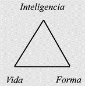
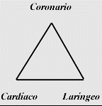

# <Pin lang="es">154</Pin> <Pin lang="en">203</Pin> Empleo del Color y del Sonido

1. Enumeración de los colores y algunos comentarios.
2. Los colores y la ley de correspondencia o analogía.
3. Efectos de los colores.
4. La aplicación de colores y su futuro empleo.

## 27 de agosto de 1920.

<Pin lang="en">204</Pin> No cabe duda de que quienes infringen la ley, perecen por la ley, mientras que quienes la obedecen, viven por ella. El verdadero estudio del ocultismo consiste en analizar él por qué y cómo de los fenómenos. Constituye el descubrimiento del método por el cual se alcanzan resultados, e implica un detenido análisis de los acontecimientos y circunstancias, a fin de descubrir las leyes que los rigen. He creído conveniente hacer estas observaciones preliminares, porque vi con claridad las preguntas que prevalecen en la mente de cada uno de ustedes, las cuales serán de valor si continúan buscando la correcta respuesta. La vida del discípulo está regida por ciertas leyes bien definidas, y las mismas controlan toda vida. La diferencia reside en que el discípulo comprenda parcialmente el propósito de tales leyes, su razón de ser y su consciente y razonable aplicación a las circunstancias que se presentan en el diario vivir. Cuando hay conformidad con la ley es trasmutada la vida personal... Veamos, por ejemplo, la Ley de la Subsistencia. Esta ley pone al discípulo en posición de utilizar inteligentemente el depósito universal. Constituye la manipulación de la materia y su adaptación a la acción recíproca de las fuerzas de la oferta y la demanda... El místico cultiva la fe ciega, este medio le permite llegar al depósito divino, pero sería mejor que comprendiera el método por el cual tal depósito se mantiene siempre lleno y los medios por los cuales la provisión abundante del Padre se pone en contacto con las necesidades de sus hijos. Puedo repetir aquí una de las máximas referentes a la oferta y la demanda. Sólo en la <Pin lang="en">205</Pin> medida que se emplea hábilmente la provisión para las necesidades del trabajador y del trabajo (elijo estas palabras con gran deliberación) la provisión continúa afluyendo. El secreto es: <b>usa, <Pin lang="es">155</Pin> pide, toma</b>. Sólo cuando se abre la puerta por la ley de la demanda, se abre otra puerta mejor provista. El secreto se halla oculto en la Ley de Gravedad. Reflexionen sobre esto.

:::note[Recuerda]

No cabe duda de que quienes infringen la ley, perecen por la ley, mientras que quienes la obedecen, viven por ella.

:::

## Algunas observaciones sobre el color.

Ahora debemos trabajar. El tema que consideraremos esta tarde es de interés profundo y complicado. Esta séptima carta tratará del empleo del color y del sonido en la meditación.

Como bien saben, en cartas anteriores hemos tratado extensamente el tema del sonido, tanto al estudiar el empleo de la Palabra Sagrada como al considerar las fórmulas y los mántram. Es muy común decir que el sonido es color y que el color es sonido, y así es. El tópico sobre el cual quiero realmente llamarles la atención no es el sonido como sonido, sino los efectos del color producidos por el sonido. En esta carta hago resaltar especialmente el aspecto color, pidiéndoles que recuerden que **todos los sonidos se expresan como color**.

:::note[Recuerda]

todos los sonidos se expresan como color

:::

Cuando el Logos emitió la gran Palabra cósmica para este sistema solar, surgieron tres corrientes principales de color, dividiéndose casi simultáneamente en otras cuatro, dándonos así las siete corrientes de color mediante las cuales la manifestación fue posible. Estos colores son:

|            |               |
| ---------- | ------------- |
| 1. Azul    | 4. Amarillo   |
| 2. Índigo  | 5. Anaranjado |
| 3. Verde   | 6. Rojo       |
| 7. Violeta |               |

El orden en que he colocado los colores no es caprichoso; pero <Pin lang="en">206</Pin> el verdadero significado lo dejo para que lo descubran por sí mismos.

Quisiera hacer resaltar una segunda idea: Estas siete corrientes de color fueron producto de la meditación logoica. El Logos meditó, caviló, concibió mentalmente, formó un mundo ideal y lo construyó con materia mental. Entonces vino a la existencia nuestro universo objetivo, brillando con sus siete colores, teniendo como subtono sintético el azul intenso o índigo. Por lo tanto se pueden afirmar ciertas cosas, con respecto al color.

1. Se relaciona con la meditación objetiva; en consecuencia tiene que ver con la forma.
2. Es el resultado del sonido emitido como culminación de la meditación.
3. En estos siete colores y en su inteligente comprensión radica <Pin lang="es">156</Pin> la capacidad del hombre para construir como lo hace el Logos.
4. Los colores producen ciertos efectos en los diferentes vehículos y también en los planos en que estos vehículos funcionan. Cuando el ocultista conoce el color aplicable a cada plano y el matiz básico para ese plano, domina el secreto fundamental del desenvolvimiento microcósmico y puede construir su cuerpo de manifestación, aplicando las mismas leyes que el Logos empleó al construir Su sistema solar objetivo. Practicar la meditación sobre nuestro correspondiente rayo revelará oportunamente al estudiante inteligente este secreto. Los cuatro puntos que anteceden son la clave de todo cuanto sigue.

:::note[Recuerda]

Cuando el ocultista conoce el color aplicable a cada plano y el matiz básico para ese plano, domina el secreto fundamental del desenvolvimiento microcósmico y puede construir su cuerpo de manifestación, aplicando las mismas leyes que el Logos empleó al construir Su sistema solar objetivo. Practicar la meditación sobre nuestro correspondiente rayo revelará oportunamente al estudiante inteligente este secreto. Los cuatro puntos que anteceden son la clave de todo cuanto sigue.

:::

Aquí quisiera aclarar alguna duda sobre si los colores que he enumerado están en contradicción con los enumerados por H. P. B. <Pin lang="en">207</Pin> Hallarán que no lo están, sino que ambos empleamos las mismas pantallas, como podrán percibir quienes tengan ojos para ver. Una pantalla deja de serlo cuando se la reconoce, por eso no doy aquí la clave. Sin embargo, puedo hacer una o dos indicaciones:

En los libros de ocultismo a un color complementario se le puede aplicar el nombre de su color primario. Al rojo se lo puede llamar verde y al anaranjado, azul. La clave de interpretación exacta del término empleado reside en la etapa alcanzada por el ente en estudio. Si se habla del Ego puede emplearse un término, si de la Personalidad, otro, mientras que si se trata de la Mónada, o esfera áurica superior, se la puede describir sintéticamente o en términos de rayo monádico.

Los colores de la mente superior o inferior se mencionan a veces en términos del plano y no del rayo involucrado.

Podemos hablar de los Señores de la Llama y del trabajo respecto a este planeta. en términos de cuatro colores:

1. Índigo, debido a que Ellos están en la línea del Bodhisatva en conexión con el Rayo de Amor o Sabiduría. El Señor del Mundo es un reflejo directo del segundo aspecto.
2. Azul, debido a su afinidad con el índigo y su relación con el huevo áurico; así como al Logos solar se lo denomina "Logos Azul" (literalmente índigo), así el color del hombre perfecto y la envoltura áurica, por medio de la cual se manifiesta, serán predominantemente azules.
3. Anaranjado, complementario del azul, que tiene directa <Pin lang="es">157</Pin> relación con el hombre como inteligencia, siendo éste él <Pin lang="en">208</Pin> custodio del quinto principio de manas en su relación con la entera personalidad.
4. Amarillo, complementario del índigo y también el color de budi, estando en la línea directa del segundo aspecto.

La ilustración que antecede demuestra la gran complejidad que significa el empleo de pantallas, pero también pone de manifiesto, a quienes tienen ojos para ver, que la elección de tales pantallas no es arbitraria, sino que está sujeta a regla y ley.

En consecuencia, será evidente él por qué de la repetición tan frecuente de que cuando se trata de cuestiones esotéricas la mente inferior no es de gran ayuda. Sólo quien está desarrollando la visión superior, puede alcanzar cierta medida de discriminación exacta. Así como el verde de la actividad de la Naturaleza o la vibración del índigo de este sistema de amor, forman la base del aspecto amor, lo mismo sucederá en el plano mental. Nada más puedo decir sobre esto, pero tienen aquí mucho tema para pensar. El anaranjado también guarda el secreto de los Hijos de la Mente y por el estudio de la llama (la que también exotéricamente mezcla todos los colores) viene la iluminación.

Al estudiar el tema de los colores y del sonido en la meditación ¿Cuál será la mejor forma de dividir este extenso tema? Vamos a considerarlo bajo los siguientes acápites:

1. La enumeración de los colores y algunos comentarios sobre ellos.
2. Los colores y la Ley de Correspondencia o Analogía.
3. Los efectos de los colores sobre:
   1. Los cuerpos del estudiante.
   2. Los grupos y el trabajo grupal.
   3. El medio ambiente.
4. Aplicación del color:
   1. En la meditación.
   2. <Pin lang="en">209</Pin> Para curación durante la meditación.
   3. En el trabajo constructivo.
5. El futuro empleo del color.

Bajo estos cinco encabezamientos podrá resumirse todo lo que debe decirse en la actualidad. Quizás muy poco de lo que diga sea fundamentalmente nuevo, pues se halla en el libro básico de H. P. Blavatsky. Pero con una nueva presentación y agregando otro material en un mismo acápite, puede llegar la iluminación y reajustarse inteligentemente el conocimiento. Más adelante trataremos estas cinco divisiones. Esta noche sólo añadiré unos pocos puntos mas a los ya dados.

Los colores manifestados en el plano físico se presentan en su <Pin lang="es">158</Pin> forma más burda y tosca; hasta los matices más exquisitos, vistos por el ojo físico, son burdos y toscos comparados con los del plano emocional; a medida que se hace contacto con la materia más refinada de otros planos, aumenta la belleza, la suavidad y la exquisitez de los distintos matices en cada transición. Cuando se llega al último color sintético, la belleza trasciende todo concepto.

Los colores que nos conciernen en la evolución son los colores de la luz. Ciertos colores, restos del sistema solar anterior, han sido tomados como modos de expresión de ese misterioso algo que llamamos mal cósmico" (denominado así por nuestra ignorancia). Son colores involutivos y el medio de fuerza de la Fraternidad Negra. Quien aspira a recorrer el Sendero de Luz nada tiene que hacer con ellos. Son matices como el marrón, el gris, el repugnante púrpura, los verdes cárdenos, que se encuentran en los lugares oscuros de la tierra, en el plano emocional y en el nivel inferior del plano mental, siendo negativos. Su tono es más bajo que la nota de la <Pin lang="en">210</Pin> naturaleza. Son engendros de la noche, entendido esotéricamente, y la base del espejismo, la desesperación y la corrupción, debiendo ser neutralizados por el discípulo de los Grandes Seres mediante la introducción de los colores vinculados con la luz.

La síntesis de todos los colores, como se dijo anteriormente, es el rayo sintético índigo. Subyace en todos y los absorbe a todos. Pero en los tres mundos de la evolución humana el color anaranjado de la llama irradia sobre todo, emanando del quinte principio; subyace en el quinto principio y es el efecto producido por la enunciación esotérica de las palabras esotéricas: "Nuestro Dios es un fuego consumidor". Estas palabras se aplican al principio mental o manásico, ese fuego de la inteligencia o la razón, que los Señores de la Llama impartieron, que estimula y guía la vida de la personalidad activa. Es la luz de la razón que guía al hombre a través del Aula del Aprendizaje hasta llegar al Aula de la Sabiduría, en la cual se descubren sus limitaciones, y esa estructura que el conocimiento ha construido (el cuerpo causal o templo de Salomón) es destruida por el fuego consumidor. Este fuego consume la suntuosa prisión que el hombre ha erigido durante muchas encarnaciones, liberándose la luz divina interna. Entonces los dos fuegos se fusionan, ascienden y se pierden en la Luz Triádica.

Algunos colores pertenecen más exclusivamente a la Jerarquía humana y otros a la dévica. En la final mezcla y fusión llega la oportuna perfección.

## 29 de agosto de 1920.

### La enumeración de los colores.

Esta noche continuaremos con el estudio de los colores, comenzando con el primer punto.

<Pin lang="es">159</Pin> <Pin lang="en">211</Pin> Haré ciertos comentarios y daré ciertos datos, no obstante he de insistir en el empleo de los términos exotéricos, pues mi propósito es hacer sugerencias. El empleo de la palabra "color" pone de manifiesto la intención, porque, como bien saben, su definición sugiere la idea de ocultamiento. Por lo tanto, color es "aquello que oculta". Es simplemente el medio objetivo por el cual se trasmite la fuerza interna, y constituye el reflejo, sobre la materia, del tipo de influencia que emana del Logos y ha penetrado en la parte más densa de Su sistema solar. Lo conocemos como color. El adepto lo conoce como fuerza diferenciada y el iniciado avanzado como luz final, indiferenciada e indivisible.

Ayer enumeramos los colores en cierto orden. Nuevamente los enumeraré así, pero sólo les recordaré que un rayo, del cual los demás son subrayos, podría considerarse como un círculo de séptuple luz. La tendencia del estudiante es imaginar siete franjas que se proyectan hacia abajo, a los cinco planos inferiores, hasta hacer contacto con el plano de la tierra, siendo absorbidos en la materia densa. Esto no es así. Los siete colores pueden ser considerados como un conjunto de siete colores que circulan y cambian continuamente, moviéndose a través de los planos hacia su punto de origen... Las siete franjas de color emanan del rayo sintético. El subrayo índigo del rayo índigo forma el sendero de menor resistencia, desde el corazón de la materia más densa, volviendo otra vez a su fuente. Las franjas de color forman un anillo circulante, que, moviéndose a diferentes grados de vibración, atraviesa todos los planos en círculos descendentes y ascendentes. Quiero poner de manifiesto especialmente aquí, que las siete franjas no se mueven todas al mismo ritmo; en ello reside la clave de la complejidad del tema.

Algunas circulan a un ritmo de vibración más rápido que otras. Por consiguiente -como llevan en sí sus correspondientes <Pin lang="en">212</Pin> Mónadas- tienen aquí la respuesta a la pregunta de por qué algunos egos parece que progresan más rápidamente que otros.

Estos círculos de color no siguen un curso recto y libre de obstáculos, sino que se entremezclan en forma muy curiosa, mezclándose entre sí y absorbiéndose uno a otro en ciclos determinados y reuniéndose en grupos de a tres o de a cinco, pero siempre yendo hacia adelante. Esta es la verdadera base del diseño romboidal que tiene sobre la espalda la serpiente de la sabiduría. Las escamas entrelazadas de la piel de la serpiente deberían ser representadas por tres líneas principales de color, entrecruzándose con los otros cuatro colores. Algún día, alguien que estudie el color y la sabiduría divina construirá un gran gráfico de los siete planos y sobre ellos colocará una serpiente de la sabiduría de siete colores. Si se dibuja correctamente en escala, se observarán interesantes diseños geométricos, a medida que los círculos cortan transversalmente los planos, <Pin lang="es">160</Pin> y se tendrá una impresión ocular de la complejidad que posee la materia de los siete rayos...

Serán oportunas aquí algunas afirmaciones breves:

El verdadero color índigo es el azul de la bóveda celeste en una noche sin luna. Constituye la culminación, y cuando todo llegue a la síntesis, sobrevendrá la noche solar, por eso el color corresponde a lo que el cielo proclama cada noche. El índigo absorbe.

El verde es la base de la actividad de la naturaleza. Fue el color sintético del primer sistema y es el fundamento del actual sistema manifestado. La nota de la naturaleza es verde, y cada vez que el hombre observa la vestidura que cubre la tierra se pone en contacto con alguna fuerza que alcanzó ya su consumación en el primer sistema. El verde estimula y cura.

Quisiera llamar la atención sobre el hecho de que aún no se <Pin lang="en">213</Pin> permite dar el significado esotérico de estos colores ni una información exacta respecto a su orden y aplicación. Los peligros son demasiado grandes, porque en la correcta comprensión de las leyes del color y en el conocimiento, por ejemplo, del color que representa un rayo particular, reside el poder que maneja el adepto.

### Comentarios sobre los colores.

Algunos colores son ya conocidos y será oportuno que los enumeremos. El rayo sintético es el índigo o el azul oscuro. Es el Rayo de Amor-Sabiduría, el gran rayo fundamental del actual sistema solar y uno de los rayos cósmicos, dividido para propósitos de la manifestación en siete subrayos:

1. índigo, y un color no revelado.
2. índigo-índigo, el segundo subrayo de Amor-Sabiduría. Tiene su gran expresión en el segundo plano monádico y su principal manifestación en las mónadas de amor.
3. índigo-verde, el tercer subrayo, el tercer Rayo mayor de Actividad o Adaptabilidad. Es el rayo básico del segundo sistema; el gran rayo de la evolución dévica.
4. índigo-amarillo, El Rayo de Armonía.
5. índigo anaranjado, El Rayo de Conocimiento Concreto.
6. índigo, y un color no revelado. El Rayo de Devoción.
7. índigo-violeta, El Rayo de Orden Ceremonial.

Notarán que no menciono dos colores, rojo-índigo y azul-índigo; <Pin lang="en">214</Pin> tampoco les adjudico determinados rayos o planos. No es que no pueda hacerlo, sino que al retener esta información se crea el enigma. Cuando se ocupen de estos colores deben recordar siempre ciertas cosas:

Que he dado los nombres y su aplicación exotérica y que en todo <Pin lang="es">161</Pin> lo dado sólo dos colores coinciden con su aplicación esotérica: índigo y verde. Los Rayos Sintético y de Actividad son en esta etapa los únicos dos sobre los cuales pueden tener absoluta seguridad; uno es la meta del esfuerzo, el otro el color fundamental de la Naturaleza.

Que los otros cinco colores, los cuales conciernen a nuestra quíntuple evolución, cambian, se entremezclan, fusionan y no son esotéricamente comprendidos en el mismo sentido impartido por las palabras: rojo, amarillo, anaranjado, azul y violeta. Esotéricamente apenas se parecen a sus nombres y estos nombres tienen por objeto encubrir y despistar.

Que cada uno de estos tres colores y los otros dos sólo se los comprende por medio de sus cuatro subrayos menores. La actual es la cuarta ronda y sólo se han percibido hasta ahora cuatro subrayos de estos colores. Teniendo presente estos tres puntos, a esta información aparente no se dará mayor importancia de la que tiene, y el estudiante inteligente reservará su opinión.

El amarillo es otro de los colores que ha venido del primer sistema. La fusión del azul y del amarillo en ese sistema tuvo mucho que ver con la iniciación de la actividad. El amarillo armoniza y señala consumación y fructificación. Observen que en otoño, cuando los procesos de la naturaleza han terminado su curso y el ciclo se ha completado, el amarillo otoñal se extiende sobre el paisaje.

Observen también que cuando el sol irradia directamente, las <Pin lang="en">215</Pin> sementeras se visten de amarillo. Lo mismo sucede en la vida del espíritu. Cuando se alcanza el plano de la armonía o de budi, se logra la consumación. Cuando la personalidad ha completado su tarea y el sol del microcosmos, el ego, irradia directamente sobre la vida de la personalidad, llega entonces la fructificación y la cosecha. Se alcanza la unificación o armonización y se ha llegado a la meta. La mezcla de azul y amarillo produce el verde, y el azul o índigo sintético (el aspecto amor-sabiduría) domina cuando se ha llegado al plano de la armonía. Ellos conducen al tercer plano de Atma, donde predomina el verde de la actividad.

## 31 de agosto de 1920.

Continuando con el estudio del color y la meditación y su clasificación particular, quisiera -a fin de estimularlos- indicarles que la parte que a ustedes les corresponde es recibir y publicar estas cartas con la información que contienen, haciéndome responsable de dicha información. Aunque no las comprendan y parezcan contradictorias, quisiera sugerir que una mitad del misterio se halla oculta en la interpretación esotérica y la otra mitad en el hecho de que toda interpretación depende del punto de vista del <Pin lang="es">162</Pin> intérprete y del nivel en el cual actúa su conciencia. El valor de lo que imparto ahora, radica en lo siguiente: por medio del estudio del color (un aspecto del estudio de la vibración) llega la capacidad para comprender la vibración personal, sintonizaría con la vibración egoica y posteriormente sincronizaría con la del Maestro. **La meditación es uno de los métodos principales para efectuar esta sincronización.** Cuando la inteligencia capta los hechos científicos relacionados con este tema, los utiliza para acelerar la vibración y desarrollar inteligentemente los colores necesarios.

:::note[Recuerda]

El valor de lo que imparto ahora, radica en lo siguiente: por medio del estudio del color (un aspecto del estudio de la vibración) llega la capacidad para comprender la vibración personal, sintonizaría con la vibración egoica y posteriormente sincronizaría con la del Maestro. **La meditación es uno de los métodos principales para efectuar esta sincronización.** Cuando la inteligencia capta los hechos científicos relacionados con este tema, los utiliza para acelerar la vibración y desarrollar inteligentemente los colores necesarios.

:::

<Pin lang="en">216</Pin> En mi carta anterior me he ocupado de cuatro colores -azul, índigo, verde y amarillo- y esta agrupación primaria es muy interesante. Ahora tomaremos un grupo diferente de colores, los cuales se unen en forma natural, el anaranjado, el rojo y el violeta.

Anaranjado. Es para nuestro propósito el color del plano mental, el color de la hoguera; es el símbolo de la llama, y en forma curiosa el color que sintetiza la separación. Pero tengan en cuenta que el color anaranjado esotérico no es exactamente el color que ustedes entienden por dicho término. El anaranjado exotérico es una mezcla de amarillo y rojo; el anaranjado esotérico es un amarillo más puro, en el cual el rojo apenas se percibe. Este anaranjado llega como una vibración establecida por un rayo cósmico, pues ha de recordarse que el quinto rayo (lo mismo que el quinto plano y el quinto principio) está íntimamente aliado al rayo cósmico de la inteligencia o ese aspecto actividad que tuvo su gran expresión en el primer sistema solar. El rayo sintético de esa época era el verde, y estaba íntimamente asociado al rayo anaranjado, el de la mente o inteligencia, manifestándose por medio de la forma. En el actual sistema solar tenemos su analogía en el sintético Rayo de Amor y Sabiduría y su estrecha relación con el cuarto Rayo de Armonía. Esto lo demuestra el triángulo formado por su interacción, de la manera siguiente:

<table>
<tr>
    <td colspan="2" style={{textAlign: "center"}}>
        <Pin lang="en">217</Pin> PRIMER SISTEMA SOLAR
    </td>
</tr>
<tr>
    <td colspan="2" style={{textAlign: "center"}}>
        Rayo Verde  
        Tercer Aspecto  
        Actividad o Inteligencia
    </td>
</tr>
<tr>
    <td style={{textAlign: "center"}}>
        Tercer Subrayo  
        Actividad  
        Verde-verde
    </td>
    <td style={{textAlign: "center"}}>
        Quinto Subrayo  
        Manas, mente  
        Verde-anaranjado
    </td>
</tr>
</table>
 
<table>
<tr>
    <td colspan="2" style={{textAlign: "center"}}>
        <Pin lang="es">163</Pin> SEGUNDO SISTEMA SOLAR
    </td>
</tr>
<tr>
    <td colspan="2" style={{textAlign: "center"}}>
        Rayo índigo  
        Segundo Aspecto  
        Amor y Sabiduría
    </td>
</tr>
<tr>
    <td style={{textAlign: "center"}}>
        Segundo Subrayo  
        Amor y Sabiduría  
        índigo-índigo
    </td>
    <td style={{textAlign: "center"}}>
        Cuarto Subrayo  
        Armonía  
        índigo-amarillo
    </td>
</tr>
</table>

<Pin lang="en">218</Pin> En el sistema de actividad tenemos el tercer aspecto de la mente universal o actividad, manifestándose por medio del color anaranjado del subrayo concreto, adaptabilidad por medio de la forma, que expresa perfectamente esa actividad latente. Análogamente en el segundo sistema de amor, tenemos el aspecto amor manifestándose por medio del color amarillo del Rayo de Armonía o Belleza -amor expresándose perfectamente por medio de la unidad, armonía o belleza. Observen aquí el hecho de que también empleo términos cuya exactitud depende de su interpretación exotérica o esotérica.

Por lo tanto, volviendo a lo que dije anteriormente, este color anaranjado nos llega como una vibración establecida por el anterior rayo cósmico de actividad, en el sistema solar anterior; la fuerza del color anaranjado (su captación científica por la inteligencia) perfecciona el eslabón entre el espíritu y la forma, entre la vida y los vehículos a través de los cuales trata de expresarse.

Podríamos adjudicar los grandes colores básicos a los distintos términos que empleamos para expresar la totalidad del universo manifestado:

| 1. Aspecto Vida | 2. Aspecto Forma | 3. Aspecto Inteligencia |
| --------------- | ---------------- | ----------------------- |
| Espíritu        | Materia          | Mente                   |
| Conciencia      | Vehículo         | Vitalidad               |
| Yo              | No-Yo            | Relación entre          |

| Rayo                | Rayo                     | Rayo                         |
| ------------------- | ------------------------ | ---------------------------- |
| 2. Amor y Sabiduría | 1. Poder o Voluntad      | 3. Actividad o adaptabilidad |
|                     | 7. Ley Ceremonial        |                              |
| 4. Armonía          | 5. Conocimiento Concreto | 5. Conocimiento Concreto     |
| 6. Devoción         |                          |                              |

<Pin lang="es">164</Pin> <Pin lang="en">219</Pin> Esto es sólo una de las maneras en que pueden agruparse y considerarse los rayos como influencias, ejerciendo efecto directo sobre la vida evolutiva o sobre la forma en que ella evoluciona por medio del tercer factor, la inteligencia. Estas tres divisiones constituyen los tres puntos de un triángulo cósmico:

y la corriente de los rayos actuando macro cósmicamente entre los tres, tiene su correspondencia microcósmica en el fuego kundalínico (despertado por la meditación), actuando con exactitud geométrica entre los tres centros mayores:

Los siete rayos interactúan entre la vida, la forma y la mente interna; en esencia ellas mismos son esos tres, la vida, la forma y la inteligencia, y en su totalidad constituyen el universo manifestado. Los siete actúan sobre los diversos aspectos en épocas diferentes.

<Pin lang="en">220</Pin> Existe una interacción muy interesante entre:

1. El Rayo de Amor-Sabiduría y el Rayo de Armonía, como ocurre entre los planos monádico y búdico.
2. El Rayo de Poder y el Rayo de Ley Ceremonial, como sucede entre los planos primero y séptimo.
3. El Rayo de Actividad o Adaptabilidad y el de Conocimiento Concreto o Ciencia, como acontece entre el tercer plano átmico y el quinto plano de la mente. El verde y el anaranjado estuvieron aliados en el primer sistema solar y continúan aún en el actual sistema. He abierto vastas regiones del pensamiento para los verdaderos estudiantes.

<Pin lang="es">165</Pin> En la relación entre el índigo, el azul y el amarillo, se halla oculto un secreto; entre el verde, el anaranjado y el rojo, se encierra otro secreto y entre el azul, el rojo y el violeta existe otro misterio.

El estudiante que capta estos tres misterios, empleando la intuición, ha hallado la clave del ciclo mayor y posee la llave del desenvolvimiento evolutivo. Por lo tanto recuerden que al estudiar el microcosmos, hallarán la misma relación, la cual les abrirá el portal al "Reino de Dios interno".

**Rojo.** Para todo propósito evidente es uno de los colores más difíciles de considerar. Se lo clasifica como indeseable. ¿Por qué? Porque se lo considera el color de Kama o deseo maligno. Su imagen surge al observar los colores rojo oscuro y cárdeno del cuerpo emocional del hombre no desarrollado. Sin embargo, en una época aún lejana, el rojo será la base de un sistema solar, en que, gracias a la perfecta fusión de los colores rojo, verde y azul, se completará <Pin lang="en">221</Pin> la tarea del Logos y la consumación de la luz blanca pura.

1. El sistema de actividad fue verde.
2. El sistema de amor es azul.
3. El sistema de poder será rojo.

La mezcla del rojo, azul y verde da como resultado el blanco, como saben, y el Logos esotéricamente habrá "lavado Sus vestiduras en la sangre, tomándolas blancas", así como el microcosmos, en menor grado. lo hace en el proceso evolutivo.

**Violeta.** En forma curiosa el Rayo violeta de Ley u Orden Ceremonial es un rayo sintético cuando se manifiesta en los tres mundos. Así como el Rayo sintético de Amor y Sabiduría es la síntesis de todas las fuerzas de la vida, de la misma manera el séptimo rayo sintetiza, en los tres mundos, todo cuanto tiene que ver con la forma. En el primer plano, la vida en su aspecto sintético más puro, más elevado e indiferenciado, está resumida en el rayo sintético de Amor; en el séptimo plano, o la forma en su aspecto más denso, mas burdo y diferenciado, está actuando sobre ella el séptimo rayo.

*Tenemos también una síntesis en el hecho de que por medio del color violeta, los reinos dévico y humano encuentran un punto de contacto. Esotéricamente, el color violeta es blanco.* En la mezcla de estos dos reinos, los siete Hombres celestiales llegan a la perfección y plenitud, y son considerados esotéricamente blancos, sinónimo de perfección.

Otro punto de síntesis es que cuando el séptimo rayo domina se produce un punto de fusión entre los cuerpos físico denso y etérico. Esto es de suprema importancia en el macrocosmos para el que estudia meditación. Es necesario efectuar esta fusión y <Pin lang="es">166</Pin> alineamiento antes de que la transmisión de la enseñanza al cerebro <Pin lang="en">222</Pin> físico denso se considere exacta. Esto tiene íntima relación con el alineamiento de los centros.

En las observaciones que anteceden he tratado únicamente de indicar líneas de pensamiento, que si se siguen detenidamente pueden llevar a resultados sorprendentes. Por el estudio de los colores y los planos, por el estudio del color y sus efectos y la relación con el aspecto vida, y por el estudio del aspecto forma de la mente, quien practica la meditación obtendrá mucho de valor si hace tres cosas:

1. Descubrir los colores esotéricos y su correcta aplicación a los planos y centros, a los cuerpos por medio de los cuales se manifiesta y a los cuerpos a través de los cuales se manifiesta el Logos (los siete planetas sagrados), a las rondas, a las razas y a los ciclos de su propia vida individual. Cuando pueda realizar esto tendrá en sus manos la clave de todo conocimiento.
2. Aplicar en forma práctica, en su vida personal de servicio en los tres mundos, las verdades indicadas y tratar de ajustar sus métodos de trabajo a los métodos demostrados por el Logos a través de los siete rayos o influencias. Con esto quiero significar que, a través de la meditación, pone su vida sistemáticamente y en ciclos ocultistas ordenados, bajo estas siete grandes influencias, produciendo así una belleza ordenada al manifestar su Ego.
3. Recordar siempre que la perfección, tal como la conocemos, es sólo parcial y no real, y que hasta esta perfección, como la comprende la mente del hombre, no es más que ilusión, y sólo la próxima manifestación logoica revelará la gloria final esperada. Mientras existan colores diferenciados - habrá imperfección. Recuerden que el color, tal como lo conocemos, constituye la comprensión del hombre que emplea un cuerpo de la quinta raza raíz en la cuarta ronda de la cuarta cadena, en una vibración que hace contacto con <Pin lang="en">223</Pin> el ojo humano. Entonces ¿Cómo será el color que verá el hombre de la séptima ronda que posea un cuerpo de la séptima raza raíz? Aún entonces, fuera y más allá de su comprensión, existirá toda una gama de colores de maravillosa belleza. La razón de ello es que sólo se expresan totalmente dos grandes aspectos de la vida logoica, y el tercero será revelado parcialmente, esperando que ese mayor "Día sea con nosotros" y destelle en perfecta radiación. La palabra radiación tiene un significado oculto que merece ser considerado.

:::note[Recuerda]

Aplicar en forma práctica, en su vida personal de servicio en los tres mundos, las verdades indicadas y tratar de ajustar sus métodos de trabajo a los métodos demostrados por el Logos a través de los siete rayos o influencias. Con esto quiero significar que, a través de la meditación, pone su vida sistemáticamente y en ciclos ocultistas ordenados, bajo estas siete grandes influencias, produciendo así una belleza ordenada al manifestar su Ego.

:::

## 3 de septiembre de 1920.

Dedicándonos constantemente al deber inmediato y poniendo los pies firmemente en el siguiente peldaño se abre un camino <Pin lang="es">167</Pin> hacia el Maestro y, con el tiempo e incidentalmente, se eliminarán todas las dificultades. La formulación de elevados conceptos mentales y su expresión en el plano físico, traen el desenvolvimiento del cuerpo mental, que permite una afluencia de vida cada vez mayor desde lo alto. La estabilización de las emociones y la transferencia del deseo del plano emocional al búdico, desarrolla la facultad de reflejar correctamente un punto de vista elevado. El cuerpo físico disciplinado y purificado adquiere la capacidad de desarrollar lo que el hombre interno sabe. Si se realizan estas tres cosas, entonces la ley puede actuar y apresurar la emancipación. La gente se pregunta: ¿Cómo actúa la ley? ¿Qué parte nos corresponde desempeñar en esa actividad que pone en vigencia la ley en la vida individual? Como ya lo he expresado, simplemente dedicándose al deber más elevado y ordenando la vida de la personalidad a fin de que ese deber pueda cumplirse a la perfección.

:::note[Recuerda]

La gente se pregunta: ¿Cómo actúa la ley? ¿Qué parte nos corresponde desempeñar en esa actividad que pone en vigencia la ley en la vida individual? Como ya lo he expresado, simplemente dedicándose al deber más elevado y ordenando la vida de la personalidad a fin de que ese deber pueda cumplirse a la perfección.

:::

### Colores exotéricos y esotéricos.

Nuestro tema de hoy constituye el segundo punto sobre el empleo del color, y trata de la ley de correspondencia o analogía y <Pin lang="en">224</Pin> también del color. El significado esotérico de los colores exotéricos, como ya he explicado, no fue impartido en su totalidad. Algunos de estos significados fueron dados por H. P. B., pero no han sido muy bien comprendidos. Haré una indicación para que la consideren inteligentemente. Cierta información dada en La Doctrina Secreta, respecto al color y al sonido, concierne al primer sistema solar, y otra, a una parte del segundo sistema solar. Esta diferencia, lógicamente, no ha sido comprendida pero, como clave principal para ser estudiada en la nueva Escuela, producirá una gran revelación. Basados en esta afirmación respecto al significado esotérico de los colores, quisiera que los clasificaran (aunque ya lo están en La Doctrina Secreta), a fin de que les sirva de base para las comunicaciones posteriores a impartir:

| Exotéricos | Esotéricos |
| ---------- | ---------- |
| Púrpura    | Azul       |
| Amarillo   | índigo     |
| Crema      | Amarillo   |
| Blanco     | Violeta    |

No puedo dar más de cuatro; pero si se los comprende correctamente darán la clave de la actual cuarta ronda y de su historia. Por hallarnos ahora en la cuarta cadena y en la cuarta ronda, observarán por lo tanto que en el número cuatro reside la historia del presente. Los incito especialmente a ustedes, los instructores y estudiantes de la generación venidera, a reflexionar sobre el significado de que el color blanco es esotéricamente el color violeta. <Pin lang="es">168</Pin> Esto tiene una aplicación especial ahora con el advenimiento del rayo violeta; el séptimo rayo es, en esta ronda, uno de los tres mayores; maneja poder en proporción al cuatro, en el cuatro y bajo el cuatro.

Los colores esotéricos de los colores rojo, verde y anaranjado, exotéricos, no se pueden revelar todavía al público en general, <Pin lang="en">225</Pin> aunque los estudiantes y discípulos aceptados, en cuya discriminación se puede confiar, pueden obtener el conocimiento necesario si se esfuerzan.

Desearía hacer otras consideraciones que resultarán más fáciles si consideramos brevemente la ley de analogía y correspondencia. Por lo tanto estudiaremos los puntos siguientes:

1. En qué consiste la correspondencia entre el micro y el macrocosmos.
2. Las correspondencias básicas.
3. El color en el micro y en el macrocosmos.

Me ocuparé brevemente de cada punto, porque en la correcta captación de la ley reside la capacidad de pensar esotéricamente y de desentrañar el significado interno de los acontecimientos externos.

### Correspondencia micro y macrocósmica.

La relación entre el micro y el macrocosmos es exacta y existe, no sólo en términos amplios, sino también en detalle. Este hecho se ha de comprender y desarrollar. **A medida que el conocimiento y el progreso aumentan y la capacidad de meditar se trasforma en la facultad de trasmitir, desde la Tríada superior a la personalidad, vía el causal, entonces estos hechos serán demostrados más claramente en sus detalles, con lo cual se alcanzará la perfecta comprensión** "Como arriba es abajo" es una verdad superficialmente repetida, pero poco comprendida. ¿Qué existe arriba y en consecuencia qué se desarrolla abajo?

Arriba existe Voluntad, Amor y Actividad, o Poder, Sabiduría e Inteligencia, términos que aplicamos a los tres aspectos de la manifestación divina. Abajo hallaremos los tres en proceso de manifestación.

1. La Personalidad expresa inteligencia activa.
2. <Pin lang="en">226</Pin> El Ego expresa amor o sabiduría.
3. La Mónada expresa poder o voluntad.

En los tres mundos de la personalidad tenemos:

1. El físico, que expresa un reflejo del aspecto actividad.
2. El astral, que expresa un reflejo del aspecto amor o sabiduría.
3. <Pin lang="es">169</Pin> El mental, que expresa un reflejo del aspecto voluntad o poder.

¿Cuáles son los colores de estos tres cuerpos, descritos exotéricamente?

1. El violeta del físico, según se manifiesta en el etérico.
2. El rosa o rojo del astral.
3. El anaranjado del mental.

¿Qué tenemos en la Tríada o mundo del triple Ego?

1. Manas superior, expresando el aspecto actividad o inteligencia.
2. Budi, expresando el aspecto amor o sabiduría.
3. Atma, expresando el aspecto poder o voluntad.

¿Cuáles son los colores de estos cuerpos, exotéricamente descritos?

1. El azul de los niveles manásicos superiores.
2. El amarillo del nivel búdico.
3. El verde del nivel átmico.

Ellos están en proceso de transmutación. Deben realizar el correspondiente cambio de colores de lo inferior a lo superior. Relacionen esta información con la dada en una carta anterior sobre la trasferencia de la polarización.

Existe una correspondencia directa entre:

1. El violeta del nivel etérico y el azul del mental superior.
2. <Pin lang="en">227</Pin> El rosa del astral y el amarillo del búdico.
3. El anaranjado del mental y el verde del átmico.

El secreto de todo ello reside en la aplicación de las leyes ocultas de la meditación. Por otra parte pueden transferir todo la gama de colores a un grado superior y desarrollar en la Mónada la analogía:

1. El verde del tercer aspecto.
2. El azul sintético o índigo del segundo aspecto.
3. El rojo del primer aspecto.

Quiero indicar que a medida que se retorna al centro de la evolución del sistema, la nomenclatura de estos colores es de lo más engañosa. El rojo, por ejemplo, no tiene parecido con lo que se llama rojo o rosa en el plano inferior. El rojo, el verde y el índigo de esos elevados niveles son, para todos los fines y propósitos, colores nuevos de belleza y trasparencia inconcebibles. Si se interpreta esto con exactitud, tienen aquí una insinuación sobre la correspondencia que existe entre el micro y el macrocosmos.

Exotéricamente los colores tienen que ver con la forma. Las fuerzas o cualidades que estos colores velan y ocultan se relacionan con la Vida evolucionante dentro de esas formas. Por la meditación se construye el puente que conecta a ambas. Meditación <Pin lang="es">170</Pin> es la expresión de la inteligencia que vincula la vida y la forma, el Yo y el no-yo. En el tiempo y en los tres mundos el proceso de esta conexión tiene lugar en el plano de la mente, que vincula lo superior con lo inferior. La correspondencia será siempre perfecta. En consecuencia, por la meditación vendrá ese conocimiento que efectuará tres cosas:

1. Dará el significado interno del color exotérico.
2. Desarrollará las cualidades que estos colores velan.
3. <Pin lang="en">228</Pin> Efectuará la necesaria transmutación de los colores de la personalidad, a los de la Tríada y luego los de ésta a los de la Mónada.

El cuerpo causal actúa como síntesis de esos colores en la vida del Ego reencarnante, de la misma manera que el rayo sintético fusiona todos los colores en la manifestación logoica. Procuren mantener claro en la mente, que los colores expresan fuerza o cualidad. Ocultan o velan las cualidades abstractas del Logos, las cuales se reflejan en los tres mundos del microcosmos como virtudes o facultades. En consecuencia, así como los siete colores ocultan cualidades del Logos, también estas virtudes se manifiestan en la vida de la personalidad y vienen a la objetividad mediante la práctica de la meditación, así cada vida corresponde a un color. Reflexionen sobre esto.

### Las correspondencias básicas.

Del estudio de estas correspondencias en los diferentes sectores del universo manifestado, y de la aplicación de estos colores en justa proporción, surge la belleza del todo sintético y la iluminación de la vida microcósmica. Las enumeraré o clasificaré en términos generales, permitiendo a quien estudia la meditación, desarrollarlas detalladamente. A esta altura nada más puedo decir.

1. 
El triple jiva evolucionante. 
 Los tres aspectos del Logos. 
 La triple Mónada. 
 La Tríada espiritual, el Ego. 
 La triple Personalidad. 
 Los tres mundos de la evolución humana. 
 Las tres personas de la Deidad.

2. 
<Pin lang="en">229</Pin> Los cuatro Señores Lipikas. 
 Los cuatro Maharajaes.
 El cuádruple hombre inferior, el cuaternario.

3. 
 Los cinco planos de la evolución humana.  
 Los cinco sentidos.  
 <Pin lang="es">171</Pin> El quíntuple sector del Mahachohan. 
 Los cinco reinos de la naturaleza:   

 

 <ol>
 <li>El reino mineral.</li>
 <li>El reino vegetal.</li>
 <li>El reino animal.</li>
 <li>El reino humano.</li>
 <li>El reino espiritual o superhumano.</li>
 </ol>
 El quinto principio de manas.
 

4. 
Los siete rayos o jerarquías. 
Los siete colores. 
Los siete planos de manifestación. 
Los siete Kumaras. 
Los siete principios del hombre. 
Los siete centros. 
Los siete planetas sagrados. 
Las siete cadenas. 
Los siete globos. 
Las siete rondas. 
Las siete razas raíces y subrazas. 
Las siete iniciaciones. 

Lo que trato de hacer resaltar, en la clasificación que antecede, es que para el adepto, la correspondencia de todos ellos es perfectamente conocida y existe en términos de conciencia, de forma y de inteligencia. **Las conoce (si lo puedo expresar así) en términos de color, cuando trata con la forma; en términos de sonido, cuando trata con el aspecto vida; en términos de vitalidad, cuando trata con la inteligencia o aspecto actividad.** La declaración que <Pin lang="en">230</Pin> antecede compensará mucho a quienes reflexionen sobre ello con empeño, pues contiene la afirmación de un hecho oculto. De acuerdo a las tres líneas de acercamiento, tratadas en nuestra carta anterior, así será el empleo de los términos, según fueron descritos anteriormente.

### El color en el micro y en el macrocosmos.

Este asunto presenta mucha dificultad debido al proceso constante de mutación. El color está sujeto en el microcosmos a los factores siguientes:

1. El rayo del Ego.
2. El rayo de la Personalidad.
3. El grado de evolución.

Aquí puedo hacer una indicación. En un grado inferior de evolución los colores se basan principalmente en el aspecto <Pin lang="es">172</Pin> actividad. Luego viene su actuación en el aspecto amor o sabiduría, lo cual produce tres efectos:

<ol type="a">
<li>Eliminación de los colores que tienen las envolturas inferiores, residuos de un sistema anterior. Implica la eliminación de matices como el marrón y el gris.</li>
<li>Transmutación de ciertos colores en aquellos de tono superior.</li>
<li>Trasparencia, radiación o brillo subyacente, resultado de una mayor pureza de los cuerpos y de las dimensiones de la siempre creciente llama interna.</li>
</ol>

4.  El factor rayo o rayos manifestados, saliendo o entrando en manifestación. Estos rayos afectan a los Egos en encarnación, cambian en parte la vibración o producen un consiguiente cambio de color o cualidad. Si un individuo se halla, por ejemplo, en el Rayo de la Ciencia y viene bajo la influencia del Rayo entrante de Armonía, el efecto sobre su línea de pensamiento y en consecuencia <Pin lang="en">231</Pin> sobre el color que manifiesta, será muy notable. Todos estos factores causan la mezcla y fusión que es inextricable y prácticamente confusa para el individuo, desde el punto de vista de los tres mundos.

Comprendo que piensen que estas mismas indicaciones evidentemente conducen a una mayor confusión, pero en la constante dedicación al tema, en la frecuente reflexión y meditación sobre los colores, y en el esfuerzo por descubrir su significado esotérico y su aplicación microcósmica, aparecerá gradualmente el hilo que sacará al estudiante de su confusión y lo llevará hasta la clara luz del perfecto conocimiento. Tengan, por lo tanto, valor, un amplio y flexible punto de vista, la capacidad de reservar opiniones hasta que nuevos hechos se comprueben, y también absténganse de hacer afirmaciones dogmáticas. Lo antedicho será la mejor guía durante los primeros días de búsqueda. Muchas personas, por la meditación y su receptividad a las enseñanzas superiores, hallaron el camino que las llevó del Aula de Aprendizaje al Aula de Sabiduría. Únicamente en el Aula de la Sabiduría se puede conocer realmente la interpretación esotérica de los colores. Se llega a ella por la meditación, que prepara al estudiante para esa iniciación que le abrirá la puerta. En consecuencia, persistan en la meditación sin flaquear en su propósito.

## 4 de septiembre de 1920.

Vamos a tratar ahora algo que tiene una verdadera aplicación espiritual en sentido práctico. Gran parte de lo que he dicho les ha proporcionado tema para pensar e investigar. Tiende a desarrollar la mente superior y por el estímulo de la imaginación desarrolla en parte la intuición. Mucho de ello es de carácter profético, <Pin lang="es">173</Pin> o ha presentado un ideal que algún día podrá realizarse. Únicamente señalando la meta y haciendo resaltar ese punto, se induce al <Pin lang="en">232</Pin> hombre a hacer el esfuerzo necesario y alcanzar en cierta medida la posición deseada. Pero hoy trataremos la vida práctica y la imposición de cierta vibración rítmica sobre la personalidad.

Esto lo haremos al estudiar en el tercer punto los efectos que produce el color sobre:

1. Los cuerpos del estudiante.
2. Los grupos a los cuales está afiliado.
3. Su medio ambiente.

El punto que trato especialmente de hacer resaltar es el color del aspecto vida y no el del aspecto forma. Como dije anteriormente, el color no es más que la forma que asume una fuerza de cualquier tipo, cuando ésta se mueve a cierto ritmo y su acción y movimiento están o no obstruidos por lo material a través de lo cual actúa. En esta frase reside la clave para solucionar el problema respecto a la diferencia de colores en los planos superior e inferior. La resistencia que ofrece la materia al descenso de la fuerza o vida, y su densidad o tenuidad relativa, explican la diferencia de color. Una de las diferencias tiene necesariamente una base cósmica y, en consecuencia, difícilmente el hombre tridimensional la capte en esta cuarta ronda. Pero la razón fundamental de la diferencia puede ser suficientemente captada como para que el estudiante comprenda la absoluta necesidad de refinar constantemente sus vehículos a fin de que esa fuerza pueda irradiar a través de ellos con mayor facilidad. Por lo tanto, es cuestión de vivir prácticamente en los tres planos inferiores, sometiendo a los tres cuerpos a reglas precisas de refinamiento.

:::note[Recuerda]

...el estudiante comprenda la absoluta necesidad de refinar constantemente sus vehículos a fin de que esa fuerza pueda irradiar a través de ellos con mayor facilidad. Por lo tanto, es cuestión de vivir prácticamente en los tres planos inferiores, sometiendo a los tres cuerpos a reglas precisas de refinamiento.

:::

Las fuerzas, en términos de desenvolvimiento espiritual y no tanto de forma, se manifiestan en las virtudes, como lo denominan ustedes, por medio del magnetismo, de la vitalidad y de la inteligencia. Para expresarlo brevemente diré, que a medida que el estudiante construye un cuerpo físico puro y un etérico <Pin lang="en">233</Pin> refinado, que desarrolla las virtudes emocionales y coordina y expande su cuerpo mental, altera constantemente al grado de vibración y cambia su ritmo, cambios que ante los ojos del clarividente aparecen como mutaciones de color. Como ya he enseñado, los colores vistos en el aura de un salvaje y en el de un hombre común evolucionado, son extraordinariamente distintos. ¿ Por qué? Porque uno se mueve o vibra a un grado lento, el otro con mayor rapidez. Uno tiene un ritmo lento, pausado y pesado, el otro un ritmo pulsante, moviéndose a enorme velocidad, permitiendo en consecuencia a la materia que compone esos cuerpos actuar con mayor rapidez

:::note[Recuerda]

Las fuerzas, en términos de desenvolvimiento espiritual y no tanto de forma, se manifiestan en las virtudes, como lo denominan ustedes, por medio del magnetismo, de la vitalidad y de la inteligencia. 

:::

<Pin lang="es">174</Pin> Por lo tanto, quisiera señalar que a medida que la raza progresa como unidad colectiva, Quienes la observan desde un plano superior, se dan cuenta del constante mejoramiento de los colores y de la mayor pureza y trasparencia de los matices en el aura de la raza, aura compuesta por las auras combinadas de los entes de la raza. Por ejemplo, el aura de la raza raíz atlante y la de la raza aria son muy diversas y radicalmente distintas. Por consiguiente he demostrado el primer punto, o sea que, a medida que los entes evolucionan, los colores cambian, produciéndose por la transmutación de lo que ustedes denominan vicios, en virtudes. Un vicio es el predominio de una cualidad involutiva de la misma fuerza que en un periodo posterior se manifestará como virtud.

:::note[Recuerda]

a medida que los entes evolucionan, los colores cambian, produciéndose por la transmutación de lo que ustedes denominan vicios, en virtudes. Un vicio es el predominio de una cualidad involutiva de la misma fuerza que en un periodo posterior se manifestará como virtud.

:::

El segundo punto que quiero demostrar es que estas influencias (las cuales se manifiestan como colores cuando están en contacto con la materia) se mueven en sus propios ciclos ordenados. A dichos ciclos se los describe como la entrada o salida de un rayo. En esa cuarta ronda están en actividad, comúnmente, cuatro rayos, en cualquier momento dado. Con esto trato de inculcarles que aunque todos los rayos se manifiestan en el sistema solar, en ciertas etapas de manifestación predomina simultáneamente un <Pin lang="en">234</Pin> número mayor o menor. Estos rayos, fuerzas, influencias o coordinación de cualidades, al expresarse en términos de luz coloran la materia sobre la que hacen impacto, dándole ciertos matices conocidos, los cuales dan el tono a la vida de la Personalidad o del Ego. Ustedes los conocen como cualidades del carácter y el clarividente los ve como color.

En consecuencia, se verá que los grupos de unidades que convergen, debido a la similitud de vibración, poseen aproximadamente el mismo matiz básico, aunque con numerosas diferencias menores de color y tono. Como ya dije, se puede calibrar y juzgar el color de grandes masas de personas. Así los miembros de la Jerarquía, en Cuyas manos se halla el desarrollo evolutivo en los tres mundos, pueden juzgar la etapa alcanzada y el propósito realizado.

Los distintos rayos entrantes traen unidades matizadas por esos rayos. Otros desaparecen llevando consigo unidades de un matiz básico diferente. Durante el período de transición, la mezcla de colores asume enorme complejidad, siendo de ayuda y beneficio mutuos. Cada rayo da algo a los otros rayos que se hallan al mismo tiempo en encarnación, afectándose ligeramente la vibración rítmica. Este efecto puede ser imperceptible, desde el punto de vista del presente y del tiempo en los tres mundos, pero en virtud de la frecuente reunión e intercambio de fuerzas y colores y de su constante acción e interacción, se producirá un constante nivelamiento general y una similitud de vibración. Por lo <Pin lang="es">175</Pin> tanto, verán que se obtiene la síntesis al finalizar un mahamanvantara mayor. Los tres rayos absorben a los siete y oportunamente se fusionan en el rayo sintético.

En el microcosmos los tres rayos, de la Mónada, el Ego y la Personalidad, predominarán, absorberán a los siete y, con el tiempo, <Pin lang="en">235</Pin> también se alcanzará la fusión en el rayo sintético de la Mónada. La analogía será perfecta.

Estas fuerzas, virtudes o influencias (repito términos sinónimos, debido a la necesidad de que piensen con claridad) son recibidas gradualmente por los cuerpos de la personalidad, cada vez con mayor facilidad y plena expresión. A medida que los cuerpos se refinan proporcionando mejores medios para las fuerzas entrantes, la cualidad particular de alguna fuerza -o lo contrario, la fuerza de alguna cualidad particular-, se expresa cada vez con mayor perfección. Aquí entra el trabajo de quien estudia la meditación. Primitivamente en la evolución, estas fuerzas actuaban en los cuerpos del hombre y a través de ellos, con poca comprensión de su parte y menos capacidad para aprovecharlas. Pero a medida que transcurre el tiempo, comprende cada vez más el valor de todo lo que acontece y trata de beneficiarse del conjunto de las cualidades de su vida. Aquí reside la oportunidad. Por la comprensión inteligente de la cualidad, por el esfuerzo para adquirir virtudes y por la construcción de atributos deíficos, viene la respuesta a esas fuerzas, facilitando su acción. Quien estudia meditación, reflexiona sobre estas fuerzas o cualidades, trata de expresar su esencia y de comprender su significado espiritual, cavila sobre su propia falta de respuesta, se da cuenta de las deficiencias de su vehículo, como medio para tales fuerzas, estudia su grado de vibración rítmica y trata con empeño de aprovechar todas las oportunidades para satisfacer la necesidad. Se concentra en la virtud y (si está en condiciones de darse cuenta del rayo entrante o predominante en ese momento) aprovecha la hora de la oportunidad y colabora con la fuerza existente. Todo esto lo hace mediante fórmulas ordenadas de la verdadera meditación ocultista.

:::note[Recuerda]

Aquí reside la oportunidad. Por la comprensión inteligente de la cualidad, por el esfuerzo para adquirir virtudes y por la construcción de atributos deíficos, viene la respuesta a esas fuerzas, facilitando su acción. Quien estudia meditación, reflexiona sobre estas fuerzas o cualidades, trata de expresar su esencia y de comprender su significado espiritual, cavila sobre su propia falta de respuesta, se da cuenta de las deficiencias de su vehículo, como medio para tales fuerzas, estudia su grado de vibración rítmica y trata con empeño de aprovechar todas las oportunidades para satisfacer la necesidad. Se concentra en la virtud y (si está en condiciones de darse cuenta del rayo entrante o predominante en ese momento) aprovecha la hora de la oportunidad y colabora con la fuerza existente. Todo esto lo hace mediante fórmulas ordenadas de la verdadera meditación ocultista.

:::

A medida que transcurre el tiempo -nuevamente profetizo- se dará a los estudiantes de ocultismo ciertos datos sobre los rayos <Pin lang="en">236</Pin> predominantes, lo cual permitirá aprovechar la oportunidad que cada rayo ofrece.

### El efecto sobre el medio ambiente.

Respecto a nuestro tercer punto, el estudiante atento se dará cuenta inmediatamente de que el efecto que produce lo antedicho sobre el medio ambiente será notable, especialmente a medida <Pin lang="es">176</Pin> que un mayor número de miembros de la raza humana llega a estar bajo el control consciente de su Yo superior y de acuerdo con la ley. Entonces será posible realizar ciertas cosas:

1. Contacto directo con la evolución dévica o angélica, imposible ahora debido a la inestabilidad de la vibración.
2. Vendrán almas muy desarrolladas que ahora están impedidas por la baja vibración y la consiguiente densidad de color de la mayor parte de la raza humana. Existen en el mundo celestial y en el nivel causal algunas grandes y para ustedes incomprensibles entidades de la cuarta Jerarquía Creadora, que esperan la oportunidad de manifestarse, así como algunos de ustedes esperaron la llegada de cierto período, en la raza atlante, antes de encarnar en este planeta, Cuando el grado de vibración de un mayor porcentaje de la raza adquiera cierta medida y cuando el aspecto color de las auras coordinadas de los grupos posea cierta tonalidad, esas entidades volverán a la tierra y traerán mucho de valor, más allá de la comprensión de ustedes.
3. Otro punto interesante, sobre el cual no podemos detenernos, es que se observará objetivamente el efecto rítmico -incluso en los dos reinos inferiores al humano. No fue un alarde inútil del Profeta de Israel cuando dijo: "El leopardo se acostará con el <Pin lang="en">237</Pin> cordero" y "el desierto florecerá como una rosa." Esto vendrá por el predominio de ciertas vibraciones y la entrada de algunos colores velando determinadas influencias o virtudes.

## 7 de septiembre de 1920.

Hoy trataremos el tema de la aplicación del color. Si los colores sólo son el velo tendido sobre una influencia, y si valiéndose de la intuición pueden descubrir en ustedes los colores que ocultan una virtud, tienen en sus manos la clave. Habrán observado que en estas cartas sobresalen dos hechos:

Que el tema tratado es tan vasto, que únicamente he intentado dar sus delineamientos.

Que cada frase escrita en estas cartas tiene por objeto impartir con exactitud un pensamiento completo y contiene mucho material para reflexionar. ¿Por qué no he tratado los tópicos más detalladamente, ni he entrado en extensas explicaciones ni ampliado las frases en párrafos? Por la única razón de que si el estudiante ha hecho el trabajo preliminar en la meditación, durante los años anteriores, el material de estas cartas lo conducirá a desarrollar el pensamiento abstracto y ensanchar el canal que comunica con la intuición. Sólo trato de hacer sugerencias. Mi objeto es sólo indicar. La utilidad de la enseñanza impartida depende <Pin lang="es">177</Pin> de la intuición del estudiante. Por lo tanto, al decirles que el color produce ciertos efectos al ser aplicado, debo advertirles también que será necesario interpretar lo antedicho en términos de vida, forma y mente.

### La aplicación del color.

1. En la meditación.
2. En la curación.
3. En el trabajo constructivo.

<Pin lang="en">238</Pin> El color puede ser utilizado de muchas maneras y las mencionadas no abarcan el tema. Sólo indican tres maneras que tienen un valor inmediato y práctico para el estudiante. Puede ser empleado para ponerse en contacto con otras evoluciones, subhumanas o super humanas; en trabajos definidos de construcción o de desintegración; puede emplearse conjuntamente con otros métodos tales como la música o el movimiento, en conexión con los mántram establecidos, a fin de producir determinados resultados, pero de estos métodos no tenemos por qué ocuparnos en esta serie de cartas. El progreso del individuo y su acrecentada capacidad de servir se producen por la práctica inteligente de la meditación ocultista. Vamos pues a considerar nuestro primer punto.

#### Empleo del color en la meditación.

Todos los colores emanan de una fuente o de un color primario -en este sistema solar el rayo índigo cósmico vela el de amor o sabiduría cósmico- que luego se separa en tres colores principales, después en cuatro menores, formando los siete colores del espectro. Verán el mismo efecto en la vida del individuo, pues siempre el macrocosmos afecta al microcosmos. El color primario del individuo será su rayo monádico, manifestándose a continuación los tres colores de la Tríada y los cuatro colores del Cuaternario. En el sendero de retorno estos siete colores se trasforman en tres y nuevamente en uno.

El sendero de manifestación, de diferenciación, es el sendero de adquisición. Es lo homogéneo convirtiéndose en los muchos o heterogéneo. Es la disgregación de un color básico en sus numerosas partes componentes. Este es el aspecto forma, la expresión de aquello que vela a la vida. En el aspecto vida, es el desarrollo de una cualidad básica en sus muchas virtudes inherentes; es la posibilidad latente en la divinidad, manifestándose en los muchos <Pin lang="en">239</Pin> atributos de lo divino; es la Vida Una manifestando sus múltiples Cualidades por medio de la diversidad de formas. Es el Yo con todas las capacidades inherentes del Omni-Yo, utilizando formas para la demostración de Sus perfecciones omnincluyentes. En el <Pin lang="es">178</Pin> aspecto inteligencia es el método mediante el cual la vida utiliza la forma y la desarrolla por medio de comprensión, análisis e intelecto. Es la relación entre la vida y la forma, el Yo y el no-yo, espíritu y materia, manifestándose como modos de expresión, mediante los que la divinidad inmanente impone sus características sobre el material provisto para su uso. El Dios interno expresa todas Sus virtudes latentes por medio de formas, empleando la actividad o inteligencia. La vida muestra color y la forma perfecciona esos colores, a medida que el aspecto inteligencia (el eslabón energetizante) evoluciona más y se desarrolla la comprensión.

En el sendero de retorno, la regla es renunciación, en contraposición al método primitivo. La vida inmanente renuncia a las formas, hasta entonces consideradas (necesariamente) esenciales. Ahora, mediante el empleo de la inteligencia que ha vinculado estos dos pares de opuestos, espíritu y materia, conciencia y forma, las formas construidas de materia con la ayuda de la inteligencia son repudiadas una tras otra, y por la ayuda de esa misma inteligencia o facultad razonadora son trasmutadas en sabiduría. Las formas desaparecen, pero la vida permanece. Los colores son gradualmente reabsorbidos, pero las virtudes divinas persisten, las cuales son ahora estables y eternamente útiles debido a la experiencia. Estos atributos divinos no son potenciales, sino poderes desarrollados para ser utilizados. La facultad inherente se ha convertido en característica activa, llevada a la más alta potencia. Los velos son descartados uno a uno; las envolturas son abandonadas y reemplazadas; se prescinde de los vehículos, y las formas ya no son necesarias, pero la vida permanece siempre y retorna <Pin lang="en">240</Pin> a su rayo paterno. Se disuelve nuevamente en su primario, conjuntamente con la actividad y la expresión, la experiencia y la capacidad de manifestarse, más todo lo que constituye la diferencia entre el ignorante salvaje y el Logos solar. Esto ha sido consumado, mediante la utilización, por parte de la vida, de muchas formas, siendo la inteligencia el medio por el cual esa vida empleó las formas a fin de aprender. Después de haberse manifestado como un aspecto de este rayo primario y de haberlo diferenciado en sus muchas partes componentes, a través de muchas encarnaciones, y después de verse recubierto de los siete colores que componen ese rayo, el jiva reencarnante emprende el sendero de retorno y de siete se convierte en tres y de tres en uno.

Cuando el hombre hace esto conscientemente, cuando voluntariamente y con plena comprensión de lo que debe hacer se esfuerza en liberar a la vida inmanente de los velos que la ocultan y de las envolturas que la aprisionan, descubre que el método por el cual lo consigue, es el de la vida subjetiva de meditación <Pin lang="es">179</Pin> ocultista y la vida objetiva de servicio. En el servicio está la renunciación y, según la ley oculta, en el servicio halla su liberación lo subjetivo, liberándose así de la manifestación objetiva. Reflexionen sobre esto porque bajo el velo de las palabras se oculta mucho de valor.

:::note[Recuerda]

cuando voluntariamente y con plena comprensión de lo que debe hacer se esfuerza en liberar a la vida inmanente de los velos que la ocultan y de las envolturas que la aprisionan, descubre que el método por el cual lo consigue, es el de la vida subjetiva de meditación <Pin lang="es">179</Pin> ocultista y la vida objetiva de servicio. En el servicio está la renunciación y, según la ley oculta, en el servicio halla su liberación lo subjetivo, liberándose así de la manifestación objetiva.

:::

El estudiante de ocultismo, desde el punto de vista del color, debe efectuar dos cosas en la meditación:

1. Descubrir sus tres colores principales, según se manifiestan en la Personalidad, en el Ego y en la Mónada.
2. Resolver el cuaternario inferior en los tres, para lo cual la primera etapa consiste en retirarse conscientemente en el Ego y así atrofiar al yo inferior. El estudiante empieza eliminando los colores indeseables, anulando toda vibración inferior o grosera, <Pin lang="en">241</Pin> llegando con el tiempo a refinar sus vehículos de tal modo, que los tres colores principales -de los cuales él es la expresión- resplandecen con perfecta claridad. Esto lo conduce a la tercera iniciación. Después trata de resolver los tres en el uno, hasta que transfiere su conciencia de las vehículos inferiores a la envoltura monádica.

No es mi intención, como erróneamente suponen, informarlos acerca de las efectos de los colores que actúan en los cuerpos durante la meditación. Sólo trato de darles alguna idea del color, como un velo que eventualmente ha de ser apartado. Bajo el titulo "Empleo futuro del color", quizás me ocupe de lo que a ustedes les interesa, pero la comprensión de los fundamentos es mucha mejor que darles fórmulas para experimentar.

## 10 de septiembre de 1920

Hoy sólo tocaré el segunda punto, la aplicación del color para propósitos curativos. La razón de esta brevedad reside en que, para tratar el tema como es debido y en consecuencia sin peligro, debería ser dilucidado extensamente. A este respecto podría aplicarse el antiguo adagio de que "el poco conocimiento es algo peligroso". A no ser que el tema de la curación por el color se encare correctamente, con conocimiento técnico y la necesaria extensión, los resultados obtenidos podrían ser más desastrosos que benéficos. Más adelante el tema será dilucidado plenamente, si el futuro trae lo que se espera; mientras tanto puedo, como información, delinear ciertas características de este trabajo: señalar algunas condiciones incidentales para el éxito y pronosticar la dirección que probablemente seguirá el tema.

### <Pin lang="es">180</Pin> <Pin lang="en">242</Pin> Aplicación del color para curaciones.

Encararé ahora el tema desde el punto de vista de la meditación. Por lo tanto es esencial que lo consideremos desde ese ángulo. En la meditación el trabajo de curación se hace totalmente desde el punto de vista mental Cualquier fuerza proporcionada vendrá desde el cuerpo mental del paciente y de allí irá al físico, vía el emocional.

Esto significa que el individuo o grupo que emprende este trabajo tiene que averiguar ciertos hechos, los cuales enumeraré brevemente a fin de clarificar la mente de lector:

1. El trabajo ha de ser en gran parte subjetivo, contemplando las causas y no los efectos. El principal objetivo del grupo de curación será 1. descubrir la causa originante del malestar; una vez localizado el mal, en el cuerpo emocional o el mental, los miembros del grupo se ocuparán del efecto manifestado en el cuerpo físico o en el etérico. Si la dolencia es totalmente física, como en casos de accidentes de cualquier tipo, o de alguna afección de carácter puramente hereditario o dolencia congénita, se aplicarán primeramente los métodos científicos comunes más avanzados del plano físico; en este caso el trabajo de los curadores consistirá en ayudar a esos métodos, concentrándose en los cuerpos sutiles. Esto es aplicable durante el período de transición en que está entrando ahora la raza. En el futuro, cuando el conocimiento de la curación esotérica esté más difundido y se conozcan mejor las leyes que rigen los cuerpos sutiles, la ciencia del plano físico será reemplazada por la ciencia preventiva de los planos más sutiles, ciencia que tenderá a proporcionar correctas condiciones y a construir cuerpos que se protejan a sí mismos, inmunes a todo <Pin lang="en">243</Pin> ataque. Se descubrirá que la comprensión de la ley de vibración y el efecto de una vibración sobre otra, encierran la clave para establecer mejores condiciones de vida y tener cuerpos más sanos en todos los planos.

Pero como están ahora las cosas, en todas partes existen enfermedades, corrupción de diversos tipos y dolencias en todos los cuerpos; cuando se reconozcan estas condiciones se han de buscar con empeño medios para ayudar.

Esto nos lleva al siguiente punto:

2. El grupo que practica curaciones debe averiguar datos completos acerca del paciente, basándose en las siguientes preguntas:
   1. ¿Cuáles son las líneas básicas de sus pensamientos? ¿Qué formas mentales lo rodean principalmente?
   2. ¿Cuál es el matiz predominante de su cuerpo emocional? ¿Cuál es su grado de vibración? ¿Está el paciente sujeto a <Pin lang="es">181</Pin> perturbaciones repentinas que ponen en desorden todo el cuerpo emocional?
   3. ¿Cuáles son sus temas comunes de conversación? ¿En qué se interesa principalmente? ¿Qué literatura estudia? ¿Cuáles son sus actividades favoritas?
   4. ¿Cuál es la condición de los centros de su cuerpo? ¿Qué centros están despiertos? ¿Hay algún centro que gira en orden cuatridimensional? ¿Cuál es el centro principal en cada caso particular?
   5. ¿En qué condición se encuentra el cuerpo etérico? ¿Manifiesta síntomas de desvitalización o congestión? ¿Le falta vitalidad al paciente? ¿Cuál es el valor de su actividad magnética sobre otras personas?
 

 <Pin lang="en">244</Pin> Después de estudiar al paciente bajo esos puntos, y no antes, el grupo que intenta curarlo deberá estudiar el vehículo físico detalladamente. Luego -teniendo una idea de las condiciones internas subyacentes de la dolencia- estudiarán lo siguiente:
 

   6. La condición del sistema nervioso, prestando particular atención a la columna vertebral y al estado en que se encuentra el fuego interno.
   7. El estado de los diversos órganos del cuerpo, especialmente el órgano u órganos, causantes de la dolencia.
   8. Su estructura, estudiando los huesos y la carne y la condición del fluido vital, la sangre.

### La visión superior y la salud.
    
Lo antedicho, como necesariamente habrán observado, demanda conocimiento científico directo o la facultad de visión interna, que ve la dolencia donde quiera esté, capaz de examinar clarividentemente toda la estructura y los órganos, a fin de localizar instantáneamente toda dolencia. Esta capacidad presupone el desenvolvimiento de esos poderes internos que otorga el conocimiento de los tres mundos y corrige los desastrosos errores que con tanta frecuencia se incurre en la práctica moderna de la medicina, como ustedes denominan al arte de la curación. En el futuro, no existirá el gran peligro de cometer errores en las curaciones; pero he de indicar que aunque se evitarán tales errores, en el caso del cuerpo físico, pasará mucho tiempo antes de comprender plenamente el cuerpo emocional, en el mismo grado que la ciencia moderna comprende el físico. La curación del cuerpo físico y su estudio y comprensión pueden realizarlos quien posea la visión interna. Gracias a su capacidad de ver en las esferas emocionales puede colaborar con el médico moderno iluminado, y así salvaguardarlo <Pin lang="es">182</Pin> <Pin lang="en">245</Pin> de los errores, permitiéndole juzgar con exactitud la extensión de la dolencia, su ubicación, el tratamiento y el progreso de la curación.

Las dolencias emocionales que se manifiestan en el cuerpo físico, corno ocurre hoy en la mayoría de los males físicos, comúnmente pueden ser localizadas y eliminadas mediante un tratamiento apropiado. Pero las dolencias emocionales, profundamente arraigadas en el cuerpo sutil, se han de tratar desde los niveles mentales, por lo tanto se requiere un psíquico mental para tratarlas y eliminarías. Todos estos métodos exigen lógicamente la activa colaboración consciente del mismo paciente.

En forma similar, las dolencias mentales deben ser tratadas directamente desde el nivel causal y necesitan, por consiguiente, la ayuda del Ego y la de alguien que posea visión y conciencia causales. Este último método y la mayor parte de estos tipos de dolencias pertenecen a un futuro lejano de la raza, por lo tanto no nos conciernen ahora. Sin embargo, ya se empieza a conocer y estudiar algo sobre la curación de las dolencias físicas que se asientan en el cuerpo emocional. Por el estudio de la Psicología y por la comprensión de las enfermedades y trastornos nerviosos y su mutua vinculación, la ciencia médica conocerá el siguiente paso que deberá dar. El vínculo que existe entre el cuerpo emocional y el físico es el cuerpo etérico. El paso inmediato consiste en considerar al cuerpo etérico bajo dos aspectos: como transmisor de prana, la fuerza de vida, vitalidad o magnetismo, o como vehículo que vincula la naturaleza emocional con el físico denso. El físico, invariablemente, sigue los mandatos de dicha naturaleza, trasmitidos por el etérico.

Al formar grupos de curación, en condiciones ideales, debe presidir una persona que posea conciencia causal, capaz de tratar cualquier dolencia en el cuerpo mental y de estudiar el <Pin lang="en">246</Pin> alineamiento de todos los cuerpos con el Ego. El grupo incluirá también:

1. Una o varias personas capaces de observar clarividentemente el cuerpo sutil de las emociones.
2. Un número de personas que conozca algo de los rudimentos de la ley de vibración, y mediante **el poder del pensamiento** pueda definidamente aplicar ciertas ondas de color para efectuar determinadas curas y alcanzar, mediante la comprensión científica, los resultados deseados.
3. Alguien del grupo deberá también pertenecer a la profesión médica, quien trabajará sobre el cuerpo físico dirigido por clarividentes conscientes. Estudiará la resistencia del cuerpo, aplicará ciertas corrientes, colores y vibraciones que tendrán efecto físico directo y, en colaboración de las <Pin lang="es">183</Pin> demás unidades del grupo, obtendrá resultados que merecerán el calificativo de milagrosos.
4. Habrá también en el grupo un número de personas que puedan practicar la meditación ocultista y, por el poder de su meditación, crear el conducto necesario para trasmitir las fuerzas curativas del Yo superior y del Maestro.
5. Además de lo antedicho, ha de haber en cada grupo una persona que pueda escribir con exactitud todo lo que sucede y así mantener un registro que llegará a ser la literatura de la nueva escuela de medicina.

Me he referido al grupo ideal. Esto aún no es factible, pero ya se ha hecho un comienzo, utilizando los conocimientos y poderes que se encuentran entre quienes tratan de servir a su raza y al Maestro.

Podrán ver por lo que antecede, que los colores se aplicarán de dos maneras:

1. <Pin lang="en">247</Pin> En los planos sutiles, por el poder del pensamiento.
2. Por medio de luces de colores, aplicadas al cuerpo físico.

En el plano físico se aplicarán los colores exotéricos, pero en los sutiles los esotéricos. El trabajo, en consecuencia (hasta que lo esotérico se convierta en exotérico), estará en manos de los estudiantes ocultistas del mundo, trabajando en grupos organizados bajo experta supervisión.

Quizás se pregunten ¿hasta qué punto pueden empezar ya a trabajar estos grupos con el color? Lo que hay que hacer es dominar y desarrollar el conocimiento respecto al cuerpo etérico, para inculcar la necesidad de construir cuerpos puros y estudiar el efecto de los diversos colores sobre el cuerpo físico denso. Este punto hasta ahora ha sido poco estudiado. Se verá que ciertos colores afectan definidamente ciertas enfermedades, curan ciertas dolencías nerviosas, desarraigan determinadas tendencias nerviosas, tienden a construir nuevos tejidos, o quemar lo deteriorado. Se ha de estudiar todo esto. Se pueden hacer experimentos sobre la vitalización y el magnetismo, que involucra actuar directamente sobre el etérico, y esto también se halla oculto en la ley de la vibración y del color. Más adelante..., se podrá tratar con mayor detalle el trabajo de estos grupos de curación, cuando se reúnan para la meditación. Ahora agregaré que ciertos colores tienen un efecto definido, aunque sólo puedo brevemente enumerar tres:

1. El anaranjado estimula la actividad del cuerpo etérico, elimina la congestión y aumenta la afluencia de prana.
2. El rosa actúa sobre el sistema nervioso y tiende a vitalizar <Pin lang="es">184</Pin> <Pin lang="en">248</Pin> y a eliminar la depresión y los síntomas de debilitamiento, acrecentando la voluntad de vivir.
3. El verde produce un efecto curativo general, puede emplearse sin peligro en casos de inflamación y de fiebre, pero es casi imposible todavía proporcionar las condiciones correctas para la aplicación de ese color o para lograr un matiz adecuado. Es uno de los colores básicos que se empleará, eventualmente, en la curación del cuerpo físico denso, por ser el color de la nota de la Naturaleza.

¿Les parecerá esto fragmentario e inadecuado? En efecto, lo es mucho más de lo que pueden comprender. Pero no olviden lo que he dicho muchas veces: en la reflexión sobre estas breves indicaciones hallarán el camino que los llevará a la fuente de todo conocimiento.

## 11 de septiembre de 1920.

He llegado a la parte final de nuestras ideas sobre el empleo del color en la meditación. He tratado el tema en tal forma que si se siguen las indicaciones diseminadas en todo lo informado, constituirán las bases de ciertas conclusiones inevitables, que llegarán a ser, oportunamente, postulados sobre los cuales continuarán su trabajo las nuevas escuelas de medicina o la ciencia médica. Podríamos resumir los datos impartidos, diciendo, en las afirmaciones siguientes, que:

1. Los colores básicos de la Personalidad se han de trasmutar en los de la Tríada o el triple Espíritu, lo cual se efectúa a través de la verdadera meditación ocultista.
2. Los colores que concernirán primordialmente al principiante son anaranjado, rosa y verde.
3. El rayo violeta contiene el secreto de este ciclo inmediato.
4. <Pin lang="en">249</Pin> El siguiente punto a captar es el conocimiento de las leyes que rigen al cuerpo etérico.
5. Por el desarrollo de la intuición viene el conocimiento de los colores esotéricos que los exotéricos velan.
6. El color (en sentido ocultista) es forma y fuerza de la virtud de la vida interna.

He compendiado, con fines de esclarecimiento, los puntos prácticos que demandan atención inmediata. Teniendo todo esto como base, el estudiante puede estudiar y ver oportunamente la completa transformación del tipo de trabajo hecho por las escuelas de medicina y las cátedras de Psicología. Podría hacer aquí ciertas profecías para beneficio de los que vendrán después.

### <Pin lang="es">185</Pin> Profecías acerca del futuro

1. La fraseología de las escuelas de medicina se basará cada vez más sobre la vibración y se expresará en términos de sonido y color.
2. La enseñanza religiosa y la inculcación de la virtud serán impartidas también en términos de color. Con el tiempo, la gente se agrupará según el color de su rayo, lo cual será posible en la medida que la raza humana desarrolle la facultad de ver el aura. El número de clarividentes es ahora mayor de lo que se cree, debido a la reticencia del verdadero psíquico.
3. La ciencia de los números, que en realidad es la ciencia del color y del sonido, cambiará también algo su fraseología, y los colores reemplazarán, con el tiempo, a los guarismos.
4. Las leyes que rigen la erección de grandes edificios y el <Pin lang="en">250</Pin> manejo de grandes pesos, algún día serán comprendidas en términos de sonido. El ciclo se repite, y en días venideros presenciaremos la reaparición de la facultad que poseían los lemurianos y los primitivos atlantes, de levantar grandes masas sólidas -esta vez en una vuelta más alta de la espiral. Entonces se desarrollará la comprensión mental del método empleado. Los grandes pesos eran levantados por la capacidad que poseían los primitivos constructores de crear un vacío por medio del sonido, utilizándolo para realizar sus propósitos.
5. Será demostrada la destrucción que puede producirse por el manejo de ciertos colores y el empleo conjunto del sonido. De esta manera se puede obtener efectos terribles. El color puede destruir lo mismo que curar; el sonido puede desintegrar lo mismo que producir cohesión. Ambas ideas encierran el nuevo paso que ha de dar la ciencia en el futuro inmediato. Las leyes de la vibración serán estudiadas y comprendidas ampliamente y la aplicación de este conocimiento en el plano físico traerá muchos e interesantes desarrollos. En parte derivarán del estudio de la guerra y de su efecto psicológico o de otro tipo. El efecto del estampido de los grandes cañones, por ejemplo, fue mucho mayor que el impacto de los proyectiles en el plano físico. Estos efectos no se conocen todavía prácticamente, pues son en gran parte de carácter etérico y astral.
6. La música será extensamente empleada en la construcción. Dentro de cien años ello será la característica de cierto trabajo constructivo. Esto les parecerá imposible, pero <Pin lang="es">186</Pin> significará simplemente la utilización del sonido en forma ordenada, para lograr determinados fines.

<Pin lang="en">251</Pin> Se preguntarán, ¿Qué objeto tiene todo esto en una serie de Cartas sobre meditación? Simplemente, que los métodos empleados al utilizar el color y el sonido para curación, promover el crecimiento espiritual y construir exotéricamente en el plano físico, tendrán como base las leyes que rigen al cuerpo mental y serán fórmulas de meditación. Cuando la raza desarrolle los poderes dinámicos y los atributos mentales (poderes que son el resultado de la meditación correctamente practicada), sólo entonces se podrán aplicar las leyes de la vibración en forma objetiva. No crean que únicamente el devoto religioso o místico, y el individuo imbuido de lo que se llama enseñanza superior, son el exponente de los poderes alcanzados por la meditación. Todos los grandes capitalistas y los destacados dirigentes financieros de grandes empresas, son exponentes de poderes similares, constituyen personificaciones de estricta adherencia a una línea de pensamiento, y su evolución es equivalente a la de los místicos y ocultistas. Trato de remarcar enfáticamente lo siguiente: Ellos meditan en la línea del Mahachohan, el Señor de la Civilización y Cultura. La máxima atención concentrada sobre los asuntos inmediatos, hace que sean lo que son; en algunos aspectos logran mayores resultados que muchos estudiantes de meditación. Lo que deben hacer es trasmutar el móvil de su trabajo, y al hacerlo realizarán mucho más que cualquier estudiante. Así se acercarán a un punto de síntesis, después de lo cual entrarán en el Sendero de Probación.

Por lo tanto, la Ley de la Vibración será gradualmente mejor comprendida y se observará que rige la acción en los tres sectores: del Manu, del Instructor del Mundo y del Mahachohan. La expresión y terminología familiar básicas serán el color y el sonido. El desorden emocional se considerará como sonido discordante; el <Pin lang="en">252</Pin> letargo mental se expresará en términos de baja vibración y las enfermedades físicas serán clasificadas numéricamente. Toda tarea constructiva se expresará, con el tiempo, en guarismos, colores y sonidos.

Ya he dicho bastante sobre este tema, y a esta altura nada más tengo que comunicar. El tópico es complicado y difícil; pero sólo la paciente reflexión iluminará la oscuridad. Sólo cuando el rayo de la intuición disipe el velo de la oscuridad (el velo de la ignorancia, que oculta todo Conocimiento), serán irradiadas y conocidas las fórmulas que velan la vida subjetiva. Sólo cuando la luz de la razón sea apagada por el sol radiante de la sabiduría, se verán todas las cosas en sus justas proporciones, las formas asumirán sus exactos colores y se conocerá el número de su vibración.
