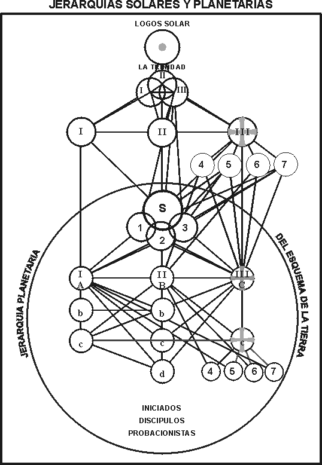

# CARTA VIII

## ACERCAMIENTO A LOS MAESTROS POR MEDIO DE LA MEDITACIÓN

1. ¿Quiénes son los Maestros?
2. ¿Qué entraña el acceso a los Maestros
   1. desde el punto de vista del estudiante y
   2. desde el punto de vista del Maestro?
3. Métodos de acercamiento a los Maestros durante la meditación.
4. El efecto de este acceso en los tres planos. <Pin lang="es">187</Pin> <Pin lang="en">256</Pin>

## 12 de septiembre de 1920.

### Búsqueda de la meta.

Hoy podré ocuparme, con mayor extensión, de los Maestros y cómo acercarse a Ellos a través de la meditación. Sé que este tema está muy cerca de su corazón y del corazón de aquellos que siguen ansiosamente la luz interna. Lo desarrollaré en tal forma que al final de esta carta los Maestros serán para ustedes más reales que nunca, porque habrán comprendido mejor lo que significa acercarse a Ellos; el método para hacerlo les resultará más simple; el efecto que producirá ese contacto se manifestará en la vida de tal manera, que se procurará ansiosamente lograrlo en forma inmediata y práctica. Por consiguiente, como hemos hecha en otros casos, vamos a clasificar nuestro tema en subtítulos y divisiones:

1. ¿Quiénes son los Maestros?
2. ¿Qué entraña el acceso a los Maestros
   1. desde el punto de vista del estudiante y
   2. desde el punto de vista del Maestro?
3. Métodos de acercamiento a los Maestros durante la meditación.
4. El efecto de este acceso en los tres planos.

<Pin lang="es">188</Pin> 

### <Pin lang="es">189</Pin> Explicación del diagrama de las jerarquías solar y planetaria

LA JERARQUIA SOLAR

El Logos Solar

|

La trinidad Solar o los Logos

|                        |                     |
| ---------------------- | ------------------- |
| I. El Padre            | Voluntad o Poder    |
| II. El Hijo            | Amor - Sabiduría    |
| III. El Espíritu Santo | Inteligencia Activa |

|

Los siete Rayos

Tres rayos de aspecto

Cuatro rayos de atributo

|                     |                    |                          |
| ------------------- | ------------------ | ------------------------ |
| I. Voluntad o Poder | II. Amor-Sabiduría | III. Inteligencia Activa |
|                     |                    | 4. Armonía o Belleza     |
|                     |                    | 5. Conocimiento concreto |
|                     |                    | 6. Devoción o Idealismo  |
|                     |                    | 7. Magia ceremonial      |

|

La Jerarquía Planetaria

 

Sanat Kumara, el Señor del Mundo.

(El Anciano de los Días. El Iniciador Uno.)

|

Los Tres Kumaras.

(LosTres Buddhas de Actividad.)

1 ... 2 ... 3

|

Reflejos de los Tres Rayos mayores en los cuatro menores.

Los Tres Guías Departamentales.

<table style={{width: "70%"}}>
    <tr>
        <td style={{width: "33.3%", verticalAlign: "top"}}>
            
I. El Aspecto Voluntad

            
A. El Manú.

            
|

            
b) El Maestro Júpiter.

            
|

            
c) El Maestro M.

        </td>
        <td style={{width: "33.3%", verticalAlign: "top"}}>
            
II. El Aspecto Amor-Sabiduría

            
B. El Bodhisattva.

            
(El Cristo. El Instructor del Mundo.)

            
|

            
b) Un Maestro Europeo.

            
|

            
c) El Maestro KH.

            
|

            
d) El Maestro DK.

        </td>
        <td style={{width: "33.3%", verticalAlign: "top"}}>
            
III. El Aspecto Inteligencia

            
C. El Mahachohán.

            
(El Señor de la Civilización.)

            
|

            
c) El Maestro Veneciano.

            
|

            
4. El Maestro Serapis.

            
5. El Maestro Hilarión.

            
6. El Maestro  Jesús.

            
7. El Maestro R.

        </td>
    </tr>
</table>

|

Cuatro Grados de Iniciados.

|

Varios grados de discípulos.

|

Personas que se hallan en el sendero de probación.

|

Humanidad común de cualquier grado.

 

En todas partes del mundo se siente el anhelo que impulsa al hombre a buscar a alguien que personifique su ideal. Aun quienes no admiten la existencia de los Maestros buscan algún ideal y luego <Pin lang="es">190</Pin> lo visualizan, encarnado en alguna forma, en el plano físico. <Pin lang="en">257</Pin> Quizás se imaginan a sí mismos como exponentes de la acción ideal o vean a algún gran filántropo, eminentísimo científico, notable artista o músico, como encarnando su suprema concepción. El ser humano, simplemente por ser fragmentario e imperfecto, ha sentido siempre dentro de sí mismo el impulso de buscar a otro que sea más grande que él. Esto lo impele a volver al centro de su ser, obligándolo a tomar el camino de retorno al Omni-Yo. En el transcurso de las edades, siempre el Hijo Pródigo se levanta y vuelve al Padre, y siempre permanece latente en su memoria el recuerdo del Hogar del Padre y Su gloria. Pero la mente humana está constituida de manera que la búsqueda de la luz y el ideal, es lógicamente larga y difícil. "A veces la vemos a través de un cristal oscuro, pero luego cara a cara". Ahora vemos, fugazmente a través de las ventanas que ocasionalmente cruzamos al ascender la escala evolutiva, a Seres más grandes que nosotros, que nos tienden una mano de ayuda y nos incitan a luchar valientemente si queremos llegar a donde Ellos han llegado.

Presentimos la belleza y la gloria que nos circunda, y que aun no podemos gozar; pasa fugazmente nuestra visión y alcanzamos tal gloria en un momento sublime, para volver a perderla y hundirnos de nuevo en la lóbrega oscuridad que nos envuelve. Pero sabemos que fuera y más allá existe algo deseable; descubrirnos que el misterio de esa maravilla externa sólo puede ser alcanzado retirándonos internamente, hasta hallar el centro de la conciencia que vibra a tono con esas maravillas tenuemente percibidas y con las radiantes Almas que se denominan a Sí mismas nuestros Hermanos Mayores. Únicamente pisoteando las envolturas externas que velan y ocultan el centro interno, alcanzamos esa meta y hallamos a esos Seres que buscamos. Sólo cuando hemos dominado todas las formas y las sometemos a la égida del Dios interno podemos hallar <Pin lang="en">258</Pin> a Dios en todo, porque las envolturas en que nos movemos en el plano del ser, son las únicas que nos ocultan al Dios interno y nos separan de Aquellos en quienes este Dios trasciende todas las formas externas.

Un gran iniciado que expresó lo que digo aquí, añadió otras palabras de radiante verdad: "Entonces nos conoceremos tal como somos conocidos". El futuro encierra para cada uno y para todo aquel que lucha debidamente: sirve abnegadamente y medita por el método ocultista, la promesa de que conocerán a Quienes tienen pleno conocimiento de aquel que lucha. En esto reside la esperanza del que estudia la meditación. A medida que lucha, fracasa, persevera y laboriosamente repite día tras día, la ardua tarea de concentración y control de la mente, en el aspecto interno están Quienes <Pin lang="es">191</Pin> lo conocen y, con vehemente simpatía, observan el progreso que realiza.

Recuerden la primera parte de las observaciones hechas por ese Iniciado, donde indica el medio por el cual se disipa la oscuridad y se alcanza el conocimiento de los Grandes Seres. Hace hincapié en que sólo por el amor se recorre el sendero de luz y conocimiento. ¿Por qué hace hincapié en el amor? Porque la meta para todos es el amor y allí subyace la fusión. Para explicar científicamente, lo que con frecuencia es un sentimiento ambiguo, podemos expresarlo de la manera siguiente: Cuando se logra esa vibración, análoga a la del Rayo de Amor-Sabiduría (el rayo divino), se hace contacto con los Señores de Amor, se conoce a los Maestros de Compasión, y la posibilidad de penetrar en la conciencia de los Grandes Seres y de todos nuestros hermanos, cualquiera sea su rango, se convierte en una realidad de la manifestación.

Éste es el sendero que han de seguir todos y cada uno, y el método es la meditación. La meta es Amor y Sabiduría perfectos; los pasos a dar consisten en superar, en los tres planos, un subplano tras otro; el método es la meditación ocultista; la recompensa es la <Pin lang="en">259</Pin> continua expansión de conciencia, que finalmente pone al hombre en perfecta relación con su propio Ego, con los otros Yoes, con el Maestro que le ha sido asignado y lo espera ansiosamente, con los condiscípulos e Iniciados avanzados, con los cuales puede entrar en contacto dentro del aura del Maestro, hasta que por último hace contacto con el Único Iniciador, es admitido en el Lugar Secreto y conoce el misterio que subyace en la conciencia misma.

## 14 de septiembre de 1920.

### 1. ¿Quiénes son los Maestros?

Será de valor considerar el tema del acceso a los Maestros por medio de la meditación. Empezaré con algunas afirmaciones fundamentales concernientes a los Maestros y el lugar que ocupan en la evolución. Por lo tanto trataré el primer punto. De esta manera expondré, a quienes lean estas cartas, algunas ideas sobre Su Jerarquía, Su abarcante desenvolvimiento y Sus métodos de trabajo. Es innecesario decir que gran parte de lo que diré no contiene nada nuevo ni de importancia. Las cosas que más de cerca nos conciernen y con las cuales estamos más familiarizados, son las que más frecuentemente pasamos por alto y las más oscuras para nuestra facultad razonadora.

Maestro de Sabiduría es aquel que ha pasado la quinta iniciación. Esto, en realidad, significa que Su conciencia ha alcanzado tal expansión, que ello incluye el quinto reino o reino espiritual. Se ha abierto camino a través de los cuatro reinos inferiores: el <Pin lang="es">192</Pin> mineral, el vegetal, el animal y el humano, y, por medio de la meditación y el servicio, ha expandido Su Centro de conciencia hasta incluir el plano del espíritu.

Maestro de Sabiduría es aquel que ha transferido la polarización desde los tres átomos de la vida de la personalidad -incluidos en el cuerpo causal- a los tres átomos de la Tríada espiritual. <Pin lang="en">260</Pin> Conscientemente es espíritu-intuición-mente abstracta o atma-budi-manas, no potencialmente sino en pleno poder efectivo, alcanzado por medio de la experiencia. Esto lo ha logrado, como dije anteriormente, por el proceso de la meditación.

Maestro de Sabiduría es aquel que no sólo ha encontrado el acorde del Ego sino también el pleno acorde de la Mónada, y puede, por lo tanto, pulsar a voluntad las variaciones de todas las notas, desde la más baja hasta las del plano monádico. Esto significa esotéricamente que ha desarrollado la facultad de crear y puede emitir la nota correspondiente a cada plano y construir en el mismo. Este poder de descubrir -primero las notas del acorde monádico y después utilizar estas notas en el trabajo constructivo- se realiza primeramente por medio de la meditación practicada según el método ocultista, equilibrado por el servicio prestado amorosamente.

Maestro de Sabiduría es aquel que puede aplicar la ley en los tres mundos y dominar todo lo que evoluciona en esos planos. Por el aprendizaje de las leyes de la mente, mediante la práctica de la meditación, el Maestro expande estas leyes hasta abarcar las leyes de la Mente Universal, tal como se expresan en la manifestación inferior. Las leyes de la mente se aprenden en la meditación y se aplican en la vida de servicio, consecuencia lógica del conocimiento verdadero.

Maestro de Sabiduría es aquel que ha pasado del Aula del Aprendizaje al Aula de la Sabiduría; ha cursado los cinco grados, ha trasmutado la mente inferior en mente pura y sin mácula y el deseo en intuición, anegando su conciencia con la luz del Espíritu puro. La disciplina de la meditación es el único camino por el cual esto puede realizarse.

Maestro de Sabiduría es aquel que, por el conocimiento <Pin lang="en">261</Pin> adquirido mediante los cinco sentidos, ha aprendido que existe una síntesis y ha fusionado los cinco sentidos en los dos sintéticos, que marcan el punto de realización en el sistema solar. Por medio de la meditación se ajusta el sentido geométrico de proporción, se reconoce claramente el sentido de los valores y, mediante tal reajuste y reconocimiento, se disipa la ilusión y se conoce la realidad. La práctica de la meditación y la concentración interna que en ella se realiza despierta la conciencia respecto al valor de la fórmula y su verdadero empleo. Por ello se hace contacto con la realidad, y los tres mundos ya no pueden atraparnos.

<Pin lang="es">193</Pin> Maestro de Sabiduría es aquel que conoce el significado de la conciencia, de la vida y del espíritu, y puede llegar directamente, por la línea de menor resistencia, al "seno de su Padre, en el Cielo". El acercamiento a la línea de menor resistencia, el camino directo, se descubre mediante la práctica de la meditación.

Maestro de Sabiduría es aquel que se ha trasformado a Sí mismo, de quíntuple en triple y de triple en dual. Se ha convertido en la estrella de cinco puntas, y cuando ha llegado ese momento la ve brillar sobre el Único Iniciador y la observa en todos Aquellos que han alcanzado Su misma posición. Ha santificado (en sentido esotérico) el Cuaternario, utilizándolo como piedra fundamental, sobre la cual erige el Templo de Salomón. Ha progresado más allá del templo mismo, llegando a considerarlo una limitación. Ha salido de sus muros limitadores y ha penetrado en la Triada. Lo ha hecho empleando siempre el método ocultista, es decir, conscientemente y con pleno conocimiento de cada paso dado. Aprendió el significado de cada forma limitadora, asumió el control y aplicó la ley en el plano correspondiente a la forma. Habiendo trascendido la forma, la desechó por otras superiores. Así progresa constantemente a través del sacrificio y de la muerte de la forma. <Pin lang="en">262</Pin> Reconoce que ella siempre aprisiona, que hay que sacrificarla constantemente y debe morir para que la vida interna progrese rápidamente hacia adelante y arriba. El camino de la resurrección presupone la crucificación y la muerte; luego conduce al Monte donde tendrá lugar la Ascensión. Durante la meditación se puede apreciar y conocer el valor de la vida y las limitaciones de la forma, y mediante el conocimiento y el servicio la vida puede liberarse de todo lo que limita y traba.

Maestro de Sabiduría es aquel que ha decidido permanecer en este planeta para ayudar a sus semejantes. Quienes alcanzan la quinta iniciación son Maestros de Sabiduría, pero no todos se quedan para trabajar como servidores de la raza. Algunos emprenden otros trabajos de igual o mayor importancia. Para el público en general esta expresión significa que algunos Maestros deciden permanecer y limitarse a Sí Mismos en beneficio de quienes tratan de avanzar en la escala de evolución. Por la meditación el Maestro alcanza Su meta y por la meditación (algo que a menudo no se comprende) o la manipulación de la materia mental y por su actuación sobre los cuerpos mentales de la raza, lleva a cabo el trabajo que ayuda al proceso evolutivo.

Maestro de Sabiduría es aquel que ha recibido esa primera Iniciación que lo vincula con la gran Fraternidad de Sirio, y como ya he dicho, es un iniciado de Primer Grado en la Gran Logia. Ha alcanzado una expansión de conciencia que le ha permitido entrar en contacto con muchos sectores del sistema solar. Ahora tiene <Pin lang="es">194</Pin> ante Sí una vasta región de expansiones que eventualmente lo llevarán más allá de la conciencia del sistema, hacia algo mucho más grande y amplio. Debe empezar a aprender los rudimentos de la meditación cósmica, que le permitirá entrar en esa Conciencia que está más allá de cuanto podemos concebir.

<Pin lang="en">263</Pin> Maestro de Sabiduría es aquel que actúa conscientemente, como parte del Hombre celestial, a Cuyo cuerpo puede pertenecer. Comprende las leyes que rigen a los grupos y a las almas grupales. Él mismo rige conscientemente un alma grupal (un grupo que se halla en el sendero de retorno, compuesto por muchos hijos de los hombres) y conoce el lugar que le corresponde en el cuerpo del sistema. También conoce ese Centro en el Cuerpo del Hombre celestial, mediante el cual se mantiene la vibración armoniosa entre Él y Su grupo, y lo conduce a relacionarse con otros grupos en el mismo Cuerpo, de acuerdo a determinadas leyes. El estudiante que reflexiona se dará cuenta de cuán útil es la meditación, como preparación para esta actividad, pues es el único medio de trascender todo sentimiento de separatividad y comprender esotéricamente la unidad con nuestros semejantes.

Maestro de Sabiduría es aquel a quien se le han confiado, en virtud del trabajo realizado, ciertas Palabras de Poder. Por medio de estas palabras aplica la ley a otras evoluciones distintas de la humana y, a través de ellas, colabora con el aspecto actividad del Logos. Así fusiona Su conciencia con la del tercer Logos. Por medio de dichas Palabras ayuda en el trabajo constructor y en el esfuerzo manipulador cohesivo del segundo Logos; comprende la acción interna de la ley de gravedad (o de atracción y repulsión) que rige todas las funciones del segundo aspecto Logoico. Mediante estas Palabras colabora en el trabajo del primer Logos, y al recibir la sexta y séptima iniciaciones (lo cual no siempre logra), aprende el significado de la Voluntad, tal como es aplicada en el sistema Estas Palabras le son comunicadas oralmente y mediante la facultad de clarividencia, pero el Iniciado debe descubrirlas por Sí mismo una vez que alcanza la conciencia átmica y la utiliza.

<Pin lang="en">264</Pin> Al desarrollar esta conciencia por medio de la intuición, el Iniciado puede hacer contacto con la reserva de conocimientos inherente a la Mónada y así aprender las Palabras de Poder. Esta capacidad sólo se adquiere después de la aplicación del Cetro de la Iniciación por el Señor del Mundo. Por lo tanto, en las etapas superiores de la meditación ocultista, el maestro de Sabiduría amplía más aún Su conocimiento. Su conciencia no permanece estática, sino que cada día es más abarcante.

Maestro de Sabiduría es aquel que ha obtenido el derecho, por similitud de vibración, de trabajar con los Guías de la Jerarquía de este planeta, conjuntamente con los de otros planetas <Pin lang="es">195</Pin> conectados con nuestra cadena. Cuando ha recibido otras iniciaciones puede hacer contacto con los siete Logos planetarios y trabajar conjuntamente con ellos, y no sólo con los tres que controlan las cadenas afines, pudiendo abarcar el entero sistema, pues Su conciencia se ha expandido hasta incluir todo el sistema solar objetivo.

Podría enumerar otras definiciones y dilucidar el asunto más ampliamente, pero con lo dicho hoy, basta. El punto alcanzado por un Maestro es elevado sólo relativamente, pues se ha de recordar que cuando lo alcanza, comprueba que es realmente inferior, comparado con la perspectiva que se extiende ante Él. Cada expansión de conciencia y cada peldaño de la escala, no hace más que abrir ante el iniciado otra esfera que ha de abarcar y otro paso que ha de avanzar. Cada iniciación lograda sólo revela otras más elevadas a alcanzar, de manera que nunca se llega al punto en que el aspirante (sea un hombre común, iniciado, Maestro, Chohan o Buda) puede permanecer en condición estática, incapaz de mayor progreso. Hasta el Logos Mismo aspira llegar, y aún Aquel a Quien el Logos aspira, a su vez, aspira llegar a otro superior a Él.

<Pin lang="en">265</Pin> Lo que ocurre en el sistema se repite en los planos cósmicos y lo que se aprende aquí debe aprenderse nuevamente, en más vasta escala, en el cosmos mismo. Esta idea encierra inspiración y desenvolvimiento, no cansancio ni desesperación. La recompensa que viene con cada paso adelante, el gozo que acompaña a toda nueva comprensión, compensa al luchador aspirante en forma adecuada. Mañana trataremos el aspecto más práctico del tema, el hombre que aspira a esta elevada vocación.

## 16 de septiembre de 1920.

### 2. Lo que entraña el acceso a los Maestros.

Trataremos el segundo punto de esta octava carta, estudiándola en dos sentidos: brevemente, desde el punto de vista del Maestro, y con cierta extensión, desde el punto de vista del discípulo.

En estas cartas he dado un amplio delineamiento de la magna tarea que tiene ante sí el hombre que se propone llegar a la meta. Mucho de lo escrito no tiene interés para aquel que sólo ha alcanzado un desarrollo común, concierne principalmente a quien ha llegado a una etapa específica en la evolución y se halla en el sendero de probación. Gran parte de lo que podría decirse sobre ello ya ha sido tratado anteriormente. No abarcaré aquí el mismo terreno, sino que me referiré en especial a las relaciones internas que existen entre Maestro y discípulo.

Esta relación comprende cuatro grados; en cada uno el aspirante se acerca más a su Maestro, y abarca el periodo en que el individuo <Pin lang="es">196</Pin> está en entrenamiento hasta el momento en que se convierte en un adepto, siendo tales períodos los siguientes:

1. Aquél en que el aspirante se halla en probación.
2. <Pin lang="en">266</Pin> Aquél en que se convierte en discípulo aceptado.
3. Aquél en que se lo considera como intimo del Maestro o, según se dice esotéricamente, el "Hijo del Maestro".
4. Aquél en que recibe las tres iniciaciones finales, donde se reconoce como uno con el Maestro. Su condición es la de "Elegido del Maestro", condición análoga a la de Juan, el discípulo amado, a que se refiere La Biblia.

Estos estados están regidos por dos condiciones:

1. Similitud de vibración,
2. karma

implicadas en la capacidad del individuo para desarrollar la conciencia grupal.

En los planos de la mente superior, en el segundo subplano, tenemos un reflejo de lo que se puede observar en los planos superiores de nuestro sistema solar. ¿Qué tenemos allí? Siete Hombres celestiales, integrado cada uno (desde el punto de vista de la forma) por almas grupales -formadas de unidades de conciencia humana y angélica. En el segundo subplano del plano mental se hallan los grupos que pertenecen a los Maestros, si puedo expresarlo así. Estos grupos están animados y vitalizados desde el subplano atómico, donde residen los Maestros [^1] (cuando Se manifiestan para ayudar a los hijos de los hombres), de la misma manera que los Hombres celestiales tienen Su fuente de origen y la causa de Su vida en el plano atómico del sistema solar, al que llamamos plano de Adi o primer plano. Estos grupos se forman alrededor de un Maestro, están incluidos en Su aura y son parte de Su conciencia, abarcando a personas cuyos rayos egoico y monádico son iguales <Pin lang="en">267</Pin> a los del Maestro. Esto significa que conciernen a dos tipos de personas:

[^1]: Desde 1920 han ocurrido grandes cambios. En la actualidad (1945) han sido trasladados al plano búdico (A.A.B.)

1. Los que se preparan para recibir la primera y segunda iniciaciones en el rayo del Ego.
2. Los que se preparan para recibir las dos iniciaciones siguientes en el rayo de la Mónada. He aquí la razón de la trasferencia de una persona de un rayo a otro. La trasferencia sólo es aparente, aunque signifique pasar al grupo de otro Maestro. Esto tiene lugar después de la segunda iniciación.

### <Pin lang="es">197</Pin> Los tres objetivos del probacionista.

Durante el período en que el aspirante se halla en probación se espera que desarrolle tres cosas:

1. La aptitud de hacer contacto con su grupo o, en otras palabras, ser sensible a la vibración del grupo, del cual un determinado Maestro es el punto focal. Al principio establece contacto a raros intervalos. Durante la primera parte de su período de probación, mientras está bajo observación, sólo es capaz de sentir y retener la vibración del grupo (que es la vibración del Maestro) durante un periodo muy breve. En un momento de elevación se vinculará con el Maestro y el grupo; todo su ser será inundado con esa elevada vibración que surgirá como una explosión del color del grupo. Luego se apaciguará, volverá a su estado anterior y perderá el contacto. Sus cuerpos no están suficientemente refinados y su vibración es demasiado inestable para retenerla durante mucho tiempo.
 Pero a medida que transcurre el tiempo (períodos extensos o breves, de acuerdo al anhelo del estudiante) la frecuencia de los momentos de contacto aumenta, puede retener la vibración mayor tiempo y no vuelve a su estado normal tan fácilmente. Llega por fin el momento en que puede mantener el contacto regularmente estable. Entonces pasa a la segunda etapa.

2. <Pin lang="en">268</Pin> La facultad de pensar en forma abstracta, o el poder de hacer contacto con la mente superior, vía el cuerpo causal. Debe aprender a hacer contacto con la mente inferior, simplemente como un instrumento para llegar a la superior, y así trascendería hasta polarizarse en el cuerpo causal. Después, por medio del cuerpo causal, se vinculará con los niveles abstractos. Hasta no realizar esto le resultará imposible establecer contacto con el Maestro, pues, como ya se ha dicho, el estudiante debe elevarse desde su mundo (el inferior) al mundo del Maestro (el superior).

 Ahora bien, ambas cosas -el poder de llegar al Maestro y a Su grupo y el poder de polarizarse en el cuerpo causal y llegar a niveles abstractos- son definidamente el resultado de la meditación, como ha sido aclarado en cartas anteriores. Por lo tanto, no es necesario recapitular la información dada, excepto indicar que por la meditación constante y la facultad de concentrarse en el inmediato deber (que después de todo sólo es el fruto de la meditación practicada en la vida diaria) vendrá la creciente facultad para retener firmemente la vibración más elevada. He de reiterar una y <Pin lang="es">198</Pin> otra vez esta aparentemente sencilla verdad, que únicamente la similitud de vibración atraerá al aspirante al grupo superior a que pueda pertenecer, al Maestro que representa para él el Señor de su rayo, al Instructor del Mundo que le administrará los misterios, al Único Iniciador que efectuará la liberación final y al Centro del Hombre celestial en Cuyo cuerpo el aspirante halla su lugar. La actuación de la Ley de Atracción y Repulsión, en todos los planos, extrae la vida divina del reino mineral, del vegetal y del animal y también de la Deidad latente, limitada por el reino humano, <Pin lang="en">269</Pin> afiliando al hombre con su grupo divino. La misma ley lo libera de las formas sutiles que análogamente lo atan y lo fusionan de nuevo con su fuente animadora, el Señor de Rayo en cuyo Cuerpo se halla su Mónada. En consecuencia, el trabajo del probacionista consiste en armonizar su vibración con la del Maestro, purificar sus tres cuerpos inferiores para que no entorpezcan dicho contacto, y controlar su mente inferior en tal forma que no obstaculice el descenso de luz desde el triple Espíritu. Así puede hacer contacto con esa Tríada y con el grupo en el subplano mental superior, al cual pertenece por derecho y karma. Todo esto se logra por la meditación, y no existe ningún otro medio para alcanzar dichos objetivos.

 :::note Recuerda

 Por la meditación constante y la facultad de concentrarse en el inmediato deber (que después de todo sólo es el fruto de la meditación practicada en la vida diaria) vendrá la creciente facultad para retener firmemente la vibración más elevada. He de reiterar una y <Pin lang="es">198</Pin> otra vez esta aparentemente sencilla verdad, que únicamente la similitud de vibración atraerá al aspirante al grupo superior a que pueda pertenecer, al Maestro que representa para él el Señor de su rayo, al Instructor del Mundo que le administrará los misterios, al Único Iniciador que efectuará la liberación final y al Centro del Hombre celestial en Cuyo cuerpo el aspirante halla su lugar.

 :::

3. Equiparse emocional y mentalmente, **comprender y comprobar que tiene algo que dar al grupo al cual está afiliado esotéricamente**. Reflexionen sobre lo siguiente: a veces se hace demasiado hincapié en lo que el estudiante recibirá cuando sea un discípulo aceptado o probacionista. Diré con toda seriedad, el aspirante no dará los pasos deseados hasta que tenga algo para dar, algo que agregar para aumentar la belleza del grupo, algo que aportar a ese equipo disponible que el Maestro necesita para ayudar a la raza, y que acrecentará la riqueza del colorido grupal. Esto puede realizarse de dos maneras que interactúan mutuamente:
   1. Equipando, por el estudio y la aplicación, el contenido de los cuerpos mental y emocional.
   2. Utilizando ese equipo para servir a La raza en el plano físico, demostrando así a la Jerarquía observadora que el estudiante tiene algo que dar. También debe <Pin lang="en">270</Pin> demostrar que su único deseo es ser benefactor y servidor, más bien que codiciar y adquirir para sí. Esta vida de adquisición con el propósito de dar, debe tener por incentivo los ideales alcanzados en la meditación y por inspiración la afluencia de los niveles mentales superiores y de los <Pin lang="es">199</Pin> niveles búdicos, como resultado de la meditación ocultista.

Cuando se han obtenido estos tres resultados y la vibración superior alcanzada es más frecuente y estable, el probacionista da el siguiente paso y se convierte en discípulo aceptado.

### Discipulado aceptado.

El segundo período, cuando el estudiante se convierte en discípulo aceptado, es quizás uno de los más difíciles en toda la sucesión de vidas de un hombre, lo cual se debe a diversas causas.

El discípulo constituye una parte del grupo del Maestro y se halla en todo momento en Su conciencia, siendo mantenido dentro de Su aura, lo cual implica conservar constantemente una elevada vibración. Quisiera que reflexionaran sobre el efecto que esto produce. Resulta algo difícil sostener continuamente esta vibración; frecuentemente implica la intensificación de todo cuanto subsiste en la naturaleza del hombre y puede conducir (especialmente al principio) a curiosas manifestaciones. *No obstante, si el hombre es capaz de retener la fuerza resultante de la aplicación del Cetro de Iniciación, debe demostrar su aptitud para hacerlo en las primeras etapas, mantenerse estable y avanzar firmemente cuando esté sometido a la intensa vibración proveniente del Maestro*.

Debe disciplinarse a sí mismo en tal forma, que nada penetre en su conciencia capaz de perjudicar al grupo al cual pertenece o antagonizar con la vibración del Maestro. A fin de darles una idea <Pin lang="en">271</Pin> clara de lo que quiero significar diré, que al principio cuando forma parte del grupo, incluido en el aura del Maestro, es mantenido en la periferia de esa aura hasta que ha aprendido a expulsar de sí automáticamente, y a rechazar inmediatamente todo pensamiento y deseo indignos del yo y por lo tanto, perjudicial para el grupo. Hasta que no aprenda a hacerlo, será incapaz de lograr una relación más íntima, pero deberá permanecer donde pueda ser aislado automáticamente. Gradualmente se purificará cada vez más, desarrollará la conciencia grupal y pensará en términos grupales de servicio; poco a poco su aura absorberá la coloración del aura del Maestro, hasta fusionarse y adquirir el derecho de ser atraído más cerca del **"Corazón de su Maestro"**. Más adelante explicaré el significado técnico de esta frase, cuando me ocupe del trabajo que realiza el Maestro con el discípulo. Basta decir que a medida que transcurre el período de **"discípulo aceptado"** (y varía según los casos), va acercándose al corazón del grupo y encuentra su lugar y actividad funcional en ese cuerpo colectivo. El secreto es: hallar nuestro propio lugar, no tanto en la escala de la evolución (pues esto se sabe aproximadamente), sino en el servicio. Ello tiene más <Pin lang="es">200</Pin> importancia de lo que se cree, pues abarca el periodo que finalmente señalará, en forma terminante, el sendero que deberá seguir el hombre después de la quinta iniciación.

:::note Recuerda

El secreto es: hallar nuestro propio lugar, no tanto en la escala de la evolución (pues esto se sabe aproximadamente), sino en el servicio.

:::

### Afiliación con el Maestro.

Llegamos ahora al momento en que el discípulo pasa a la muy apetecida posición de "hijo del Maestro". Entonces es conscientemente y en todo momento parte de la conciencia del Maestro. La interacción entre Él y el discípulo se perfecciona rápidamente, y el discípulo puede conscientemente y a voluntad vincularse con el Maestro y conocer Sus pensamientos, penetrar en Sus planes, <Pin lang="en">272</Pin> deseos y voluntad. Esto lo ha adquirido en virtud de la similitud de vibración y porque el proceso de aislamiento (necesario al principio, debido a la vibración discordante) ha sido prácticamente superado; el discípulo se ha purificado al punto de que sus pensamientos y deseos ya no causan inquietud al Maestro ni tampoco vibración antagónica al grupo. Ha sido sometido a prueba, y no ha fracasado. Su vida de servicio en el mundo es más concentrada y perfecta, y desarrolla día tras día su poder de dar, acrecentando sus dotes. Todo ello concierne a su relación con algún Maestro o alma grupal. No depende de si recibe la iniciación. La iniciación es una cuestión técnica y puede expresarse en términos de ciencia esotérica. Un individuo puede recibir una iniciación. La iniciación es una cuestión técnica y puede expresarse en términos de ciencia esotérica. Un individuo puede recibir una iniciación y sin embargo no ser "hijo de un Maestro". El discipulado constituye una relación personal, regida por las condiciones de karma y afiliación, y no depende de la posición del individuo en la Logia. Mantengan esto claro en sus mentes. Se han dado casos en que el hombre, gracias a su dedicación y laboriosidad, ha adquirido los requisitos técnicos para la iniciación antes de afiliarse a un Maestro determinado.

Esta última relación de ser "hijo" de un Maestro, tiene una dulzura peculiar propia, y otorga ciertos privilegios. El discípulo puede entonces asumir alguna carga que pesa sobre el Maestro y aliviarlo de ciertas responsabilidades, liberándolo para que realice un trabajo más extenso. De allí que se haga tanto hincapié sobre el servicio, porque el hombre avanza en la medida que sirve, siendo la nota clave de la vibración del segundo nivel abstracto. Durante dicho período el Maestro conferenciará con Su "hijo", planeando el trabajo a realizar, de acuerdo a sus unificados puntos de vista. Así el Maestro desarrollará la discriminación y el juicio de su discípulo y aliviará Su propia carga en ciertas líneas, liberándose para otro trabajo más importante.

<Pin lang="en">273</Pin> Poco puede decirse acerca del período final de lo que estamos considerando. Abarca el período en que el hombre domina las <Pin lang="es">201</Pin> etapas finales del Sendero y entra en contacto, cada vez más íntimo, con su grupo y con la Jerarquía. No sólo vibra a tono con su grupo y su Maestro, sino que empieza a reunir a su propia gente y a formar su grupo propio. Al principio este grupo existirá nada más que en los niveles emocional, físico y mental inferior. Después de la quinta iniciación el discípulo incluirá dentro de su aura a estos grupos y a los que les son propios en los niveles egoicos. Esto en manera alguna impide que continúe siendo uno con el Maestro y con el grupo, pero el método de interfusión es uno de los secretos de la iniciación.

Todo ello unido a lo que se ha dicho anteriormente, dará una idea de los derechos y poderes que se adquieren en los senderos de probación y de iniciación. Los métodos de desenvolvimiento son siempre los mismos: la meditación ocultista y el servicio; la vida interna de concentración y la externa de práctica; la aptitud interna de ponerse en contacto con lo superior y la aptitud externa de expresar esta facultad mediante una vida santa; la radiación interna del Espíritu, y la externa brillando ante los hombres.

## 17 de septiembre de 1920

El tema que hemos estudiado durante los últimos días, aunque no es tan técnico como los anteriores, lleva en sí una vibración que hará de esta octava carta una de las más interesantes de la serie. He tratado hechos respecto a los Maestros, Quiénes son Ellos y el lugar que ocupan en el esquema de las cosas; he dilucidado brevemente lo que entraña tener acceso a un Maestro, desde el punto de vista del discípulo. Se ha visto que el acercamiento es un proceso gradual y lleva al hombre desde un <Pin lang="en">274</Pin> contacto externo ocasional con un Maestro y Su grupo, a una posición muy íntima y a una actitud que coloca al discípulo dentro del aura y cerca del corazón de su Instructor. Ahora vamos a considerar brevemente lo que este cambio gradual de posición ha significado para el Maestro y ha exigido de Él.

### Relación entre Maestro y discípulo.

Como frecuentemente se ha dicho, la atención del Maestro es atraída hacia un individuo por el brillo de su luz interna. Cuando esta luz ha alcanzado cierta intensidad, cuando los cuerpos están compuestos de materia de cierta calidad, el aura ha tomado cierta tonalidad, la vibración ha alcanzado cierto grado y ritmo específicos y la vida del hombre comienza a emitir un sonido esotérico en los tres mundos (el cual ha de hacerse oír a través de una vida de servicio), determinado Maestro lo somete a prueba, aplicándole una vibración más elevada y estudiando cómo reacciona <Pin lang="es">202</Pin> a ella. Cuando el Maestro elige un discípulo, lo hace regido por el karma pasado y su antigua vinculación con él, por el rayo en que ambos se encuentran y la necesidad del momento. El trabajo del Maestro (todo lo que pueda trabajar inteligentemente en forma exotérica) es variado e interesante y está basado en la comprensión científica de la naturaleza humana. ¿Qué debe hacer el Maestro con el discípulo? Bastará enumerar lo esencial para obtener una idea del alcance de su trabajo:

Acostumbrar al discípulo a elevar su grado vibración, hasta que pueda mantener continuamente una vibración elevada, luego ayudarlo a que esta vibración elevada se convierta en un ritmo estable en los cuerpos del discípulo.

Ayudar al discípulo a transferir la polarización, desde los tres átomos inferiores de la personalidad a los superiores de la triada espiritual.

<Pin lang="en">275</Pin> Vigilar el trabajo realizado por el discípulo mientras erige el canal entre la mente superior y la inferior, a medida que construye y utiliza este canal (el antakarana). Oportunamente éste reemplaza al cuerpo causal como medio de comunicación entre lo superior y lo inferior. También el cuerpo causal desaparece con el tiempo, cuando el discípulo recibe la cuarta iniciación y puede crear libremente su propio cuerpo de manifestación.

Ayudar decididamente a vivificar los diversos centros y a despertarlos correctamente, y más tarde ayudar al discípulo a actuar conscientemente a través de esos centros y guiar el fuego circulante en correcta progresión geométrica, desde la base de la columna vertebral al centro coronario.

Supervisar el trabajo del discípulo en diferentes planos y registrar la amplitud del trabajo realizado y el alcance del efecto que produce la palabra pronunciada por el discípulo, Éste es (expresándolo esotéricamente) el efecto producido en los planos internos por la nota que emite su vida exotérica.

Expandir la conciencia del discípulo de varias maneras y desarrollar su capacidad para incluir y hacer contacto con otros grados de vibración, aparte de la humana, para comprender la conciencia de otras evoluciones y actuar fácilmente en otras esferas, además de la terrestre.

El objetivo inmediato del Maestro, al trabajar con el discípulo, es prepararlo para la primera iniciación. Esto tiene lugar cuando él ha desarrollado la capacidad de mantener cierto grado de vibración durante un período específico de duración; el tiempo de duración lo determina el periodo que permanecerá ante el Señor que imparte las dos primeras iniciaciones. Esto se efectúa elevando gradualmente la vibración durante pocos y determinados <Pin lang="es">203</Pin> intervalos, después con más frecuencia, hasta que el discípulo puede vibrar con mayor facilidad y comodidad al mismo grado de <Pin lang="en">276</Pin> vibración de su Maestro y mantenerla durante períodos cada vez más extensos. Cuando puede sostenerla durante este período (cuya longitud es lógicamente uno de los secretos de la primera iniciación), se lo somete a una vibración aún más elevada, la cual -si es capaz de mantenerla- le permitirá estar ante el Gran Señor el tiempo suficiente para la ceremonia de la iniciación. La aplicación del Cetro de la Iniciación, en tales condiciones, efectúa algo que estabiliza la vibración y facilita la tarea de vibrar a un ritmo más elevado en planos más sutiles.

Desarrolla la capacidad del discípulo para trabajar en forma grupal. Estudia sus acciones e interacciones en el propio grupo a que está afiliado. Trabaja con su cuerpo causal, su expansión y desenvolvimiento; le enseña a comprender la ley de su propio ser, trayendo la comprensión del macrocosmo.

Ahora bien, los distintos aspectos del trabajo del Maestro (que sólo son algunos de los pocos puntos a considerar) podrían ser tratados con mayor extensión y resultarían de gran interés para el lector. Cada uno de los párrafos que anteceden pueden ampliarse y resultar muy iluminadores, pero el punto principal que trato de hacer resaltar aquí se refiere a las primeras etapas de este trabajo, antes de que al discípulo se le permita llegar a posteriores etapas, de mayor intimidad con el Maestro. Durante este período el Maestro trabaja con el discípulo principalmente durante

1. la noche, cuando el discípulo está fuera del cuerpo físico, y
2. los períodos en que el discípulo medita.

De acuerdo al éxito obtenido en la meditación y a la capacidad del estudiante para aislarse de lo inferior y hacer contacto con lo superior, así será la oportunidad que ofrecerá al Maestro para <Pin lang="en">277</Pin> efectuar el trabajo científico determinado que demanda Su atención. Los estudiantes de la meditación se sorprenderían o quizás se decepcionarían si se dieran cuenta cuán pocas veces, durante la meditación, proporcionan las condiciones correctas que permiten al Instructor, que los observa, obtener ciertos resultados. La frecuencia con que la capacidad del estudiante permite hacer esto, indica su progreso y la posibilidad de adelantar otro paso. Al enseñar se ha de insistir sobre ello, porque lleva en sí un incentivo para una mayor dedicación y aplicación. Si el discípulo por su parte no proporciona las condiciones convenientes, las manos del Maestro están atadas y muy poco puede hacer. El propio esfuerzo es la clave del progreso, conjuntamente con la aplicación consciente y comprensiva en el trabajo designado. Cuando el esfuerzo es perseverante el <Pin lang="es">204</Pin> Maestro tiene la oportunidad de realizar la parte que le Corresponde en la tarea.

A medida que el discípulo medita con precisión ocultista, alineando sus tres vehículos inferiores, y repetiré enfáticamente, sólo cuando se haya efectuado el alineamiento el Maestro podrá trabajar con los cuerpos del discípulo. Si de la publicación de estas cartas no se obtiene otra cosa que la intensificación del deseo de meditar con corrección, se habrá cumplido en gran parte el objetivo buscado. En tal esfuerzo se establecerán las condiciones precisas entre el discípulo y el Maestro y se logrará una correcta interrelación. La meditación, cuando se la practica correctamente, proporciona estas condiciones y prepara el campo para la tarea y el trabajo.

Vamos a considerar ahora, brevemente, los diversos períodos enumerados ayer, al estudiar las relaciones del discípulo con el Maestro.

En el período en que el aspirante está bajo probación y supervisión... se lo deja casi enteramente librado a sí mismo siendo consciente de la atención del Maestro únicamente a muy raros e irregulares intervalos. Su cerebro físico pocas veces es receptivo <Pin lang="en">278</Pin> al contacto superior, y aunque el Ego se da cuenta de su situación en el sendero, el cerebro físico no está todavía en condiciones de saberlo. Sin embargo, sobre esto no se puede establecer una regla fija e inflexible. Cuando el aspirante ha establecido contacto con su Ego o con su Maestro en varias vidas anteriores, puede ser consciente de ello. Los individuos difieren tanto entre sí que no se puede formular una regla universal. Como bien saben, el Maestro modela una pequeña imagen del probacionista, la cual guarda en ciertos centros subterráneos de los Himalayas. La imagen está relacionada magnéticamente con el probacionista, mostrando todas las fluctuaciones de su naturaleza. Está compuesta de materia emocional y mental, vibrando de acuerdo con las vibraciones de esos cuerpos. Muestra sus matices predominantes y, estudiándola, el Maestro puede apreciar rápidamente el progreso realizado y juzgar cuándo podrá permitírsele al probacionista tener una relación más íntima. Observa la imagen en determinados períodos, raras veces al principio, pues el progreso efectuado en las primeras etapas no es muy rápido, pero con creciente frecuencia a medida que el estudiante de meditación capta más fácilmente y colabora más conscientemente. Cuando el Maestro observa las imágenes, las modela y, por medio de ellas, obtiene ciertos resultados Así como más tarde le es aplicado el Cetro de la Iniciación a los cuerpos y centros del iniciado, de la misma manera el Maestro, en determinadas épocas, aplica ciertos contactos a las imágenes y por su intermedio estimula los cuerpos del discípulo. <Pin lang="es">205</Pin> Llega un momento en que el Maestro ve, por la observación de la imagen, que el aspirante es capaz de mantener el necesario grado de vibración, que ha efectuado las necesarias eliminaciones y ha alcanzado cierta intensidad de color. Entonces el Maestro puede arriesgarse (porque es un riesgo) y admitir al probacionista dentro de la periferia de Su propia aura. El probacionista se convierte entonces en un discípulo aceptado. <Pin lang="en">279</Pin> Durante el periodo en que el individuo es discípulo aceptado, el trabajo que realiza el Maestro es muy interesante. Le asigna clases especiales conducidas por discípulos más avanzados, supervisadas por el Maestro, y aunque puede asistir a clases generales más concurridas en el Ashrama (aula de enseñanza del Maestro), se lo somete a un entrenamiento más intenso. En las primeras etapas el Maestro trabaja de cuatro maneras:

1. A intervalos, y cuando el progreso del discípulo lo justifica, "atrae a éste a Su Corazón". Ésta es una descripción esotérica de una experiencia muy interesante a la cual será sometido el discípulo. Al finalizar una clase en el Ashrama o durante alguna meditación, especialmente exitosa, donde haya alcanzado determinado grado de vibración, el Maestro lo atraerá íntimamente hacia Sí, desde la periferia de Su aura al centro de Su conciencia. Con ello le proporciona una enorme y temporaria expansión de conciencia que le permitirá vibrar a un ritmo poco común. De allí la necesidad de meditar. La recompensa que tal experiencia representa sobrepasa con creces los más grandes esfuerzos.
2. El Maestro trabaja sobre los cuerpos de su discípulo mediante el color y produce en ellos efectos que le permiten progresar con mayor rapidez. Ahora verán por que se hace tanto hincapié sobre el color. No es sólo porque oculta el secreto de la forma y de la manifestación (secreto que debe ser conocido por el ocultista), sino para poder <Pin lang="en">280</Pin> colaborar conscientemente en el trabajo que el Maestro realiza sobre sus cuerpos y seguir inteligentemente los efectos producidos. Reflexionen sobre esto.
3. A intervalos determinados, el Maestro permite a sus discípulos hacer contacto con otras evoluciones, tales como la de los grandes ángeles y devas, los constructores menores y también las evoluciones subhumanas. El discípulo puede hacer esto sin peligro, gracias a la acción protectora que ejerce el aura del Maestro. Más adelante, cuando llegue a ser un iniciado, se le enseñará a protegerse a si mismo y a establecer sus propios contactos.
4. <Pin lang="es">206</Pin> El Maestro supervisa la estimulación de los centros en los cuerpos del discípulo y el despertamiento del fuego interno. Le enseña el significado de los centros y su correcta rotación cuatridimensional y oportunamente lo llevará a un punto en que podrá, conscientemente y con pleno conocimiento de la ley, trabajar con sus centros y ponerlos en condiciones de ser estimulados sin peligro por el Cetro de la Iniciación. No me es posible decir más sobre este tópico.

Sólo he enumerado, muy brevemente, algunas cosas que el Maestro tiene que hacer con su discípulo. No trataré de las etapas posteriores de su progreso. Conducimos a todos por etapas graduales, y los discípulos aceptados son todavía pocos. Si por la meditación, el servicio y la purificación de los cuerpos, se puede inducir a que avancen más rápidamente a los que están ahora en probación, entonces llegará el momento de proporcionarles mayor información. ¿De qué sirve dar informaciones que el estudiante no puede utilizar? No perdemos el tiempo en interesar intelectualmente a quienes tratamos de ayudar. Cuando el discípulo se ha preparado a sí mismo, se ha purificado y alcanzado la vibración adecuada, nada puede privarlo de adquirir todo el <Pin lang="en">281</Pin> conocimiento. Cuando abra la puerta y ensanche el canal, la luz y el conocimiento penetrarán a raudales.

Mañana trataremos el tercer punto o sea los métodos de acercamiento al Maestro, vía la meditación; trataré con alguna extensión ciertos tipos de meditación que facilitarán el contacto; pero no olviden que la vida de servicio objetivo debe ir a la par del crecimiento subjetivo; únicamente cuando ambos se observan juntos y son aprobados, se permitirá dar los pasos necesarios para establecer contacto. El Maestro sólo se interesa por el individuo desde el punto de vista de su utilidad para el alma grupal y su capacidad para ayudar.

## 19 de septiembre de 1920.

Hoy tomaremos los dos últimos puntos casi simultáneamente. Encararé los métodos de acercamiento a los Maestros y los efectos objetivos que se producen en los tres planos de la evolución humana. Algunos de los puntos ya son conocidos y otros quizás no sean tan familiares para el estudiante común. En estas cartas me be ocupado del estudiante y de lo que él debe aportar al esfuerzo; he indicado también su meta y, muy someramente, las fórmulas y métodos por los cuales puede lograr el éxito. También he considerado aquello que proporciona una ayuda para la meditación, es decir la Palabra Sagrada, el Color y el Sonido, y he indicado lo que (sí reflexionan silenciosamente sobre ello) puede <Pin lang="es">207</Pin> conducir al estudiante a hacer descubrimientos por sí mismo. Finalmente, he tratado de que los Maestros sean más reales para el estudiante, y así facilitar su acercamiento a Ellos.

¿Qué queda por hacer? Indicar cinco cosas que puede esperar confiadamente el estudiante que ha tratado de adaptar su vida conforme a lo impartido en estas cartas. Si el estudiante <Pin lang="en">282</Pin> proporciona las correctas condiciones, si se sujeta a las reglas requeridas, si procura lograr la regularidad, la calma y. esa concentración interna que constituye el misterio de los Lugares Elevados, llegará, en ciertas ocasiones y con mucha frecuencia, a obtener definidas realizaciones, consistentes en el reconocimiento externo de resultados internos, y serán para él la garantía de que se halla en el correcto sendero. Pero he de indicar una vez más que tales resultados sólo se alcanzan después de prolongada práctica, dura lucha, constante disciplina del triple hombre inferior y servicio consagrado al mundo.

### Métodos de acercamiento a los Maestros y resultados obtenidos.

Los métodos de acercamiento son tres. Podemos indicar además cinco resultados del empleo de los métodos. Los tres métodos son:

1. Servicio santificado.
2. Amor, demostrándose a través de la sabiduría.
3. Aplicación intelectual.

Estos tres sólo son distintos modos de expresar una misma cosa: actividad en un sólo sentido, que se expresa en servicio a la raza por medio del amor y la sabiduría. Algunos individuos lo expresan de una manera y otros de otra; unos tienen la apariencia externa de la intelectualidad y otros la del amor; sin embargo, antes de lograr la meta, la intelectualidad ha de estar basada en el amor, mientras que el amor sin desarrollo mental y sin la discriminación que otorga la mente, es propenso al desequilibrio y a la imprudencia. Tanto el amor como la mente han de expresarse en términos de servicio antes de que puedan florecer plenamente. Vamos a considerar estos métodos por separado e indicar la meditación que debe acompañarlos.

#### Servicio santificado.

Método empleado por el hombre que esgrime la ley, método del ocultista. Los rudimentos de este método <Pin lang="en">283</Pin> se encuentran en el raja yoga. La palabra "santificación", como bien saben, significa, en su sentido básico, la total entrega del ser a un único objetivo, al Señor o Regidor; la absoluta entrega del devoto al ser a quien aspira llegar; la consagración del triple hombre al trabajo a realizar. Por consiguiente, implica dedicar el tiempo y el Yo a la tarea de someter cada cuerpo al dominio <Pin lang="es">208</Pin> del Ego y el total dominio de Cada plano y subplano y significa abarcar toda evolución y forma de vida divina, tal como se manifiestan en esos planos y subplanos, con un solo objetivo y propósito -desarrollar el plan de la Jerarquía de la Luz. El método a seguir consiste en la intensa dedicación al trabajo de perfeccionamiento de los cuerpos para convertirlos en aptos instrumentos de servicio. Éste es quizás el camino más arduo que el hombre puede seguir. Llega sin excepción a cada sector de la vida. Todo se somete a la ley. Por lo tanto la fórmula de esa meditación tendrá una triple estructura:

1. Se estudiarán las leyes que rigen el cuerpo físico y se reflexionará sobre ellas. Esta reflexión se expresará como rígida disciplina aplicada al cuerpo físico, el cual se dedicará enteramente al servicio y se lo someterá, por consiguiente, a un proceso que lo sintonizará y desarrollará más rápidamente.
2. Se estudiará científicamente el cuerpo de las emociones y se comprenderán (en sentido ocultista) las leyes del agua. El aspirante aprenderá el significado de la frase: **"ya no habrá mar"**, y el mar tormentoso y pasional será reemplazado por el mar de cristal, que reflejará directamente la intuición superior y la reproducirá con perfecta exactitud en su superficie tranquila e inmóvil. El cuerpo emocional <Pin lang="en">284</Pin> se dedicará exclusivamente al servicio, su posición en el triple microcosmo será considerada análoga a la del macrocosmo y se captará el significado oculto de que dicho cuerpo es la única unidad completa en la triple naturaleza inferior, conocimiento que se utilizará para obtener ciertos resultados. Reflexionen sobre esto
3. Se estudiará el lugar que la mente inferior ocupa en el esquema de las cosas y se desarrollará la discriminación. Discriminación y fuego están esotéricamente aliados, y así como el Logos comprueba por medio del fuego qué tipo de trabajo realiza el hombre, también el microcosmo ,en pequeña escala, hace lo mismo. El Logos también realiza esto, principalmente durante la quinta ronda del juicio y la separación; así también el microcosmos, en menor escala, realiza lo mismo en el último y quinto período de su evolución -tratado y descrito anteriormente en estas cartas. Se utilizará al máximo cada uno de los poderes de la mente para impulsar los planes de la evolución; primeramente, en el propio desenvolvimiento del hombre; luego, en el campo especial del trabajo en que él se expresa y, finalmente, en sus relaciones con otras unidades de la raza, a medida que se constituye en un guía y servidor.

<Pin lang="es">209</Pin> ¿Ven, por lo tanto, la síntesis de esto? Ante todo, la tenaz centralización, signo del ocultista, fusionado por la sabiduría y el amor, reflejo de lo superior en el espejo del cuerpo emocional; luego, el intelecto forzado a actuar como servidor del Yo o Ego centralizado, animado por el amor y la sabiduría, dando por resultado el verdadero yogui.

Quisiera puntualizar aquí que verdadero yogui es aquel que después de emplear debidamente las fórmulas ya determinadas y de meditar durante el tiempo establecido, fusiona esa meditación en la vida cotidiana, llegando oportunamente a mantener una <Pin lang="en">285</Pin> actitud meditativa durante todo el día. La meditación es el medio para hacer contacto con la conciencia superior. Cuando el contacto se hace continuo reemplaza a la meditación, tal como ustedes la comprenden. En el primer método, el estudiante de ocultismo trabaja de la periferia al centro, de lo objetivo a lo subjetivo, de la forma a la vida que la anima. En consecuencia, por la importancia que el Raja Yoga da al cuerpo físico y su control inteligente, el ocultista comprende la importancia esencial del físico, y la inutilidad de todo su conocimiento si no tiene un cuerpo físico por el cual pueda expresarse y servir a la raza. Ésta es la línea del primer rayo y su rayo afín o complementario.

:::note Recuerda

verdadero yogui es aquel que después de emplear debidamente las fórmulas ya determinadas y de meditar durante el tiempo establecido, fusiona esa meditación en la vida cotidiana, llegando oportunamente a mantener una actitud meditativa durante todo el día. La meditación es el medio para hacer contacto con la conciencia superior. Cuando el contacto se hace continuo reemplaza a la meditación, tal como ustedes la comprenden.

:::

#### Amor y Sabiduría.

Este método constituye la línea de menor resistencia para los hijos de los hombres. Es el subrayo del rayo sintético de una vibración análoga, de la cual nuestro sistema solar es la manifestación objetiva. Pero quisiera señalar que el amor adquirido por quien practica la meditación y sigue esta línea, no constituye el concepto sentimental que tan frecuentemente se pone en discusión. Tampoco es el amor que no discrimina, ve limitaciones ni reconoce defectos. No es ese amor que evita la corrección y se expresa en una actitud irracional hacia todo ser viviente. Tampoco es el amor que impele a todos a prestar servicio, adecuado o inadecuado, y no reconoce diferencias en los grados de evolución. Gran parte de lo que se denomina amor -si se lo dejara actuar con lógica- prescindiría aparentemente de la escala de evolución y le daría a todo igual valor. Potencialmente es así, pero en los actuales términos de servicio no lo es.

El verdadero amor o sabiduría ve con perfecta claridad las deficiencias inherentes a toda forma, y dirige sus esfuerzos a prestar ayuda a la vida que en ella mora, para liberarla de sus trabas. Sabe a quienes debe ayudar y quienes no necesitan ayuda. Oye con claridad, percibe el pensamiento del corazón y trata de <Pin lang="en">286</Pin> fusionar en uno a todos los que actúan en el campo mundial. Esto no se obtiene obrando ciegamente, sino por el discernimiento y la sabiduría, separando las vibraciones antagónicas y ubicándolas <Pin lang="es">210</Pin> en distinta posición. Se ha hecho demasiado hincapié en lo que se llama amor (interpretado por el hombre de acuerdo a su actual grado de evolución) y no en la sabiduría, que es amor expresándose en servicio- ese servicio que reconoce la ley oculta, el significado del tiempo y la etapa de evolución alcanzada.

Esta es la línea de segundo rayo y de sus rayos afines o complementarios. Más tarde será el omni incluyente, el solvente y el absorbente. Siendo sintético, puede seguírselo indistintamente en la línea del Raja Yoga o en la del Gnóstico cristiano.

#### Aplicación intelectual.

Aquí el orden se invierte y el estudiante, por estar frecuentemente polarizado en el cuerpo mental, debe aprender, con ayuda de la mente, a comprender a los otros dos cuerpos, a dominar, controlar y utilizar en la máxima medida los poderes inherentes al triple hombre. El método, en este caso, quizás no sea tan difícil en cierto sentido. Pero antes de que haya un verdadero progreso, deben ser trascendidas las limitaciones del quinto principio. Estas limitaciones consisten en gran parte en cristalizaciones y en lo que denominamos orgullo. Ambos deben ser destruidos antes de que el estudiante, que progresa por medio de la aplicación intelectual, pueda servir a su raza, teniendo como causa animadora el amor y la sabiduría.

Tiene que aprender el valor de las emociones y al hacerlo debe comprender el efecto que produce el fuego sobre el agua -comprenderlo esotéricamente. Debe aprender el secreto del plano emocional, que -una vez conocido- proporcionará la clave para la afluencia de luz desde la Tríada vía el cuerpo causal, y de éste al astral. Además contiene la clave del cuarto nivel etérico. Esto no <Pin lang="en">287</Pin> será comprendido aún por ustedes, pero lleva en sí una indicación de gran valor para el estudiante.

Esta es la línea del tercer rayo y de sus cuatro rayos subsidiarios, siendo de gran actividad, de frecuente trasferencia y de despliegue mental muy activo en los mundos inferiores.

Sólo cuando el estudiante que progresa por la aplicación intelectual, haya aprendido el secreto del quinto plano, llevará una vida de servicio santificado, fusionando así los tres caminos. Hay que llegar a la síntesis, aunque siempre se ha de mantener el colorido o tono fundamental. En la próxima o quinta ronda, tendremos una mayor expresión de este método. Será la ronda de máximo desarrollo mental y llevará a sus Mónadas evolucionantes a alturas no soñadas hasta ahora.

La presente ronda marca la culminación del segundo método, el de Amor-Sabiduría. En la cuarta ronda el emocional obtiene un elevado grado de vibración, y existe una conexión directa entre el cuarto plano de armonía, el cuerpo emocional o cuarto <Pin lang="es">211</Pin> principio, el cuaternario, la cuarta raza raíz o Atlante, que coordinó el astral. En estas correspondencias o analogías tenemos mucho tema para pensar.

## 21 de septiembre de 1920.

### Cinco resultados de la meditación en los tres mundos.

Hoy veremos los cinco efectos producidos en los tres cuerpos de los mundos inferiores, de los cuales será consciente quien estudie la meditación y siga debidamente las instrucciones dadas.

Estos efectos no se producen específicamente en la vida, según <Pin lang="en">288</Pin> los ve el mundo, es decir como un gran amor, espiritualidad o capacidad de servir. Hoy trataré de explicar cuáles son las indicaciones en la conciencia del cerebro físico del estudiante que ha realizado parte del trabajo necesario y está logrando parcialmente el objetivo deseado. Tengan esto muy en cuenta. No intento aclarar los muchos y variados resultados de la aplicación de las leyes ocultas de la meditación. Sólo me ocupo de un aspecto de la cuestión, es decir, de la comprensión, en la conciencia del cerebro físico, de ciertos resultados relacionados con nuestro tema inmediato, el acceso a los Maestros.

Esto reduce nuestro tema al reconocimiento consciente de los Maestros o de algún Maestro particular, en el cerebro físico del estudiante. Tal comprensión nada tiene que ver, en gran parte, con el lugar que ocupa en el Sendero y de lo lejos o cerca que se halle de la iniciación. Quizás algunos Egos muy avanzados que verdaderamente se hallan muy cerca de su Maestro, tratan de resolver este problema, pero son incapaces de hacer llegar a sus cerebros físicos hechos específicos que comprueben Su cercanía a Aquel. Unos adquieren este conocimiento antes que otros. Ello depende del tipo de cuerpo utilizado y del trabajo realizado en vidas anteriores, dando por resultado un vehículo físico, que es exponente bastante exacto del hombre interno. Frecuentemente, el hombre ha logrado en los planos internos mayor categoría y realización que en el físico. Muchos de nuestros trabajadores más activos, en este particular medio siglo, están agotando su mal karma mediante cuerpos inadecuados. Pero con constancia, dedicación, elevado esfuerzo y persistente y paciente adaptación a las reglas establecidas, llega un momento en que el estudiante de pronto es consciente, en su cerebro físico, de ciertos acontecimientos inesperados y de una iluminación y percepción desconocidas hasta entonces. Es algo muy real y, sin embargo, <Pin lang="en">289</Pin> momentáneamente muy sorprendente, de que ya nada podrá negarle la realidad de que él vio, hizo contacto y sintió.

<Pin lang="es">212</Pin> Como he dicho muchas veces, en estas cosas sólo es posible generalizar. Sesenta mil millones de almas en proceso de evolución, cada una siguiendo determinadas rondas de vidas totalmente diferente de las de los demás, ofrecen un amplio campo de elección, y ninguna experiencia es igual a otra. Pero en líneas generales podría decirse que cinco de ellas (entre las muchas posibles) merecen ser enumeradas, pues comparativamente hablando ocurren con gran frecuencia. Todas han sido insinuadas anteriormente, pero voy a ampliar un poco los datos impartidos.

#### Ver al Maestro y al Yo en la caverna del corazón.

Como bien saben, se recomienda con frecuencia al estudiante visualizarse a sí mismo y al Maestro (reducidos, aproximadamente a 6 milímetros) dentro de la circunferencia del corazón etérico, y al finalizar su meditación, imaginar al corazón etérico y construir allí formas diminutas del Maestro, por el cual se sienta atraído, y de sí mismo. Esto debe hacerlo con minucioso detalle y cuidado, ayudado por la imaginación y el amoroso esfuerzo, modelando día a día sus imágenes, hasta que sean para él algo muy real y su construcción y formación se convierten en parte casi automática de su meditación. Llega un día (generalmente cuando las condiciones astrológicas son favorables y la Luna se acerca al plenilunio), en que es consciente en su cerebro, de que dichas imágenes no son los pequeños muñecos que él cree, sino que él está dentro de la figura que lo representa y se encuentra literal y verdaderamente ante el Maestro. Esto ocurre muy de tarde en tarde al principio, y la conciencia del hecho se mantiene sólo durante breves segundos; a medida que avanza y se desarrollan todos los aspectos de su naturaleza y de su servicio, se repite con más frecuencia la <Pin lang="en">290</Pin> experiencia, que dura períodos más prolongados, hasta que llega el momento en que puede vincularse tan fácilmente con su Maestro como antes construyó sus imágenes.

¿Qué ha ocurrido? El discípulo ha logrado realizar tres cosas:

1. Identificarse con la imagen dentro del corazón, aspirando llegar al Maestro.
2. Construir un canal permanente entre el centro cardíaco (en el que está tratando de enfocar su conciencia) y su correspondiente centro coronario. Como bien saben, cada uno de los siete centros del cuerpo tiene su contraparte en la cabeza. Por la vinculación del centro cardiaco con su contraparte en la cabeza viene la iluminación, y es lo que se ha realizado en este caso.
3. No sólo ha realizado las dos cosas mencionadas, sino que ha purificado en tal forma esa parte del cerebro físico, correspondiente a ese particular centro de la cabeza, que <Pin lang="es">213</Pin> puede responder a las vibraciones superiores requeridas y, en consecuencia, registra lo que ha transcurrido.

#### Reconocimiento de la vibración.

En este caso el método no es el mismo. El estudiante llega a ser consciente en los momentos de intensa aspiración, durante la meditación, de una vibración o sensación peculiar en la cabeza. Puede ocurrir en uno de los tres lugares siguientes:

1. En la parte superior de la columna vertebral.
2. En la frente.
3. En la parte superior de la cabeza.

No me refiero aquí a la sensación que se experimenta cuando se desarrolla la facultad psíquica, aunque existe cierta relación entre ambas, sino a esa vibración que se produce al hacer contacto con uno de los Grandes Seres. Al principio el estudiante sólo es consciente de un momentáneo sentimiento de elevación, que se manifiesta en forma de estremecimiento o movimiento en la cabeza, <Pin lang="en">291</Pin> causando quizás alguna molestia; si se siente en la frente puede producir lágrimas o llanto; en la parte superior de la columna vertebral o base del cráneo, excitación y hasta mareo, y en la parte superior de la cabeza una sensación de expansión con un sentimiento de plenitud, como si el cráneo fuera muy estrecho. Estos efectos desaparecen con la práctica. Son causados por un contacto, momentáneo al principio, con algún Maestro. Con el tiempo el discípulo se acostumbra a esta vibración y la asocia con determinado Gran Ser, pues cada Maestro tiene Su propia vibración que la trasmite a Sus discípulos en forma específica. Este método de contacto va frecuentemente acompañado de un perfume. Con el tiempo el discípulo aprende a elevar su vibración a cierto grado, y una vez que lo ha conseguido, la mantiene en forma constante, hasta que siente, en respuesta, la vibración o el perfume del Maestro. Entonces procura fusionar su conciencia con la del Maestro, hasta ser capaz de discernir cuál es Su voluntad y comprender lo que tiene que comunicarle. A medida que transcurre el tiempo y aumenta la respuesta del discípulo, el Maestro, por Su parte, procurará atraer su atención o hacerle conocer Su aprobación (por ejemplo, despertando esta vibración dentro de la cabeza)

## 23 de septiembre de 1920.

Nos quedan tres puntos a tratar, pues he explicado los dos que se refieren al contacto con el Maestro en la caverna del corazón y al reconocimiento de Su vibración. Hay otros tres métodos (entre muchos, no lo olviden) por medio de los cuales el <Pin lang="es">214</Pin> estudiante puede ser consciente, en el cerebro físico, de haber hecho contacto con el Maestro.

### Traer a la conciencia del cerebro físico el recuerdo del Ashrama del Maestro y las lecciones impartidas allí.

<Pin lang="en">292</Pin> A medida que el estudiante persevera en la meditación y adquiere facilidad para alcanzar la adecuada vibración, construye un sendero (si así puede denominárselo) que lo conduce directamente a su Maestro. Tal es la afirmación literal de una realidad. Un buen trabajo proporciona con el tiempo el derecho a estar con el Maestro, en determinados períodos. Esto significa buen trabajo de meditación, unido a un activo servicio en bien de la raza. Estos intervalos son raros al principio, pero vienen más frecuentemente a medida que se progresa. Entonces el discípulo se da cuenta de ese contacto, por que lo recuerda al despertar. Verá la habitación del Maestro y recordará a sus compañeros de clase y también ciertas frases dichas por el Maestro, trayéndole el recuerdo del trabajo sugerido o de la amonestación recibida. Este método indica al discípulo que está logrando el acceso al Maestro, debido a la habilidad adquirida en la meditación.

### La obtención de cierta medida de conciencia causal.

Esto indica que el discípulo ha desarrollado (quizás en pequeña medida, pero cabalmente realizado) el poder de penetrar parcialmente en el mundo de los Maestros. La facultad de pensar y contemplar en forma abstracta y el poder de trascender las limitaciones de tiempo y espacio, son poderes del cuerpo egoico y, puesto que todos los grupos egoicos, como ya se dijo, están controlados por algún Maestro, el desenvolvimiento de la conciencia egoica (cuando es reconocida conscientemente) indica contacto y acceso. Muchas personas inconscientemente hacen contacto con su alma y temporariamente tienen destellos de conciencia egoica; pero cuando el discípulo puede elevarse conscientemente, intensificar deliberadamente su vibración y transferir su polarización al cuerpo egoico, aunque sólo sea por un breve momento, puede saber entonces que vibra al ritmo del Maestro de su grupo. Ha establecido <Pin lang="en">293</Pin> contacto. Puede ser que al principio no recuerde, en su cerebro físico, los detalles de dicho contacto; quizás no se dé cuenta de la apariencia del Maestro ni de las palabras que salieron de Sus labios. pero habiéndose ajustado conscientemente a la regla y penetrado en el silencio de los lugares elevados, la ley siempre se cumple y, por lo tanto, hizo contacto. Algunos discípulos conocen íntimamente a su Maestro en los planos internos y trabajan bajo Su dirección, pero pasan muchas vidas antes de que comprendan la ley y puedan construir deliberadamente, el canal de acceso, gracias al poder desarrollado en la meditación.

<Pin lang="es">215</Pin> Con el tiempo, la facilidad de contacto aumenta hasta el punto en que el discípulo puede, en cualquier momento, descubrir cuál es la voluntad de su Maestro y tener acceso a Su corazón.

### Escuchar la nota del Maestro

Este quinto método, aunque no tan común, es conocido por algunos. Por el sonido el aspirante se da cuenta del éxito. El aspirante sigue su fórmula usual de meditación; persevera día tras día y estudia, en los tres planos, el trabajo que debe efectuar; eleva continuamente su vibración y realiza el esfuerzo necesario, uniendo todo esfuerzo interno a la vida externa de amoroso servicio. En alguna meditación se dará cuenta repentinamente de una nota musical, que parece resonar dentro de la cabeza o emanar del corazón. No será evocada por la entonación de la Palabra Sagrada, que cuando es emitida por el hombre en cierta clave puede provocar respuesta musical del Ego, sino que vendrá como resultado o culminación de la meditación, y el sonido de la nota vibrará dentro del centro tan nítidamente que jamás se olvidará. Ello también indica éxito. Ha hecho contacto con el Maestro y Él ha respondido emitiendo el tono del propio Ego del hombre. En realidad esto ha dado lugar a que el custodio del portal responda habitualmente al presunto aspirante a los misterios del grupo. <Pin lang="en">294</Pin> Cuando el trabajo se hace debidamente el aspirante entonará la palabra de admisión en su propia clave o tono, tratando de dar la nota que evocará al Ego. El custodio responderá y entonará la respuesta en el mismo tono sonoro y pleno, y así, con el poder del sonido, vinculará al hombre con el Maestro que presidirá las ceremonias. Esto pone a cada miembro del grupo -por medio de su propio esfuerzo y del tercer factor, el custodio- en armonía con el Maestro. Con el tiempo esto se comprenderá mejor y se hará un constante esfuerzo para mantener la reverberación de la nota entre los que entran y los custodios del Umbral. Cuando se efectúa con perfección (algo imposible ahora), constituye una perfecta protección. Los grupos se organizarán, con el Maestro respectivo, de acuerdo a la formación egoica. La nota del grupo será conocida por quien custodia la entrada, no pudiendo entrar nadie que no emita la nota, ya sea en la octava superior o inferior. Esto es aplicable a los grupos que se consagran al desarrollo espiritual interno y que se ocupan directamente del trabajo de un Maestro, de sus estudiantes, discípulos o probacionistas afiliados. Otros grupos, formados de unidades diversas y bajo diferentes rayos y Maestros, custodiarán la puerta por otros métodos que serán revelados más adelante

Cuando el estudiante oye esta nota musical interna durante la meditación, debe procurar registrarla y cultivar la facultad de reconocerla y utilizarla. Esto no resulta fácil al principio, pues el sonido es inesperado y demasiado breve para captarlo; pero con <Pin lang="es">216</Pin> el tiempo y a medida que el discípulo obtiene una y otra vez la misma respuesta, puede comenzar a descubrir el método y a observar las causas que ponen la vibración en actividad.

Como ya he dicho, muchos son los métodos por los cuales el discípulo se da cuenta de su progreso en el sendero de acceso, y de entre estos muchos se han indicado cinco. Más adelante, <Pin lang="en">295</Pin> cuando estén organizadas las Escuelas de Meditación, vigiladas conscientemente por un Maestro en el plano físico, se llevarán registros del tiempo y de los métodos de contacto y se obtendrá así mucho conocimiento. Para finalizar, quiero indicar que la tarea del discípulo consiste siempre en evocar respuesta, y que el momento de la respuesta depende de su celo en el trabajo, de su consagración al servicio y de sus deudas kármicas. Cuando merezca cierta respuesta se manifestará en sus estrellas, y nada podrá entorpecerla o demorarla. Tampoco nada puede realmente apresurarla; por la tanto, el discípulo no necesita perder el tiempo en lamentaciones por falta de respuesta. Su parte consiste en obedecer las reglas, ajustarse a las fórmulas establecidas, reflexionar, adherirse inteligentemente a las instrucciones prescritas y trabajar definida y vehementemente para prestar servicio a sus semejantes. Cuando haya hecho todo esto, cuando haya acumulado el necesario material vibratorio en los tres cuerpos inferiores, cuando los haya alineado con el cuerpo egoico (aunque no sea más que por un breve minuto), quizás repentinamente pueda ver, oír y sentir una vibración. y entonces por siempre podrá decir que la fe está fusionada con la visión y la aspiración se ha convertido en reconocimiento.

:::note Recuerda

la tarea del discípulo consiste siempre en evocar respuesta, y que el momento de la respuesta depende de su celo en el trabajo, de su consagración al servicio y de sus deudas kármicas. Cuando merezca cierta respuesta se manifestará en sus estrellas, y nada podrá entorpecerla o demorarla. Tampoco nada puede realmente apresurarla; por la tanto, el discípulo no necesita perder el tiempo en lamentaciones por falta de respuesta. Su parte consiste en obedecer las reglas, ajustarse a las fórmulas establecidas, reflexionar, adherirse inteligentemente a las instrucciones prescritas y trabajar definida y vehementemente para prestar servicio a sus semejantes.

:::
