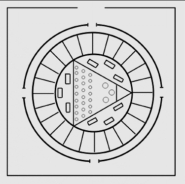

# CARTA IX

# FUTURAS ESCUELAS DE MEDITACIÓN

1. La escuela básica.
2. Sus subdivisiones nacionales.
3. Ubicación, personal y edificios de la escuela.
4. Los grados y las clases.

## 26 de septiembre de 1920.

<pin lang="es">217</pin><pin lang="en">297</pin> En esta carta me ocuparé de las Futuras Escuelas de Meditación; intentaré demostrar cómo se aplicará el entrenamiento y el desarrollo indicados en otras cartas; profetizaré respecto a lo que algún día será posible realizar y lo que todavía no es factible en manera alguna. Es conveniente mantener ideales elevados, porque la mente humana siempre mira hacia adelante y hacia una meta predestinada. Si lo que aquí voy a delinear les parece una visión imposible, se debe únicamente a que trato de presentar un ideal y proporcionar a la raza un objetivo muy digno de los mayores esfuerzos.

### Observaciones preliminares.

Detengámonos un momento y establezcamos ciertos postulados respecto al presente, que en cierto modo nos prepara el terreno para una futura acción.

El valor de la meditación se está aceptando en todas partes. En los diarios se anuncian Escuelas de Concentración y los métodos de desarrollo mental. Pero la verdadera meditación es aún poco comprendida. La concentración no es más que la base sobre la cual se ha de construir el trabajo futuro. La estructura no puede ser todavía erigida debido a dos causas principales:

1. <pin lang="en">298</pin> La incapacidad inherente al hombre, actualmente, para alcanzar el nivel causal y la conciencia de ese nivel.
2. La inexistencia de un Maestro en cuerpo físico, idóneo y competente, que enseñe el desarrollo realmente científico, meta de la verdadera meditación.

<pin lang="es">218</pin> La turbulenta condición del mundo en el presente es barrera suficiente que impide la aceptación general del entrenamiento y el desarrollo científico de los vehículos.

Establezco aquí estas premisas como punto de partida. Es innegable que algunos individuos alcanzan la meta, otros llegan a dominar el sistema de meditación ocultista y obtienen el progreso deseado; pero éstos constituyen un número muy reducido, y más aún si se los compara con el vasto conjunto de seres humanos encarnados a un mismo tiempo. Esos pocos triunfaron por el esfuerzo realizado durante épocas y porque en vidas anteriores hollaron el sendero o estuvieron cerca del portal de la iniciación. Pero incluso el hombre de mediana inteligencia (producto, por ejemplo, de la civilización occidental), se halla muy lejos de estar preparado para el entrenamiento esotérico. Ahora se están haciendo experimentos, en muchos casos desconocidos para los entes mismos, a fin de ver cuán rápidamente el hombre puede ser impelido, a través de la experiencia y de un aceleramiento general del proceso evolutivo, hacia una condición donde no será peligroso darle más entrenamiento. Hay personas en muchos países civilizados que son supervisadas, aplicándoseles un método de estimulo e intensificación, que llevará a conocimiento de los Grandes Seres un cúmulo de información, la cual Les servirá de guía en Sus futuros esfuerzos para bien de la raza. Se trata especialmente de personas residentes en América, Australia, India, Rusia, Escocia y Grecia. También están bajo observación algunos individuos en Bélgica, Suecia <pin lang="en">299</pin> y Austria. Si llegan a responder como se espera, formarán un núcleo que se irá expandiendo.

### Futuras Escuelas de Meditación.

Al tratar este tema, como es nuestra costumbre, lo subdividiremos en diferentes acápites, a saber:

1. La verdadera y única escuela fundamental.
2. Sus subdivisiones nacionales.
3. La ubicación, el personal y los edificios de la escuela.
4. Los grados y las clases.

Ante todo quisiera hacer hincapié, en forma vehemente, que todo cuanto digo aquí es parte de un plan provisional, cuyo objeto es acelerar la evolución de la mente superior y controlar los cuerpos de los hombres por el poder del Dios interno. Este plan ha sido formulado teniendo en cuenta la clamorosa y urgente necesidad del mundo, donde las facultades mentales del hombre se están acrecentando fuera de toda proporción, si se las compara con el equilibrio emocional y su equipo físico. El rápido avance del conocimiento, la difusión de los sistemas pedagógicos, que pone el <pin lang="es">219</pin> producto de numerosas mentes al alcance de los muy pobres, la capacidad de todos para leer y escribir, especialmente en los países de América y en las razas anglosajonas, han sido la causa de que se les plantee (casi diría inesperadamente) un problema realmente serio a los Grandes Seres.

El desarrollo mental debe ser una aspiración para todos, a condición de que vaya acompañado de estabilidad emocional y de un cuerpo sano. Pero ahora tenemos un desenvolvimiento mental, acompañado de inestabilidad astral y de un cuerpo físico débil, desnutrido y deficiente. De allí proviene el desorden, la falta de equilibrio, el oscurecimiento de la visión y las discusiones desproporcionadas. La mente inferior en lugar de ser un medio para un fin <pin lang="en">300</pin> y un instrumento para ser utilizado, está en camino de convertirse en regente y tirano, impidiendo la actuación de la intuición y excluyendo la mente abstracta.

En consecuencia, los Maestros tienen en proyecto un movimiento, si puede cumplirse de alguna manera, cuyo objeto es metodizar la mente inferior valiéndose de los individuos mismos. Con este objetivo en vista, proyectan utilizar el entrante Rayo de Ley Ceremonial u Organización y el período inmediatamente coincidente, o el siguiente, al advenimiento del Gran Señor, para iniciar estas Escuelas (al principio en forma limitada e inconspicua) y llevar a la conciencia del hombre los cuatro puntos fundamentales siguientes:

1. La historia de la evolución del hombre, desde el aspecto mental.
2. La constitución septenaria del macro y del microcosmos
3. Las leyes que rigen al ser humano.
4. El método de desarrollo ocultista.

Este trabajo ya se ha iniciado, por medio de las diferentes escuelas que existen actualmente. Constituyen los principios del plan. Cuando estén firmemente afianzadas, trabajen sin dificultades y sean reconocidas públicamente; cuando el mundo de los hombres haya sido matizado por ellas y por su énfasis subjetivo; cuando egresen de ellas escolares y obreros, políticos y científicos y también pedagogos que puedan hacer sentir su influencia en el medio ambiente, quizás llegue el momento para fundar con carácter exotérico la verdadera escuela de ocultismo. Con esto quiero significar que sí las primitivas escuelas y colegios desarrollan satisfactoriamente su trabajo, habrán demostrado al mundo de los hombres que lo subjetivo es la verdadera realidad y que lo inferior no es más que el escalón hacia lo superior. Esta realidad subjetiva, una vez admitida universalmente, permitirá fundar una cadena de <pin lang="es">220</pin> <pin lang="en">301</pin> escuelas internas, que serán reconocidas públicamente. No obstante, será necesario tener siempre una sección esotérica y secreta, pues habrá ciertas verdades y hechos cuyo conocimiento es peligroso para el no iniciado; pero aquí quiero puntualizar que los misterios serán aceptados oportunamente como realidades, para que se reconozcan universalmente como metas y objetivos universales. Los aspirantes a estos misterios provendrán de escuelas que definidamente y bajo una experta guía, serán separados para las escuelas internas. Estas escuelas han existido antes y, con el girar de la rueda, volverán a la manifestación.

Quizás se pregunten ¿Cuándo será? Ello depende de la humanidad misma y de todos ustedes, que con fe y aspiración trabajan en la iniciación del plan.

H. P. B. colocó la piedra fundamental de la primera escuela en este particular ciclo menor (que no obstante es relativamente importante, siendo un retoño de la quinta raza raíz, la aflorescencia del quinto principio). Ésta es la piedra clave. El trabajo de fundación de las diversas escuelas continúa, y las de ciencia mental tienen también su lugar. El plan avanzará como se desea si cada uno de los que reciben entrenamiento esotérico dedican todas sus fuerzas y energías a la tarea. Si se hace todo lo que es posible, cuando el Gran Señor venga con Sus Maestros, la tarea recibirá otro ímpetu y se expandirá y crecerá gradualmente, hasta convertirse en un poder en el mundo. Llegará el día en que las escuelas de ocultismo prepararán a los hombres para la iniciación.

## 27 de septiembre de 1920.

Hoy vamos a tratar el primero de los puntos enumerados, pues sólo cuando los cimientos están correctamente construidos se consigue que la superestructura reúna las condiciones requeridas.

### <pin lang="en">302</pin> La verdadera y única Escuela básica.

Es por lo tanto muy esencial hacer resaltar el hecho de que no importa cuales sean las escuelas subsidiarias. Escuela básica de ocultismo es aquella que tiene sus raíces en el sagrado centro del planeta, Shamballa. En este lugar, custodiada directamente por el Iniciador Uno, que es -aunque pocas veces se comprende- la expresión más elevada del Rayo de la Enseñanza en la tierra, existe lo que podría denominase la oficina central, para la tarea del entrenamiento disciplinario y educativo de la Jerarquía. Allí se halla el Chohan responsable de las distintas empresas, y ante Él son directamente responsables los Maestros que aceptan discípulos y los dirigentes de las diversas escuelas de ocultismo. Todo se desarrolla de acuerdo a una ley y orden.

<pin lang="es">221</pin> Algo sobre lo que quiero hacer hincapié es que la Fraternidad de la Luz, representada por los Maestros del Himalaya, tiene representantes en otras partes, que realizan un trabajo específico bajo adecuada supervisión. Los teósofos creen ser los únicos depositarios de la Religión de la Sabiduría. Sin embargo no es así. En este momento particular (con el fin de desarrollar y ofrecer la oportunidad a la quinta subraza) la Fraternidad del Himalaya es el canal principal del esfuerzo, del poder y de la luz. Pero el trabajo que se realiza con otras razas prosigue simultáneamente, y numerosos proyectos, procedentes de la oficina central en Shamballa, se desarrollan paralelamente con la tarea de la Fraternidad del Himalaya. Tengan esto muy en cuenta porque es importante. La Escuela y la Logia del Himalaya se ocupan principalmente de Occidente, siendo la única escuela sin excepción, que deberá controlar el trabajo y el aporte de los estudiantes de ocultismo en Occidente. No aceptará de los discípulos trabajo competidor o <pin lang="en">303</pin> extemporáneo, ni para beneficio de sus Instructores, sino para seguridad de sus discípulos. El peligro acecha en el sendero del estudiante de ocultismo, y los Adeptos del Himalaya saben cómo proteger adecuadamente a sus discípulos, siempre que se mantengan dentro de la periferia de Sus auras unidas y no se desvíen hacia otras escuelas. Todas las verdaderas escuelas de ocultismo exigen esto a sus discípulos, y los verdaderos Maestros esperan que ellos se abstengan de recibir al mismo tiempo otras instrucciones esotéricas. Los Maestros no dicen: "Nuestro método es el único correcto y verdadero". Ellos dicen "mientras reciban nuestras instrucciones sería inteligente y prudente abstenerse de recibir entrenamiento de otra escuela o de otro Maestro". Sí el discípulo lo desea tiene perfecta libertad de buscar otras escuelas y otros Instructores, pero primero tiene que romper sus anteriores conexiones.

La escuela central fundamental puede ser reconocida por ciertas características sobresalientes:

El carácter básico de las verdades que enseña, contenidas en los siguientes postulados:

1. La unidad de toda vida.
2. Las etapas graduales de desarrollo, reconocidas en el hombre, y las de su programa de estudios, que conducen al hombre de una expansión de conciencia a otra, hasta alcanzar lo que llamamos perfección.
3. La relación que existe entre el micro y el macrocosmos y su séptuple aplicación.
4. El método de este desarrollo y el lugar que ocupa el microcosmos dentro del macrocosmos, revelado mediante el <pin lang="es">222</pin> estudio de la periodicidad de toda manifestación y la ley básica de causa y efecto.

El énfasis puesto en la formación del carácter y en el <pin lang="en">304</pin> desenvolvimiento espiritual, como base para el desarrollo de -todas las facultades inherentes al microcosmos.

Los requisitos exigidos a todos los discípulos afiliadas sin excepción, a fin de que -la vida de desenvolvimiento y desarrollo internos vaya a la par de una vida de servicio exotérico.

Las sucesivas expansiones de conciencia, resultantes del entrenamiento impartido, llevando al hombre paso a paso hasta hacer contacto con su Yo superior, su Maestro, su grupo egoico, el Primer Iniciador, el Único Iniciador Supremo, hasta llegar al Señor de su Rayo y entrar en el seno de su "Padre que está en el cielo".

Estas son las características sobresalientes que describen a la verdadera y única escuela fundamental.

Dicha escuela tiene tres ramas principales y una cuarta está en proceso de formación, de modo que se constituirán las cuatro ramas de esta cuarta ronda, y son las siguientes:

1. La rama del Transhimalaya.
2. La rama de la India meridional (éstas son ramas arias).
3. La rama que trabaja con la cuarta raza raíz, y tiene como guías a dos adeptos de la cuarta raza raíz.
4. La rama en proceso de formación, que tendrá su sede central en Occidente, en un lugar aún no revelado. Su objetivo principal es dar instrucción a los individuos vinculados con la venidera sexta raza raíz.

Estas ramas están y estarán, estrechamente interaliadas y trabajarán en íntima colaboración, estando controladas por el Chohan y enfocadas en Shamballa. Los guías de cada una de las cuatro ramas se comunican frecuentemente entre sí, siendo similares a la facultad de una maravillosa Universidad. Las cuatro escuelas <pin lang="en">305</pin> se asemejan a los distintos y principales departamentos de una fundación -como las escuelas subsidiarias. La finalidad de todas es la evolución de la raza y llevar a los hombres ante el Único Iniciador. Los métodos empleados son fundamentalmente los mismos, aunque varían en detalle, debido a las características propias de cada raza y tipo y al hecho de que algunas escuelas trabajan predominantemente con un rayo y otras con otro.

La escuela del Transhimalaya tiene adeptos que ya conocen, y otros Cuyos nombres son desconocidos.

La Escuela de la India meridional trabaja especialmente con la evolución dévica y con la segunda y tercera subrazas de la rama aria.

<pin lang="es">223</pin> La escuela del Himalaya trabaja con la primera, cuarta y quinta subrazas.

La rama de la cuarta raza raíz trabaja bajo el Manú de esa raza y Su hermano del Rayo de la Enseñanza. Su sede se halla en China.

El Maestro R. y uno de los Maestros ingleses se ocupan de la fundación grupal de la cuarta rama de la Escuela, con la ayuda del Maestro Hilarión. Reflexionen sobre los hechos mencionados, porque su significado es de gran importancia.

Mañana me ocuparé del futuro. Hoy me he ocupado de hechos actuales.

## 28 de septiembre de 1920.

Hoy consideraré el segundo punto. Para dilucidarlo tendré que internarme en el campo de la profecía. Sin embargo quisiera recordarles que al predecir lo que existirá en el futuro, quizás lo que se produzca no sea exactamente como se ha previsto. Por mi parte sólo pretendo dar los delineamientos de un gran plan general. La forma en que este plan se desarrollará en el futuro <pin lang="en">306</pin> dependerá de la intuición o percepción elevada de los pensadores de la raza y de la capacidad de los egos encarnantes para aprovechar las oportunidades y cumplir con su destino.

Ayer traté de la verdadera y única escuela fundamental y de sus cuatro ramas. Hoy vamos a tratar de:

### Las subdivisiones nacionales de la escuela única.

De entrada señalaré que no todas las naciones tendrán su escuela de ocultismo, pues ésta sólo se puede constituir y fundar a medida que el cuerpo causal nacional adquiere un determinado ritmo de vibración. Cuando el trabajo educativo de una nación llegue a cierta altura, puede emplearse el grupo mental de la nación como escalón para una mayor expansión y como base de la escuela de ocultismo. Resulta interesante observar que sólo las naciones que originalmente tuvieran escuelas de entrenamiento para los misterios (excepto tres), tendrán nuevamente durante las primeras etapas, escuelas nacionales.

Las excepciones son:

1. Gran Bretaña.
2. Canadá y Estados Unidos.
3. Australia.

Estas excepciones podrían reducirse a una sola, el caso de Australia, porque las otras dos, en la época Atlante, tuvieron sus instituciones esotéricas cuando formaron parte del primitivo continente. <pin lang="es">224</pin> En el girar de la rueda la tierra misma reencarna; los lugares entran en oscuración o pralaya, y vuelven a la manifestación, llevando en sí las semillas de lo que con el tiempo vibrará en forma similar, trayendo nuevamente a la existencia modos y formas similares de expresión.

Más adelante se verá, cuando sean fundadas las escuelas de ocultismo, que estarán situadas en los lugares donde persiste todavía el antiguo magnetismo, y en algunos casos se han <pin lang="en">307</pin> conservado antiguos talismanes que la Fraternidad dejó con ese fin.

Las ramas, afiliadas a una de las cuatro divisiones centrales de la única fundación esotérica, existirán en los siguientes países:

1. Egipto. Una de las últimas escuelas a fundarse, será profundamente ocultista y avanzada y estará en comunicación directa con los grados internos. De ello trataré más adelante.
2. Estados Unidos. Tendrá una escuela preparatoria, en alguna parte del centro oeste meridional y un instituto de ocultismo subsidiario en California, en un lugar que se revelará más adelante. Será una de las primeras en abrirse cuando el Gran Señor inicie Su carrera terrena y probablemente antes de cinco años serán sembradas las semillas si los estudiantes captan correctamente el trabajo a realizar.
3. Habrá una Escuela para los países latinos, probablemente en Italia o sur de Francia; pero esto depende mucho del trabajo político y educativo, en el curso de los próximos diez anos.
4. Gran Bretaña. En uno de los lugares magnetizados de Escocia o Gales, se iniciará, dentro de poco, una rama para entrenamiento esotérico que abarcará el programa de estudio de los primeros grados. Luego de unos pocos años de existencia, una vez demostrada la efectividad del entrenamiento y después que Irlanda haya solucionado sus problemas internos, se abrirá allí, en uno de los lugares magnetizados, una escuela para grados más avanzados que preparará definitivamente para los misterios. En realidad, entrenará para recibir una iniciación superior y estará dirigida por el Bodisatva, preparando al discípulo de segundo rayo para la iniciación. La primera Escuela de Egipto será para quienes reciban la iniciación de primer rayo en Occidente.

<pin lang="en">308</pin> Los que reciban la iniciación en la línea del Mahachohan o en la de tercer rayo, lo harán en una escuela ocultista avanzada, en Italia. De esta manera en Occidente habrá un centro donde se dará instrucción de acuerdo a las tres línea de acercamiento y preparará para los misterios internos.

5. Existirá también una escuela preparatoria en Suecia, para las razas nórdica y germánica que buscan el sendero. Después <pin lang="es">225</pin> de existir ésta por algún tiempo, Rusia estará en condiciones de tener una sede para una escuela más avanzada, vinculada a la preparatoria de Suecia. En conexión con la escuela superior de Egipto habrá una escuela preparatoria en Grecia o Siria.

Por lo tanto, se ha proyectado establecer las escuelas detalladas más adelante, teniéndose en cuenta que primeramente serán fundadas las escuelas preparatorias y los primeros grados, que están ya en proceso de formación o lo estarán durante el período inmediato, precediendo la venida del Gran Señor. La fundación de otras vendrá como consecuencia de Su trabajo y el de Sus Maestros, y dependerá de lo que Ellos decidan y del éxito de los primeros esfuerzos

| Grados preparatorios           | Escuelas Avanzadas |
| ------------------------------ | ------------------ |
| Grecia o Siria                 | Egipto             |
| Centro oeste de Estados Unidos | California         |
| Sur de Francia                 | Italia             |
| Escocia o Gales                | Irlanda            |
| Suecia                         | Rusia              |
| Nueva Zelandia                 | Australia          |

<pin lang="en">309</pin> Se ha proyectado una escuela preparatoria para los egos avanzados de la cuarta raza raíz. Será supervisada por el Manú de esa raza y estará situada en Japón. con su rama esotérica en China occidental, constituyendo la séptima en el grupo de escuelas descritas.

No se ha planeado aún el establecimiento de ramas en Sudáfrica ni en Sudamérica. No ha llegado el momento, pero llegará en el próximo ciclo.

Debo advertirles que estas escuelas tendrán un comienzo muy modesto y serán establecidas de tal modo que parecerán demasiado insignificantes para llamar la atención. Se hará un primer ensayo con miembros de diversas escuelas esotéricas, como los de la sección esotérica del movimiento teosófico y otros. Ya se ha iniciado la tarea en Gran Bretaña, América y Australia y muy pronto se iniciará en Suecia. Las otras les seguirán dentro de poco.

Sólo se ha permitido publicar esta parte del Plan como un incentivo para quienes estudian con intensa aspiración y trabajan con gran empeño. Cada uno tendrá su lugar en el plan si se realiza el trabajo necesario, el cual consistirá en:

El esfuerzo de reconocer lo divino dentro de cada uno. De esta manera la verdadera obediencia ocultista, esencial en todo <pin lang="es">226</pin> entrenamiento ocultista, será fomentada y desarrollada; no estará basada, como sucede a menudo, en la personalidad, sino en la comprensión instintiva de que existe un Maestro y en la disposición de seguirlo, como resultado del conocimiento de Sus poderes, la pureza de Su vida y objetivos y la profundidad de Sus conocimientos.

El esfuerzo para pensar en términos de grupo y claramente por sí mismo, sin depender de otros para las explicaciones aclaratorias.

<pin lang="en">310</pin> El esfuerzo para purificar y refinar todos los cuerpos y convertirlos en servidores dignos de confianza.

El esfuerzo para equipar al cuerpo mental lo mejor posible y acumular en él hechos sobre los cuales ampliar el conocimiento.

Cuando se realicen tales cosas, grande será la oportunidad.

## 2 de octubre de 1920.

Mediante la rígida disciplina impuesta por uno mismo, llega oportunamente la perfección. Nada es demasiado insignificante para el discípulo, porque la meta se alcanza mediante el riguroso ajuste de los detalles en la vida del mundo inferior. El discípulo al acercarse al Portal, lleva una vida cada vez más difícil; la vigilancia ha de ser más estricta, y ha de obrar correctamente, sin considerar las consecuencias, luchar con cada cuerpo y subyugar cada uno de sus aspectos. Sólo mediante la total comprensión del axioma: "Conócete a ti mismo", llega el conocimiento que permite al hombre aplicar la ley y conocer el mecanismo interno del sistema desde el centro a la periferia. Lucha, esfuerzo, disciplina y servicio dedicado, sin otra recompensa que la incomprensión y el abuso de los que vienen detrás, es la función del discípulo.

Hoy me ocuparé del tercer punto.

### 3. La ubicación, el personal y el edificio de la escuela de ocultismo.

Desde ya les recuerdo que gran parte de lo que podría decir sobre este tema lo omitiré porque no podrán comprenderlo. Formularé ciertas reglas y haré ciertas indicaciones fundamentales, <pin lang="en">311</pin> que podrán aplicarse en el desarrollo final. No formularé ninguna regla que deba cumplirse, pues no es tal la ley ocultista. Al establecerse estas escuelas de ocultismo, en sus dos divisiones, preparatoria y superior, en los diversos centros designados, dependientes de una de las cuatro ramas de la verdadera y única Escuela Fundamental de Ocultismo, el trabajo se iniciará de manera que pase desapercibido. Los discípulos y egos avanzados, cuya tarea consista en hacer los preparativos necesarios, deberán <pin lang="es">227</pin> descubrir por sí mismos el método, el lugar y el procedimiento. Todo debe ser forjado en la hoguera del esfuerzo y el experimento, y el precio a pagar será elevado, porque lo que así se obtiene, proporciona el residuo o núcleo sobre el cual se basará el trabajo posterior. Los errores no interesan, pues sólo sufre la transitoria personalidad. Lo importante es que haya aspiración y habilidad para emprender las cosas y capacidad para aprender las lecciones que los fracasos enseñan. Cuando los fracasos se consideran como valiosas lecciones, cuando el error se toma simplemente como advertencia para evitar un desastre y cuando el discípulo nunca pierde el tiempo en vana desesperación y en inútiles recriminaciones, entonces los Instructores observadores de la raza saben que el trabajo que el ego trata de realizar a través de cada aspecto del plano inferior, avanza en la forma deseada y que el éxito final es inevitable. Ahora me ocuparé de cada punto de nuestro tema, como ya se ha enumerado.

#### La ubicación.

Esto es algo de suma importancia, pero diferirá según el lugar que se busque, sea para una escuela preparatoria o para una avanzada. Hablando en forma general (pues los requisitos nacionales varían mucho), las escuelas para trabajo preparatorio se situarán a una distancia razonable de algún gran centro poblado o ciudad, pero las de grado avanzado estarán más aisladas, y no serán tan fácilmente accesibles.

Vamos a considerar esto por un momento. Una de las cosas fundamentales que el novicio debe aprender, es descubrir el <pin lang="en">312</pin> centro dentro de sí mismo, independientemente de lo que lo circunda, y preferentemente a pesar de ello. Es importante descubrir este centro antes de que el discípulo pueda pasar a grados superiores y trabajar en una escuela avanzada. Sobre todas las cosas, la escuela preparatoria se concentra en el desarrollo del triple hombre inferior, en su entrenamiento y servicio. Las escuelas avanzadas preparan definidamente para la Iniciación y se ocupan de las ciencias ocultistas, de impartir verdades cósmicas, del desenvolvimiento abstracto del discípulo y del trabajo en los niveles causales. En una, el trabajo se puede realizar mejor en el mundo de los hombres y en contacto con él; la otra, exige necesariamente un ambiente de relativa reclusión y libre de interrupciones. Podría expresarse mejor diciendo: los grados preparatorios se ocupan del interno reino de Dios, mientras que los avanzados amplían el entrenamiento hasta abarcar el externo reino del Dios. Por lo tanto, las primeras estarán situadas entre los activos hijos de los hombres a fin de que el estudiante pueda conocerse a si mismo mediante sus reacciones o interacciones, vinculándose a ellos en el servicio y en el esfuerzo. Las segundas serán para quienes han <pin lang="es">228</pin> dominado parcialmente esas cosas y están preparados para aprender algo más sobre otras evoluciones y el cosmos. Hasta que el hombre no sea en gran medida dueño de sí mismo, no podrá trabajar sin peligro, por ejemplo, con la evolución dévica o angélica. En la escuela preparatoria aprende a adquirir este dominio; en la escuela avanzada se le podrán confiar otros contactos aparte del humano. En ambas la instrucción básica es la meditación en todos sus grados. ¿Por qué? Porque en las escuelas de ocultismo nunca se da información o instrucción precisa o un conglomerado de hechos, ni tampoco se emplean libros de texto exotéricos. El único objeto es encaminar al estudiante para que encuentre por <pin lang="en">313</pin> sí mismo el conocimiento que necesita. ¿Cómo? Desarrollando la intuición por medio de la meditación y alcanzando cierta medida de control mental que permita descender la sabiduría de la Tríada al cerebro físico, vía el causal. Por consiguiente, en la escuela preparatoria se hará hincapié en la meditación que concierne a la mente, aplicándose la enseñanza impartida en este libro. Requiere un medio ambiente donde se puedan hacer muchos y variados contactos humanos, donde el estudiante tenga a su disposición el conocimiento concreto del mundo de los hombres (música, bibliotecas, conferencias, etc.), porque en la preparación para recibir el verdadero entrenamiento esotérico, lo primordial es equipar al estudiante astral y mentalmente. Una vez logrado lo antedicha en cierta medida, y cuando el guía clarividente de la escuela vea que la circunferencia del huevo áurico inferior se aproxima al punto esperado, el estudiante pasará a una escuela más avanzada y se le enseñará a establecer contacto con el centro cósmico desde su centro, y desde el punto dentro de sí mismo a expandir su conciencia hasta alcanzar la periferia del sistema macrocósmico y a abarcar todo cuanto vive, es decir, vive en sentido esotérico. Ello requiere, durante el período de entrenamiento, relativa reclusión, y esto lo proveerán las escuelas avanzadas. Por consiguiente, las escuelas preparatorias estarán situadas cerca de alguna gran ciudad, con preferencia próximas al mar o alguna gran extensión de agua, pero nunca dentro de la ciudad; se las situará en los confines de los centros de estudio dentro de la ciudad, y serán fácilmente accesibles. Las Escuelas avanzadas estarán lejos de los lugares densamente poblados de la tierra, con preferencia en las regiones montañosas, porque éstas tienen influencia directa sobre el ocultista y le imparten esa cualidad de fortaleza y firmeza, sus características predominantes, que deben ser también la del ocultista. El mar o las grandes extensiones de agua, cerca de la escuela <pin lang="en">314</pin> preparatoria, le recordará constantemente al estudiante su trabajo principal, la purificación, mientras que las montañas inculcarán al estudiante avanzado la idea de la fuerza cósmica y mantendrán <pin lang="es">229</pin> constantemente ante él, el pensamiento del Monte de la Iniciación, al cual pronto tratará de ascender. Mañana nos ocuparemos de un factor importante, el personal y cuerpo facultativo de la escuela y los tipos de edificios.

## 7 de octubre de 1920.

### El personal

Consideraré hoy esa parte del tercer punto en la carta sobre las "Futuras Escuelas de Meditación", que se ocupa del Personal de la Escuela. Este término incluye a supervisores y supervisados. El tema es necesariamente extenso. Como ya dije, las escuelas constarán, dondequiera estén situadas, de dos divisiones:

1. Una escuela preparatoria para los primeros grados de instrucción esotérica u ocultista, situada preferentemente cerca de una extensión de agua y próxima a alguna ciudad capital.
2. Una escuela avanzada para los últimos grados, la cual preparará para la iniciación e instruirá a los discípulos en las ciencias ocultas.

En consecuencia, verán que el personal de ambas escuelas será necesariamente diferente, así como los programas de estudio. Trataré cada tipo por separado y formularé ciertos fundamentos para los Instructores e instruidos.

Escuela de ocultismo preparatoria. Para el mundo externo no aparentará ser diferente de un instituto común. Habrán diferencias y aunque al principio el hombre mundano no las observe, el estudiante las percibirá durante el estudio y también en los planos internos. Los requisitos fundamentales para los Instructores son los siguientes:

<pin lang="en">315</pin> El Rector de la escuela será un discípulo aceptado. Es esencial que el Maestro, que respalda el trabajo de determinada escuela sea capaz en todo momento de penetrar en la conciencia de esa escuela y, a través de ella, llegar al discípulo. El Rector debe actuar como medio de comunicación entre los estudiantes y el Maestro y como punto focal para que Su fuerza afluya a ellos. Debe actuar conscientemente en el plano astral durante la noche, y llevar el conocimiento al cerebro físico, pues parte de su trabajo se hará con estudiantes en el plano astral, conduciéndolos al Ashrama del Maestro, en determinados intervalos, para algún trabajo especial. Además deberá entrenarlos para que sean conscientes de esta función.

Bajo su guía trabajarán seis instructores, de los cuales por lo menos uno debe ser clarividente consciente, capaz de ayudarlo e informarlo respecto al desarrollo áurico de los estudiantes; además debe ser capaz de valorar los colores y la expansión de los <pin lang="es">230</pin> vehículos de los estudiantes y colaborar con el Rector en la tarea de expansión y sintonización de esos vehículos. Estos instructores han de estar en el Sendero de Probación, incesantemente dedicados al trabajo de ayudar a la evolución y al servicio de algún Maestro. Se los elegirá con máximo cuidado, para suplementarse y complementarse mutuamente; constituirán en la escuela una Jerarquía en miniatura, una diminuta réplica, en el plano físico, del prototipo oculto. Como el trabajo de estos instructores consistirá en gran parte en desarrollar la mente inferior del estudiante y vincularla con la conciencia superior, y como la meta de sus esfuerzas será la construcción rápida del cuerpo causal, tendrán que ser hombres eruditos y de conocimiento, doctos en el conocimiento del Aula de Aprendizaje y capaces de enseñar y competir con los profesores preparados de las universidades del mundo.

<pin lang="en">316</pin> En cada escuela el trabajo de estos siete hombres será ayudado por tres mujeres, elegidas por su capacidad de enseñar, su desarrollo intuitivo y ese toque espiritual y devocional que impartirán a la vida del estudiante. A estos diez instructores se les confiará el trabajo de inculcar en los estudiantes las esencialidades importantes, de supervisar la adquisición de los rudimentos de la ciencia y sabiduría ocultas y de desarrollar el siquismo superior. Los diez han de ser asiduos estudiantes de meditación, capaces de supervisar y enseñar a los estudiantes los rudimentos de la meditación ocultista, tal como se enseñan, por ejemplo, en este libro. Impartirán hechos ocultos y las leyes básicas que, en las escuelas avanzadas, serán sometidas a la práctica por el presunto iniciado. Enseñarán ejercicios de telepatía, comunicación causal, reminiscencias del trabajo realizado durante las horas de sueño y la recordación de las vidas pasadas, mediante ciertos procesos mentales, pues los instructores serán peritos en esas artes.

Por lo dicho verán que estos instructores estarán dedicados totalmente al entrenamiento y desenvolvimiento interno del triple hombre.

Con estas diez instructores trabajarán también otros, que tendrán a su cargo los diversos aspectos de la vida de los discípulos. Profesores competentes enseñarán y practicarán la ciencia exotérica, a fin de desarrollar al máximo la mente inferior, supervisada por los diez instructores que vigilan el desarrollo proporcional, y la aptitud del estudiante para practicar correctamente la meditación.

A la par de la instrucción, se exigirá de todos y de cada uno de los discípulos una vida de servicio mundial. Esto será estrictamente vigilado y anotado, sin embargo se ha de observar que no es <pin lang="en">317</pin> obligatorio. El discípulo sabrá lo que se espera de él y lo que debe <pin lang="es">231</pin> hacer para pasar a las escuelas más avanzadas. Su ficha escolar(donde se registra la condición de sus vehículos, su progreso y su capacidad de servir) estará a disposición del estudiante para ser analizada, pero para nadie más. Sabrá claramente dónde se encuentra, qué debe hacer y qué queda por realizar, y ha de decidir si ayudará en el trabajo mediante una estrecha colaboración. Se tendrá cuidado de quién se admita en la escuela, para evitar su expulsión por incapacidad o falta de interés, pero de esto me ocuparé más adelante al tratar de los grados y las clases.

Por lo tanto, tendrán diez instructores supervisores -siete hombres y tres mujeres- y un Rector, que será un discípulo aceptado. Supervisado por ellos trabajarán varios instructores que se ocuparán de la mente inferior, de equipar al discípulo mental, emocional y físicamente, y de que ingrese en la escuela avanzada en condiciones tales que pueda beneficiarse por las instrucciones allí impartidas. Señalaré que he descrito un ideal y presentado la escuela tal como se espera que sea con el tiempo. Pero, como en todo desenvolvimiento ocultista, los comienzos serán modestos y aparentemente de poca importancia. Mañana me ocuparé de las reglas que rigen la admisión de los estudiantes y del personal de las escuelas más avanzadas.

## 16 de octubre de 1920.

Hoy consideraré:

El personal de las escuelas avanzadas y las reglas de admisión, en la preparatoria y la avanzada. Las reglas de admisiones serán en gran parte técnicas.

Lo primero que voy a decir aquí, es que habrá pocas escuelas avanzadas y ello durante largo tiempo. El personal de las mismas, <pin lang="en">318</pin> por lo tanto, será reducido. Al frente de la escuela habrá siempre un Iniciado de primero o segundo grado, pues la finalidad de la escuela consistirá en preparar aspirantes a la primera iniciación. Esto necesariamente requiere un guía iniciado, nombrado por el Maestro a cargo de la escuela, siendo, dentro de los confines de la misma, única autoridad y juez. Los riesgos del entrenamiento esotérico son demasiado serios para permitir frivolidades, y lo que ordena el Rector debe ser obedecido; pero esta obediencia será voluntaria y no obligatoria, porque cada discípulo comprenderá la necesidad y prestará obediencia por reconocimiento espiritual. Como ya dije, las diferentes escuelas ocultistas serán prácticamente escuelas de rayo, el personal de instructores pertenecerá a determinado rayo o a su complementario, y los estudiantes pertenecerán al mismo o a su complementario. Por ejemplo, si la escuela es de segundo rayo, como se intenta que sea la de Irlanda, habrá en <pin lang="es">232</pin> instructores y estudiantes de los rayos segundo, Cuarto y sexto; además habrá, por lo menos, un instructor de quinto rayo en cada escuela de ocultismo. Si ella es de primer rayo, el personal y los estudiantes serán de primero, tercero y séptimos rayos y también habrá entre ellos un instructor de quinto rayo.

Supervisados por el Rector iniciado, habrá otros dos instructores que serán discípulos aceptados, y sus estudiantes deben haber egresado de la escuela preparatoria y aprobado los grados inferiores. Probablemente estos tres serán los únicos instructores, porque tendrán pocos discípulos a su cargo y el trabajo del instructor es de supervisión más que didáctico, pues el ocultista es esotéricamente autodidacta.

La mayor parte de su trabajo se limitará a los planos internos y lo harán en la reclusión de sus habitaciones privadas más bien que <pin lang="en">319</pin> en las aulas con los estudiantes. Se supone que estarán preparados para trabajar por si mismos y hallar por si solos el camino al portal de la iniciación. El trabajo de los instructores será el de consejero; estarán siempre dispuestos a responder a las preguntas y a supervisar el trabajo iniciado por el estudiante mismo y no impuesto por el instructor. Parte del trabajo de los instructores consistirá en la estimulación de la vibración, el alineamiento de los cuerpos, la supervisión del trabajo en los planos internos, la afluencia de fuerza, la protección del peligro mediante métodos esotéricos, además de supervisar la necesaria y constante meditación. A intervalos conducirán a los discípulos ante el Maestro, aconsejarán respecto a su ingreso en los distintos grados del discipulado, informarán sobre la cualidad de su vida de servicio y los ayudarán en la construcción de su vehículo búdico, que estará en embrión al recibir la primera iniciación. Estos instructores supervisarán también la aplicación práctica de las teorías respecto a otra evolución, la dévica o angélica, formulada en las escuelas preparatorias; vigilarán la forma en que el estudiante manipula la materia y aplica las leyes de la construcción; será protegido, en lo posible, en su contacto con las evoluciones subhumanas y superhumanas, y le enseñarán a aplicar la ley y a trascender el karma. Mediante su instrucción le permitirán recobrar el conocimiento adquirido en vidas anteriores y leer los archivos akásicos. Como verán, en estas escuelas, el estudiante es quien inicia y efectúa el trabajo, supervisado y protegido por los instructores. Su progreso y el tiempo de permanencia en la escuela dependen de su propio esfuerzo y su capacidad de iniciativa.

Las reglas que rijan la admisión en la escuela preparatoria serán más o menos las siguientes. (Téngase en cuenta que sólo indico probabilidades, no hechos establecidos y comprobados).

1. <pin lang="es">233</pin> <pin lang="en">320</pin> El estudiante deberá estar libre de obligaciones kármicas y emprender los cursos sin abandonar otros deberes ni vínculos familiares.
2. No habrá cuotas ni transacciones monetarias. El estudiante atenderá su propio sostenimiento y se ganará la vida mientras estudie. Las escuelas en ambas divisiones se sostendrán con contribuciones voluntarias y mediante el conocimiento de las leyes de oferta y demanda, esotéricamente interpretadas.
3. El estudiante deberá estar a la altura de las normas pedagógicas de su época y generación, y demostrará aptitudes para alguna línea de pensamiento.
4. El estudiante, antes de ser aceptado, debe demostrar a la visión clarividente, que posee alguna coordinación y alineamiento y un cuerpo causal de cierto grado o cualidad. Los instructores de ocultismo no pierden tiempo con quienes no están preparados. Únicamente cuando brilla la luz interna y el cuerpo causal posee cierta capacidad, el estudiante puede beneficiarse con los estudios. Por lo tanto el Rector de la escuela dará el veredicto final de si se lo acepta o no. Esa palabra será definitiva, y pronunciada después que el Rector de la escuela lo haya inspeccionado debidamente por medio de la visión causal y clarividente, y luego de haber consultado al Maestro.
5. El estudiante debe haber demostrado, en un período previo de servicio, su capacidad para trabajar en grupo y pensar en forma colectiva.
6. <pin lang="en">321</pin> Se investigarán sus encarnaciones anteriores, cuyo estudio ayudará al Rector a tomar su decisión final.
7. El estudiante deberá tener más de veintiún años de edad y menos de cuarenta y dos.
8. Su cuerpo etérico deberá estar en buenas condiciones y ser un buen transmisor de prana, libre de enfermedades o deformaciones físicas que puedan entorpecerlo.

Éstas son reglas fundamentales que es posible darles ahora. Habrá otras, y surgirán ciertas dificultades durante la selección.

Las reglas para el ingreso en escuelas avanzadas son menos en número, pero más esotéricas. Los estudiantes se seleccionarán en las escuelas preparatorias una vez aprobados los grados, pero la selección no dependerá del desarrollo mental ni de la asimilación del conocimiento concreto, sino de la comprensión interna, del entendimiento ocultista, de la cualidad del tono de su vida, tal como <pin lang="es">234</pin> vibra en el mundo interno, del brillo de la luz interna y de su capacidad para el servicio.

Esto basta por hoy; mañana trataré la última parte de este tercer punto, los edificios de las escuelas.

## 17 de octubre de 1920.

### El edificio de la escuela de ocultismo

Hoy trataremos los dos tipos de edificios para las escuelas de ocultismo; poco puede decirse sobre ello y sólo darse un delineamiento general, porque las condiciones del clima y la amplitud deseada de las escuelas variarán grandemente, como también el consiguiente planeamiento.

Los edificios de las escuelas preparatorias no serán muy <pin lang="en">322</pin> diferentes de los institutos comunes del mundo exotérico. Se impondrá una sola condición: que los estudiantes residan dentro de los limites de la escuela, y cada uno ocupe una habitación. El tipo de edificio no importa, con tal que se cumplan tales condiciones. Las habitaciones no se comunicarán entre sí, sino por un corredor central. Cada una constará de tres compartimentos pequeños, aunque con sus propias características: Un compartimento servirá de morada y estudio, otro será el baño y el tercero se utilizará exclusivamente para la meditación, donde tendrá las imágenes de los Grandes Seres cubiertos con una cortina y una alfombra o un asiento, una cama turca, donde descansará el vehículo físico durante ciertos ejercicios, y un pequeño taburete frente a los retratos de los Maestros, sobre el cual habrá un sahumador y un vaso para ofrendas florales.

Los instructores residentes vivirán con los estudiantes; las mujeres se harán cargo de los estudiantes femeninos y los hombres de los masculinos. El Rector de la escuela vivirá solo, en casa aparte, la cual tendrá, además de sus habitaciones particulares, una sala de recibo de pequeñas dimensiones para la recepción individual y otra más grande para reuniones generales, más un santuario donde se reunirá todo el grupo de estudiantes.

Los edificios para las escuelas avanzadas, aunque no nos conciernen mucho todavía, tendrán en su construcción muchas cosas de significado oculto para quienes tengan ojos para ver. La característica principal de la escuela de ocultismo avanzada, será el templo central en forma circular, el que contendrá un santuario privado para cada estudiante (que, como recordarán, serán pocos), al cual se entrará por la parte posterior, cerrada por una puerta y una cortina, y se comunicará con el santuario central, donde se celebrarán las reuniones grupales.

<pin lang="en">323</pin> En el piso de este amplio santuario central se trazará un triángulo, dentro del Cual se sentará el grupo; en los tres espacios fuera <pin lang="es">235</pin> del triángulo habrá mesas que contendrán varios símbolos y algunos libros fundamentales sobre simbolismo, así como grandes pergaminos, en los que se dibujarán símbolos cósmicos.

El color de este santuario dependerá del rayo que representa. Las cortinas de separación tendrán también el color del rayo y la cortina de cada santuario individual llevará el signo natal del estudiante -su signo, su signo ascendente y los planetas regentes. <pin lang="en">324</pin> Estas cortinas serán propiedad del discípulo, lo mismo que el asiento o alfombra, los cuales tendrán el símbolo de su rayo egoico y el de su personalidad.

En la pared del gran corredor central estarán trazados los signos del zodíaco.

Las cuatro entradas representarán los cuatro Maharajáes.

Una pared cuadrada circundará todo, incluyendo un jardín, que será cuidado por los estudiantes. Sólo tendrá una entrada sobre la parte norte. Fuera de ella habrá pequeños edificios que no albergarán más que a tres estudiantes, y una casa donde residirán los tres instructores. El Rector iniciado tendrá también su residencia <pin lang="es">236</pin> particular, que se caracterizará por una torre abovedada, situada en un costado. Esta torre servirá a dos objetivos: será el lugar de instrucción astronómica y astrológica, conteniendo los más modernos aparatos científicos para el estudio de los planetas y de la vida microcósmica. Servirá también como seguro albergue para esos estudiantes que puedan dejar conscientemente sus cuerpos físicos y actuar en otra parte del plano físico.

Esto es todo lo que puedo adelantar. Tomen nota, vigilen y esperen el momento en que se materializará el ideal.

## 29 de octubre de 1920.

Trataremos ahora el cuarto punto, y al dilucidarlo diré algo respecto a la escuela de ocultismo preparatoria, pero muy poco sobre la avanzada. Este cuarto punto se refiere a los grados y clases.

### Los grados y clases.
