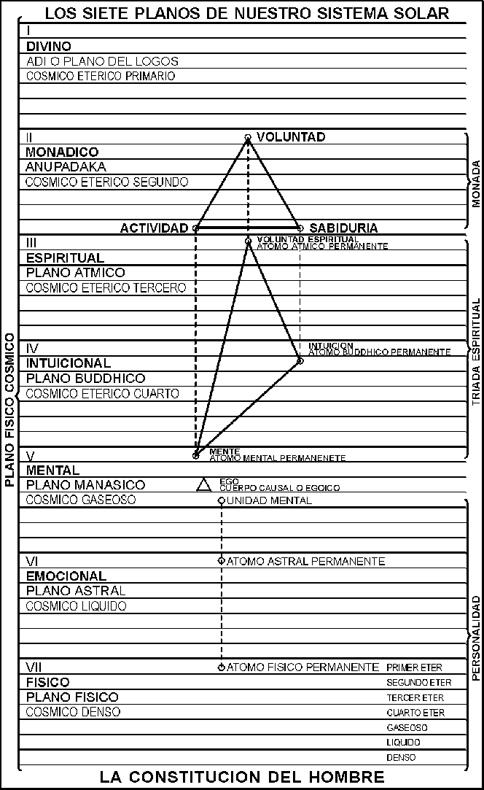

# LA CONSTITUCIÓN DEL HOMBRE

La Constitución del Hombre, es fundamentalmente triple

## La Mónada o Espíritu puro, el Padre en los Cielos

Este aspecto refleja los tres aspectos de la Deidad:

|                     |                   |
| ------------------- | ----------------- |
| Voluntad o Poder    | El Padre          |
| Amor-Sabiduría      | El Hijo           |
| Inteligencia Activa | El Espíritu Santo |

y sólo se hace contacto con Ella en las iniciaciones finales, cuando el hombre se acerca al final de la jornada y es perfecto. La Mónada también se refleja en:

## El Ego, Yo Superior o Individualidad

Potencialmente, este aspecto es:

|                                                        |                |
| ------------------------------------------------------ | -------------- |
| Voluntad Espiritual                                    | Atma           |
| Intuición   Amor-Sabiduría, el Principio Crístico. | Buddhi         |
| Mente Superior o Abstracta                             | Manas Superior |

El Ego empieza a hacer sentir su poder en el hombre evolucionado y en forma acrecentada en el Sendero de Probación, hasta que en la Tercera Iniciación llega a perfeccionarse el control del Yo Superior sobre el yo inferior y el aspecto más elevado comienza a hacer sentir Su Energía.

## La Personalidad o yo inferior, el hombre en el plano físico.

Este aspecto también es triple:

|                  |                                     |
| ---------------- | ----------------------------------- |
| Cuerpo Mental    | Manas Inferior                      |
| Cuerpo Emocional | Cuerpo astral                       |
| Cuerpo Físico    | los cuerpos Físico Denso y Etérico. |

:::tip[Nota]

La finalidad de la evolución es, por lo tanto, llevar al hombre a la compresión del Aspecto Egoico y poner la naturaleza inferior bajo Su control.

:::
