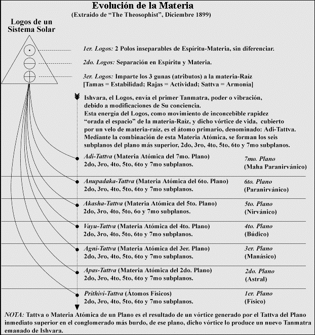

# 1a Parte

# SECCIÓN A
 
# LOS FUEGOS INTERNOS DE LAS ENVOLTURAS

1. I. Los tres canales
2. II. Los elementales del fuego y los devas

## I. LOS TRES CANALES PARA EL FUEGO

<pin lang="es">72</pin> <pin lang="en">55</pin> Por el significado de la palabra “envoltura” deducirán que pasaremos a estudiar los fuegos que se manifiestan a través de tales exteriorizaciones o velos de sustancia que envuelven y ocultan la Realidad interna. No nos ocuparemos del tema de las envolturas en los planos superiores, sino de los fuegos que animan a los tres vehículos inferiores, el cuerpo físico en sus dos divisiones (etérico y denso), el cuerpo emocional o astral y la envoltura mental. Con gran frecuencia el estudiante ocasional pasa por alto el hecho de que tanto el cuerpo astral como el mental son materiales, tan materiales en su esfera como el físico denso, y también que la sustancia de que están compuestos se halla animada por un triple fuego, lo mismo que el físico.

En el cuerpo físico tenemos los fuegos de la naturaleza inferior (el plano animal), centralizados en la base de la columna vertebral. Están situados en un punto que tiene, con respecto al cuerpo físico, la misma relación que el Sol físico con el sistema solar. Este punto central de calor irradia en todas direcciones, utilizando la columna vertebral como arteria principal, pero actúa en estrecha relación con ciertos ganglios centrales, dondequiera estén ubicados, manteniendo una asociación especial con el bazo. <pin lang="en">56</pin>

<pin lang="en">57</pin> En el cuerpo etérico, réplica exacta de su contraparte más densa, tenemos el órgano del fuego activo o irradiante, que como ya se sabe, es el vehículo del Prana. Su función es almacenar los rayos de luz y calor irradiante que extrae del Sol, transmitiéndolos, por medio del bazo, a todas las partes del cuerpo físico. Por lo tanto, en el futuro, se llegará a reconocer que la columna vertebral y el bazo son de máxima importancia para el bienestar físico del individuo y que, cuando la columna vertebral esté debidamente ajustada y alineada y el bazo descongestionado y sano, no tendrá tantas <pin lang="es">73</pin>

<pin lang="es">74</pin> dolencias el cuerpo físico denso. Cuando la hoguera del físico arda intensamente y el combustible del cuerpo (rayos pránicos) se asimile adecuadamente, la estructura humana funcionará como es de desear.

La forma en que se fusionan ambos fuegos, fusión que se realiza totalmente en una persona normal y sana, debería ocupar la atención del médico moderno, quien entonces trataría de eliminar la congestión nerviosa o material, a fin de dejar despejado un canal para que circule el calor interno. Esta fusión, que ahora es un desarrollo natural y común en todo ser humano, en un sistema solar anterior fue signo de realización o de iniciación. Así como en el actual sistema solar la iniciación y la liberación se caracterizan por la fusión de los fuegos del cuerpo, de la mente y del Espíritu, así también en un ciclo anterior, la realización se caracterizó por la fusión de los fuegos latentes en la materia con los fuegos activos o irradiantes y luego su unión con los fuegos de la mente. En el período anterior, los efectos manifestados de la Llama divina era tan remotos y se hallaban tan profundamente ocultos que casi no se los reconocía, aunque existían en forma imperceptible. Su analogía puede observarse en el reino animal, donde el instinto mantiene en estado latente a la intuición <pin lang="en">58</pin> y el Espíritu los influencia imperceptiblemente. Sin embargo, todo es parte de un todo divino.

El tema del calor irradiante de los sistemas macro y microcósmico será tratado más detalladamente en una sección posterior. Aquí trataremos únicamente el fuego interno latente de

1. El sol
2. El planeta
3. El hombre
4. El átomo

Debemos tener en cuenta que en las envolturas astral y mental tenemos la contraparte de los centros ubicados en el cuerpo físico. Estos centros tienen que ver con la materia y su evolución. Podría formularse un enunciado fundamental respecto a los fuegos internos del Sol, de un planeta, del hombre y del átomo:

*Existe en el Sol, en el planeta, en el hombre y en el átomo, un punto central de calor y (si se me permite emplear un término tan limitador e inadecuado) una caverna central de fuego o núcleo de calor; este núcleo central llega hasta los limites de su esfera de influencia, su “circulo no se pasa”, por medio de un triple canal.*[^1] <pin lang="es">75</pin>

1. **El Sol**. Dentro del Sol, en su mismo corazón, existe un mar de fuego o de calor pero no un mar de llamas. Esta es una diferenciación que quizás no tenga significado para algunos. Constituye el centro de la esfera y el punto de calor interno más intenso, pero tiene poca relación con las llamas o gases ardientes (cualquiera sea el término que se <pin lang="en">59</pin> emplee), que por lo general se sabe que existen en lo que respecta al Sol. Es el punto de máxima incandescencia; la esfera objetiva de fuego no es más que la manifestación de esa combustión interna. Este calor central que se irradia a todo el sistema por medio de un triple canal o a través de sus “Rayos de Acercamiento”, en conjunto nos da una idea de lo que es el “calor del sol”.
   1. **Akasha**, en sí misma, es materia vitalizada o sustancia animada por el calor latente.
   2. **Electricidad**, es sustancia de una sola polaridad. energetizada por uno de los tres aspectos logoicos. Expresándolo en términos más ocultos, es sustancia que manifiesta la cualidad del Señor cósmico, Su energía.
   3. **Rayos de Luz de aspecto pránico**, algunos de los cuales comienzan a ser reconocidos por los científicos modernos. Constituyen solamente aspectos del calor latente del Sol cuando se acerca a la Tierra por una determinada línea de menor resistencia.

 La expresión “canal o rayo de acercamiento” significa pasar del centro de irradiación solar a la periferia. Todo lo que el canal o rayo encuentre en su trayectoria -por ejemplo los cuerpos planetarios-, será afectado de algún modo por las corrientes akáshicas. eléctrica y pránica, pero dichas corrientes constituyen únicamente los fuegos internos del sistema observados desde otro punto de vista del espacio universal, no del solar. Por lo tanto es evidente que el tema del fuego es tan complejo como el de los rayos. Los fuegos internos del sistema solar, al ser considerados desde el ángulo de un planeta, se convierten en externos e irradiantes, mientras que los fuegos internos del planeta afectan al ser humano por irradiación de la misma manera que las emanaciones pránicas de <pin lang="es">76</pin> su cuerpo etérico afectan a otro cuerpo físico que también emite irradiaciones. En estos aspectos se ha de comprender <pin lang="en">60</pin> que cada uno y todos ellos tienen que ver con la materia o sustancia y no con la mente o Espíritu.

2. El planeta. En las profundidades del corazón de un planeta, por ejemplo la Tierra, se encuentran los fuegos internos que ocupan la esfera central o las cavernas que, llenas de fuego incandescente, hacen posible la vida en el mismo. Los fuegos internos de la Luna se encuentran prácticamente consumidos; en consecuencia sólo brilla por reflejo, pues carece del fuego interno que se combine y fusione con la luz externa. Podrá observarse que los fuegos internos de la Tierra actúan, como en el Sol, por medio de tres canales principales:
   1. **La Substancia productiva**, o materia del planeta, vitalizada por el calor. Este calor, conjuntamente con la materia, actúan como madre de todo lo que germina y como protectores de todo lo que existe dentro y fuera. Corresponde al Akasha, la materia activa vitalizada del sistema solar que nutre todo como una madre.
   2. **Fluido eléctrico**, latente en el planeta, aunque poco conocido. Quizás se pueda precisar mejor mediante la expresión “magnetismo animal”. Cualidad característica de la atmósfera de un planeta, o su “círculo no se pasa” eléctrico. Es el polo opuesto del fluido eléctrico solar, y el contacto de ambos y su correcta manipulación constituyen el objetivo -quizás inconsciente- de todo el esfuerzo científico en la actualidad.
   3. **La Emanación del planeta que podríamos denominar Prana Planetario**. A ella nos referimos cuando hablamos de las cualidades dadoras de salud de la Madre naturaleza, y en ello se funda el médico moderno cuando dice sabiamente “hay que volver a la naturaleza”. La emanación fluídica de este prana actúa sobre el cuerpo físico, aunque en este caso no lo hace por intermedio del cuerpo etérico. Es absorbida <pin lang="en">61</pin>exclusivamente por la piel; los poros son su línea de menor resistencia.

3. **El hombre**. En la base de la columna vertebral se hallan ocultos los fuegos del sistema humano o fuegos internos del microcosmos. El centro está situado allí, y desde éste sus irradiaciones pasan a través de los tres canales que existen en la columna vertebral.
   1. **Calor corpóreo**. Hay un canal por el cual se irradia el calor que tiene como finalidad calentar la estructura <pin lang="es">77</pin>corpórea. Este proceso de vitalización de la materia densa del cuerpo tiene su analogía en el akasha del sistema y en la sustancia productiva del planeta.
   2. **Reacción nerviosa**. Es el fluido tenue y vitalizador que estimula los centros nerviosos y origina la reacción eléctrica cuando se establece contacto entre los nervios y el cerebro. Esto debería estudiarse más detenidamente. Corresponde a la electricidad planetaria y a la del sistema.
   3. **Emanación pránica**. Es la emanación producida por intermedio del cuerpo etérico, que en el hombre corresponde al prana solar y planetario. Se demuestra principalmente en el aura de salud y nada tiene que ver con las cualidades magnéticas, como generalmente se la interpreta cuando se considera a la personalidad o al hombre como una unidad o ente. Repito esto pues es muy necesario que no haya confusión mental entre el magnetismo que es emanación espiritual y el magnetismo exclusivamente animal.

Seria conveniente indicar que esta triple manifestación del fuego se manifiesta similarmente en los cuerpos astral y mental, y tiene que ver con la sustancia de dichos cuerpos. Podemos describirlo, en su triple manifestación, como la suma total del fuego esencial o actividad vital del tercer Logos. Se debe tener muy <pin lang="en">62</pin> en cuenta que la manifestación del trabajo de los tres Logos es la expresión de la mente de alguna Entidad cósmica. Similarmente, las siete Entidades planetarias, los siete Hombres celestiales, son siete Logos (también Seres cósmicos), quienes forman el Cuerpo del triple Logos. Tenemos por consiguiente:

1. El Indiferenciado Logos -una Entidad cósmica.
2. El Logos, triple en manifestación:
   1. El Señor Cósmico de Poder Voluntad
   2. El Señor Cósmico de Amor Sabiduría.
   3. El Señor Cósmico de Inteligencia Activa.
3. El triple Logos, séptuple en manifestación, por ejemplo, los siete Logos planetarios. [^2] [^3] [^4]

<pin lang="es">78</pin> <pin lang="en">63</pin> Cada una de estas Entidades cósmicas es, en Su esencial esencia, fuego; cada una se manifiesta como fuego en forma triple. Respecto al tiempo, el Señor Cósmico de Inteligencia Activa, considerado desde el punto de vista de la evolución cósmica, ha evolucionado más que Sus dos Hermanos. Constituye la vida de la materia, el fuego latente interno. Es la esencia ígnea que se encuentra en el corazón del Sol, del planeta y de las formas materiales del hombre, y la suma total del Pasado.

El Señor Cósmico de Amor actualmente trata de unirse con Su hermano y, en lo que respecta al tiempo, personifica todo el presente. Es la suma total de todo lo que tiene forma; es Existencia consciente; es el Hijo divino, y Su vida y naturaleza evolucionan por medio de todas las formas. El Señor Cósmico de Voluntad mantiene oculto el futuro dentro de Sus planes y conciencia. Los tres son hijos de un Padre; los tres son aspectos de UN SOLO Dios, los tres son Espíritu, los tres son Alma y los tres son Rayo, que <pin lang="es">79</pin> emanan de un solo centro cósmico. Los tres son sustancia pero, en el pasado, un Señor fue el Hijo mayor; en el presente, otro Señor pasa adelante y en el futuro, otro hará lo mismo. Pero esto sólo sucede en lo que respecta al tiempo. Desde el punto de vista del Eterno Ahora, ninguno es ni más ni menos grande que el otro, porque el último será el primero y el primero, el último. Fuera de la manifestación el tiempo no existe, y fuera de la objetividad no existen estados de conciencia.

El fuego del Espíritu es el fuego esencial del primer Señor de Voluntad, además de ser el fuego del segundo Logos, el de Amor. Estas dos entidades cósmicas se combinan, fusionan y manifiestan como Alma utilizando la ayuda del tercer Logos a fin de manifestarse. Los tres fuegos se combinan y fusionan. En esta cuarta ronda y en este cuarto globo de nuestro esquema planetario, los fuegos del tercer Logos de materia inteligente se fusionan parcialmente con los fuegos de la mente <pin lang="en">64</pin> cósmica, manifestándose como poder o voluntad y animando al Pensador en todos los planos. La finalidad de Su colaboración es manifestar, en forma perfecta, al Señor Cósmico de Amor. Debe reflexionarse sobre esto, porque revela un misterio.

:::note Reflexiona

En esta cuarta ronda y en este cuarto globo de nuestro esquema planetario, los fuegos del tercer Logos de materia inteligente se fusionan parcialmente con los fuegos de la mente <pin lang="en">64</pin> cósmica, manifestándose como poder o voluntad y animando al Pensador en todos los planos. La finalidad de Su colaboración es manifestar, en forma perfecta, al Señor Cósmico de Amor. Debe reflexionarse sobre esto, porque revela un misterio.

:::

La combinación de los tres fuegos, la fusión de los tres rayos y la colaboración de los tres Logos, tienen por objetivo (en la actualidad y dentro de este sistema solar) el desarrollo de la Esencia del Señor Cósmico de Amor, la segunda Persona de la trinidad logoica. Al principio no fue así, en el futuro tampoco lo será, pero ahora lo es. Considerados desde el plano mental cósmico, estos Tres constituyen la PERSONALIDAD DEL LOGOS y puede verse que actúan como uno. He aquí el secreto -bien conocido como hecho, aunque no comprendido- del calor excesivo, ocultamente expresado, del cuerpo astral o central de la triple personalidad. Anima y controla al cuerpo físico y sus deseos predominan en la mayoría de los casos; su analogía existe en tiempo y espacio como unión temporaria del espíritu y la materia, los fuegos del amor cósmico y los fuegos de la materia fusionada. Una analogía similar se halla en el aparente calor de este segundo sistema solar.

4. **El átomo**. Podrá observarse que los fuegos internos del átomo actúan de modo similar, y esto ya está siendo reconocido por la ciencia. Por lo tanto no hay necesidad de elucidarlo. [^5]

## II. LOS ELEMENTALES DEL FUEGO Y LOS DEVAS

<pin lang="es">80</pin> <pin lang="en">65</pin> Será de utilidad considerar brevemente los elementales del fuego y los devas y tratar la relación que existe entre el Rayo de la Personalidad y el fuego interno del sistema y su triple manifestación.

Se conocen ciertos hechos respecto a los espíritus del fuego, si así pueden denominarse. El hecho fundamental que debe acentuarse es que AGNI, el señor del Fuego, rige a los elementales y devas del fuego en los tres planos de la evolución humana, físico, astral y mental; no sólo los rige en este planeta denominado Tierra, sino en los tres planos que corresponden a todo el sistema. Es uno de los siete Hermanos (expresión familiar empleada para los estudiantes de La Doctrina Secreta), y cada uno de ellos personifica uno de los siete principios, constituyendo en Sí Mismos los siete centros en el cuerpo del Señor Cósmico del Fuego, denominado “Fohat” por H. P. B. Es la ígnea inteligencia activa, base de los fuegos internos del sistema solar. En cada plano rige uno de Ellos, y los tres mayores (los tres se verán siempre, luego los siete, quienes con el tiempo se fusionan con los tres primarios) rigen los planos primero, tercero y quinto, o Adi, Atma [^6] y Manas. Es esencial que recordemos que constituyen, <pin lang="en">66</pin> en su tercer aspecto, el fuego de la materia. En su totalidad, estos siete Señores forman la esencia del Señor Cósmico, denominado Fohat en los libros ocultistas. [^7] <pin lang="es">81</pin> 

Similarmente los siete Choanes [^8] y sus grupos de discípulos forman la esencia o centros del cuerpo de uno de los Hombres celestiales, uno de los Logos planetarios. Estos siete, a su vez, forman la esencia del Logos.

Cada uno de los siete Señores de Fuego [^9] se divide en numerosos grupos de entes de fuego, desde los Señores de los devas de un plano, descendiendo hasta las pequeñas salamandras de las hogueras internas. No nos referimos a las esencias ígneas de los planos superiores en esta etapa de nuestro estudio. Enumeraremos sólo sucintamente algunos de los grupos más conocidos con los cuales se hace contacto en los tres mundos.

### 1. Plano Físico.

**Salamandras**, son los diminutos elementales del fuego que algunos pueden ver danzando en toda llama, cuidan los fuegos del hogar y de la fábrica. Pertenecen al mismo grupo de los espíritus del fuego que se encuentran en las profundidades de las ígneas entrañas del planeta.

**Los espíritus del fuego**, latentes en todo foco de calor, son en si mismos la esencia del calor, se los encuentra <pin lang="en">67</pin> en el calor de la estructura corpórea, humana o animal, y constituyen similarmente el calor terrestre.

Los **Agnichaitas**, o espíritus del fuego de grado superior, forman un vórtice de fuego, y se los ve en gran escala en los volcanes y en los grandes incendios. Se hallan estrechamente vinculados a un grupo de devas aún más importante, quienes forman la envoltura ígnea del Sol.

<pin lang="es">82</pin> Los <b>elementales pránicos</b>, esas diminutas esencias ígneas que tienen la capacidad de compenetrar la contextura de un cuerpo humano, de un árbol y de todo cuanto se encuentra en los reinos humano, animal y vegetal, y se fusionan con los fuegos de los sistemas microcósmicos.

Ciertos miembros del reino dévico, que pueden ser descritos como animando ciertos grandes rayos de luz, quienes son la esencia de esos rayos. Podríamos enumerar otras formas elementales de vida y grupos de devas, pero los ya citados son suficientes para nuestro propósito.

### 2. Plano Astral.

Las esencias ígneas de este plano son más difíciles de comprender, pues aún no tenemos desarrollada la vista para ver dicho plano. Constituyen en sí el calor del cuerpo emocional y del cuerpo sensorio. Son de orden inferior mientras se hallan en el sendero del deseo, y de orden superior cuando están en el sendero de la aspiración; entonces el elemental se trasmuta en deva.

Tienen muchos grados y categorías, pero sus nombres no interesan, excepto en un caso. Será importante conocer el nombre que se aplica a los devas del fuego, cuya misión es cuidar los fuegos que más tarde destruirán al cuerpo causal. Debemos recordar que el ascenso del fuego latente en la materia y su fusión con los otros dos fuegos causa destrucción. Estos elementales y devas se denominan **Agnisuryas**, siendo en <pin lang="en">68</pin> su totalidad las esencias ígneas de budi, de manera que su manifestación más inferior es el sexto plano, el astral.

En este tratado se dará más adelante una detallada y extensa Información sobre estas vidas dévicas.

[^1]: La esencia divina que compenetra el entero universo de millones de sistemas solares, es arrebatada por nuestro Sol y trasmitida, en forma manifestada, a los confines de nuestro sistema solar, a fin de que esta esencia manifestada sea la tierra fértil para el crecimiento, conservación y destrucción de nuestros mundos; esa esencia divina es simplemente el Nadam de la filosofía yogui; este Nadam u OM se manifiesta como siete corrientes. Lo inmanifestado se manifiesta o es gestado por las ramificaciones subsiguientes. Estas corrientes son las siete vocales y las siete notas. Estas siete vocales y notas han de tener una correlación especial con los siete versículos védicos, pues en el Vishnu Purana, Parasara describe los versículos védicos como cauces de la esencia solar. Some Thougts on the Gita, pág. 74.

[^2]: Subba Rao, en Esoteric Writings, pág. 20, dice: "Por regla general cuando en la antigua ciencia oculta de la India, se mencionan en cualquier conexión los siete entes, se ha de suponer que esos siete entes vinieron a la existencia procediendo de tres primarios y que éstos, a su vez, evolucionaron de un solo ente o mónada. Para dar un ejemplo conocido: Los siete colores contenidos en el rayo solar se originan en los tres rayos de colores primarios; los tres colores primarios coexisten con los cuatro colores secundarios en el rayo solar. Análogamente, los tres entes primarios que trajeron al hombre a la existencia coexisten en él con los cuatro entes secundarios surgidos de las diversas combinaciones de los tres entes primarios

    La terminología cristiana los denomina las tres Personas de la Trinidad y los Siete Espíritus ante el Trono. Comárese con: "Nuestro Dios es un fuego consumidor." Heb. 12:29.

[^3]: Al hablar de este Logos, he dicho ya que es muy posible que fuera Él mismo quien apareció en la forma de primer Dhyan Choan o Espíritu planetario cuando recomenzó la evolución del hombre, después del último período de inactividad en este planeta, como se dice en el libro Budismo Esotérico, de Sinnett, y después de poner en movimiento la corriente evolutiva se retiró al plano espiritual que tiene afinidad con Su propia naturaleza; desde entonces ha estado vigilando los intereses de la humanidad y de vez en cuando aparece relacionado a alguna individualidad humana para bien de la raza. Podría considerarse que el Logos representado por Krishna, es de la misma categoría que el Logos que apareció así. Hablando de Si mismo, Krishna dice, Cap. X, Vers. 6

    > Los siete grandes Rishis, los cuatro Manú precedentes, que participan de mi naturaleza, nacieron de Mi mente; de Ellos brotó (nació ) la raza humana y el mundo.

    Habla de los sapta Rishis y de los Manu como sus manasaputras o hijos nacidos de la mente, como pudieran serlo si Él fuera el denominado Prajapati, que apareció en este planeta y comenzó el trabajo de la evolución". The Theosophist, T. VIII, pag. 443.

[^4]: Debe tenerse en cuenta la clasificación siguiente:

    |                                       |                       |
    | ------------------------------------- | --------------------- |
    | Siete ramales constituyen             | una subraza           |
    | Siete subrazas constituyen            | una raza raiz         |
    | Siete razas raíces constituyen        | un período mundial    |
    | Siete períodos mundiales constituyen  | una ronda             |
    | Siete rondas constituyen              | un período de cadena  |
    | Siete períodos de cadena constituyen  | un esquema planetario |
    | Diez esquemas planetarios constituyen | un sistema solar      |

[^5]: "Se ha de recordar que la escala comparativa no interesa, porque la grandeza y la pequeñez son esencialmente relativas. El destino de cada átomo es crear un brahmanda (huevo de brahma). Brahmandas similares, más grandes o más pequeños que el nuestro, unidos por un Sol, están presentes en todo átomo. Vishvas (grandes sistemas mundiales) existen en un átomo, y átomos existen igualmente en esos vishvas. Éste es el significado de "los muchos en uno"; donde veamos el uno deberemos reconocer también los muchos y viceversa. Después de obtener la capacidad y emplearla para crear un brahmanda, el siguiente paso es la creación de un jagat (universo), luego un vishva, después de un maha vishva y así sucesivamente hasta alcanzar el estado de maha vishnu. Pranava Vada, pág. 94, por Bhagavan Das.

[^6]: Atma, significa el Yo, Ego, o un centro individualizado, alrededor del cual se agrupan y se ordenan todas las experiencias mundanas en su doble aspecto de subjetivas y objetivas. Es como uno de los focos de donde salen rayos de luz para iluminar las aguas cósmicas y en el que también convergen los rayos devueltos por esas aguas. En los escritos teosóficos se le llama la la individualidad autoconsciente o el Manas Superior. Desde este punto de vista, veras que el Manas superior es el principio más importante o el eje central de la constitución humana o el alma verdadera. Es el hilo del que quiere agarrarse quien cree conocer la verdad y salir de esta existencia condicionada. A esto se puede objetar que Atma representa el séptimo principio del septenario teosófico y que Manas está mucho más abajo en la escala. Pero la respuesta sencilla es que el séptimo principio es el estado último que puede alcanzar el yo después de cruzar el océano de la existencia condicionada o samsara. Algunos pensamientos sobre el Gita, p. 26

[^7]: Fohat, o electricidad, es una Entidad

    |                     |                     |                       |
    | ------------------- | ------------------- | --------------------- |
    | Él es el primordial | Entidad electrica   | D.S. I, 105           |
    | Él es               | Voluntad            | D.S. I, 136           |
    | Él es               | Amor-Sabiduría      | D.S. I, 100, 144, 155 |
    | Él es               | Inteligencia activa | D.S. I, 136           |

    Por consigueinte es el es Dios. D.S. I, 167

    Él es la suma total de la energía de los siete espíritus. Quienes son la suma total de los Logos. D.S. I, 169

[^8]: Chohan (Tibetano). Un Señor o Maestro. Un Gran Adepto. Un iniciado que ha tomado más iniciaciones que las cinco iniciaciones mayores las cuales hacen al hombre un Maestro de Sabiduría

[^9]: Los siete Hermanos. véase D.S. I, 105. Esos siete son las siete diferenciaciones de la energía eléctrica primordial.

    Plano. Como es usado en el ocultismo, el término denota el rango o extensión de algún estado de la conciencia o del poder perceptivo de un conjunto particular de sentidos o la acción o una particular fuerza, o el estado de la materia correspondiente a alguno de los anteriores
