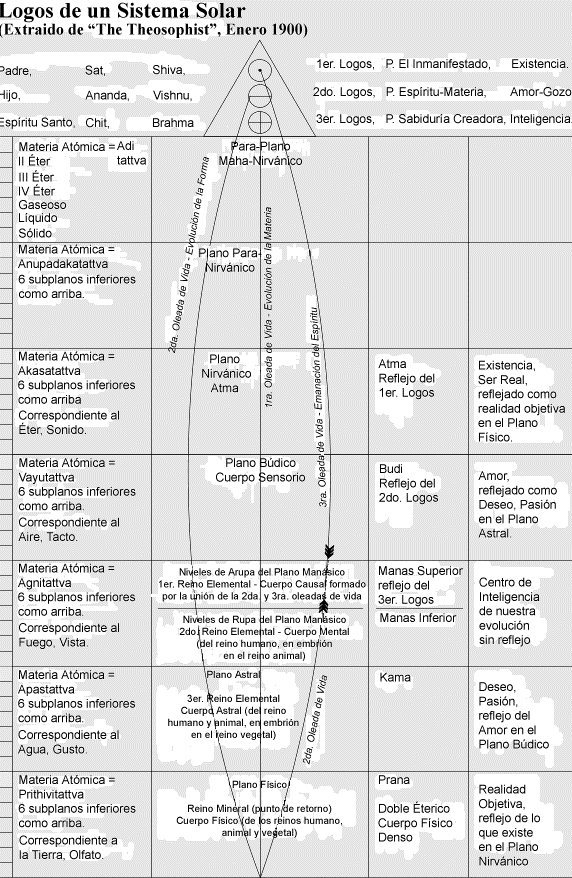
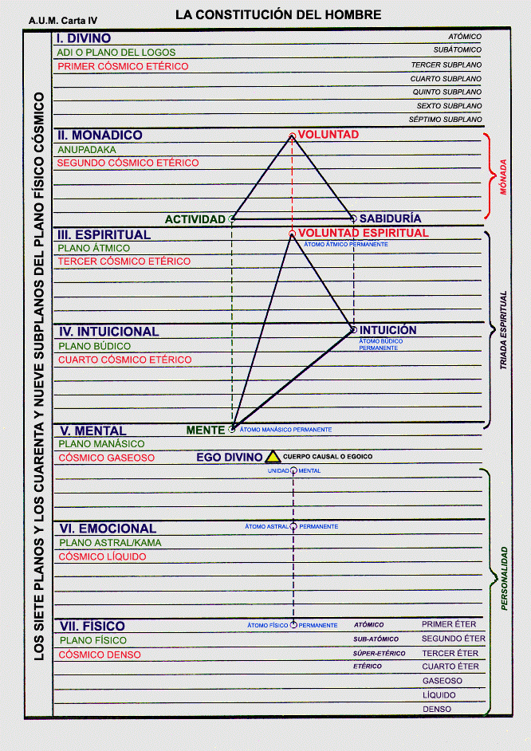

# PRIMERA PARTE

# SECCIÓN C

# EL CUERPO ETÉRICO Y EL PRANA [^1]

1. I. La naturaleza del cuerpo etérico.
   1. Su propósito y descripción.
   2. Ocho enunciados.
2. II. La naturaleza del prana.
   1. Prana solar.
   2. Prana planetario.
   3. Prana de las formas.
3. III. La función del cuerpo etérico.
   1. Receptor de prana.
   2. Asimilador de prana.
   3. Transmisor de prana.
   4. Desórdenes del cuerpo etérico.
4. IV. Éteres macrocósmicos y microcósmicos.
   1. El Logos planetario y los éteres.
   2. Éteres del cosmos y del sistema.
   3. Propósito protector del cuerpo etérico.
5. V. La muerte y el cuerpo etérico
   1. La muerte microcósmica.
   2. El pralaya macrocósmico.

## I. LA NATURALEZA DEL CUERPO ETERICO

<Pin lang="es">90</Pin> <Pin lang="en">77</Pin> Al estudiar los fuegos internos del sistema hallaremos cosas de gran interés para la venidera <Pin lang="en">78</Pin> generación de pensadores, que podrían enumerarse de la manera siguiente: <Pin lang="es">91</Pin>

### 1. Su Propósito y Descripción

Primero. Si los científicos y médicos estudiaran el cuerpo etérico, hallarían y llegarían a comprender más plenamente las leyes de la materia y de la salud. La palabra salud se ha empleado hasta ahora en forma demasiado limitada, y su significado ha sido aplicado a la sanidad del cuerpo físico, a la acción colaboradora de los átomos del cuerpo físico del hombre y a la plena expresión de los poderes del elemental físico. En el futuro, nos daremos cuenta de que la salud del hombre depende de la salud de las otras evoluciones afines, de la acción colaboradora y de la plena expresión de la materia del planeta y del elemental planetario, el cual constituye en sí mismo, la manifestación conjunta de todos los elementales físicos de la naturaleza manifestada.

Segundo. El estudio del cuerpo etérico y del prana revelará los efectos de ciertos rayos del sol, a los cuales, por falta de una expresión más adecuada, denominaremos “emanaciones pránicas solares”. Estas emanaciones son efecto del calor central del sol, cuando se acerca a otros cuerpos del sistema solar por uno de los tres canales principales de contacto, produciendo, en los cuerpos sobre los que ha hecho contacto, ciertos efectos diferentes a los producidos por otras emanaciones. Dichos efectos podrían considerarse estimulantes y constructivos y, por su cualidad esencial, producen condiciones que activan el crecimiento de la materia celular; su adaptación concierne a las condiciones ambientales y, similarmente, a la salud interna (que se manifiesta como calor en el átomo y su consiguiente actividad) y a la evolución uniforme de la forma, de la cual ese átomo particular de materia es parte constitutiva. Las emanaciones de prana ayudan poco en <Pin lang="en">79</Pin> la construcción de formas porque eso no le corresponde, pero conservan la forma preservando la salud de sus partes componentes. Otros rayos del sol actúan de manera distinta sobre las formas y su sustancia. Algunos de esos rayos actúan como Destructores de la forma, otros realizan el trabajo de cohesión y atracción. La tarea del Destructor y del Preservador se efectúa bajo la Ley de Atracción y Repulsión. Algunos rayos del sol aceleran el movimiento, otros lo retardan. Los rayos que ahora tratamos, “las emanaciones pránicas solares”, actúan dentro de los cuatro éteres: esa materia que, aunque física, no es aún visible objetivamente para el ojo humano. Dichas emanaciones constituyen la base de toda vida en el plano físico, considerada únicamente en relación con la vida de los átomos de materia del plano físico, su calor inherente y su movimiento giratorio. Estas emanaciones son la base del “fuego por fricción” que se manifiesta en la actividad de la materia.

<Pin lang="es">92</Pin> Finalmente, por el estudio del cuerpo etérico y del prana llegaremos a comprender el método de la manifestación logoica, lo cual será de gran interés para los metafísicos y los pensadores abstractos. El cuerpo etérico del hombre oculta el secreto de su objetividad. Tiene su analogía en el plano arquetípico, denominado el plano de manifestación divina, el primer plano de nuestro sistema solar o Adi. La materia de este plano tan elevado, a menudo se la denomina “mar de fuego” y es la raíz del akasha, término aplicado a la sustancia del segundo plano de manifestación. Delinearemos esta analogía más detalladamente, pues su exacta captación traerá gran iluminación a la vez que muchas cosas que servirán para dilucidar problemas macro y microcósmicos. Comenzaremos con el hombre y su cuerpo etérico.

Se ha descrito el cuerpo etérico como una red impregnada de fuego, o una trama animada por una luz dorada. En la Biblia se lo denominan “cuenco dorado”. <Pin lang="en">80</Pin> Está compuesto de esa materia del plano físico que llamamos etérica y adquiere esa apariencia porque las finas hebras de esta materia se entrelazan y los Constructores menores las convierten en la forma o molde, de acuerdo al cual se moldeará el cuerpo físico denso. Bajo la Ley de Atracción la materia densa del plano físico se adhiere a esta forma vitalizada, y gradualmente se va conformando a su alrededor y dentro de sí misma, hasta que la interpenetración es tan completa que ambas constituyen una sola unidad; las emanaciones pránicas del cuerpo etérico actúan sobre el físico denso, de la misma manera que las emanaciones pránicas solares actúan sobre el cuerpo etérico. Existe un vasto sistema de transmisión y de interdependencia dentro del sistema. Todos reciben para dar y ayudar a lo inferior o poco evolucionado. Este proceso puede observarse en todos los planos.

De esta manera el cuerpo etérico constituye el plano arquetípico, en relación con el cuerpo físico denso. El Pensador en su propio plano, se encuentra, con respecto al físico, en la misma relación en que el Logos se encuentra respecto a Su sistema. En forma sintética puede expresarse así: “El Pensador en el plano astral, el plano del deseo y de la necesidad, se encuentra respecto al cuerpo físico en la misma relación que el Logos del plano astral cósmico se encuentra en relación con Su sistema.”

A medida que avancemos en nuestro estudio, iremos observando las analogías en el cosmos, en el sistema y en los tres mundos, pues debemos tener presente que la analogía ha de ser perfecta.

1. El Hombre, el Microcosmos, la Mónada en manifestación, el Uno.
2. El Hombre celestial, el Logos planetario, el grupo manifestado. <Pin lang="es">93</Pin>
3. El gran Hombre de los Cielos, el Macrocosmos, el Logos solar, la manifestación de todos los grupos y evoluciones dentro de Su cuerpo, el sistema solar. <Pin lang="en">81</Pin>

Todos estos cuerpos -hombre, Logos planetario y Logos solar- son producto del deseo originado en los respectivos planos de la mente abstracta, ya sea la mente cósmica, del sistema o de los tres mundos, o deseo-mente cósmica, deseo-mente humana, y todos sus cuerpos son “Hijos de la necesidad”, como tan adecuadamente lo expresa H. P. B. [^2] [^3]

### 2. Ocho Enunciados.

Nos ocuparemos del cuerpo etérico de todas las cosas, de su vivificación por el prana (cósmico, solar, planetario y humano), de los órganos de recepción y de la fuente de las emanaciones. Para mayor claridad podrían formularse ciertos enunciados sobre el cuerpo etérico, enumerados de la manera siguiente:

Primero: El cuerpo etérico es el molde del cuerpo físico. D. S. I, 100. <Pin lang="es">94</Pin>

Segundo: El cuerpo etérico es el arquetipo, de acuerdo al cual <Pin lang="en">82</Pin> se construye la forma física densa; ya se trate de la forma de un sistema solar o de un cuerpo humano en cualquier encarnación.

Tercero: El cuerpo etérico es una trama o red de finos canales entrelazados, formados de materia de los cuatro éteres y construido en forma específica. Constituye el punto focal para ciertas emanaciones que irradian y vivifican, estimulan y producen la acción giratoria de la materia.

Cuarto: Estas emanaciones pránicas una vez enfocadas y recibidas reaccionan sobre la materia densa, construida sobre el armazón y la estructura etéricos.

Quinto: Esta trama etérica constituye, durante la encarnación, una barrera entre el plano físico y el astral; barrera que sólo puede trascenderse cuando la conciencia está suficientemente desarrollada como para poder evadirse. Esto se observa en el micro y en el macrocosmos. Una vez que el hombre, por medio de la concentración y la meditación, expande su conciencia hasta cierto grado, puede abarcar los planos más sutiles e ir más allá de los límites de la trama divisoria.

|     | SUBPLANOS FÍSICOS           | PLANOS DEL SISTEMA SOLAR                                |
| --- | --------------------------- | ------------------------------------------------------- |
| 1   | Primer éter.  Plano atómico | Adi. Divino. Mar de fuego. Primer éter cósmico          |
| 2   | Segundo éter. Subatómico    | Anupadaka. Plano monádica. Akasha. Segundo éter cósmico |
| 3   | Tercer éter. Super etérico  | Átmico.Plano espiritual. Éter. Tercer éter cósmico.     |
| 4   | Cuarto éter. Super gaseoso  | Búdico. Plano intuicional. Aire.Cuarto éter cósmico     |

|     | FÍSICO DENSO         | PLANOS DE LA HUMANIDAD                          |
| --- | -------------------- | ----------------------------------------------- |
| 5.  | Gaseoso. Sub etérico | Mental. Fuego. Cósmico gaseoso.                 |
| 6.  | Líquido              | Astral. Plano emocional. Agua. Cósmico líquido. |
| 7.  | Terrenal. Denso      | Físico. Tierra. Cósmico denso.                  |

<Pin lang="en">83</Pin> Una vez que el Logos expande Su conciencia en los niveles cósmicos puede trascender la trama etérica logoica e ir más allá del “círculo no se pasa” de Su manifestación objetiva. Al reflexionar sobre esta analogía debemos tener muy en cuenta que los siete planos mayores de nuestro sistema solar son los siete subplanos del físico cósmico o el plano cósmico más inferior.

Podemos observar aquí la exactitud de la analogía respecto a la materia e igualmente la exactitud de la analogía respecto a la irradiación. <Pin lang="es">95</Pin>

Sexto: En cada uno de los tres cuerpos: humano, planetario y del sistema o logoico, se encuentra un gran órgano dentro del organismo que actúa como receptor de prana. Dicho órgano tiene su manifestación etérica y su analogía en el físico denso.

En el sistema, el órgano del prana cósmico, fuerza que vitaliza la materia, es el Sol central, receptor directo y distribuidor de la radiación cósmica. Ésta es una de las triples divisiones del Rayo Primordial de inteligencia activa. Cada uno de los Rayos cósmicos es triple en esencia, hecho que a menudo se pasa por alto, aunque lógicamente se evidencia; cada Rayo es el vehículo de un Ente cósmico y toda existencia es necesariamente triple en manifestación. El Sol central contiene dentro de su periferia un centro de recepción y una superficie irradiante.

En el planeta, también hay un órgano receptor similar en su cuerpo etérico, cuya ubicación no se puede revelar exotéricamente. Se relaciona con la ubicación de los dos polos, norte y sur; siendo el centro alrededor del cual gira el globo terráqueo y el origen de la leyenda de que existe dentro de la esfera de influencia polar una fértil tierra central. La tierra mítica de extraordinaria fertilidad, de abundante <Pin lang="en">84</Pin> vegetación y de exuberante crecimiento vegetal, animal y humano, lógicamente se halla en el lugar donde se recibe el prana. Constituye el esotérico Jardín del Edén, la tierra de perfección física. La radiación de la superficie, una vez distribuida, se manifiesta como prana planetario.

En el hombre, el órgano de recepción es el bazo, mediante su contraparte etérica. Después de distribuirse por todo el cuerpo, por mediación de la red etérica, se irradia sobre la superficie como aura de salud.

Séptimo: De esta manera se observará claramente la semejanza en los tres cuerpos y puede comprobarse fácilmente su perfecta analogía:

#### PRANA DEL SISTEMA SOLAR

| EL SISTEMA SOLAR                         |                                                     |
| ---------------------------------------- | --------------------------------------------------- |
| Entidad manifestante                     | El Logos solar.                                     |
| Cuerpo de manifestación                  | El sistema solar                                    |
| Centro receptor                          | El polo del Sol central                             |
| Irradiación o emanación en la superficie | El prana solar                                      |
| Movimiento producido                     | La rotación del sistema                             |
| Efecto distribuyente                     | La irradiación etérica solar (sentida cósmicamente) |

| <Pin lang="es">96</Pin> EL PLANETA       |                                                               |
| ---------------------------------------- | ------------------------------------------------------------- |
| Entidad manifestante                     | Un logos planetario                                           |
| Cuerpo de manifestación                  | Un planeta                                                    |
| Centro receptor                          | El polo planetario                                            |
| Irradiación o emanación en la superficie | El prana planetario                                           |
| Movimiento producido                     | La rotación planetaria                                        |
| Efecto distribuyente                     | La irradiación etérica planetaria(sentida dentro del sistema) |

| EL SER HUMANO                            |                                                              |
| ---------------------------------------- | ------------------------------------------------------------ |
| Entidad manifestante                     | El Pensador, un Dhyan Choan                                  |
| Cuerpo de manifestación                  | El cuerpo físico                                             |
| Centro receptor                          | El bazo                                                      |
| Irradiación o emanación en la superficie | El aura de la salud                                          |
| Movimiento producido                     | La rotación atómica                                          |
| Efecto distribuyente                     | La irradiación etérica humana (sentida en el medio ambiente) |

| <Pin lang="en">85</Pin> EL ÁTOMO DE MATERIA |                                                                     |
| ------------------------------------------- | ------------------------------------------------------------------- |
| Entidad manifestante                        | Una vida elemental                                                  |
| Cuerpo de manifestación                     | La esfera atómica                                                   |
| Centro receptor                             | El polo del átomo                                                   |
| Irradiación o emanación en la superficie    | La contribución del átomo a la unidad del aura de salud del cuerpo  |
| Movimiento producido                        | La rotación atómica                                                 |
| Efecto distribuyente                        | La irradiación etérica atómica (sentida dentro de la forma física). |

Octavo: Cuando desaparece la “voluntad de vivir”, entonces los “Hijos de la necesidad” dejan de manifestarse objetivamente. Como es natural ello es inevitable, y puede observarse en todos los casos en que existe un ente objetivado. Cuando el Pensador en su propio plano aparta su atención del pequeño sistema, en los tres mundos, y repliega dentro de sí todas sus fuerzas, su existencia en el plano físico termina, y todo vuelve a la conciencia causal; esto constituye tanto una abstracción del Pensador en los tres mundos, como del Absoluto en el triple sistema solar del Logos. Ello se manifiesta en el plano físico cuando se retira por la parte superior de la cabeza el radiante cuerpo etérico, teniendo lugar la consiguiente desintegración del físico. La estructura desaparece y la forma física densa se desintegra, la vida pránica es extraída totalmente de la envoltura densa, dejando de estimular los fuegos de la materia. Permanece el fuego latente en el átomo, al que es inherente, pero la forma se construye por la acción de los dos fuegos de la materia <Pin lang="es">97</Pin> -uno activo y latente, otro irradiante e innato-, ayudados por el fuego del segundo Logos; cuando se separan, la forma se desintegra. Esta es una representación en miniatura de la dualidad esencial que existe en todas las cosas sobre las cuales actúa Fohat.

<Pin lang="en">86</Pin> Existe una íntima relación, en conexión con el cuerpo etérico, entre el bazo y la parte superior de la cabeza. El órgano del bazo tiene una interesante analogía con el cordón umbilical, que une al niño con la madre a fin de ser nutrido, el cual se corta al nacer. Cuando un hombre comienza a vivir conscientemente su propia vida de deseo, y nace en ese nuevo mundo donde se vive en forma más sutil, el cordón entrelazado de materia etérica (que lo ha unido a su cuerpo físico) se corta; el “cordón plateado se desata” y el hombre rompe su vínculo con el cuerpo físico denso, retirándose por el centro superior del cuerpo en vez de hacerlo por el inferior; pasa así a vivir en un mundo superior y en otra dimensión. Así ocurre con los cuerpos y envolturas del microcosmos, pues la analogía existe en todos los planos de la manifestación. Cuando se alcance un conocimiento más científico se verá que el mismo procedimiento, en mayor escala, tiene lugar en la manifestación planetaria. Un planeta sólo es el cuerpo de un Logos planetario, siendo etérico este cuerpo, y el Logos se expresa a través de él y construye sobre la estructura etérica un vehículo de manifestación. La LUNA fue en un tiempo el cuerpo de expresión de un Logos; la Tierra lo es ahora, pues los ciclos cambian constantemente. El centro por donde se retira el cuerpo etérico se encuentra análogamente en un planeta físico, y el cordón plateado planetario se corta en el momento señalado; pero el momento y los ciclos, su comienzo y terminación se hallan ocultos en los misterios de la Iniciación y no nos conciernen.

:::note[Recuerda]

Cuando un hombre comienza a vivir conscientemente su propia vida de deseo, y nace en ese nuevo mundo donde se vive en forma más sutil, el cordón entrelazado de materia etérica (que lo ha unido a su cuerpo físico) se corta; el “cordón plateado se desata” y el hombre rompe su vínculo con el cuerpo físico denso, retirándose por el centro superior del cuerpo en vez de hacerlo por el inferior; pasa así a vivir en un mundo superior y en otra dimensión.

:::

En el sistema solar ocurrirá lo mismo al término de un Mahamanvantara. El Logos se recogerá en Sí Mismo, abstrayendo Sus tres principios mayores. [^4] Su cuerpo de manifestación -el Sol <Pin lang="en">87</Pin> y los siete Planetas sagrados que existen en materia etérica- se retirarán de la objetividad y quedará oscurecido. Desde el punto de vista físico podemos decir que la luz se apagará en el sistema. A esto le seguirá una gradual inhalación hasta que el Logos haya recogido todo en Sí Mismo; el etérico cesará de existir y la trama habrá desaparecido. Se logrará plena conciencia, y en el momento de la realización cesará la existencia o la manifestación de la <Pin lang="es">98</Pin> entidad. Todo será reabsorbido en el Absoluto; entonces llegará el pralaya, [^5] o el ciclo cósmico de descanso, y ya no se oirá la Voz del Silencio. La reverberación de la PALABRA se apagará y el “Silencio de las Alturas” reinará supremo.

## II. LA NATURALEZA DEL PRANA

Cuando nos ocupamos del cuerpo etérico y sus funciones, como asimilador y distribuidor de prana, lo hemos hecho desde el punto de vista del lugar que ocupa en el esquema de las cosas. Consideramos el tema desde el punto de vista de las analogías, indicando dónde se hallan en el sistema, en el planeta y en el hombre.

Hemos visto que constituye el fundamento de la forma física y que es, en sí mismo, el vínculo más importante entre:

1. El hombre físico y el plano emocional o astral.
2. El Hombre planetario y la cualidad emocional, esencial.
3. El Logos, el gran Hombre celestial, y el plano astral cósmico.

Podemos ahora limitar el tema a la consideración del cuerpo etérico del ser humano, sin tocar las analogías del sistema o cósmicas; aunque quizás sería conveniente recordar que el estudiante inteligente obtiene la sabiduría <Pin lang="en">88</Pin> por la línea interpretativa; quien se conoce a sí mismo (como manifestación objetiva, cualidad esencial y desarrollo comprensivo), conoce también al Señor de su Rayo y al Logos de su sistema. Por lo tanto sólo es cuestión de aplicación, expansión consciente e interpretación inteligente; además debe abstenerse sensatamente de hacer afirmaciones dogmáticas, y ha de reconocer que la analogía se encuentra en la cualidad y en el método empleado más que en ajustarse estrictamente a una acción específica en un determinado momento de la evolución.

El material de estudio que es posible dar aquí, si se reflexiona detenidamente, puede inducir a llevar una vida práctica más inteligente, empleando el término “vivir” en su sentido esotérico. Estudiando dicho material en forma científica, filosófica y religiosa puede conducir también a desarrollar los objetivos del proceso evolutivo en el ciclo menor inmediato. Por eso nuestro objetivo consiste en hacer más real el cuerpo secundario del hombre y en exponer algunas de sus funciones y la forma en que podrá ser puesto oportuna y conscientemente al alcance de la comprensión mental.

La ciencia, como bien sabemos, está llegando rápidamente a la <Pin lang="es">99</Pin> etapa en que se verá obligada a admitir la realidad del cuerpo etérico, pues las dificultades que surgirán al negarlo serán tan insuperables como admitir su existencia. Los científicos aceptan ya la existencia de la materia etérica; el éxito obtenido en la fotografía ha demostrado la realidad de lo que hasta ahora fue considerado irreal, porque es intangible desde el punto de vista físico. Continuamente ocurren fenómenos considerados sobrenaturales que pueden ser explicados por medio de la materia etérica, y los científicos, en su empeño por demostrar que los espiritistas están equivocados, han ayudado a la causa del espiritismo verdadero y superior, apoyándose en la realidad y en la existencia del cuerpo etérico, aunque lo consideren (pues se interesan en los efectos sin haber descubierto la causa) un cuerpo que <Pin lang="en">89</Pin> emana irradiación. La ciencia médica empieza a estudiar (aunque a ciegas) la cuestión de la vitalidad, el efecto de los rayos solares sobre el organismo físico y las leyes subyacentes en el calor inherente e irradiante. Atribuye al bazo funciones no reconocidas anteriormente y estudia los efectos de la acción de las glándulas y su relación con la asimilación de las esencias vitales a través de la estructura corporal. Se halla en el verdadero camino; no pasará mucho tiempo (quizás en el curso de este siglo) sin que la REALIDAD del cuerpo etérico y sus funciones básicas sea afirmada más allá de toda controversia y el objetivo de la medicina, preventiva y curativa, pase, entonces, a un nivel superior. Todo lo que podemos hacer aquí es dar simplemente, y en forma condensada, algunos datos que podrán acelerar el día de su reconocimiento, lo cual despertará mayor interés en el verdadero investigador. Permítaseme, por lo tanto, enunciar brevemente lo que se tratará en los tres puntos que resta considerar:

1. Las funciones del cuerpo etérico.
2. Su relación con el físico durante la vida.
3. Los males y las enfermedades del cuerpo etérico (teniendo en cuenta el significado original de la palabra “enfermedad”).
4. Su condición después de la muerte.

Lo indicado abarcará aquello que es de utilidad práctica en la actualidad. Luego adquiriremos más conocimiento si lo transmitido al público es aplicado cuidadosamente, y si los investigadores estudian inteligente, sensata y ampliamente tan importante tema.

A medida que la naturaleza del cuerpo etérico y su función ocupen en el pensamiento del mundo el lugar que les corresponde, y la gente se dé cuenta de que el etérico es el más importante de los dos cuerpos físicos, el hombre hará contacto consciente e íntimo con otras evoluciones <Pin lang="en">90</Pin> que existen en materia etérica, así como lo hace en el cuerpo físico denso. Existen ciertos grandes grupos de <Pin lang="es">100</Pin> devas denominados “devas de las sombras” o devas violeta, que están íntimamente vinculados con el desarrollo evolutivo del cuerpo etérico humano, y le transmiten irradiaciones solares y planetarias. El cuerpo etérico humano recibe prana de diferentes maneras y de diversas clases, que lo ponen en contacto con distintas entidades.

### 1. Prana Solar.

Fluido vital y magnético que irradia del sol, y se trasmite al cuerpo etérico del hombre por mediación de ciertas entidades dévicas de orden muy elevado y de matiz dorado. Pasa a través de los cuerpos de dichas entidades, que lo emiten en potentes irradiaciones, aplicadas directamente a ciertos plexos situados en la parte superior del cuerpo etérico, en la región de la cabeza y de los hombros, desde donde descienden a la analogía etérica del órgano físico, el bazo, y de allí se transmiten enérgicamente al mismo. Estas entidades pránicas, de matiz dorado, se encuentran en el aire sobre nosotros, y están especialmente activas en algunas partes del mundo, como California y en las regiones tropicales, donde el aire es puro y seco y los rayos del sol son considerados esencialmente benéficos. Las relaciones que existen entre el hombre y este grupo de devas son muy íntimas, pero aún muy peligrosas para el hombre. Los devas tienen mucho poder y, en su propia línea, están más evolucionados que el hombre. El ser humano que no sabe protegerse está a merced de éstos, y debido a ello y a la incomprensión de las leyes de resistencia magnética o de repulsión solar, está propenso a la insolación. Cuando el cuerpo etérico y sus procesos asimilativos sean comprendidos científicamente, el hombre se inmunizará de los peligros de la irradiación solar. Se protegerá por la aplicación de las leyes que rigen <Pin lang="en">91</Pin> la repulsión y la atracción magnéticas y no meramente mediante el vestido y el techo. Por lo general es cuestión de polarización. Podría sugerirse que cuando los hombres comprendan la evolución dévica más correctamente, sepan cómo trabajar en ciertas líneas relacionadas con el Sol y se den cuenta de que tal evolución representa el polo femenino, así como el hombre representa el masculino (la cuarta Jerarquía creadora es masculina)[^6] comprenderán su interrelación y regirán esa relación de acuerdo a la ley.

Estos devas solares reciben los irradiantes rayos del sol, los <Pin lang="es">101</Pin> cuales salen desde el centro y llegan hasta la periferia por uno de los tres canales de acercamiento, los pasan por su organismo y los enfocan allí. Actúan casi como un vidrio de aumento que concentra los rayos solares. Luego son reflejados o transmitidos al cuerpo etérico humano, que los capta y asimila. Cuando el cuerpo etérico es sano y funciona correctamente, absorbe bastante prana para mantener la forma organizada. Este es el objetivo de la función del cuerpo etérico, cosa que nunca se hará resaltar suficientemente. El prana sobrante se emite como irradiación animal o magnetismo físico; ambos términos expresan la misma idea. Por lo tanto, el hombre repite, en escala menor, la tarea de los grandes devas solares y a su vez agrega su cuota de emanaciones, repolarizada o remagnetizada, a la suma total del aura planetaria.

:::note[Recuerda]

Cuando el cuerpo etérico es sano y funciona correctamente, absorbe bastante prana para mantener la forma organizada. Este es el objetivo de la función del cuerpo etérico, cosa que nunca se hará resaltar suficientemente.

:::

### 2. Prana Planetario.

Fluido vital que emana de cualquier planeta y constituye su coloración o cualidad fundamental, debido a que se repite dentro del planeta el mismo proceso <Pin lang="en">92</Pin> que tiene lugar respecto al hombre y al prana solar. El planeta (ya sea la tierra o cualquier otro) absorbe el prana solar, lo asimila en la cantidad requerida e irradia el que no necesita para su bienestar, en forma de irradiación planetaria. El prana planetario es, por lo tanto, prana solar que ha pasado a través del planeta, ha circulado por el cuerpo etérico planetario, ha sido transmitido al cuerpo físico denso del planeta y emitido por éste como irradiación, con la misma característica esencial que la del prana solar, además de la cualidad individual y distintiva del planeta implicado. La repetición del proceso tiene lugar en el cuerpo humano. Las irradiaciones físicas de los hombres difieren de acuerdo a la calidad de sus cuerpos físicos. Lo mismo ocurre con un planeta.

El prana que emana del planeta (como en el caso del prana solar) es recibido y transmitido por medio de un grupo determinado de devas denominados “devas de las sombras”, devas etéricos de matiz ligeramente violado. Los cuerpos de estos devas están compuestos de materia de alguno de los cuatro éteres, y enfocan y concentran las emanaciones del planeta y de todas las formas que existen en el mismo. Debido a la esencial similitud de su sustancia corpórea con la sustancia etérica humana se hallan muy íntimamente vinculados con los seres humanos, transmitiéndole el magnetismo de la "Madre Tierra”. Como vemos, dos grupos de devas trabajan en conexión con el hombre:

1. Los devas solares le trasmiten el fluido vital que circula por el cuerpo etérico. <Pin lang="es">102</Pin>
2. Los devas planetarios de color violeta, vinculados al cuerpo etérico del hombre, le transmiten el prana de la tierra o del planeta en el cual actúe el hombre durante una encarnación física.

Aquí podrían formularse varios interrogantes y, aunque no expliquemos plenamente el misterio, hacerse algunas <Pin lang="en">93</Pin> sugerencias. ¿Cuál es la causa de la aparente falta de vida en la Luna? ¿Existe allí vida dévica? El prana solar ¿produce algún efecto allí? ¿ En qué difiere la Luna, aparentemente muerta, de un planeta vivo tal como la Tierra? [^7]

Aquí nos enfrentamos con un misterio, cuya solución -para quienes investigan- quedará revelada en el hecho de que no existen seres humanos ni ciertos grupos de devas en la Luna. *El hombre no ha dejado de existir en la Luna porque esté muerta y, por consiguiente, no pueda sustentarlo, sino que la Luna está muerta porque el hombre y los devas se han retirado de su superficie y de su esfera de influencia.* [^8] El hombre y los devas actúan en cada planeta como intermediarios o agentes transmisores. Donde ellos no habitan resulta imposible realizar ciertas actividades, sobreviniendo la desintegración. La razón de ese retiro se halla en la Ley cósmica de Causa y Efecto o karma cósmico, y en la historia conjunta, aunque individual, de uno de los Hombres celestiales cuyo cuerpo fue, en un momento determinado, la Luna o cualquier otro planeta.

### 3. Prana de las Formas.

Ante todo se ha de advertir que las formas son de dos clases, cada una de las cuales ocupa un lugar diferente en el esquema:

Formas resultantes del trabajo realizado por el tercero y el segundo Logos y las vidas conjuntas de Estos. Dichas formas constituyen las unidades de los reinos vegetal, animal y mineral.

Formas resultantes de la acción unida de los tres Logos, comprendiendo estrictamente la formas dévicas y humanas.

Existe también una forma más simple incorporada a la sustancia con la cual están hechas todas las formas, siendo estrictamente de materia atómica y molecular, animada por la vida o energía del tercer Logos. <Pin lang="en">94</Pin> <Pin lang="en">95</Pin>

Con respecto al primer grupo de formas se ha de observar que las emanaciones pránicas, emitidas por las unidades de los reinos animal y vegetal (después que han absorbido el prana solar y planetario), son lógicamente la combinación de ambos, siendo transmitidas por medio de irradiaciones superficiales, como el prana <Pin lang="es">103</Pin> solar y el planetario, a ciertos grupos de devas menores de orden no muy elevado, que tienen una curiosa e intrincada relación con el alma grupal del animal o del vegetal que las irradia. De ello no podemos ocuparnos aquí. Estos devas tienen también un matiz violado, pero tan pálido que es casi gris; están en estado de transición y se mezclan en forma confusa con grupos de entidades que se encuentran en el arco involutivo [^9] [^10] [^11]

<Pin lang="en">96</Pin> Respecto al segundo grupo, la forma humana transmite las irradiaciones emanantes a un grupo de devas de grado mucho más elevado. Estos devas tienen un matiz más pronunciado, los cuales después de asimilar debidamente la irradiación humana, la trasmiten principalmente al reino animal, demostrándose así la íntima relación existente entre estos dos reinos. Si la explicación que antecede sobre la complicada interacción entre el Sol y los planetas, entre éstos y las formas que evolucionan en ellos y entre dicha, formas y aquellas inferiores, sirve para demostrar aunque <Pin lang="es">104</Pin>

<Pin lang="es">105</Pin> sólo sea la exquisita interdependencia de todo lo existente, mucho se habrá logrado.

Otro hecho que debe hacerse resaltar es la íntima relación existente entre todas las evoluciones de la naturaleza, desde el Sol celestial a la violeta más humilde, por mediación de la <Pin lang="en">97</Pin> evolución dévica, que actúa como fuerza transmisora y transmutadora en todo el sistema.

Por último, todos trabajan con fuego. Fuego interno, inherente y latente, irradiante y emanante; generado, asimilado e irradiado; vivificador, estimulador y destructor; fuego transmitido, reflejado y absorbido, base de toda vida; esencia de todo lo que existe y agente que desarrolla e impulsa lo que se halla detrás de todo proceso evolutivo; fuego edificador, preservador y constructor; fuego originador, el proceso y la meta; fuego purificador y consumidor. El Dios del Fuego y el fuego de Dios interactúan hasta que todos los fuegos se fusionen y ardan y todo lo que existe haya pasado por el fuego -desde un sistema solar hasta una hormiga-, surgiendo como triple perfección. Entonces el fuego emergerá como esencia perfecta del “círculo no se pasa”, ya sea la del “círculo no se pasa” humano, planetario o solar. La rueda del fuego gira; todo <Pin lang="es">106</Pin> lo que se halla dentro de ella es sometido a una triple llama, y con el tiempo todo llega a la perfección.

## III. LA FUNCIÓN DEL CUERPO ETERICO

Continuaremos nuestro estudio respecto al cuerpo etérico a fin de analizar sus funciones y su relación con el cuerpo físico.

Será conveniente considerarlos conjuntamente, porque se interrelacionan tan íntimamente, que no es posible estudiarlos por separado. Las principales funciones del cuerpo etérico son tres:

1. Receptor de prana.
2. Asimilador de prana.
3. Transmisor de prana.

### 1. Receptor de Prana

El cuerpo etérico puede clasificarse como negativo o receptivo respecto a los rayos del sol, y como <Pin lang="en">98</Pin> positivo o expulsor respecto al cuerpo físico denso. Su segunda función, la asimilativa, está estrictamente equilibrada y es interna. Como se explicó anteriormente, el cuerpo etérico absorbe las emanaciones pránicas del sol por medio de ciertos centros situados principalmente en la parte superior del cuerpo, desde los cuales descienden al centro denominado bazo etérico, su contraparte en materia etérica. El centro principal receptor de prana, en la actualidad, está situado entre los dos omóplatos. Hay otro centro situado un poco más arriba del plexo solar que ha quedado, debido a los abusos de la llamada civilización, parcialmente aletargado. La próxima raza raíz, y cada vez más la presente, valorará la necesidad de exponer dichos centros a los rayos del sol, lo cual aumentará la vitalidad física y la adaptabilidad. Los centros situados

1. entre los omóplatos,
2. arriba del diafragma y
3. en el bazo,

forman, si pudiéramos verlo, un triángulo etérico radiante donde se origina el impulso para la ulterior circulación pránica que recorrerá todo el sistema. El cuerpo etérico está realmente formado por una red de finos canales, que forman un sutil cordón trenzado -el cual es parte del eslabón magnético que une los cuerpos físico y astral, cortándose al retirarse el cuerpo etérico del cuerpo físico denso en el momento de la muerte. Como lo expresa la Biblia, [^12] el cordón plateado se corta. Esto fundamenta la leyenda de la “hermana fatal que corta el hilo de la vida con las temidas tijeras”. <Pin lang="es">107</Pin>

La trama etérica está compuesta por el complicado tejido de este cordón vitalizado, y separados de los siete centros <Pin lang="en">99</Pin> de la trama (Centros sagrados, de los cuales el bazo se considera frecuentemente uno de ellos) se hallan los dos ya mencionados, que forman con el bazo, un triángulo activo. La trama etérica del sistema solar es análoga, e igualmente posee tres centros receptores de prana cósmico. La misteriosa franja del firmamento denominada Vía Láctea [^13] está íntimamente relacionada con el prana cósmico, vitalidad cósmica o alimento que vitaliza al sistema etérico solar.

### 2. Asimilador de Prana

El proceso de asimilación se lleva a cabo en el triángulo mencionado; el prana, al penetrar por cualquiera de esos centros, circula tres veces por todo el triángulo, antes de ser transmitido al vehículo etérico y de éste al cuerpo físico denso. El órgano principal de asimilación es el bazo -el centro etérico y el órgano físico denso. La esencia vital procedente del sol penetra en el bazo etérico; en éste es sometida a un proceso de intensificación o desvitalización, lo cual depende del estado de salud de dicho órgano. Si el hombre está sano la emanación recibida será intensificada por la vibración individual, y el grado de vibración será acelerado antes que el prana pase al bazo físico. Si el estado de salud no es bueno, el grado de vibración disminuye y se hace más lento el proceso.

Estos tres centros, parecidos a platillos, tienen la misma forma que los demás y se asemejan a pequeños remolinos que atraen a su esfera de influencia las corrientes que se ponen a su alcance.

Los centros pueden describirse como vórtices giratorios, unidos entre si por el triple canal compactamente entretejido, que casi forma un sistema circulatorio separado. Este sistema tiene su punto de salida <Pin lang="en">100</Pin> en el lado del bazo, opuesto a aquel por el cual penetra el prana. El fluido vital circula tres veces por estos tres centros y entre ellos antes de pasar a la periferia de su pequeño sistema. Después de circular el prana por los finos canales entrelazados pasa por todo el cuerpo, impregnándolo totalmente con sus emanaciones si así puede expresarse. Dichas emanaciones salen finalmente del sistema etérico, irradiándose por la superficie. La esencia pránica sale de la circunferencia de su “circulo no se pasa” temporario como emanante prana humano, que es el mismo prana recibido anteriormente pero cargado, durante su transitoria circulación, con la cualidad peculiar que el individuo le transmite. La esencia sale, llevando la cualidad individual.

En esto tenemos una nueva analogía de cómo se evaden todas <Pin lang="es">108</Pin> las esencias de cualquier “círculo no se pasa”, una vez terminado su ciclo.

El tema del cuerpo etérico es de gran interés práctico. Cuando el hombre se de cuenta de su importancia, prestará mayor atención a la distribución de prana en el cuerpo, y procurará que su vitalización, a través de los tres centros, no sea entorpecida.

Aunque necesariamente el tema se ha de tratar en forma superficial, y sólo pueden darse esbozos y sugerencias espaciadas, se hallará sin embargo, que si se lo estudia detalladamente, impartirá un conocimiento de las verdades cuyo contenido y calidad resultará valioso y algo que hasta ahora no había sido enseñado. El lugar que ocupa la envoltura etérica, como separadora o “círculo no se pasa”, y su función como receptora y distribuidora de prana, se dilucidan aquí en forma mucho más extensa que antes; posiblemente más adelante el tema será ampliado.

Del conjunto de datos tan superficialmente tratados se desprenden dos verdades fundamentales:

<Pin lang="en">101</Pin> Primero. El cuarto subplano etérico del plano físico es la preocupación inmediata de

1. el hombre, el microcosmos,
2. el Hombre celestial, el Logos planetario,
3. el gran Hombre de los Cielos, el Logos solar.

Segundo. En la cuarta cadena y cuarta ronda se comienza a estudiar el cuarto éter que -visto como trama separadora- permite la salida ocasional de las vibraciones correspondientes.

### 3. Transmisor de Prana.

Hasta ahora muy poco nos hemos referido al tema del fuego, pues el propósito del cuerpo etérico es llevarlo y distribuirlo por todo su sistema; sólo hemos tratado los hechos que podrán despertar el interés y acentuar la utilidad del vehículo pránico. Debemos considerar y recalcar ciertos hechos, a medida que estudiamos este círculo estático y sus fuegos circulantes. Para mayor claridad vamos a recapitular brevemente lo ya expuesto:

El Sistema recibe prana de fuentes cósmicas, por medio de tres centros, y lo redistribuye a todas las partes de su dilatada influencia, hasta los límites de la trama etérica solar. Este prana cósmico está coloreado por la cualidad solar y llega a los más apartados confines del sistema. Podría decirse que su misión consiste en vitalizar el vehículo, la expresión material física del Logos solar.

El Planeta recibe prana del centro solar y lo redistribuye, por medio de tres centros receptores, a todas las partes de su esfera de <Pin lang="es">109</Pin> influencia. Este prana solar está coloreado por la cualidad planetaria y es absorbido por todo lo que evoluciona dentro del “círculo no se pasa” planetario. Podría decirse que su misión consiste en vitalizar el vehículo de expresión material física de cualquiera de los siete Hombres celestiales.

<Pin lang="en">102</Pin> El Microcosmos recibe prana proveniente del Sol, después dé haber compenetrado el vehículo etérico planetario, de modo que además de ser prana solar, posee la cualidad planetaria. Cada planeta es la personificación de un aspecto de Rayo, y su cualidad se destaca predominantemente durante toda su evolución.

Por lo tanto, prana es calor irradiante, su vibración y cualidad varían de acuerdo a la Entidad receptora. Al pasar el prana por el cuerpo etérico del hombre, es coloreado por su propia cualidad peculiar transmitiéndolo a esas vidas menores que componen su propio sistema. Así se produce una gran interacción; todas las partes se mezclan y fusionan, dependiendo una de otra, y todas reciben, coloran, cualifican y transmiten. Tiene lugar así una interminable circulación sin principio concebible ni posible fin, desde el punto de vista del hombre finito, porque su origen y fin se hallan ocultos en la ignota fuente cósmica. Si existieran en todas partes perfectas condiciones, esta circulación continuaría sin interrupción y sería casi interminable, pero el fin y la limitación son producidos por la imperfección, que gradualmente es reemplazada por la perfección. Cada ciclo se origina en otro ciclo aún no finalizado, cediendo su lugar a otra espiral más elevada; así se suceden periodos de aparente y relativa perfección, que conducen a periodos de mayor perfección.

El objetivo de este ciclo mayor consiste, como sabemos, en fusionar los dos fuegos de la materia, latentes y activos, sumergiéndolos con los fuegos de la mente y del espíritu, hasta que desaparezcan en la llama general; los fuegos de la mente y del espíritu consumen la materia y con ello liberan la vida de los vehículos que la confinan. EI altar terreno es el lugar donde nace el espíritu, quien lo libera de la madre (materia), y es también la entrada a reinos superiores.

Cuando el vehículo pránico funcione correctamente en los tres grupos humano, planetario y solar, se logrará la unión con el fuego latente. Por esta <Pin lang="en">103</Pin> razón se recalca la necesidad de construir vehículos físicos puros y refinados. Cuanto más refinada y sutil sea la forma, será mejor receptora de prana y ofrecerá menos resistencia a la acción del kundalini en el momento asignado. La materia tosca y los cuerpos burdos e inmaduros son una amenaza para el ocultista; ningún verdadero vidente tendrá un cuerpo burdo. El peligro de ser desintegrado es muy grande y la amenaza de ser <Pin lang="es">110</Pin> destruido por el fuego es terrible. Ya una vez en la historia (en la época lemuriana) [^14] la raza y los continentes fueron destruidos por medio del fuego. Los Guías de la raza, en esa época, aprovecharon tal acontecimiento para eliminar la forma inadecuada. El fuego latente en la materia (por ejemplo, en las erupciones volcánicas) y el fuego irradiante del sistema se combinaron. El kundalini planetario y la emanación solar entraron en conjunción y tuvo lugar el trabajo de destrucción. Lo mismo podría volver a ocurrir, pero sólo en la materia del segundo éter, y sus efectos no serían tan graves debido a la sutilidad de dicho éter y al refinamiento comparativamente mayor de los vehículos.

:::note[Recuerda]

Cuanto más refinada y sutil sea la forma, será mejor receptora de prana y ofrecerá menos resistencia a la acción del kundalini en el momento asignado. La materia tosca y los cuerpos burdos e inmaduros son una amenaza para el ocultista; ningún verdadero vidente tendrá un cuerpo burdo. El peligro de ser desintegrado es muy grande y la amenaza de ser destruido por el fuego es terrible.

:::

Observaremos aquí un hecho interesante, aunque sea un misterio insoluble para la mayoría; las destrucciones producidas por el fuego son parte de las pruebas de fuego de una iniciación de ese Hombre celestial cuyo karma está ligado al de nuestra tierra.

La destrucción de una parte de la trama hace más fácil la salida; en realidad (visto desde los planos superiores) es un paso adelante y una expansión. Su repetición se efectúa en el sistema, en ciclos determinados. <Pin lang="en">104</Pin>

### 4. Desórdenes del Cuerpo Etérico.

Estudiaremos ahora el cuerpo etérico, sus dolencias y también su condición “post-mortem”. Me ocuparé de ello muy brevemente. Todo lo que puedo hacer es indicar, en líneas generales, las dolencias fundamentales a las cuales el cuerpo etérico puede estar sujeto, y la orientación que la medicina podrá seguir más adelante, cuando se comprendan mejor las leyes ocultas. Haré resaltar un hecho significativo que ha sido poco comprendido y ni siquiera captado: las dolencias que padece el vehículo etérico del microcosmos las padece también el del Macrocosmos. Lo antedicho encierra la explicación de los aparentes sufrimientos de la naturaleza. Algunos de los grandes males del mundo tienen su origen en las dolencias etéricas; extendiendo la idea, lo mismo puede decirse respecto a las condiciones planetarias e incluso las solares. Al tratar las causas de las dolencias etéricas en el hombre, quizás percibamos las analogías y reacciones de orden planetario y solar. Se deberá tener muy en cuenta, al estudiar esto, que las enfermedades del cuerpo etérico derivan de su triple propósito y podrían ser:

1. funcionales, afectando por consiguiente la absorción de prana; <Pin lang="es">111</Pin>
2. orgánicas, afectando de esta manera la distribución del prana;
3. estáticas, afectando la trama considerada estrictamente como el “círculo no se pasa” físico, y como elemento separador entre el físico y el astral.

Las tres funciones o propósitos antedichos son de primordial interés, producen resultados totalmente diferentes y reaccionan externa e internamente de distintas maneras.

Consideradas desde el punto de vista planetario sé podrán percibir las mismas condiciones, y el cuerpo etérico planetario <Pin lang="en">105</Pin> (que es fundamentalmente el cuerpo de los planetas sagrados, de los cuales la Tierra no es uno de ellos) también tendrá sus desórdenes funcionales que afectarán la absorción de prana, y sufrirá trastornos orgánicos que alterarán su distribución produciendo dificultades en la trama etérica, el “círculo no se pasa” del Espíritu planetario involucrado. Quisiera advertirles que en los Espíritus planetarios que se hallan en el arco evolutivo divino, los Hombres celestiales, cuyos cuerpos son planetas, la trama etérica no constituye una barrera, sino que (al igual que los Señores kármicos, pero en un plano superior) pueden actuar libremente fuera de los limites de la trama planetaria, dentro de la circunferencia del circulo no se pasa solar. [^15]

Desde el punto de vista del sistema, puede observarse que los mismos efectos están vinculados funcionalmente con el centro cósmico orgánicamente, con la totalidad de los sistemas planetarios y estáticamente, con el “círculo no se pasa” solar o logoico.

Podemos ahora, para mayor claridad, considerar estos tres grupos en forma separada, e indicar brevemente (lo único que puedo hacer) los métodos curativos y rectificadores.

a. Desordenes funcionales en el microcosmos. En el hombre, se relacionan con la absorción de los fluidos pránicos por medio de sus correspondientes centros. Debemos tener siempre en cuenta y saber distinguir con claridad que las emanaciones de prana tienen relación con el fuego latente en la materia; cuando son recibidas y actúan correctamente a través del cuerpo etérico, colaboran con el calor natural latente <Pin lang="en">106</Pin> del cuerpo y al mezclarse lo vitalizan, <Pin lang="es">112</Pin> imponiendo a su materia cierto grado de acción vibratoria, que lleva al vehículo físico a la necesaria actividad y al correcto funcionamiento de sus órganos. Por lo tanto, es evidente que el a b c de la salud física se halla sujeto a la correcta recepción del prana, y que uno de los cambios fundamentales en la vida del animal humano (el aspecto que estamos considerando) deberá efectuarse en las condiciones comunes del vivir diario.

Se ha de procurar que los tres centros principales, utilizados para la recepción de prana, funcionen con más libertad y menos restricción. Debido al actual sistema erróneo de vida seguido durante siglos y a los errores fundamentales originados en la época lemuriana, los tres centros pránicos del hombre no funcionan correctamente en la actualidad. El centro entre los omóplatos es el que está en mejores condiciones receptivas, aunque, debido a una deficiente condición de la columna vertebral (que en muchas personas está desviada), su ubicación en la espalda quizá no es exacta. El centro del bazo, situado cerca del diafragma, es de tamaño menor que lo normal y su vibración no es correcta. En el caso de los aborígenes de las islas del Pacífico sur, sus condiciones etéricas son mejores y su vida es más normal (desde el punto de vista animal) que en cualquier otra parte del mundo.

La raza en general carece de ciertas capacidades, situación que puede ser descrita de la manera siguiente:

Primero. Incapacidad para extraer de las corrientes pránicas, debido a la vida malsana que lleva la mayoría. Esto interrumpe el aprovisionamiento proveniente de la fuente de origen y causa la consiguiente atrofia y reducción de los centros receptores. Ello se observa, con exageración, en los niños de las zonas muy pobladas de las grandes ciudades y en los moradores anémicos y viciosos de los bajos fondos. La cura es evidente: mejores condiciones de vida, uso <Pin lang="en">107</Pin> de ropas más adecuadas y adopción de métodos de vida más independientes y saludables. Una vez que los rayos pránicos tengan libre acceso a los hombros y al diafragma, la condición subnormal del bazo se ajustará automáticamente.

Segundo. Excesiva capacidad de extracción de las corrientes pránicas. El primer tipo de desorden funcional mencionado es común y muy difundido. Su opuesto se encuentra donde las condiciones de vida son de tal naturaleza que los centros (por estar expuestos y sometidos directa y prolongadamente a las emanaciones solares) se desarrollan excesivamente, vibran muy rápidamente y reciben demasiado prana. Esto es poco frecuente, pero sucede en algunos países tropicales, siendo en gran parte la causa de la molesta debilidad que ataca a sus moradores. El cuerpo etérico recibe el prana o los rayos solares con demasiada rapidez y <Pin lang="es">113</Pin> permite que entre y salga del sistema con excesiva fuerza, dejando a la víctima presa de la inercia y la desvitalización. En otras palabras, el cuerpo etérico se hace perezoso; es como una tela inconsistente (empleando un ejemplo muy familiar), semejante al tejido de una raqueta de tenis que se ha aflojado y ha perdido elasticidad. El triángulo interno transmite las emanaciones de prana con demasiada rapidez, no permitiendo la subsidiaria absorción, y lógicamente sufre todo el sistema; más adelante se descubrirá que la mayoría de las dolencias sufridas por los europeos en la India tienen su origen en esto, y algunas de las dificultades se eliminarán cuidando el bazo y regulando inteligentemente las condiciones de vida.

Al analizar las condiciones similares que imperan en el planeta, se perciben las mismas dificultades. Nada más puedo decir, pero al estudiar inteligentemente la acción de la radiación solar sobre la superficie del planeta, en relación con su movimiento giratorio, se comprenderán y aplicarán algunas reglas grupales sanitarias. El espíritu del planeta (o entidad planetaria) tiene análogamente sus ciclos: el secreto de la fertilidad y de la vegetación se halla en la adecuada absorción y distribución del <Pin lang="en">108</Pin> prana planetario. Gran parte de esto se oculta en la fabulosa leyenda que se refiere a la lucha entre el fuego y el agua, basada en la reacción del fuego latente en la materia, oponiéndose al fuego que viene de lo externo de sí misma y actúa sobre ella. En el intervalo que transcurre mientras ambas están en proceso de fusionarse, se suceden esos períodos, durante los cuales, debido a la herencia kármica, la absorción es irregular y la distribución desigual. Cuando se haya alcanzado el punto de equilibrio racial, se logrará también el equilibrio planetario y con ello se obtendrá un equilibrio recíproco entre los planetas solares. Una vez que hayan obtenido mutuo equilibrio e interacción, entonces el sistema se estabilizará y se llegará a la perfección. La distribución equitativa de prana irá paralela al equilibrio obtenido por el hombre, la raza, el planeta y el sistema. Ésta es otra manera de decir, que se logrará una vibración uniforme.

b. Desórdenes orgánicos microcósmicos. Éstos, fundamentalmente son dos:

1. Malestares producidos por congestión.
2. Destrucción de los tejidos, a causa de la excesiva absorción de prana o su fusión demasiado rápida con el fuego físico latente.

Un ejemplo de ambos lo tenemos en la insolación y en la sofocación o acaloramiento. Aunque los médicos creen conocerlos, sin embargo constituyen desórdenes etéricos. Cuando se comprenda mejor la naturaleza del cuerpo etérico y se lo cuide inteligentemente, se podrán prevenir ambas clases de dolencias. Son <Pin lang="es">114</Pin> ocasionadas por la emanación solar pránica. En ciertos casos su efecto es la muerte o una enfermedad grave, a causa de la congestión de un canal etérico; mientras que en otros, el mismo efecto se produce por la destrucción de la materia etérica.

El ejemplo dado tiene un propósito definido; <Pin lang="en">109</Pin> pero debe observarse que la congestión etérica puede traer otras dolencias además de incapacidad mental. La congestión etérica hace que la trama adquiera un espesor anormal que puede impedir, por ejemplo, establecer contacto con el Yo superior o principios, y traer como resultado la idiotez y el desequilibrio mental. También podría ocasionar un crecimiento carnoso anormal y engrosamiento de algún órgano interno, produciendo la consiguiente y excesiva presión; la parte congestionada del cuerpo etérico puede alterar totalmente la condición física y dar lugar a diversas dolencias.

La destrucción de los tejidos puede ocasionar varios tipos de demencia, especialmente las incurables. Por otra parte, al quemarse la trama permitirá la entrada de corrientes astrales extrañas, contra las cuales el hombre no tiene defensa; los tejidos cerebrales podrían destruirse a causa de esta presión y surgir serias dificultades debido a la destrucción de alguna parte del “círculo no se pasa” etérico.

Algo por el estilo puede ocurrir respecto al planeta. Más adelante se dará información que hasta ahora no ha sido suministrada y pondrá de manifiesto en qué forma han sido influenciadas razas enteras y perturbados ciertos reinos de la naturaleza, por la congestión etérica planetaria o la destrucción de tejidos etéricos planetarios.

Hemos tratado las dolencias funcionales y orgánicas del etérico, dando ciertas indicaciones para luego extender el concepto a otras esferas, además de la estrictamente humana. En el reino humano se halla la llave que abrirá la puerta a una más amplia interpretación, puesto que permite la entrada a los misterios de la naturaleza. Aunque la llave debe hacerse girar siete veces, sin embargo, una sola vuelta revela inconcebibles avenidas de eventual Comprensión. [^16] [^17]

<Pin lang="es">115</Pin> <Pin lang="en">110</Pin> Hemos considerado la recepción y distribución de las emanaciones pránicas en el hombre, en el planeta y en el sistema y observado las causas que producen desórdenes momentáneos y la desvitalización o la vitalización excesiva de la forma orgánica. Ahora estudiaremos el tema desde un tercer ángulo:

c. Desórdenes estáticos microcósmicos, o el cuerpo etérico considerado en su función de proveer un “circulo no se pasa” entre lo estrictamente físico y lo astral. Según ya se ha dicho aquí y en los libros de H. P. B, el “círculo no se pasa” [^18] es la barrera que actúa corno separadora o línea divisoria entre un sistema y lo que se halla fuera del mismo. Como se comprenderá tiene interesantes correlaciones, si consideramos el tema (como corresponde) desde el punto de vista del ser humano, de un planeta y de un sistema, recordando siempre que al estudiar el <Pin lang="en">111</Pin> cuerpo etérico tratamos con materia física, lo cual no debe olvidarse nunca. Por lo tanto, en todo grupo y conglomerado se hallará un factor dominante, debido al hecho de que el “círculo no se pasa” actúa como un obstáculo para aquello que es de poca importancia en la evolución, pero no constituye una barrera para lo que es de importancia en la misma. Todo depende de dos cosas: del karma, ya sea el del <Pin lang="es">116</Pin> hombre, del Logos planetario o del Logos solar, y del dominio que ejerce la entidad espiritual interna sobre su vehículo.

## IV. ETERES MACROCOSMICOS Y MICROCÓSMICOS

### 1. El Logos Planetario y los Éteres.

El hombre, el pensador interno, sale, durante el reposo, de su “círculo no se pasa” etérico y actúa en otra parte. Por lo tanto, de acuerdo a la ley, el Logos planetario puede igualmente salir de Su “círculo no se pasa” en épocas determinadas, que corresponderían a la hora de reposo del hombre o al pralaya en el planeta.

El Logos solar hace lo mismo durante ciclos determinados, los cuales no son los que preceden a lo que denominamos pralaya solar, sino períodos menores que preceden a los “días de Brahma” o ciclos de actividad menor. Dichos ciclos están regidos por el karma. Así como el verdadero Hombre aplica la ley del karma a sus vehículos, y en su diminuto sistema es la analogía del cuarto grupo de entidades kármicas que denominamos los Señores Lipikas. Aquél aplica la ley a su triple naturaleza inferior. El cuarto grupo de Entidades extra cósmicas, quienes ocupan un lugar secundario respecto a los tres Logos cósmicos, la triple suma total de la naturaleza logoica, puede salir de los límites de Su “círculo no se pasa” solar en determinados ciclos. Este es un profundo misterio cuya complejidad aumenta si tenemos presente que la cuarta Jerarquía creadora de Mónadas humanas y los Señores Lipikas en Sus tres grupos (el primero <Pin lang="en">112</Pin> y el segundo grupo y los cuatro Maharajáes, constituyendo la totalidad de los triples regentes kármicos, se hallan entre el Logos solar y los siete Logos planetarios) están más íntimamente vinculados, y sus destinos más estrechamente entrelazados que las demás Jerarquías.

Otro eslabón de esta cadena a ser considerado, reside en el hecho de que los cuatro rayos de la mente (que conciernen al karma del cuarto Logos planetario) tienen conjuntamente a su cargo el actual proceso evolutivo del Hombre, considerado como el Pensador. Estos cuatro, con los cuatro regentes kármicos, trabajan en íntima colaboración. En consecuencia tenemos los siguientes grupos que actúan recíprocamente:

Primero. Los cuatro Maharajáes, o Señores Lipikas menores [^19], aplican el karma pasado y lo agotan en el presente. <Pin lang="es">117</Pin>

Segundo. Los cuatro Lipikas del segundo grupo, según H. P. B., se ocupan de aplicar el karma futuro y manipular el destino futuro de las razas. La tarea del primer grupo de cuatro Lipikas cósmicos es oculta y sólo puede ser revelada parcialmente (y aún así en forma muy superficial) en la cuarta Iniciación, por lo tanto, no nos ocuparemos de ello.

Tercero. La cuarta Jerarquía creadora de Mónadas humanas regida por una cuádruple ley kármica bajo la guía de los Lipikas.

Cuarto. Los cuatro Logos planetarios [^20] de Armonía, Conocimiento, Pensamiento Abstracto y Ceremonial, constituyen <Pin lang="en">113</Pin> conjuntamente el Cuaternario de manas o mente, mientras se hallan en proceso de evolución, e influencian a todos los hijos de los hombres.

Quinto. Los Señores de los Devas de los cuatro planos, el búdico o plano de la intuición espiritual, manas o el plano mental, el plano del deseo y el físico, se hallan similarmente vinculados a la evolución humana, en sentido más intimo que los tres superiores.

Otra analogía interesante se encuentra en los siguientes hechos que aún están en proceso de desarrollo:

En el cuarto plano o búdico, los Logos planetarios empiezan a salir de Su “círculo no se pasa” planetario, o trama etérica que tiene su contraparte en todos los planos.

Cuando el hombre ha comenzado, por poco que sea, a coordinar el vehículo búdico o, expresándolo de otra manera, cuando ha desarrollado aunque en forma ínfima, el poder de establecer contacto con el plano búdico, empieza simultánea y conscientemente a adquirir la capacidad de evadirse de la trama etérica del plano <Pin lang="es">118</Pin> físico. Luego se evade de la analogía que subsiste en el plano astral y finalmente de la analogía existente en el cuarto subplano del plano mental, esta vez por medio de la unidad mental. Esto lleva, con el tiempo, a actuar en el causal, o sea a adquirir la capacidad de morar y estar activo en el vehículo egoico, el cual personifica el aspecto Amor-Sabiduría de la Mónada. Obsérvese que ésta es la analogía del hecho comprobado de que hoy la mayoría puede evadirse del cuerpo etérico y actuar en su <Pin lang="en">114</Pin> envoltura astral, el reflejo de la personalidad, de ese segundo aspecto.

Cuando el hombre recibe la cuarta Iniciación actúa en el vehículo del cuarto plano, el búdico, y ha salido definitivamente del “círculo no se pasa” de la personalidad pasando al cuarto subplano mental. Nada lo retiene en los tres mundos. En la primera iniciación sale del “círculo no se pasa” en determinados momentos, pero aún debe salir de los tres niveles mentales superiores, que tienen sus analogías mentales en los éteres superiores, y desarrollar plena conciencia en estos tres subplanos superiores. Tenemos aquí la analogía de la tarea que el iniciado ha de realizar cuando alcance el cuarto plano solar o búdico. Además debe desarrollar plena conciencia en los tres planos superiores del Espíritu, antes de que pueda evadirse del “círculo no se pasa” solar, lo cual sólo se alcanza en la séptima Iniciación, recibida en algún lugar del sistema o en su analogía cósmica, a la cual llega por medio del sutratma o hilo cósmico de la vida. [^21]

A este respecto la actual cuarta cadena terrestre es una de las más importantes, porque es el lugar asignado a la mónada humana para que domine el cuerpo etérico con el propósito de poder evadir las limitaciones humanas y planetarias. Esta cadena terrestre, aunque no es una de las siete cadenas planetarias sagradas, es hoy de importancia vital para el Logos planetario, quien la emplea temporariamente como medio para encarnar y manifestarse. En esta cuarta ronda llega a su fin la vida caótica y difícil, mediante el simple hecho de desintegrar <Pin lang="en">115</Pin> la trama etérica a fin de liberarse y emplear posteriormente una forma más adecuada.

Otra serie de ideas surge si tenemos en cuenta que la ciencia en la actualidad está estudiando y desarrollando el conocimiento del cuarto éter, y en cierta medida se halla ya al servicio del hombre; que el cuarto subplano del plano astral es el campo normal <Pin lang="es">119</Pin> de acción del hombre medio y que en esta ronda está logrando salir del vehículo etérico; que el cuarto subplano del plano mental constituye el actual objetivo que debe lograr una cuarta parte de la familia humana; que el cuarto Manvantara verá que el “círculo no se pasa” solar ofrece caminos de escape para quienes hayan alcanzado el grado de desarrollo necesario; que los cuatro Logos planetarios lograrán evadir perfectamente su medio ambiente planetario y actuarán con mayor facilidad en el plano astral cósmico, repitiendo en niveles cósmicos lo que han logrado los entes humanos los cuales son las células de Sus cuerpos.

Nuestro Logos solar, por ser de cuarto orden, empezará a coordinar Su cuerpo búdico cósmico, y a medida que desarrolle su mente cósmica obtendrá gradualmente, con ayuda de esa mente, la habilidad de establecer contacto con el plano búdico cósmico.

Nos hemos detenido en estas posibilidades y analogías, porque es necesario reconocer el trabajo que se ha de realizar en conexión con la trama etérica antes de ocuparnos de las diversas causas que pueden entorpecer el progreso deseado, impidiendo la evasión prescrita y la liberación destinada. Más adelante consideraremos la trama etérica y su condición estática. Para ello tendremos que recordar dos cosas:

Primero, esta condición estática es considerada como tal, únicamente cuando se la observa desde el punto de vista del hombre en la actualidad, y <Pin lang="en">116</Pin>se la denomina así a fin de esclarecer los cambios a efectuarse y los peligros a contrarrestarse. La evolución avanza tan despacio desde el punto de vista del hombre, que parece estacionaria, especialmente en lo que concierne a la evolución etérica.

Segundo, debemos tener en cuenta que únicamente nos ocupamos del cuerpo físico etérico y no de sus analogías en todos los planos. Ello se debe a que nuestro sistema se encuentra en los niveles etéricos cósmicos; en consecuencia, es de primordial importancia para nosotros.

### 2. Éteres del Cosmos y del Sistema

En beneficio de los lectores de este tratado y debido a que la repetición consecutiva conduce a aclarar los hechos, enumeraremos brevemente ciertas hipótesis fundamentales que gravitan definidamente sobre el tema en consideración y podrán servir para aclarar la actual confusión respecto al sistema solar. Algunos de tales hechos son ya bien conocidos, otros se deducen y aún otros responden a antiguas y exactas analogías expresadas en términos modernos.

1. El plano cósmico más inferior es el físico cósmico; el único que la mente finita del hombre puede comprender. <Pin lang="es">120</Pin> <Pin lang="es">121</Pin>
2. Este plano físico cósmico está compuesto de materia diferenciada en siete cualidades, grupos, grados o vibraciones.
3. Estas siete diferenciaciones constituyen los siete planos principales de nuestro sistema solar

Para mayor claridad podemos clasificarlos en plano físico, del sistema y cósmico, a los efectos de evidenciar sus relaciones y analogías y su conexión con aquello que está arriba y lo que está abajo o Incluido en ello. <Pin lang="en">117</Pin> <Pin lang="en">118</Pin>

#### LOS PLANOS

|     | Plano Físico                  | Planos del Sistema                  | Planos cósmicos               |
| --- | ----------------------------- | ----------------------------------- | ----------------------------- |
| 1.  | Plano atómico   1er. éter | Divino. Adi  Materia primordial | Plano atómico   1er. éter |
| 2.  | Subatómico                    | Monádico. Anupadaka   El Akasha | Subatómico  2do. éter     |
| 3.  | Super etérico                 | Espiritual. Átmico.Éter             | 3er. éter                     |

#### PLANO DE UNIÓN O UNIFICACIÓN

|     | Plano Físico | Planos del Sistema        | Planos cósmicos   |
| --- | ------------ | ------------------------- | ----------------- |
| 4.  | Etérico      | Intuicional. Búdico. Aire | 4to. éter cósmico |

#### LOS TRES MUNDOS INFERIORES

|     | Plano Físico | Planos del Sistema | Planos cósmicos     |
| --- | ------------ | ------------------ | ------------------- |
| 5.  | Gaseoso      | Mental. Fuego      | Sub-etérico gaseoso |
| 6.  | Líquido      | Astral. Emocional  | Líquido             |
| 7.  | Físico denso | Plano físico       | Físico denso        |

d . Los siete planos principales de nuestro sistema solar constituyen los siete subplanos del plano físico cósmico, y en ello reside la razón de que H. P. B. [^22] [^23] hiciera tanto hincapié respecto a que materia y éter son términos sinónimos, que dicho éter se encuentra en una u otra forma en todos los planos y sólo es una graduación de la materia atómica cósmica, llamada, cuando está indiferenciada, mulaprakriti o sustancia primordial pregenésica, y cuándo está diferenciada por Fohat (Vida energetizadora, el tercer Logos o Brahma) se la conoce como prakriti o materia. [^24]

e. Nuestro sistema solar está clasificado como de cuarto orden, porque está colocado en el cuarto plano etérico cósmico, contando de arriba abajo. <Pin lang="en">119</Pin>

f. De allí que este cuarto plano etérico cósmico represente el punto de unión del pasado y el futuro y constituya el presente.

g. En consecuencia, también el plano búdico o intuicional (la analogía en el sistema de este cuarto éter cósmico) es el punto o plano de unión para aquello que constituye el hombre y constituirá el superhombre, vinculando lo que fue con lo que será. <Pin lang="es">122</Pin>

h. Las siguientes analogías existentes en el tiempo, merecen una detenida meditación. Se basan en la comprensión de la relación que existe entre el cuarto éter cósmico, el plano búdico, y el cuarto subplano físico etérico.

El cuarto subplano de la mente, analogía del físico-etérico que existe en el plano mental, es también un punto de transición entre lo inferior y lo superior y el lugar de transferencia a un cuerpo superior.

El cuarto subplano del plano monádico es realmente el lugar donde se pasa del rayo egoico (cualquiera sea este Rayo) al rayo monádico; estos tres rayos mayores se hallan organizados en los tres subplanos superiores del plano monádico, de la misma manera que los tres subplanos abstractos del mental constituyen el grupo de transferencia donde se pasa del rayo de la personalidad al egoico.

Los cuatro rayos menores se fusionan con el tercer rayo mayor de inteligencia activa en el plano mental y en el átmico. Los cuatro Logos o Espíritus planetarios actúan como uno en el plano átmico.

i. En el segundo rayo sintético tiene lugar otra síntesis en el segundo subplano de los planos búdico y monádico, mientras que las pocas Mónadas de voluntad o poder que existen se sintetizan en el subplano atómico del plano átmico. Los tres grupos de Mónadas actúan en triple forma, en el plano mental, regidos por el Mahachoan, el Manu y el Bodhisattva o Cristo; en el segundo plano o monádico actúan como una unidad, efectuando <Pin lang="en">120</Pin> su trabajo dual sólo en el plano átmico y su triplicidad esencial en el plano búdico. [^25]

<Pin lang="es">123</Pin> El cuarto plano o etérico contiene la clave para dominar la materia. A este respecto se observará que:

En el cuarto éter físico el hombre comienza a coordinar su cuerpo astral o emocional, y a pasar a este vehículo con más frecuencia. Una vez que el hombre domina los cuatro éteres alcanza continuidad de conciencia.

En el cuarto subplano del plano mental el hombre comienza a controlar su cuerpo egoico o causal y a polarizar su conciencia en éste, hasta que la polarización es completa. Entonces funciona conscientemente en dicho cuerpo, una vez que ha dominado las analogías que existen en los éteres del plano mental.

En el plano búdico (el cuarto éter cósmico) los Hombres celestiales (o la conciencia grupal de las Mónadas humanas y dévicas) comienzan a actuar y a evadirse, con el tiempo, de los planos etéricos cósmicos. Una vez dominados los tres éteres cósmicos, perfeccionan su funcionamiento y centran su polarización en los vehículos monádicos, entonces los siete Hombres celestiales han alcanzado Su meta.

j. En consecuencia, el Logos de nuestro <Pin lang="en">121</Pin> sistema repite en estos niveles etéricos, como resumen total, las experiencias de Sus minúsculos reflejos en los planos físicos; coordina Su cuerpo astral cósmico y logra continuidad de conciencia cuando ha dominado los tres éteres cósmicos.

k. Debe observarse que así como el cuerpo físico del hombre en sus tres grados -denso, líquido y gaseoso- no es reconocido como un principio, en sentido cósmico los niveles físico (denso), astral (liquido) y mental (gaseoso) son considerados inexistentes, y el sistema solar tiene su ubicación en el cuarto éter. Los siete planetas sagrados están compuestos de materia de este cuarto éter, y los sietes hombres celestiales, que constituyen los cuerpos de dichos planetas, funcionan normalmente en el cuarto plano del sistema el búdico, o cuarto éter cósmico. Cuando el hombre ha obtenido la conciencia del plano búdico, eleva su conciencia hasta la del Hombre celestial, de cuyo cuerpo es una célula. Esto se logra en la cuarta iniciación, la iniciación liberadora. En la quinta Iniciación el hombre asciende, con el Hombre celestial, al quinto plano o átmico (desde el punto de vista humano) y en la sexta, domina el segundo éter cósmico, alcanzando conciencia monádica y actividad ininterrumpida. En la séptima Iniciación domina toda la esfera de la materia contenida en el plano cósmico inferior, se evade de todo contacto etérico y actúa en el plano astral cósmico.

El sistema solar anterior presenció la superación de los tres planos físicos cósmicos inferiores, desde el punto de vista de la materia y de la coordinación de la triple forma física densa en la cual <Pin lang="es">124</Pin> se encuentra toda forma de vida, ya sea en materia densa, materia líquida o materia gaseosa. Una analogía de esto puede observarse en el trabajo realizado por las tres primeras razas raíces. [^26] [^27] <Pin lang="en">122</Pin>

### 3. Propósito Protector del Cuerpo Etérico.

Después de esta extensa dilucidación dejaremos las cosas cósmicas e incomprensibles y entraremos en lo que atañe a la evolución; estudiaremos la materia del cuerpo etérico del hombre y el daño que le puede ocasionar si no llena (por haber quebrantado la ley) su función protectora. Ante todo veamos cuáles son esas funciones protectoras:

Primero. La trama etérica actúa como separadora y divisoria entre el cuerpo astral y el físico denso.

Segundo. Permite la circulación o afluencia de la vitalidad o fluido pránico, acción que realiza en tres etapas.

En la primera etapa se reciben el fluido pránico y <Pin lang="en">123</Pin> las radiaciones solares, que circulando tres veces por el triángulo pránico y distribuyéndose de éste a la periferia del cuerpo, animan y vitalizan los órganos físicos, lo cual permite que el cuerpo de materia densa actúe automática o subconscientemente. Cuando el etérico desempeña perfectamente su función, protege de las enfermedades; el hombre que absorbe y distribuye el prana correctamente, desconoce las dolencias de la carne. Los médicos deben tener esto en cuenta, pues cuando llegue a ser debidamente comprendido traerá cambios fundamentales en la medicina y en vez de curativa será preventiva.

<Pin lang="es">125</Pin> En la segunda etapa los fluidos pránicos comienzan a fusionarse con el fuego en la base de la columna vertebral y a impulsar dicho fuego lentamente hacia arriba, transfiriendo su calor de los centros situados debajo del plexo solar a los tres centros superiores, cardíaco, laríngeo y coronario. Este es un proceso largo y lento cuando se lo deja exclusivamente librado a las fuerzas de la naturaleza. En esta etapa se permite, en ciertos casos, acelerar el proceso, a fin de equipar a los que trabajan para servir a la humanidad. Es el objetivo que persigue todo entrenamiento ocultista. Este aspecto del tema será tratado más adelante cuando encaremos el tópico que trata de “El Kundalini y la Columna Vertebral”.

En la tercera etapa la materia radiante y activa o prana, se fusiona con el fuego latente en la materia en forma más perfecta; esto trae por resultado, como veremos más adelante, ciertos efectos.

Produce el aceleramiento de la vibración normal del cuerpo físico, a fin de que responda con más rapidez a la nota superior del Ego, causando además la constante elevación de los fuegos fusionadores a través del triple canal de la columna vertebral. Este fuego vitalizador que se ha fusionado en la segunda etapa llega hasta un centro situado en la parte inferior de los omóplatos, punto de conjunción y de total fusión del fuego proveniente de la base de la <Pin lang="en">124</Pin> columna vertebral y del fuego que circula por el triángulo pránico. Se recordará que uno de los vértices de este triángulo se origina allí. Una vez que el triple fuego básico y el triple fuego pránico se unen y fusionan, la evolución avanza con mayor rapidez. Esto se efectúa definidamente en la primera Iniciación, cuando la <Pin lang="es">126</Pin> polarización sé fija en cualquiera de los tres centros superiores, lo cual depende del rayo a que pertenece el individuo.

A consecuencia de esta fusión, tiene lugar un cambio en la acción de los centros, que se convierten en “ruedas que giran sobre sí mismas” y su movimiento exclusivamente giratorio se transforma en actividad cuatridimensional, manifestándose como centros giratorios irradiantes de fuego viviente.

Los tres centros principales de la cabeza (el orden consecutivo varía de acuerdo al Rayo) entran en actividad, desarrollándose entre ellos un proceso similar al efectuado en el triángulo pránico. Al no ser ya tres los centros que reaccionan débilmente al reciproco movimiento vibratorio (sintiendo cada uno el calor y el ritmo de los otros, aunque en forma separada), el fuego salta de un centro a otro, quedando unida cada rueda giratoria por una cadena de fuego, hasta formar un triángulo ígneo por el cual los fuegos kundalínico y pránico van oscilando hacia atrás y hacia adelante a la vez que circulando. El fuego kundalínico produce el calor del centro, así como su intenso fulgor y brillo, mientras que el fuego pránico emanante produce creciente actividad y rotación.

A medida que transcurre el tiempo, entre la primera y la cuarta iniciaciones, el cuerpo etérico y el triple canal de la columna vertebral se limpian y purifican gradualmente, gracias a la acción del fuego, hasta que (como dicen los cristianos) se quema toda la “escoria” y nada impide ya el avance de esta llama.

A medida que el fuego kundalínico y el prana continúan su tarea y el canal se va despejando, los centros se hacen más activos y el cuerpo se purifica, entonces, la llama <Pin lang="en">125</Pin> del Espíritu o el fuego proveniente del Ego desciende con más energía, hasta que emana de la cúspide de la cabeza una llama resplandeciente, surgiendo hacia arriba y a través de los cuerpos, en dirección a su fuente de origen, el cuerpo causal.

Con la activación simultánea de los fuegos de la materia y del Espíritu, los de la mente o manas arden con mayor intensidad. Éstos son los fuegos conferidos en la individualización. Son nutridos continuamente por el fuego de la materia, y su calor aumenta debido al fuego solar emanante, que tiene su origen en los niveles cósmicos de la mente. Este aspecto del fuego manásico se desarrolla como instinto, memoria animal y recuerdo activo, tan evidentes en el hombre poco evolucionado. A medida que transcurre el tiempo, el fuego de la mente arde con más brillo, hasta que empieza a quemar y a traspasar la trama etérica -en esa parte de la trama que resguarda al centro situado en la cúspide de la cabeza, permitiendo así la entrada al fuego del Espíritu. De esta manera se produce lo siguiente:

<Pin lang="es">127</Pin> La mente o el aspecto voluntad, desde el plano mental, dirige y regula conscientemente el fuego kundalínico. Por el poder mental del hombre, se mezclan los dos fuegos de la materia, primero entre sí, y luego con el fuego de la mente.

Dicha fusión destruye (por Ley y orden) la trama etérica, trayendo la consiguiente continuidad de conciencia, permitiendo que penetre en la vida personal del hombre, la “Vida más abundante”, o tercer fuego del Espíritu.

La precipitación del Espíritu y el ascenso de los fuegos internos de la materia (regulados y dirigidos por la acción consciente del fuego de la mente) producen los correspondientes resultados en los mismos niveles de los planos astral y mental, produciéndose así un contacto paralelo, y prosiguiendo en forma ordenada la gran tarea de liberación.

Las tres primeras iniciaciones perfeccionan <Pin lang="en">126</Pin> y conducen a la cuarta, donde la intensidad y unidad de estos fuegos consumen totalmente las barreras, liberándose el Espíritu de su triple envoltura inferior mediante el esfuerzo conscientemente dirigido. El hombre ha consumado así, conscientemente, su propia liberación. Estos resultados son autoinducidos por el hombre al emanciparse en los tres mundos, quien destruye la rueda de los renacimientos, en vez de ser destruido por ella.

Por lo expuesto, es evidente la gran importancia que tiene el vehículo etérico al actuar como factor separador de los fuegos. Esto pone de manifiesto los peligros a que está expuesto quien trate de manipular, ignorante, imprudente y caprichosamente, dichos fuegos.

Si alguien, valiéndose del poder de la voluntad o por el desarrollo excesivo del aspecto mental de su temperamento, adquiere el poder de fusionar y activar los fuegos de la materia, corre peligro de obsesión, locura, muerte física o de que una terrible enfermedad ataque alguna parte del cuerpo; también corre el riesgo de desarrollar excesivamente el impulso sexual, debido a que la fuerza activa asciende en forma desordenada, forzando su irradiación a centros indeseables. La razón de esto reside en que la materia de su cuerpo no está suficientemente purificada para resistir la unión de las llamas, y el canal ascendente de la columna vertebral se halla obstruido o bloqueado, por consiguiente actúa como barrera, haciendo que la llama retroceda hacia abajo; esta llama (conjunción de llamas producidas por el poder de la mente, sin el simultáneo descenso del poder, desde el plano del espíritu) al quemar el etérico, permite la entrada de fuerzas, corrientes y hasta entidades extrañas e indeseables. Éstas destruyen, rasgan y deterioran lo que queda del vehículo etérico, de los tejidos del cerebro y hasta del mismo cuerpo físico denso.

<Pin lang="es">128</Pin> El hombre desprevenido, que no sabe a qué Rayo pertenece, y por lo tanto desconoce la exacta forma geométrica triangular <Pin lang="en">127</Pin> del correcto sistema de circulación entre un centro y otro, impulsará el avance del fuego en forma indebida, quemando así los tejidos; esto dará por resultado (si no ocurre algo peor) retrasar en varias vidas el reloj de su progreso evolutivo, porque tendrá que dedicar mucho tiempo a reconstruir lo destruido y a recapitular correctamente el trabajo que debe efectuar.

Si el hombre persiste vida tras vida en esta línea de acción, descuidando su desarrollo espiritual y concentrando su esfuerzo intelectual en la manipulación de la materia para fines egoístas, y si a pesar de las advertencias de su yo interno y de aquellos que vigilan, continúa haciéndolo durante un extenso período de tiempo, puede acarrearse la propia destrucción, que significará el fin de su manvantara o ciclo. También, la unión de estos fuegos, el de la materia y la doble expresión del fuego mental puede llegar a destruir totalmente el átomo físico permanente y con ello cortar la conexión con el yo superior por eones de tiempo. H. P. B. se ha referido a algo de esto cuando habla de las “almas perdidas” [^28] [^29]; aquí debemos hacer hincapié sobre la realidad de este terrible desastre y advertir sobre los peligros que amenazan a quienes tratan de manipular los fuegos de la materia. La fusión de estos fuegos ha de ser el resultado del conocimiento espiritualizado, dirigida únicamente por la Luz del Espíritu, que es amor y actúa por medio del amor y busca la unificación y la total fusión, no desde el punto de vista de los sentidos o de la satisfacción material, sino con el fin de obtener la liberación y la purificación y establecer la unión superior con el Logos; dicha unión no debe desearse para fines egoístas porque constituye la meta de la perfección grupal cuya finalidad es prestar un mayor servicio a la raza.

:::warning[Advertencia]

Si alguien, valiéndose del poder de la voluntad o por el desarrollo excesivo del aspecto mental de su temperamento, adquiere el poder de fusionar y activar los fuegos de la materia, corre peligro de obsesión, locura, muerte física o de que una terrible enfermedad ataque alguna parte del cuerpo; también corre el riesgo de desarrollar excesivamente el impulso sexual, debido a que la fuerza activa asciende en forma desordenada, forzando su irradiación a centros indeseables.

<Pin lang="es">128</Pin> El hombre desprevenido, que no sabe a qué Rayo pertenece, y por lo tanto desconoce la exacta forma geométrica triangular <Pin lang="en">127</Pin> del correcto sistema de circulación entre un centro y otro, impulsará el avance del fuego en forma indebida, quemando así los tejidos; esto dará por resultado (si no ocurre algo peor) retrasar en varias vidas el reloj de su progreso evolutivo, porque tendrá que dedicar mucho tiempo a reconstruir lo destruido y a recapitular correctamente el trabajo que debe efectuar.

Si el hombre persiste vida tras vida en esta línea de acción, descuidando su desarrollo espiritual y concentrando su esfuerzo intelectual en la manipulación de la materia para fines egoístas, y si a pesar de las advertencias de su yo interno y de aquellos que vigilan, continúa haciéndolo durante un extenso período de tiempo, puede acarrearse la propia destrucción, que significará el fin de su manvantara o ciclo. También, la unión de estos fuegos, el de la materia y la doble expresión del fuego mental puede llegar a destruir totalmente el átomo físico permanente y con ello cortar la conexión con el yo superior por eones de tiempo. H. P. B. se ha referido a algo de esto cuando habla de las “almas perdidas”
:::

## V. LA MUERTE Y EL CUERPO ETERICO

<Pin lang="en">128</Pin> No tenemos el propósito de exponer hechos para que la ciencia los verifique, ni de indicar la dirección del nuevo paso que han de dar los investigadores científicos; si esto sucede es casual y secundario. Nos proponemos especialmente señalar el desarrollo y las analogías de la triple totalidad, que hace de nuestro sistema solar lo que es -el vehículo por medio del cual una gran ENTIDAD cósmica, el Logos solar, manifiesta inteligencia activa con el propósito de demostrar perfectamente el aspecto amor de Su naturaleza. Detrás de este designio existe un propósito, posterior y esotérico, <Pin lang="es">129</Pin> oculto en la Conciencia Voluntad del Ser Supremo, propósito que necesariamente se manifestará cuando se haya logrado el actual objetivo. La alternativa entre la manifestación objetiva y la oscuración subjetiva, la periódica exhalación, seguida de la inhalación de todo aquello que ha sido llevado a cabo por intermedio de la evolución, personifica, en el sistema, una de las vibraciones cósmicas fundamentales y la tónica de esa ENTIDAD cósmica de la cual somos el cuerpo. Los latidos del corazón del Logos (si se puede expresar en forma tan inadecuada) son la fuente de toda la evolución cíclica; de allí la importancia que se le atribuye a ese aspecto del desarrollo, denominado del “corazón” o del “amor”, y el interés que despierta el estudio del ritmo. Esto no sólo es verdad, cósmica y macro cósmicamente, sino también cuando se estudia al ente humano. Subyacentes en todas las sensaciones físicas producidas por el ritmo, la vibración, los ciclos y los latidos del corazón, se hallan las analogías subjetivas -amor, sentimiento, emoción, deseo, armonía, síntesis y orden consecutivo- y detrás de estas analogías se halla el origen de todo, la identidad de ese Supremo Ser que así

:::note[Recuerda]

 Los latidos del corazón del Logos (si se puede expresar en forma tan inadecuada) son la fuente de toda la evolución cíclica; de allí la importancia que se le atribuye a ese aspecto del desarrollo, denominado del “corazón” o del “amor”, y el interés que despierta el estudio del ritmo.

:::

Por lo tanto, el estudio del pralaya, la extracción de la vida del cuerpo etérico, no variará, ya sea que se <Pin lang="en">129</Pin> estudie la extracción del cuerpo etérico humano, la del doble etérico planetario o la del doble etérico del sistema solar. El efecto es el mismo y las consecuencias son similares.

¿Cuál es el resultado de dicha extracción, o más bien, qué es lo que causa ese algo que llamamos muerte o pralaya? Debido a que hemos adoptado el estilo de un libro de texto, continuaremos en este tratado con nuestros métodos de clasificación. La extracción del cuerpo etérico del hombre, de un planeta o de un sistema se debe a las causas siguientes:

a. **Cesación del deseo**. Debería ser el resultado de todo proceso evolutivo. La verdadera muerte, de acuerdo a la ley, se produce por haberse alcanzado el objetivo y por haber cesado la aspiración. Esto sucede cuando el ciclo perfecto llega a su término, respecto al ser humano individual, al Hombre celestial y al Logos Mismo.

b. **Logro de la vibración adecuada y la realización del trabajo por la reducción y cesación gradual del ritmo cíclico**. Cuando la vibración o nota se siente o emite perfectamente, produce (en el punto donde se sintetiza con otras vibraciones) la total desintegración de las formas. El movimiento se caracteriza, como sabemos, por tres Cualidades.

1. Inercia.
2. Movilidad. 
3. Ritmo.

<Pin lang="es">130</Pin> Las tres se experimentan sucesivamente en el orden indicado y presuponen un período de actividad lenta, seguido por otro de máximo movimiento. Este período intermedio (cuando se busca la nota exacta y el grado de vibración) produce incidentalmente periodos de caos, de experimento, de experiencia y de comprensión. A continuación de estos dos tipos de movimiento (que caracterizan al átomo, al Hombre, al Hombre celestial <Pin lang="en">130</Pin>o grupo y al Logos o la Totalidad) viene un período de ritmo y estabilización, en que se alcanza el punto de equilibrio. El pralaya es la consecuencia inevitable de la fuerza equilibradora, que trae equilibrio a los pares de opuestos.

c. **Separación del cuerpo físico del cuerpo sutil, en los planos internos, mediante la desintegración de la trama**. Esto tiene un efecto triple:

Primero. La vida que ha animado a la forma física (tanto densa como etérica) y que partiendo del átomo permanente “compenetró lo activo y lo estático” (lo que se encuentra en Dios, en el Hombre celestial, en el ser humano, lo mismo que en el átomo de la materia), se recoge totalmente dentro del átomo en el plano de abstracción. Este “plano de abstracción” es distinto para cada uno de los entes implicados:

1. Para el átomo físico permanente, es la esfera atómica.
2. Para el hombre, es el vehículo causal.
3. Para el Hombre celestial, es el segundo plano de la vida monádica, lugar donde habita.
4. Para el Logos, es el plano de Adi.

Estos puntos indican donde desaparece la unidad en el pralaya. Debemos tener presente que siempre es pralaya observado desde abajo. Desde la visión superior, que percibe lo más sutil cerniéndose constantemente sobre lo denso cuando no está en manifestación objetiva, pralaya es simplemente subjetividad, aquello que es esotérico no aquello “que no es”.

Segundo. El doble etérico del hombre, el del Logos planetario, así como el del Logos solar, cuando se desintegra, ya no se polariza con su morador interno, y por lo tanto puede evadirse. Ya no es (para expresarlo en otras palabras) fuente de atracción ni punto focal magnético. Se convierte en no magnético, cesando de regirlo la gran Ley de Atracción, <Pin lang="en">131</Pin> por eso la desintegración es la condición inmediata de la forma. El Ego ya no es atraído por su forma en el plano físico y, mediante la inhalación, retira su vida de la envoltura. El ciclo se acerca a su fin, ya se ha llevado a cabo el experimento, se ha alcanzado el objetivo -el cual es relativo en cada vida y en cada encarnación-, entonces ya no se desea nada.

<Pin lang="es">131</Pin> El Ego o ente pensante pierde su interés por la forma y dirige su atención internamente. Cambia su polarización y, con el tiempo, abandona el cuerpo físico.

Similarmente, el Logos planetario durante Su ciclo mayor (la síntesis o conglomerado de los minúsculos ciclos de las células de Su cuerpo) sigue el mismo curso; cesa de ser atraído hacia abajo, hacia afuera, y dirige Su mirada hacia adentro; recoge internamente el conglomerado de pequeñas vidas dentro de Su cuerpo, el planeta, y corta la conexión. La atracción por lo externo cesa y todo gravita hacia el centro en vez de dispersarse hacia la periferia de Su cuerpo.

En el sistema, el Logos solar sigue el mismo proceso; desde Su elevado lugar de abstracción ya no le atrae Su cuerpo de manifestación porque ha dejado de interesarle, y los dos pares de opuestos, el espíritu y la materia del vehículo, se separan. Con esta separación el sistema solar, el “Hijo de la necesidad” o del deseo, deja de ser y sale de su existencia objetiva.

Tercero. Finalmente se produce la dispersión de los átomos del cuerpo etérico, que vuelven a su condición primitiva. Se retira La vida subjetiva, se activa la síntesis de la voluntad y del amor. La sociedad se disuelve. Entonces la forma se desintegra porque el magnetismo que la mantenía coherente ya no está presente y la dispersión es total. Persiste la materia pero no la forma.

El trabajo del segundo Logos termina, y la divina <Pin lang="en">132</Pin> encarnación del Hijo llega a su fin. Pero la facultad o cualidad, inherente a la materia persiste, y al fin de cada período de manifestación la materia (aunque vuelve a su forma primitiva) llega a ser materia inteligente activa, Incorporando lo adquirido durante la objetividad y la acrecentada actividad latente e irradiante lograda por la experiencia. Permítaseme dar un ejemplo: la materia indiferenciada del sistema solar fue materia inteligente activa, y esto es todo lo que se puede afirmar de ella. Dicha materia inteligente activa era materia cualificada por una experiencia anterior y coloreada en una encarnación anterior. Ahora esta materia tiene forma, el sistema solar no se encuentra en pralaya, sino en objetividad; esta objetividad tiene por objeto agregar otra cualidad al contenido logoico, la cualidad amor sabiduría. Por consiguiente, en el próximo pralaya solar, al final de los cien años de Brahma, la materia del sistema solar estará coloreada por la inteligencia y el amor activos. Esto significa, textualmente, que el conjunto de materia atómica solar vibrará, con el tiempo, a un ritmo distinto que en los albores de la manifestación.

Puede aplicarse este mismo razonamiento al Logos planetario y a la unidad humana, pues la analogía es perfecta. En pequeña escala, tenemos la analogía en el hecho de que en cada período de la <Pin lang="es">132</Pin> vida humana el hombre ocupa un cuerpo físico más evolucionado y de mayor sensibilidad, sintonizado a una vibración más alta, más refinada, y vibrando a un ritmo diferente. Estos tres conceptos contienen mucha información si se estudian y amplían.

d. **La transmutación del color violeta en azul**. Sobre esto no nos podemos extender. Simplemente lo exponemos, dejando su elucidación a los estudiantes cuyo karma se lo permita y su intuición esté suficientemente desarrollada.

e. **Mediante la extracción de la vida, la forma se disipará gradualmente**. Resulta interesante observar la acción refleja, pues los Constructores y Devas superiores, <Pin lang="en">133</Pin> agentes activos durante la manifestación, que mantienen la forma de un conjunto coherente, transmutan, aplican y hacen circular las emanaciones pránicas, y ya no les atrae la materia de la forma sino que dirigen su atención a otra cosa. En el sendero de exhalación (ya sea humano, planetario o logoico) estos Devas constructores (que se hallan en el mismo Rayo o en uno complementario al del ente que desea manifestarse) son atraídos por su voluntad y deseo, y realizan su tarea de construcción. En el sendero de inhalación (humano, planetario o logoico) ya no son atraídos, y la forma empieza a disiparse. Pierden su interés, y las fuerzas (entidades), agentes de destrucción, efectúan el trabajo necesario de destruir la forma; la dispersan (como se dice en ocultismo) a “los cuatro vientos del cielo” o a las regiones de los cuatro alientos -cuádruple separación y distribución. Aquí hay una sugerencia que merece un detenido estudio.

Aunque no han sido descritas, como era de esperarse, las escenas desarrolladas en el lecho de muerte, ni la dramática evasión del palpitante cuerpo etérico a través del centro coronario, sin embargo se han dado algunas de las reglas y propósitos que rigen dicha evasión. Hemos visto que el objetivo de cada vida (humana, planetaria o solar) consiste en realizar y llevar adelante un propósito definido. Propósito que involucra el desarrollo de una forma más adecuada para uso del espíritu; una vez logrado, el Morador interno dirige su atención a otra parte, y la forma se desintegra después de haber llenado su cometido. Esto no siempre ocurre en cada vida humana ni en cada ciclo planetario. El misterio de la Luna es el misterio del fracaso. Conduce, una vez comprendido, a llevar una vida digna, ofreciéndonos un objetivo que merece nuestros mejores esfuerzos. Cuando este aspecto de la verdad sea reconocido universalmente, y lo será si la inteligencia de la raza se desarrolla suficientemente, entonces la evolución avanzará con certeza y los fracasos disminuirán.

[^1]: "Prana o principio vital, es la relación especial que existe entre Atma y cierta forma de materia, la cual, debido a su relación con Atma, se organiza y erige en un medio para adquirir experiencia. Esta relación especial constituye el prana individual del cuerpo individual. El omniabarcante prana cósmico no es prana, según el sentido de la palabra, sino el nombre aplicado a Brahma como productor de prana individual... Todos los seres, ya sean Devas, hombres o animales, existen mientras sus cuerpos contienen prana. Constituye la duración de todo lo que existe...Prana o vitalidad, es la función común de la mente y de los sentidos." Serpent Power, 94-95.

[^2]: D. S. I, 100.

[^3]: "El sistema solar concebido como un vasto mecanismo, con sus partes delicadamente ajustadas en sus más mínimos detalles, es sólo la expresión física de Vishnu, o la sustancia etérica fundamental, tal como entendemos el término en la actualidad. La armonía que se observa en el cosmos manifestado es el resultado de la actividad armoniosa de las energías que dan al éter la expresión que conocemos. Los planetas, los mundos, los seres humanos, etc., son sólo partes de su cuerpo, funcionando cada una subordinada a la ley que rige al todo. La evolución, preservación y destrucción del mundo constituyen, por lo tanto, un vasto proceso denominado Yagna, que tiene lugar en el cuerpo de Yagna Purusha, o el cuerpo físico de la naturaleza. Considerada colectivamente, la humanidad es el corazón y el cerebro de Purusha y, por lo tanto, todo el Karma físico, mental y espiritual generado por la humanidad determina principalmente el carácter del proceso yágnico.

    ...Sri Krishna, al explicar la Yoga a Arjuna, denomina el proceso vida yágnica (1er. Sloka 4to. Cap.). En realidad, Yoga y Yagna se hallan estrechamente vinculados y casi son inseparables, aunque en la actualidad la gente tiende a separarlos. Cuando la palabra Yoga deriva de la raíz Yuj, unir, significa acto de unir. Así como el corazón es el gran centro del hombre, similarmente el que practica la yoga del corazón conserva su posición central en el universo y en ello estriba su personalidad. La individualidad o Manas superior es el centro de la constitución humana o el eje alrededor del cual, como ya he explicado, giran los hemisferios de la existencia inferior y superior; como ya he dicho, quien practica la yoga del corazón tiene por encima la bóveda celestial y por debajo el abismo terrestre, y en consecuencia su yoga es doble porque se une a lo que está encima por medio de dhyana y a lo que se halla debajo por medio de la actividad. La palabra yagna deriva de la raíz Yaj -servir también significa doble servicio, servicio prestado a lo que se halla arriba por medio del servicio prestado a su expresión, lo que está abajo." Some Thougts on the Gita. págs. 18,134.

[^4]: Principios son las diferenciaciones básicas, cualidades esenciales o tipos de energía sobre las cuales se construyen todas las cosas; imparten a todas las formas su naturaleza característica.

[^5]: Pralaya. Período de oscuración o reposo -planetario, del sistema o cósmico. Intervalo entre dos períodos de manifestación.

[^6]: D. S. I, 235

    El cosmos es guiado, controlado y animado por una serie casi interminable de Jerarquías de Seres sensibles, teniendo cada uno una misión que cumplir. D. S. I, 287. Entre dichas Jerarquías se encuentras las mónadas humanas.

[^7]: D. S. I, 181-190.

[^8]: D. S. I, 188-189.

[^9]: Arco Involutivo es el término aplicado a la primera parte del proceso evolutivo. Abarca el "sendero de descenso" o descenso del Espíritu en la materia cada vez más densa hasta llegar al punto más inferior, el punto máximo de la concreción. La parte final del proceso se denomina evolutivo y señala el ascenso o retorno del Espíritu a su fuente de origen, llevando consigo lo que ha adquirido durante el proceso evolutivo.

[^10]: "Las Tres Emanaciones. En el diagrama, los símbolos de los tres aspectos (del Logos) están colocados fuera de tiempo y espacio, y sólo las corrientes de influencia que emanan de ellos descienden a nuestro sistema de planos... Representan, en debido orden, lo que comúnmente se denomina las tres Personas de la Trinidad... Se observará en cada una de ellas una emanación de vida o fuerza que se proyecta a los planos que se hallan abajo. La primera de ellas en orden correlativo es la línea recta que desciende desde el tercer Aspecto; la segunda la constituye el óvalo grande colocado en el lado izquierdo de la materia, luego asciende nuevamente por el lado derecho hasta llegar al nivel mental inferior. Se observará que ambas emanaciones de la vida divina se oscurecen y velan a medida que descienden a la materia, a tal grado que en el punto inferior casi no se las reconoce como vida divina; pero al volver a elevarse y pasar su nadir comienzan a verse con mayor claridad. La tercera emanación que desciende del Aspecto más elevado del Logos difiere de las otras en el sentido de que no está oscurecida por la materia a través de la cual pasa sino que conserva su pureza virginal y su esplendor inmaculado. Se comprenderá que dicha emanación sólo desciende hasta el nivel del plano búdico (cuarto plano) y que el vínculo entre ambas lo representa el triángulo dentro del círculo, que representa el alma individual del hombre -el ego reencarnante. La tercera emanación está representada aquí por el triángulo y la segunda por el círculo..." The Christian Creed, C.W. Leadbeater, págs. 39-40.

[^11]: D. S. I, 121-122, 125.

    1. La raíz de la vida se hallaba en cada gota de agua del océano de la inmortalidad. La vida del Logos compenetró todo átomo de la materia.
    2. El océano era luz radiante, siendo Fuego, Calor, Movimiento. Estos tres son la vida subjetiva manifestándose objetivamente. Fuego: Esencia del primer Logos. Fuego eléctrico. Espíritu. Calor: Dualidad. Esencia del segundo Logos. Fuego solar. Aspecto hijo. Conciencia. Movimiento: Esencia del tercer Logos. Fuego por fricción. Materia.

    **EL MACROCOSMOS**

    |               |            |                                                          |
    | ------------- | ---------- | -------------------------------------------------------- |
    | Primer Logos  | Fuego      | Voluntad de vivir o de ser. Eléctrico                    |
    | Segundo Logos | Calor      | Dualidad o amor entre dos. Solar.                        |
    | Tercer Logos  | Movimiento | Fuego de la mente, "relación entre". Fuego por fricción. |

    Esta es la expresión subjetiva

    |                |                           |
    | -------------- | ------------------------- |
    | El Sol         | Voluntad o poder          |
    | Venus-Mercurio | Amor y sabiduría          |
    | Saturno        | Actividad o inteligencia. |

    Esta es la expresión objetiva

    **EL MICROCOSMOS**

    |                 |                    |                          |
    | --------------- | ------------------ | ------------------------ |
    | La Mónada       | Fuego eléctrico    | Voluntad o poder.        |
    | El Ego          | Fuego solar        | Amor y sabiduría         |
    | La personalidad | Fuego por fricción | Actividad o inteligencia |

    Esta es la expresión subjetiva

    |               |                     |            |
    | ------------- | ------------------- | ---------- |
    | Cuerpo mental | Voluntad o poder    | Fuego      |
    | Cuerpo astral | Amor-sabiduría      | Calor      |
    | Cuerpo físico | Inteligencia activa | Movimiento |

    Ésta es la expresión objetiva

    **CUERPO FISICO**

    |                    |              |                                   |
    | ------------------ | ------------ | --------------------------------- |
    | Cerebro            | Mónada       | Voluntad o poder. Fuego eléctrico |
    | Corazón            | Ego          | Amor-sabiduría . Fuego solar      |
    | Órganos inferiores | Personalidad | Inteligencia activa.              |
    
[^12]: La Biblia. Ecc.: XII, 6.

[^13]: D.S.II, 236.

[^14]: En La Doctrina Secreta, T. II, la llamada en la página 141 se refiere a la destrucción de Lemuria por el fuego, y la llamada en la página 146, T. III, dice: "Lemuria no se sumergió, sino que fue destruida por una erupción volcánica y luego se hundió".

[^15]: Espíritu planetario es otra denominación del Logos de nuestro planeta, uno de los siete Espíritus ante el Trono, por consiguiente uno de los siete Hombres celestiales. Se encuentra en el arco evolutivo del universo y ha avanzado muchos estados más allá del humano.

    La Entidad planetaria se halla en el arco involutivo y es una Entidad de grado muy inferior. Es la suma total de todas las vidas elementales del planeta.

[^16]: Las Llaves de la Doctrina Secreta, por H.P. Blavatsky. Véase D. S. II, 33; IV, 192.

    1. Todo símbolo y alegoría tiene siete llaves. D. S. IV, 105-106;V ,22-23
    2. Sólo tres llaves se hallaban disponibles en el siglo XIX. D. S. IV, 84 Compárense IV, 150, 350.
    3. Existen siete llaves para abrir la puerta de Entrada a los Misterios. D. S. V, 167. Compárense II, 37; III, 305; III, 195-196, 250-251.
    4. Las llaves que sugiere H. P. B. son las siguientes:
       1. Psicológica. D. S. III, 38, llamada; 1,72.
       2. Astronómica. D.S. III, 38, llamada; I, 72; V, 183.
       3. Física y fisiológica. D. S. II, 38, llamada; V, 183.
       4. Metafísica. D. S. II, 38, llamada; V , 183.
       5. Antropológica. D. S. II, 72; V, 183.
       6. Geométrica. D. S. IV, 40; V, 165.
       7. Mística. D. S. II, 82.
       8. Simbólica. D. S. IV, 100.
       9. Numérica. D. S. III, 189.
    5. Se debe hacer girar cada llave siete veces. D. S. I, 62.
    6. Los judíos se valieron de dos llaves.
    7. La llave metafísica está disponible. D. S. II, 29. Compárese V, 183.

[^17]: "las siete llaves abren los misterios pasados y presentes, de las siete grandes razas raíces y de los siete kalpas." Todo libro sobre ocultismo, símbolos y alegorías, puede tener siete interpretaciones. Existen tres cerraduras que han de ser abiertas. Existen siete llaves. Todo libro puede leerse en forma exotérica, subjetiva y espiritual. Aún no están disponibles todas las llaves (D. S. II, 22, 33). Tenemos la llave fisiológica, la psicológica, la astrológica y la metafísica. La quinta es la geométrica.

[^18]: "Círculo no se pasa". Circunferencia de la esfera de influencia correspondiente a todo centro de vida positiva. Incluye la esfera de fuego del trabajo magnético que realiza el orbe solar, considerado como cuerpo de manifestación de un Logos solar, incluso de todo un sistema solar. Este término se aplica también a la esfera de actividad de un Logos planetario o a un esquema planetario, y el mismo podría aplicarse a la esfera de actividad de un ser humano. D.S. II, 35-36.

[^19]: Los Cuatro Señores Lipikas se hallan entre el primero y segundo planos. D.S. I, 169.

    1. Pueden salir del "círculo no se pasa". D. S. I, 170.
    2. Están vinculados al karma. D. S. I, 167.
    3. Se ocupan del futuro. D. S. I, 165.
    4. Constituyen tres grupos. D. S. I, 167.
    5. Son los espíritus del Universo. D. S. I, 165.

[^20]: Los cuatro Rayos de la mente son los cuatro Rayos menores que forman el Cuaternario logoico, y se sintetizan oportunamente, en un quinto Rayo, el tercer Rayo mayor de inteligencia activa o de adaptabilidad.

    Los nombre de los Rayos son los siguientes:

    1. Los tres Rayos mayores:
       1. El Rayo de Voluntad o Poder.
       2. El Rayo de Amor o Sabiduría.
       3. El Rayo de Inteligencia Activa.
    2. Los cuatro Rayos menores:
       1. El Rayo de Belleza, Armonía, Arte o Ritmo.
       2. El Rayo de Conocimiento Concreto o Ciencia.
       3. El Rayo de Idealismo Abstracto.
       4. El Rayo de Orden Ceremonial u Organización.

[^21]: **Sutratma.** "Cordón plateado" que encarna, desde el principio hasta el fin, un período de manifestación, y ensarta en el mismo la perla de la existencia humana. Es la línea de energía que vincula al hombre personal inferior con el Padre en el Cielo, por mediación del Ego, principio central mediador. En él se encuentran los puntos focales de energía que llamamos "átomos permanentes".

[^22]: D. S. I, 153; II, 43. D. S. I, 50, llamada 8.

[^23]: D. S. I, 112, 152-153; II, 359-360.

[^24]: Mulaprakriti. La raíz parabrahmica, el principio femenino abstracto y deificado -sustancia indiferenciada. Akasha. Significa literalmente "la raíz de la Naturaleza" (Prakriti) o materia.

[^25]: Las mónadas de la cuarta Jerarquía creadora o mónadas humanas se clasifican en tres grupos principales:
    
    1. Las Mónadas de Voluntad
    2. Las Mónadas de Amor.
    3. Las Mónadas de Actividad.

    **Mahachohan.** Entidad que preside nuestra Jerarquía planetaria, respecto a las actividades desarrolladas por los cuatro rayos menores y el tercero sintetizador. Se ocupa de la civilización, de la cultura intelectual de las razas y de la energía inteligente. Guía de todos los Adeptos.

    **Bodhisattva.** Exponente de la fuerza del segundo rayo; el Instrutor de los hombres, Adeptos y Ángeles. Originalmente este cargo fue ocupado por el Buda; pero Su lugar (después de obtener la iluminación) está ocupado por el Cristo. La tarea del Bodhisattva se relaciona con las religiones del mundo y con la Esencia espiritual del Hombre.

    **El Manu.** Preside la evolución de las razas. Constituye el Hombre ideal. Trabaja con las formas mediante las cuales se manifiesta el Espíritu; destruye y nuevamente construye.

    Las Entidades mencionadas presiden los tres Departamentos en que está dividida la Jerarquía; por consiguiente, representan, en su esfera particular, los Tres Aspectos de la manifestación divina.

[^26]: **Raza Raíz.** La Doctrina Secreta enseña que en esta evolución o ronda del planeta, el Jivatma (el alma humana) pasa por siete tipos principales o "razas raíces". En el caso de las dos primeras, la "adámica" y la "hiperbórea", las formas animadas fueron astrales y etéricas, respectivamente: Enormes e indefinidas, poseían un grado de conciencia muy inferior, exteriorizado por medio de un sentido (oído) que poseía la primera raza, o por dos sentidos (oído y tacto) que poseía la segunda. Pero la tercera raza, la Lemuriana, se desarrolló un tipo más denso y más humano, el cual quedó perfeccionado en la cuarta raza o Atlante. La quinta raza o Aria, está terminando su ciclo en este globo conjuntamente con una gran parte de la cuarta raza y algunos restos de la tercera. Se ha de observar que, aunque cada raza dé nacimiento a la siguiente, ambas se superponen en el tiempo, coexistiendo durante muchas épocas. De los pueblos existentes, los tártaros, los chinos y los mongoles, pertenecen a la cuarta raza. Los aborígenes australianos y los hotentotes pertenecen a la tercera.

[^27]: En la coordinación de los vehículos monádico, átmico y búdico del Hombre celestial, vehículos de la vida espiritual, analogía esotérica superior del prana que fluye a través del reflejo inferior, el cuerpo etérico-físico, el punto de síntesis siempre se halla en el subplano atómico, fusionándose y convirtiéndose en el séptimo. En este sistema solar, el plano donde se produce la síntesis no está incluido en el esquema evolutivo. Constituye el plano de la unión y del pralaya. En el sistema anterior ocupaba esta posición el cuarto etérico; representaba para los entes evolutivos de ese período lo que ahora es el plano atómico, el punto más elevado de realización. Su meta era el plano búdico o el cuarto éter cósmico. Hoy la meta la constituyen tres planos distintos - el búdico, el átmico y el monádico; tres planos por vez y su eventual síntesis. En el futuro sistema solar el éter atómico físico cósmico (el plano de Adi en el sistema actual) será el punto de partida, y los tres planos a dominar serán los cósmicos astrales inferiores. El hombre comienza donde dejó; lo hace con materia física cósmica perfeccionada. Su cuerpo inferior será por consiguiente, el monádico o el cuerpo del segundo éter cósmico. No se lo considerará como principio; tampoco es considerado ahora como principio el triple cuerpo físico inferior del hombre.

    El presente sistema solar verá la superación de los tres planos físico-cósmicos, los éteres cuarto, tercero y segundo, y la coordinación del cuerpo etérico cósmico.

[^28]: Isis sin Velo. D. S. I, 253; VI, 131, 148, 150-151, 154-155, 158-160.

[^29]: D. S. VI, 156-161.
