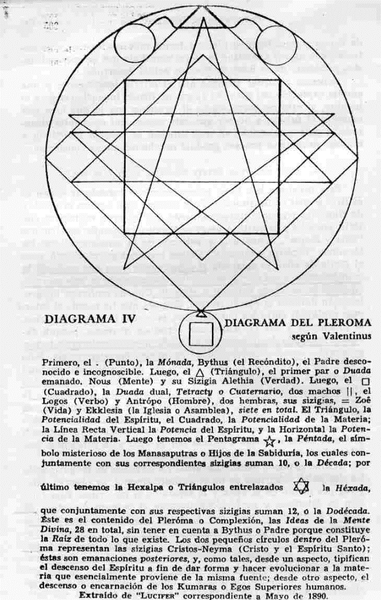

# SEGUNDA PARTE

# FUEGO SOLAR (El Fuego de la Mente)

1. Preguntas de Introducción
2. Sección A. La naturaleza de manas o mente.
3. Sección B. Manas como factor cósmico, humano y del sistema.
4. Sección C. El rayo del ego y el fuego solar
5. Sección D. Los elementales de la mente y los elementales del fuego.
6. Sección E. El movimiento en el plano de la mente.
7. Sección F. La Ley de Atracción.

# SEGUNDA PARTE

# PREGUNTAS DE INTRODUCCIÓN

1. ¿Qué relación existe entre el Hijo y el Sol?
2. ¿Qué es la evolución y cómo se desenvuelve?
3. ¿Por qué el sistema solar evoluciona como dualidad?
4. ¿Qué es la conciencia? ¿Qué lugar ocupa en el actual esquema de las cosas?
5. ¿Existe una analogía directa entre un sistema, un planeta, un hombre y un átomo?
6. ¿Quién es el aspecto mente? ¿Quiénes son los Manasaputras o los Hijos de la Mente?
7. ¿Por qué la evolución se desenvuelve cíclicamente?
8. ¿Por qué el conocimiento es a la vez exotérico o esotérico?
9. ¿Qué relación existe entre
   1.  los diez esquemas planetarios,
   2.  los siete planetas sagrados,
   3.  las siete cadenas de un esquema,
   4.  los siete globos de una cadena,
   5.  las siete rondas de un globo,
   6.  las siete razas raíces y sus subrazas?

<pin lang="es">203</pin> <pin lang="en">223</pin> Antes de tratar el tema referente al fuego de la mente, de acuerdo al programa delineado, quizás seria útil explicar ciertos hechos y aclarar uno o dos puntos. El tópico que vamos a elucidar es profundamente misterioso; constituye la base de todo lo que vemos y conocemos, tanto objetiva como subjetivamente. Hemos estudiado en parte el polo de la manifestación llamado materia. Lo que entraremos ahora a considerar concierne a una variedad de cosas que en términos generales podemos denominar Conciencia y en términos específicos, de allí su importancia fundamental, abarca los siguientes tópicos: <pin lang="en">224</pin>

1. La ciencia de la objetividad.
2. La manifestación del Hijo a través del Sol y sus esferas subsidiarias, o sea el sistema solar en su totalidad.
3. El desarrollo evolutivo de la conciencia en tiempo y espacio, por lo tanto la evolución del Espíritu y la materia.

<pin lang="es">204</pin> Si se estudian los tres fundamentos mencionados, se observará que son muy amplios; dada la inmensidad del tema, lo único que se puede hacer es dar un concepto claro y general respecto al extenso delineamiento del proceso y al desarrollo gradual de la conciencia. Para poder seguir el tema inteligentemente será conveniente que puntualicemos las proposiciones, que (aunque conocidas y valoradas) servirán, al estudiante, como armazón sobre la que podrá erigirse la correspondiente estructura del conocimiento. Si el que estudia la Sabiduría es capaz de captar en forma general la naturaleza del tema podrá ordenar con más facilidad y exactitud, en el casillero adecuado, la información detallada. El mejor plan sería quizás formular ciertas preguntas y, de acuerdo a las respuestas, dar forma a las proposiciones que se presentarán. Lógicamente todos estos interrogantes surgen cuando el que estudia La Doctrina Secreta llega al punto en que percibe el gran Plan, pero el cúmulo de detalles a incorporar se halla todavía en estado incipiente. Pueden ser formuladas y estudiadas las preguntas siguientes:

1. ¿Qué relación existe entre el Hijo y el Sol?
2. ¿Qué es la evolución y cómo se desenvuelve?
3. ¿Por qué el sistema solar evoluciona como dualidad?
4. ¿Qué es la conciencia? ¿Qué lugar ocupa en el actual esquema de las cosas? <pin lang="en">225</pin>
5. ¿Existe una analogía directa entre un sistema, un planeta, un hombre y un átomo?
6. ¿Qué es el aspecto mente y por qué el principio manásico o mental es de tanta importancia? ¿Quiénes son los Manasaputras o los Hijos de la Mente?
7. ¿Por qué la evolución se desenvuelve cíclicamente?
8. ¿Por qué consideramos aún ciertos conocimientos como esotéricos y en otros aspectos como exotéricos?
9. ¿Qué relación existe entre
   1.  los diez esquemas planetarios,
   2.  los siete planetas sagrados,
   3.  las siete cadenas de un esquema,
   4.  los siete globos de una cadena,
   5.  las siete rondas de un globo,
   6.  las siete razas raíces y sus subrazas?

Cuando hayamos tratado de responder breve y concisamente a estas nueve preguntas y captado por medio de sus respuestas, algo de lo que subyace detrás de la evolución de la conciencia del Hijo (y todo lo que incluye esta expresión), estaremos en condiciones <pin lang="es">205</pin> de entrar a considerar el plan en forma más inteligente, y de entender con mayor exactitud la etapa inmediata que debemos alcanzar, partiendo de la base de nuestro actual desarrollo.

Debemos recordar siempre que el interés investigador y una amplia captación del plan del Logos no tienen importancia para el hombre, si éste no correlaciona el presente con lo que cree que encierra el futuro, a no ser que esté seguro del desarrollo alcanzado, y que comprenda en qué consiste el trabajo inmediato a realizar durante el proceso gradual de obtener plena conciencia. <pin lang="en">226</pin>

## I. ¿QUÉ RELACIÓN EXISTE ENTRE EL HIJO Y EL SOL?

Esta pregunta nos lleva primeramente a considerar Quién es el Hijo y cuál es Su función. Todo <pin lang="en">227</pin> sistema que merece el nombre de filosófico reconoce universalmente dos factores, espíritu y materia, purusha y prakriti. A veces se tiende a confundir los términos "vida y forma", "conciencia y vehículo de la conciencia", con los términos "Espíritu y materia". Dichos términos se relacionan, pero el punto de vista se aclararía si comprendiéramos que antes de la manifestación o del nacimiento de un sistema solar es más correcto emplear las palabras Espíritu y materia. Cuando ambas se interrelacionan durante la manifestación, después que ha cesado el intervalo praláyico entre los dos sistemas, entonces la vida y la forma, la conciencia y sus vehículos, son términos correctos, porque durante el período de abstracción no existe la conciencia ni la forma, y la vida, manifestándose como principio, tampoco existe. Sólo existe Espíritu-sustancia pero en estado de positividad, de total neutralidad, de negatividad y de pasividad. En la manifestación ambos se aproximan; actúan entre sí; la actividad reemplaza a la pasividad, la positividad a la negatividad; hay movimiento en vez de pasividad y ambos factores primordiales ya no son neutros, sino que se atraen y rechazan, se interactúan y se utilizan. Sólo entonces podemos tener la forma animada por la vida y la conciencia manifestada a través de vehículos adecuados.

¿Cómo se puede manifestar esto? En términos de fuego, cuando los dos polos eléctricos se unen definitivamente, se observa calor y luz por medio de la vista y la sensibilidad esotéricas. Esta relación se establece y perfecciona durante el proceso evolutivo. El calor y la luz se producen por la unión de los dos polos, o por el matrimonio esotérico de lo masculino y lo femenino, Espíritu (padre) y materia (madre). Físicamente dicha unión produce el sistema solar objetivo, el Hijo del Padre y de la Madre. Subjetivamente produce al Sol, suma total de <pin lang="en">228</pin> las cualidades de luz y calor. En términos de Fuego, mediante la unión o unificación del fuego eléctrico (Espíritu) con el fuego por fricción <pin lang="es">206</pin> (materia energetizada) se produce el fuego solar. Este fuego solar se distinguirá de todo lo demás por su desenvolvimiento evolutivo y por la intensificación gradual del calor que se ha de sentir y la luz que se ha de ver. <pin lang="es">207</pin>

Para poder llegar a una comprensión más clara de este tema tan abstracto, podemos considerar que el microcosmos, el hombre, evoluciona en los tres mundos. El hombre es el producto de la aproximación (imperfecta hoy) de los dos polos: Espíritu (el Padre en el cielo) y materia (la Madre). Esta unión da por resultado un Hijo de Dios individualizado, la unidad del Yo divino, y su reproducción exacta, en miniatura, en el plano más inferior del gran Hijo de Dios u Omni-Yo, quien constituye en Sí mismo la totalidad de todos los hijos, en miniatura, de todos los yoes individualizados y de todos y cada uno de los entes. Expresado en otros términos, el microcosmos, desde el punto de vista subjetivo, es un sol en miniatura que se distingue por las cualidades de luz y calor. En la actualidad esa luz se halla como "debajo de un cesto", o profundamente oculta por un velo de materia; pero en el proceso evolutivo brillará en tal forma, que los velos se desvanecerán ante el resplandor de la excelsa gloria. Actualmente el calor microcósmico es mínimo, es decir, la radiación magnética entre los entes microcósmicos se siente poco (según el significado oculto del término), pero con el tiempo las emanaciones de calor -debido a la intensificación de la llama interna, unida a la radiación asimilada por otros entes- aumentarán y alcanzarán tales proporciones, que la interacción entre los Yoes individualizados traerá como resultado, en cada uno, la perfecta fusión de la llama y del calor; esto continuará hasta que exista "una sola llama con incontables chispas", y el calor sea general y equilibrado. Cuando ello ocurra y cada Hijo de Dios llegue a ser un Sol perfecto, caracterizado por la luz y el calor perfectamente expresados, <pin lang="en">229</pin> todo el sistema solar, el Hijo mayor de Dios, será un Sol perfecto.

El sistema estará entonces caracterizado por un "resplandor de refulgente gloria", y por una radiación que lo vinculará con su centro cósmico; así logrará la liberación del Hijo y Su retorno a la lejana fuente de donde originó el primordial impulso. Por lo tanto téngase en cuenta que:

Primero, el Hijo es el resultado radiante de la unión del Espíritu y la Materia, y se lo puede considerar como la totalidad del sistema solar: el Sol y los siete planetas sagrados.

Segundo, el Hijo se manifiesta por medio de Sus cualidades de luz y calor, lo mismo que el Sol.

Tercero, el Hijo es el producto de la unión eléctrica del "fuego por fricción" y "el fuego eléctrico" y también Él es "fuego solar", <pin lang="es">208</pin> o sea la manifestación de los otros dos, por consiguiente lo que se ve y lo que se siente.

Finalmente, el Hijo es, por lo tanto, la manifestación intermedia producida, en sentido oculto, por lo que está arriba y lo que está abajo. De manera que el Hijo, en Su propio plano (el mental cósmico), es el cuerpo egoico del Logos, en el mismo sentido que el cuerpo egoico del microcosmos es el producto de la unión de la Mónada o Espíritu, y la materia. Así como el cuerpo egoico del hombre (lo que se llama cuerpo causal) está sólo en proceso de formación y aún no es perfecto, lo mismo puede afirmarse del sistema solar el expresar la Vida de Dios, pues está en proceso de perfeccionamiento. El Hijo, manifestándose por medio del Sol y su esfera de influencia, todavía está desarrollándose gradualmente y no alcanzará "pleno desenvolvimiento" ni será perfecto hasta que todas las células de Su cuerpo tengan plena vida y vibren a un ritmo uniforme; no alcanzará Su lugar entre las constelaciones celestes (los Hijos de Dios en sentido cósmico) hasta que la radiación y el resplandor de Su luz sean vistos y sentidos perfectamente.

<pin lang="en">230</pin> El Hijo en los Cielos no "resplandecerá" hasta que cada una de las células de Su cuerpo sea una esfera de radiante gloria o, expresado esotéricamente, una llama de fuego y luz y una fuente de radiación magnética o calor. Como sabemos, desde el punto de vista cósmico, nuestro Sol sólo es de cuarto orden y se encuentra en el plano cósmico inferior. Cuando el Hijo haya alcanzado, por medio del Sol, plena expresión (es decir, perfeccionado Su despliegue de luz y calor) brillará en otro plano, el mental cósmico. Tenemos su analogía en el microcosmos u hombre. Cuando la luz del hombre brille plenamente y su radiación magnética haya alcanzado una vívida interacción o actividad grupal, habrá logrado la plena autoexpresión e incluido en su esfera de influencia y control al plano mental. Entonces se lo considera un Maestro, aunque también de cuarto orden, es decir, un cuaternario. Físicamente el plano etérico es el centro de su vida, así como se dice esotéricamente que el Sol y los planetas existen en materia etérica. La ley esotérica expresa "como es arriba es abajo". Por lo tanto, la relación entre el Hijo, el Padre y la Madre, en lo que respecta al Sol, es la misma que existe entre el hombre y el vehículo por el cual actúa. Es Su modo de actuar, Su vehículo de expresión; es la forma que Su vida anima con el fin específico de

1. adquirir experiencia,
2. hacer contactos,
3. desarrollar pleno conocimiento de sí mismo.
4. alcanzar pleno dominio o control,
5. llegar cósmicamente a la "madurez . El Cristo cósmico <pin lang="es">209</pin> debe llegar a la estatura del "hombre plenamente maduro", según lo expresa La Biblia cristiana." [^1]
6. expandir Su conciencia.

<pin lang="en">231</pin> Estas etapas se han de alcanzar en los niveles cósmicos, exactamente como el microcosmos persigue ideales similares en el sistema.

## II. ¿QUE ES LA EVOLUCIÓN Y COMO SE DESENVUELVE?

### 1. Ciclos de Vida.

Me limitaré aquí a tratar brevemente el proceso evolutivo y a indicar que el método de la evolución consiste simplemente en ajustar el aspecto materia al aspecto Espíritu, a fin de que el primero sea adecuado como cuerpo de expresión para el segundo. El ciclo de vida del Hijo es de cien años de Brahma, así como el ciclo de vida del hombre es de cierto número de años, el cual depende de su karma. Durante su ciclo de vida el hombre expresa en su etapa particular todo lo que ha adquirido, desarrollándolo gradualmente desde el período prenatal en que el Yo influye sobre el aspecto materia, hasta el período en que ese Yo superior toma plena posesión de la forma ya preparada. Esta etapa varía en cada individuo. Desde ese momento el hombre procura desarrollar con mayor plenitud la autoconciencia y (si progresa normalmente) expresarse con más propiedad por medio de la forma. En cada ciclo menor de vida, dentro del gran ciclo del Ego o Yo, se completa más esa expresión, controla más a la forma y desarrolla una realización consciente del Yo, hasta que llega un ciclo culminante de vidas en que el Yo interno domina rápidamente y asume plena autoridad. La forma llega a ser totalmente adecuada; se produce la plena fusión de los dos polos, Espíritu y materia, y la luz (fuego) y el calor (irradiación) se ven y se sienten en todo el sistema. Entonces se utiliza la forma conscientemente con fines específicos o se abandona, y el hombre se libera. El fuego eléctrico y el fuego por fricción se fusionan y el consiguiente fuego solar resplandece con radiante gloria.

Extendamos esta idea desde el hombre, como unidad individualizada de <pin lang="en">232</pin> conciencia, hasta los grandes Hombres celestiales, en uno de cuyos cuerpos el hombre es una célula. El cuerpo de expresión de cada Hombre celestial es uno de los planetas sagrados; persiguen el mismo objetivo que el hombre: lograr en Sus propios niveles la plena expresión y el desarrollo de Sus vehículos de conciencia, a tal grado, que el Espíritu resplandezca como luz divina y calor. Este calor se irradia conscientemente y con intensa atracción magnética entre los siete grupos del sistema o esquemas planetarios. Su campo magnético de acción comprenderá el radio <pin lang="es">210</pin> planetario de todos y cada uno de ellos. Extendamos esta idea más aún hasta incluir al Hijo y a todo el sistema solar que Él anima; Su intento es expresarse plenamente dentro de él, para que con el tiempo y conscientemente se vea Su luz y se sienta Su calor o radiación magnética, más allá de Su influencia, el "círculo no se pasa" logoico. La luz y el calor del Hijo deben sentirse en el polo cósmico opuesto, esa constelación que es el opuesto magnético de nuestro sistema.

### 2. Objetivo de las Unidades de Conciencia.

La idea de unión y de fusión subyace en todo el plan evolutivo; el Hombre, los Hombres celestiales y el Hombre cósmico (el Hijo del Padre y de la Madre) han de:

1. Irradiar calor más allá de su propio "círculo no se pasa" individual.
2. Resplandecer esotéricamente y demostrar luz u objetividad ígnea.
3. Expandirse hasta abarcar lo que está más allá de sus propias esferas inmediatas.
4. Fusionar y mezclar los dos fuegos para producir perfectamente el fuego central, fuego solar.
5. Fusionar Espíritu y materia para producir un cuerpo que exprese adecuadamente el Espíritu.
6. Fusionar la esencia de la forma, esotéricamente <pin lang="en">233</pin> cualificada durante la evolución, con la esencia de todas las formas -en sentido humano, planetario y cósmico.
7. Alcanzar madurez humana, sistemática y cósmica.
8. Dominar los tres planos del sistema solar, hablando en sentido humano.
9. Dominar los cinco planos del sistema solar, en lo que respecta al Hombre celestial.
10. Dominar los tres planos cósmicos, en lo que respecta al Cristo cósmico, el Hijo o Logos al manifestarse objetivamente. <pin lang="es">211</pin>

### 3. Unidades de Conciencia en Manifestación. [^2]

Si nos detenemos a considerar cuidadosamente los objetivos mencionados, veremos que cada uno ocupa su lugar en el plan y que el término <pin lang="en">234</pin> evolución se emplea para expresar el desenvolvimiento gradual, en tiempo y espacio, de la capacidad inherente de <pin lang="es">212</pin> un ser humano, de un Hombre celestial y del gran Hombre de los Cielos. Debe tenerse en cuenta el lugar y la posición que todos y cada uno ocupan respecto a otro u otros, pues ninguno puede desarrollarse sin los demás. Por lo tanto, ¿Qué tenemos?

1. El Hijo, el gran Hombre de los Cielos. Se manifiesta por medio del Sol y de los siete planetas sagrados, cada uno de los cuales personifica uno de Sus siete principios, de la misma manera que Él, en su totalidad, personifica uno de los principios de una Entidad cósmica mayor.
2. Un Hombre celestial. Se manifiesta por medio de un planeta, personificando uno de los principios del Hijo, el Logos, y se desarrolla similarmente por medio de siete principios, fuente de Su unidad esencial con los demás Hombres celestiales. En sentido cósmico, el hijo está desarrollando el principio de un Ser cósmico mayor, el principio denominado amor-sabiduría, característica fundamental que ha de desarrollar durante su ciclo de vida. Por consiguiente, cada Hombre celestial personifica predominantemente un principio subsidiario del fundamental. Posee similarmente seis principios subsidiarios, como el Hijo.
3. Un Ser Humano, el Hombre. Se manifiesta en el plano <pin lang="en">235</pin> físico por medio de la forma y posee también siete principios; en cada ciclo de vida trabaja para desarrollarlos; tiene además una coloración primaria, que depende del principio fundamental personificado por el Hombre celestial quien es su fuente de origen. Tenemos así:

EL LOGOS

Padre-Espíritu .......... Madre - Materia

que producen:

El Hijo o gran Hombre en los Cielos, el Ego logoico consciente, que evoluciona por medio de <pin lang="es">213</pin> El Sol y los siete planetas sagrados,
cada uno personifica Un principio cósmico, con seis diferenciaciones, por el método de:

1. Expansión, estimulo vibratorio, interacción magnética o la ley de atracción y repulsión.
2. Progresión cíclica, repetición rotatoria, conjuntamente con ascensión en espiral, y desarrollando:
   1. La cualidad de amor-sabiduría, utilizando la forma por medio de la inteligencia activa.
   2. Plena autoconciencia.
   3. Un perfecto sistema solar o forma, adecuado a las necesidades del espíritu inmanente.

La misma clasificación podría aplicarse para demostrar la similitud del proceso en el caso del Hombre celestial y del ser humano. Si se pregunta por qué hay diez esquemas y, en efecto, diez planetas (siete sagrados y tres ocultos), <pin lang="en">236</pin> se nos dirá que los siete planetas sagrados oportunamente se fusionan en los tres y finalmente los tres en uno. Esto tiene su analogía en los siete Rayos. Los siete Rayos, que en la manifestación son distintos, con el tiempo se sintetizan. Se dice que los cuatro menores se fusionan en el tercero mayor, y finalmente los tres mayores en el rayo sintético, Rayo de Amor-Sabiduría (el Dragón de Sabiduría, la serpiente [^3] oculta mordiendo su cola) de acuerdo a H. P. B. Tenemos por lo tanto tres rayos principales, pero se ven siete durante el proceso evolutivo. Respecto a los Hombres celestiales que actúan por medio de los planetas, tenemos, por consiguiente, tres planetas que podríamos considerar sintetizadores y cuatro que oportunamente son fusionados, hasta que los tres han absorbido la esencia de los cuatro; finalmente uno absorbe la esencia de los tres, y así se completa el trabajo. Este proceso tendrá lugar dentro de millones de años; se desarrollará durante el inevitable periodo de la gradual oscuración de nuestro sistema. Cuatro de los Hombres celestiales encuentran Sus opuestos magnéticos mezclándose y fusionándose. Primeramente lo realizan entre Ellos, fusionando y mezclando el Rayo negativo y el positivo, luego los cuatro se trasforman en dos. Después los dos se fusionan formando así una unidad, y el uno resultante se fusiona con el tercer rayo mayor, el aspecto Inteligencia -rayo que en nuestra Jerarquía planetaria está representado por el Mahachohan. La fusión continuará hasta que se alcance finalmente la unidad del sistema, y el Hijo haya realizado Su <pin lang="es">214</pin> propósito, Amor-Sabiduría perfectos; Su luz resplandece cósmicamente; Su radio magnético toca la periferia de Su opuesto cósmico, llevándose a cabo el matrimonio del Hijo. Las dos unidades cósmicas se fusionan.

Si preguntamos, como es lógico, qué unidad cósmica constituye nuestro opuesto solar, se nos respondería <pin lang="en">237</pin> que por ahora es un enigma, aunque se halla insinuado en La Doctrina Secreta y en otros libros sagrados. Una insinuación velada se encuentra en la relación que existe con las Pléyades de nuestra tierra; pero cuando avance más la precesión de los equinoccios se verá claramente cuál es la relación exacta implicada. [^4]

## III. ¿POR QUE EL SISTEMA SOLAR EVOLUCIONA COMO DUALIDAD?

### 1. El Problema de la Existencia.

La tercera pregunta involucra uno de los más difíciles problemas de la metafísica, y su consideración abarca todo el desconcertante misterio de la razón de por qué existe la objetividad.

"¿Por qué razón creó Dios? ¿Por qué se nos impone la existencia?", son preguntas formuladas en distintas oportunidades por los hombres de todas las escuelas de pensamiento, por los religiosos, por los científicos en su búsqueda por hallar la verdad final y en su esfuerzo por descubrir el motivo de todo lo visible y obtener la explicación de la vida sensoria; por los filósofos, al buscar activamente aquello que anima a la subjetividad, y ha sido expresado en toda civilización y en todo tipo de personas por medio de las ciencias morales y la ética; por el biólogo, en su persistente empeño por descubrir la fuente de la vida y en su ansioso esfuerzo por explicar el principio vida, que siempre elude sus investigaciones; por el matemático, quien al considerar el aspecto forma de la manifestación en las distintas ramas de las matemáticas, llega a la conclusión de que Dios geometriza, que la ley y la medida rigen todo el universo y que el uno existe por medio de los muchos, pero a pesar de todo es incapaz de resolver el problema respecto a quién puede ser esa entidad <pin lang="en">238</pin> geometrizadora. El problema persiste, y todas las vías de acercamiento (para hallar una solución) terminan en el callejón sin salida de las hipótesis y en el reconocimiento de un algo terminante, tan evadible que los hombres se ven forzados aparentemente a reconocer que existe una fuente de energía, de vida, de inteligencia, a la que dan distintos <pin lang="es">215</pin> nombres, de acuerdo a la tendencia de sus mentes (religiosas, científicas o filosóficas), Dios, Mente Universal, Energía, Fuerza, lo Absoluto, lo Desconocido. Estos y muchos otros términos son los pronunciados por aquellos que, por medio del aspecto forma, buscan al Morador de la forma que no han podido hallar aún. Este fracaso se debe a las limitaciones del cerebro físico y a la falta de desarrollo del mecanismo por el cual se puede conocer lo espiritual y oportunamente establecer contacto con el Morador.

El problema de la dualidad es el problema de la existencia misma, y no puede resolverlo quien se niegue a reconocer la posibilidad de dos hechos esotéricos:

1. Que el sistema solar personifica la conciencia de una Entidad, cuyo origen está fuera del "círculo no se pasa" solar.
2. Que la manifestación es periódica y la Ley de Renacimiento el método evolutivo del hombre, del Logos planetario y del Logos solar. De allí el énfasis puesto en el proemio de La Doctrina Secreta sobre los tres fundamentos [^5] siguientes:
   1. El Principio Inmutable e Ilimitado.
   2. La Periodicidad del Universo.
   3. La Identificación de todas las Almas con la SuperAlma.

Una vez que los científicos reconozcan los dos hechos mencionados, sus explicaciones tendrán un sentido diferente y la verdad, tal cual es, empezará a iluminar su razón. Pocos hombres están preparados para recibir la iluminación, que simplemente es la luz de la <pin lang="en">239</pin> intuición que derriba las barreras erigidas por la facultad de razonar. Con el tiempo se reconocerá que la dualidad del sistema solar depende de los siguientes factores:

1. De la existencia misma.
2. Del tiempo y el espacio.
3. De la cualidad deseo o necesidad.
4. De la facultad adquisitiva inherente a la vida misma. Esta facultad, por medio del movimiento, reúne en sí el material con que satisface su deseo, construyendo la forma mediante la cual trata de expresarse, confinándose ella misma dentro de la prisión de la envoltura, a fin de adquirir experiencia.

Es correcta la suposición de que esta teoría admite una poderosa Inteligencia que actúa de acuerdo a un plan ordenado; <pin lang="es">216</pin> conscientemente toma forma y encarna a fin de cumplir su propio propósito específico. Esta hipótesis constituye por sí sola el hecho fundamental que subyace en las enseñanzas orientales y generalmente es aceptada por los pensadores de todas las escuelas de pensamiento del mundo, aunque lo expresen y perciban de distintas maneras. Incluso este concepto, es sólo una presentación parcial de la Idea real, pero debido a las limitaciones que tiene el hombre en la actual etapa de evolución, es suficiente como base práctica sobre la que se puede erigir el templo de la verdad.

Esta Entidad denominada Logos solar, de ninguna manera es el mismo Dios personal de los cristianos, quien no es más ni menos que el hombre mismo que se ha expandido hasta transformarse en un ser de enorme poder, sujeto a las virtudes y vicios propios de aquél. El Logos solar es mucho más que el hombre, pues es la suma de todas las evoluciones dentro del sistema solar, incluyendo la humana, que se encuentra en el punto medio respecto a las demás evoluciones. Por un lado se alinean las huestes de seres que son más que humanos, quienes en <pin lang="en">240</pin> kalpas pasados alcanzaron y traspusieron la etapa en la que se encuentra ahora el hombre; por otro lado se encuentran las huestes de las evoluciones subhumanas, quienes alcanzarán en kalpas futuros la etapa de la humanidad actual. El hombre se encuentra en medio de ambas y en el punto de equilibrio; aquí reside su problema. No participa totalmente del aspecto material de la evolución, ni es la presión total del tercer Logos, el aspecto Brahma de la Deidad, esa expresión de la energía pura o inteligencia que anima ese algo tenue denominado sustancia. El hombre no es totalmente Espíritu, la expresión del primer Logos, el aspecto Mahadeva, una expresión de la voluntad pura o necesario deseo que impele a la manifestación. Constituye el móvil fundamental mismo o la gran voluntad de ser. Es el producto de la unión de ambos y también el lugar de reunión de la materia o sustancia inteligente activa con el Espíritu o voluntad fundamental. Es el hijo nacido en este matrimonio o unificación. Entra a la objetividad a fin de expresar aquello que se halla en los dos opuestos, más el resultado de la fusión de ambos dentro de sí mismo.

### 2. Su Naturaleza y Dualidad.

En términos de cualidad ¿Qué tenemos?; tenemos la Inteligencia activa que unificada con la voluntad o poder produce el "Hijo de la necesidad" [^6] (como lo expresa H. P. B.), que personifica inteligencia, voluntad o deseo y la conjunta demostración latente, amor-sabiduría.

<pin lang="es">217</pin> En términos de Fuego ¿Cómo podríamos expresar un pensamiento análogo? El fuego latente en la materia -efecto de una manifestación anterior de la misma Entidad cósmica, o la cualidad relativamente perfeccionada que ha desarrollado en una encarnación cósmica anterior- es puesto nuevamente en actividad por el deseo de dicha Entidad de volver a girar en la rueda de renacimiento. Dicho "fuego por fricción" produce calor e irradiación y evoca una reacción de su <pin lang="en">241</pin> opuesto, "el fuego eléctrico" o espíritu. Esto nos da la idea del rayo atravesando la materia, pues la acción del fuego eléctrico se dirige siempre hacia adelante como ya se sugirió anteriormente. El Rayo uno, "fuego eléctrico", penetra en la materia. En el sistema esto constituye el matrimonio del Padre y de la Madre, dando por resultado la fusión de ambos fuegos y la producción conjunta de esa expresión del fuego que llamamos "fuego solar". Así se produce el Hijo. La Inteligencia Activa y la Voluntad se han unido y darán por resultado Amor-Sabiduría cuando se ha perfeccionado mediante la evolución.

El Fuego eléctrico o Espíritu, unido al fuego por fricción, calor, produce fuego solar o luz.

De allí que, cuando la Entidad cósmica toma forma, se agrega a la inteligencia activa, producto de Su encarnación anterior, una nueva cualidad que es inherente o potencial, amor-sabiduría. Es primeramente la capacidad de amar lo objetivo, el no-yo, y finalmente de utilizar la forma con sabiduría. La voluntad pura es todavía una abstracción y será llevada a su pleno desarrollo en otra encarnación del Logos. La Mente o Inteligencia no es una abstracción, sino algo que ES. Tampoco Amor-Sabiduría es una abstracción, sino que está en proceso de desarrollo o de manifestarse, y constituye el aspecto del Hijo.

:::note Recuerda

 Amor-Sabiduría es primeramente la capacidad de amar lo objetivo, el no-yo, y finalmente de utilizar la forma con sabiduría.

:::

Lo que se ha expuesto no es nada nuevo, pero se han reunido estos conceptos sobre la dualidad esencial a fin de inculcar en nuestras mentes la necesidad de ver estas cosas desde el punto de vista del lugar que ocupan en el esquema cósmico, y no desde el punto de vista de nuestra propia evolución planetaria y del hombre mismo. La evolución humana es esa evolución por la cual el aspecto Hijo ha de expresarse con la máxima perfección en esta encarnación cósmica. El hombre fusiona los pares de opuestos; los tres fuegos se unen en él; es la mejor expresión del principio manásico y, considerado desde un punto de vista <pin lang="en">242</pin> muy interesante, dirige la obra de Brahma; es la envoltura para la vida de Dios y la conciencia individualizada del Logos, manifestándose en los siete Manasaputras divinos u Hombres celestiales, en Cuyos cuerpos cada unidad de la familia humana tiene su lugar. El hombre es el aspecto Vishnu en proceso de desarrollo por medio de la <pin lang="es">218</pin> inteligencia de Brahma, impulsado por la voluntad del Mahadeva. Por lo tanto, en modo peculiar, el hombre es muy importante, porque constituye el punto de unificación de los tres aspectos, pero no lo es puesto que no constituye el ápice del triángulo sino simplemente el punto medio, si miramos el triángulo de esta manera:

1. Espíritu-Padre.
2. El Hijo u hombre.
3. Materia-Madre.

:::note Recuerda

La evolución humana es esa evolución por la cual el aspecto Hijo ha de expresarse con la máxima perfección en esta encarnación cósmica. El hombre fusiona los pares de opuestos; los tres fuegos se unen en él; es la mejor expresión del principio manásico y, considerado desde un punto de vista muy interesante, dirige la obra de Brahma; es la envoltura para la vida de Dios y la conciencia individualizada del Logos, manifestándose en los siete Manasaputras divinos u Hombres celestiales, en Cuyos cuerpos cada unidad de la familia humana tiene su lugar. El hombre es el aspecto Vishnu en proceso de desarrollo por medio de la inteligencia de Brahma, impulsado por la voluntad del Mahadeva.

:::

La evolución del Hijo, la encarnación cósmica del Cristo, es de gran importancia para los planes del Ser más grande que el Logos solar, AQUEL SOBRE QUIEN NADA PUEDE DECIRSE. Los principios animadores de las constelaciones y sistemas afines observan, con aguda atención, el progreso de la evolución del Hijo.

Así como el planeta llamado Tierra es el punto decisivo o campo de batalla entre el Espíritu y la materia y, debido a ello, de gran importancia, así nuestro sistema solar ocupa un lugar análogo en el esquema cósmico. El hombre cósmico, el Arjuna solar, está luchando por obtener Su autoconciencia individualizada perfecta y por liberarse e independizarse de la forma y del no-yo. También en este planeta el hombre trabaja para lograr, en su pequeña esfera, ideales similares; de la misma manera luchan en el cielo Miguel y Sus ángeles o los divinos Hombres celestiales, cuyo problema es el mismo en más elevada escala.

La dualidad y la interacción entre ambos producen: <pin lang="en">243</pin>

1. La objetividad, el Hijo o Sol manifestado.
2. La evolución misma.
3. El desarrollo de la cualidad.
4. El tiempo y el espacio.

Las preguntas que estamos respondiendo encierran ciertos aspectos fundamentales de la manifestación, contemplados principalmente desde el punto de vista subjetivo o síquico.

## IV. ¿QUE ES LA CONCIENCIA? ¿QUE LUGAR OCUPA EN EL ACTUAL ESQUEMA DE LAS COSAS?

Podemos definir la conciencia como la facultad de captar; concierne principalmente a la relación que existe entre el Yo y el no-yo, el Conocedor y lo conocido, el Pensador y lo pensado. Estas definiciones involucran la aceptación de la idea de la dualidad, de lo objetivo y de lo que está detrás de la objetividad. [^7]

<pin lang="es">219</pin> La conciencia expresa lo que puede ser considerado como el punto medio de la manifestación. No atañe totalmente al polo del Espíritu; se produce por la unión de los dos polos y por el proceso de interacción y adaptación que necesariamente resulta. A fin de facilitar su aclaración podría clasificarse de la manera siguiente:<pin lang="en">244</pin>

|              |                   |              |
| ------------ | ----------------- | ------------ |
| Primer Polo  | Punto de Unión    | Segundo Polo |
| Primer Logos | Segundo Logos     | Tercer Logos |
| Mahadeva     | Vishnu            | Brahma       |
| Voluntad     | Amor-Sabiduría    | Inteligencia |
| Espíritu     | Conciencia        | Materia      |
| Padre        | Hijo              | Madre        |
| Mónada       | Ego               | Personalidad |
| El Yo        | La Relación entre | El No-Yo     |
| El Conocedor | El Conocimiento   | Lo Conocido  |
| Vida         | Realización       | Forma        |

Podríamos ir acumulando términos, pero los mencionados bastan para demostrar la relación que existe entre los tres aspectos del Logos, durante la manifestación. Se ha de recalcar lo antedicho: El sistema solar personifica, durante la objetividad evolutiva, la relación logoica mencionada, y toda la finalidad del desarrollo progresivo es llevar al Hijo del Padre y de la Madre, a un punto de plena realización, de total autoconciencia y de completo conocimiento activo. Este Hijo es objetivamente el sistema solar, inherentemente voluntad o poder y subjetivamente amor-sabiduría. Esta última cualidad se está desarrollando mediante el empleo de la inteligencia activa.

Las tres Personas manifestadas de la Tríada logoica procuran obtener un pleno desarrollo, dependiendo una de la otra. La voluntad de ser del aspecto Mahadeva, con la ayuda de la inteligencia <pin lang="es">220</pin> de Brahma, trata de desarrollar amor-sabiduría, el aspecto Vishnu o hijo. En el sistema microcósmico, reflejo del triple Logos, el hombre procura, valiéndose de los tres vehículos, alcanzar el mismo desarrollo en su propio plano. En los planos superiores, los Hombres celestiales, por medio de atma-budi-manas, tratan de lograr una progresión similar. Los Hombres celestiales además de los entes de Sus cuerpos, compuestos de mónadas dévicas y humanas, forman en conjunto el gran Hombre celestial. Cuando el hombre realiza, los Hombres celestiales también realizan; cuando Ellos alcanzan Su pleno desarrollo y conocimiento <pin lang="en">245</pin> y son autoconscientes en todos los planos, entonces el Hijo realiza y el sistema solar (Su cuerpo de manifestación y de experiencia) ha servido su propósito. El Hijo se libera. Extendiendo la idea del triple desenvolvimiento de la conciencia al Logos, en un ciclo aún más amplio (los tres sistemas solares de los cuales el nuestro es el punto medio) se repetirá en los niveles cósmicos, en conexión también con el Logos, el proceso del desarrollo del hombre en los tres mundos.

### EL MACROCOSMOS

1. El primer sistema solar personificó el principio "Yo soy".
2. El segundo sistema solar personifica el principio "Yo soy ese"
3. El tercer sistema solar personificará el principio "Yo soy ese yo soy".

### EL MICROCOSMOS

1. La primera manifestación, la Personalidad, personifica el principio "Yo soy".
2. La segunda manifestación, el Ego, personifica el principio "Yo soy Ese".
3. La tercera manifestación, la Mónada, personificará el principio "Yo soy Ese yo soy".

De esta manera los distintos factores desempeñan su parte en el orden general de las cosas; todos están interrelacionados, siendo partes interesadas y miembros unos de los otros.

## V. ¿EXISTE UNA ANALOGIA DIRECTA ENTRE UN SISTEMA, UN PLANETA, UN HOMBRE Y UN ÁTOMO?

Si al formular esta pregunta existe el deseo de comprobar una similitud exacta, la respuesta es la siguiente: No, la analogía nunca es exacta en detalle, sino que sólo ofrece ciertas correspondencias amplias y fundamentales. En los cuatro factores mencionados en la pregunta, hay puntos inmutables de semejanza; pero, durante su desarrollo las etapas de crecimiento quizás no parezcan iguales en los detalles evolutivos, si se los considera desde el punto de vista del hombre en los <pin lang="en">246</pin> tres mundos, pues está obstaculizado por su limitada captación. Los puntos de semblanza entre los cuatro se pueden sintetizar de la manera siguiente, tomando el átomo del <pin lang="es">221</pin> plano físico como punto de partida y desarrollando el concepto por etapas:

### El Átomo [^8]

1. El átomo es un esferoide que contiene dentro de sí mismo un núcleo de vida.
2. El átomo contiene en si mismo moléculas diferenciadas que, en su totalidad, forman el átomo mismo. Se dice, por ejemplo, que el átomo físico contiene en su periferia catorce mil millones de átomos arquetípicos, sin embargo estos millones se manifiestan como uno.
3. El átomo se distingue por la actividad, manifestando las cualidades de
   1. movimiento giratorio
   2. poder discriminativo
   3. capacidad de desarrollo
4. Se dice que el átomo contiene en sí mismo tres espirillas mayores y siete menores [^9], las cuales están en proceso <pin lang="en">247</pin> de vitalización, pero no han logrado todavía plena actividad. En esta etapa actúan cuatro únicamente; la quinta está en proceso de desarrollo.
5. El átomo está regido por la Ley de Economía; va siendo <pin lang="es">222</pin> lentamente gobernado por la Ley de Atracción y, con el tiempo, estará bajo el dominio de la Ley de Síntesis.
6. El átomo encuentra su lugar en todas las formas, y el conglomerado de átomos produce la forma.
7. Un átomo responde al estimulo externo:
   1. Estímulo eléctrico, que afecta su forma objetiva.
   2. Estímulo magnético, que actúa sobre su vida subjetiva.
   3. El efecto combinado de ambos produce el consiguiente crecimiento y desenvolvimiento internos.

Por lo tanto, el átomo se caracteriza por:

1. I. Su forma esferoidal. Su "círculo no se pasa" es preciso y perceptible.
2. II. Su disposición interna abarca la esfera de influencia de cualquier átomo.
3. III. Su actividad vital, o la medida en que la vida de su centro lo anima, cosa relativa en esta etapa.
4. IV. Su séptuple economía interna en proceso de evolución.
5. V. Su eventual síntesis interna de los siete en los tres.
6. VI. Su relación grupal.
7. VII. Su desarrollo de conciencia, o capacidad de responder.

Habiendo establecido los hechos anteriores con respecto al átomo, podemos ahora extender la idea al hombre, siguiendo el mismo delineamiento general:

### El Hombre

1. Un hombre tiene forma esferoidal. Puede ser visto como un "círculo no se pasa" esférico, una esfera de materia con un núcleo <pin lang="en">248</pin> de vida en el centro. Al exponer esto estamos considerando al hombre verdadero en su posición fundamental como Ego, con su esfera de manifestación, el cuerpo causal, punto medio entre Espíritu y materia.
2. El hombre contiene en sí mismo átomos diferenciados, que en su totalidad componen su forma objetiva en los planos de la manifestación. Todos los átomos están animados por la vida del hombre, debido a su persistente voluntad de ser; todos vibran de acuerdo al grado de evolución que él haya alcanzado. Visto desde los planos superiores el hombre aparece como una esfera (o esferas) de materia diferenciada, que vibra a determinado ritmo, coloreada por determinado color y girando a un ritmo fijo -el ritmo del ciclo de su vida.
3. El hombre se caracteriza por la actividad que despliega en <pin lang="es">223</pin> uno o más planos de los tres mundos, y manifiesta las cualidades siguientes:
   1. Movimiento de rotación, o su determinado período cíclico en la rueda de la vida, alrededor de su polo egoico.
   2. Capacidad de discriminar, o el poder de elegir y de adquirir experiencia.
   3. Capacidad de evolucionar, a fin de acelerar la vibración y establecer contactos.
4. Contiene en sí mismo tres principios mayores -voluntad, amor-sabiduría, inteligencia activa o adaptabilidad- y su diferenciación en siete principios. Estos, que constituirán eventualmente las diez manifestaciones perfectas, están en proceso de vitalización; pero no han alcanzado todavía plena expresión. En el hombre sólo cuatro principios se hallan activos, y está en proceso de desarrollar el quinto o principio manásico. Obsérvese cuán perfecta es la analogía entre el hombre visto como el cuaternario inferior, desarrollando el principio de la mente, y el átomo con sus cuatro espirillas activas y la quinta en proceso de ser estimulada
5. El hombre está regido por la Ley de Atracción; <pin lang="en">249</pin> evoluciona por medio de la Ley de Economía y está entrando bajo el dominio de la Ley de Síntesis. La Ley de Economía rige el proceso material, del cual el hombre no es muy consciente. La atracción rige su vinculación con otras unidades o grupos, y la síntesis es la ley de su Yo interno, la vida dentro de la forma.
6. El hombre tiene su lugar dentro de la forma grupal. Los grupos egoicos y los Hombres celestiales están formados por el conglomerado de entes humanos y dévicos.
7. El hombre responde al estímulo externo:
   1. Estímulo eléctrico, que afecta a la forma externa, o respuesta pránica.
   2. Estímulo magnético, que actúa sobre su vida subjetiva. Ésta proviene de su grupo egoico y más tarde del Hombre celestial, de Cuyo cuerpo es una célula.
   3. El efecto combinado de ambos estímulos induce al crecimiento y desarrollo constantes.

En consecuencia el hombre se caracteriza por:

1. I. Su forma esferoidal. Su "círculo no se pasa" es preciso y perceptible.
2. II. Su distribución interna; toda su esfera de influencia está en proceso de desarrollo. En la actualidad dicha esfera es <pin lang="es">224</pin> limitada y su campo de actividad pequeño. A medida que se desarrolla el cuerpo egoico, el núcleo de vida que se halla en el centro aumenta su radio de control, hasta dominar y gobernar todo el conjunto.
3. III. Su actividad vital, o lo que pueda expresar en determinados momentos su autoconciencia, o el control que ejerce sobre su triple naturaleza inferior.
4. IV. Su séptuple economía interna; el desarrollo de sus siete principios. <pin lang="en">250</pin>
5. V. Su eventual síntesis interna bajo la acción de las tres leyes, las siete en las tres y luego en una.
6. VI. Su relación grupal.
7. VII. Su desarrollo de conciencia, de respuesta al contacto, que implica por lo tanto el desarrollo de la percepción.

### El Hombre Celestial [^10].

1. Cada Hombre celestial debe ser visto también como un esferoide. Posee además su "círculo no se pasa", como el átomo y el hombre. Dicho círculo abarca todo el esquema planetario; un <pin lang="es">225</pin> globo físico denso, que corresponde a una cadena, es análogo, en su caso, al cuerpo físico del hombre y al átomo en el plano físico. Cada esquema de siete cadenas expresa la vida de la Entidad que la ocupa, así como el hombre ocupa su cuerpo a fin de manifestarse y adquirir experiencia.
2. <pin lang="en">251</pin> El Hombre celestial contiene en Sí mismo aquello que es similar a las células en los vehículos de expresión del ser humano. Los átomos o células de Su cuerpo están formados por conglomerados de entes dévicos y humanos, que vibran al ritmo de Su nota clave y responden al compás de Su vida. Todas estas unidades se mantienen unidas y animadas por Su voluntad de ser y todas vibran de acuerdo al grado de evolución por Él alcanzado. Desde el punto de vista cósmico el Hombre celestial se ve como una esfera de vida maravillosa, que comprende dentro de su radio de influencia la capacidad vibratoria de todo un esquema planetario. Vibra a cierto ritmo, que puede ser calculado por la actividad de la vida que palpita en el centro de la esfera. El esquema planetario posee determinado color; gira a velocidad fija -ritmo cíclico de Su vida dentro del mahamanvantara o ciclo logoico mayor.
3. El Hombre celestial se distingue por su actividad en uno u otro de los planos denominados Tríada o Atma-Budi-Manas, así como el hombre se caracteriza por su actividad en uno de los planos de los tres mundos mental-astral-físico. Oportunamente el hombre llega a ser autoconsciente en los tres, también el Hombre celestial con el tiempo será plenamente autoconsciente en los tres superiores. Todo movimiento progresivo o acrecentada vitalidad entre el conglomerado de hombres en los tres mundos, va acompañado de una actividad análoga en los tres planos superiores. La acción y la interacción entre la vida que anima a los grupos u Hombres celestiales, y la vida que anima a los átomos y a los hombres que forman las unidades de los grupos, son misteriosas y maravillosas. El Hombre celestial, en los niveles correspondientes, manifiesta en forma análoga las cualidades siguiente:
   1. Movimiento de rotación o actividad particular cíclica que efectúa alrededor de la rueda de Su vida, un esquema planetario y, por lo tanto, alrededor de Su polo egoico. <pin lang="en">252</pin>
   2. Capacidad discriminadora o poder de elegir, a fin de adquirir experiencia. Los Hombres celestiales personifican a manas o facultad inteligente que comprende, elige y rechaza (de allí que se los denomine divinos Manasaputras), adquiriendo así conocimiento y autoconciencia. Esta facultad manásica la han desarrollado en anteriores kalpas o sistemas solares. Su propósito ahora consiste en utilizar <pin lang="es">226</pin> lo que está en desarrollo con el fin de producir ciertos efectos específicos y alcanzar determinadas metas.
   3. Capacidad de evolucionar, de aumentar la vibración, adquirir conocimiento y establecer contactos. Esta creciente vibración es de orden evolutivo y gradual, progresa de un centro a otro, como en el caso del hombre y de las espirillas del átomo. Su objetivo es lograr la uniformidad de contacto entre sí, y fusionar con el tiempo Sus entidades en la Entidad Una, reteniendo simultáneamente la plena autoconciencia o autocomprensión individualizada.
4. El Hombre celestial contiene en Sí tres principios mayores (voluntad, amor-sabiduría, inteligencia), que se manifiestan por medio de los siete principios tan frecuentemente tratados en la literatura ocultista, constituyendo los diez de Su final perfección, pues los siete se resuelven en los tres y los tres en el uno.
 
 Cada Hombre celestial tiene, lógicamente, Su coloración primaria o principio igual que el hombre y el átomo. El hombre tiene como coloración primaria o principio la del Hombre celestial, de cuyo cuerpo es una unidad. Tiene también otros dos principios mayores (igual que el Hombre celestial) y su diferenciación en los siete, como se ha dicho anteriormente. El átomo tiene como principio y coloración primaria la del rayo egoico del ser humano, en cuyo cuerpo se encuentra. Esto naturalmente se refiere al <pin lang="en">253</pin> átomo físico de un cuerpo humano. Esta coloración se manifiesta como vibración, la cual establece el ritmo de las tres espirillas mayores y de las siete menores.

 En el Hombre celestial, cuatro principios únicamente se manifiestan en cierta medida; aunque uno de Ellos se halla más avanzado que los otros y su quinto principio vibra adecuadamente, otros están en proceso de perfeccionar el cuarto. El Hombre celestial de nuestra cadena vibra, en cierta medida, de acuerdo con el quinto principio; mejor dicho, está en proceso de despertarlo a la vida. Su cuarta vibración o principio, en esta cuarta ronda o ciclo y en este cuarto globo, está despierto, aunque no funciona todavía como lo hará en la quinta ronda. Gran parte de las dificultades que prevalecen hoy en el planeta se debe a que entra en actividad la quinta vibración, la más elevada, la cual se completará y trascenderá en el próximo quinto ciclo. Aquí también puede aplicarse la analogía que existe entre el hombre y el átomo, aunque no con exactitud.

5. El Hombre celestial está regido por la Ley de Atracción, ha trascendido la Ley de Economía y está entrando rápidamente bajo la égida de la Ley de Síntesis. Obsérvese, por lo tanto, el gradual y creciente control en el hecho siguiente <pin lang="es">227</pin>

 Primero. La Ley de Economía es la ley primaria del átomo. La Ley de Atracción está asumiendo el control del átomo. La Ley de Síntesis es sólo ligeramente sentida por la vida del átomo. Constituye la ley de la vida.

 Segundo. La Ley de Atracción es la ley primaria del hombre. La Ley de Economía es una ley secundaria para éste; rige la materia de sus vehículos. La Ley de Síntesis comienza a hacerse sentir paulatinamente.

 Tercero. La Ley de Síntesis es la ley primaria del Hombre celestial. La Ley de Atracción Lo domina plenamente y trasciende la Ley de Economía.

 El cuerpo físico denso no es un principio para el Hombre celestial, de allí que haya trascendido la Ley de Economía. <pin lang="en">254</pin> La Ley de Atracción rige el proceso material en la construcción de formas. La Ley de Síntesis constituye la Ley de Su Ser.

6. El Hombre celestial encuentra Su lugar en los grupos logoicos, y trata de comprender cuál es Su posición entre los siete y, mediante Su realización, está próximo a constituir una unidad.
7. Responde al estímulo externo. Contemplado desde el limitado punto de vista humano, abarca regiones inalcanzables todavía para el intelecto humano. Concierne:

 Al estímulo eléctrico, la respuesta dada a la irradiación solar y a la paralela irradiación planetaria.

 Al estímulo magnético, que actúa sobre Su vida subjetiva. Esta irradiación emana de fuentes que están fuera del sistema. Podrían observarse los siguiente hechos:

 El estímulo magnético del átomo físico emana del hombre en los niveles astrales y más tarde en los niveles búdicos.

 El estímulo magnético del hombre emana del Hombre celestial en el plano búdico y más tarde en los nivelas monádicos.

 El estímulo magnético del Hombre celestial emana de fuera del sistema, el astral cósmico; el efecto unido de dichos estímulos induce al constante desarrollo externo.

:::note Recuerda

El estímulo magnético del átomo físico emana del hombre en los niveles astrales y más tarde en los niveles búdicos.

El estímulo magnético del hombre emana del Hombre celestial en el plano búdico y más tarde en los nivelas monádicos.

El estímulo magnético del Hombre celestial emana de fuera del sistema, el astral cósmico; el efecto unido de dichos estímulos induce al constante desarrollo externo.

:::

El Hombre celestial se caracteriza por:

1. I. Su forma esferoidal. Su "círculo no se pasa" durante la objetividad es preciso y perceptible.
2. II. Su disposición interna y Su esfera de influencia, o esa actividad animadora de la cadena planetaria. <pin lang="es">228</pin>
3. III. El control que ejerce sobre Su vida espiritual en un período dado, poder mediante el cual anima Su séptuple <pin lang="en">255</pin> naturaleza. Obsérvese el acrecentamiento de Su influencia, comparada con el triple radio de influencia del hombre.
4. IV. Su eventual síntesis final de los siete en los tres y los tres en el uno. Esto abarca la oscuración de los globos y la fusión en la unidad de los siete principios que cada globo está desarrollando.
5. V. Su evolución bajo la Ley y el consiguiente desarrollo.
6. VI. Su relación grupal.
7. VII. El desarrollo de Su conciencia y de Su percepción.

Finalmente, debemos extender dichas ideas hasta abarcar a un Logos solar y ver cómo persiste la analogía. Los párrafos que tratan de los estímulos magnético y eléctrico, inevitablemente nos llevan retroactivamente a la contemplación del fuego, base y fuente de toda vida.

### El Logos Solar.

1. Un Logos solar, el Gran Hombre de los Cielos, es igualmente de forma esferoidal. Su "círculo no se pasa" abarca toda la circunferencia del sistema solar, y todo lo que se encuentra dentro de la esfera de influencia del Sol. El Sol ocupa una posición análoga a la del núcleo de vida en el centro del átomo. Esta esfera contiene dentro de su periferia las siete cadenas planetarias que, con las tres sintetizadoras, componen las diez de la manifestación logoica. El Sol es el cuerpo físico del Logos solar, Su cuerpo de manifestación; Su vida circula cíclicamente por los siete esquemas, en el mismo sentido que la vida de un Logos planetario circula siete veces alrededor de Su esquema de siete cadenas. Cada cadena mantiene una posición análoga a la de un globo en una cadena planetaria. Obsérvese la belleza de la analogía, a pesar de no ser exactos sus detalles. [^11]
2. El Logos solar contiene en Sí mismo (como el átomo en su cuerpo de manifestación) a grupos de todos los tipos, <pin lang="en">256</pin> desde el alma grupal involutiva hasta los grupos egoicos del plano mental. Tiene (como centros animantes de su cuerpo) los siete grupos mayores o siete Hombres celestiales, los cuales irradian Su influencia a todas partes de la esfera logoica, y personifican en Sí mismos todas las vidas y los grupos menores, los entes humanos y dévicos, células, átomos y moléculas.
 
 Visto desde niveles cósmicos, puede visualizarse la esfera del <pin lang="es">229</pin> Logos como una vibrante bola de fuego de gloria suprema, conteniendo dentro de su círculo de influencia las esferas planetarias, también como vibrantes bolas de fuego. El gran Hombre de los Cielos vibra a un ritmo constante y creciente; todo el sistema está matizado por cierto color, el calor de la vida del Logos, el Rayo Uno divino; el sistema gira a cierto ritmo, el ritmo del gran kalpa o ciclo solar, y alrededor de su polo solar central.

3. El Logos solar se caracteriza por Su actividad en todos los planos del sistema solar; es la suma total de toda la manifestación desde el átomo físico más denso e inferior, hasta el más radiante y cósmico Dhyan Chohan etéreo. Este séptuple ritmo vibratorio es el ritmo del plano cósmico inferior, y su grado de vibración puede ser sentido en el astral cósmico conjuntamente con una débil respuesta en el mental cósmico. Así en la vida de la existencia logoica, en los niveles cósmicos, puede observarse el paralelismo con la vida del hombre en los tres mundos, el plano más inferior del sistema

 En sus propios planos el Logos manifiesta igualmente:

    1. Movimiento de rotación. Puede observarse que su vida, al pasar cíclicamente por un día de Brahma, gira en espiral alrededor de Su rueda mayor, los diez esquemas de un sistema solar.
    2. Capacidad discriminativa. Su primera acción, como sabemos, Consistió en elegir la materia que necesitaba para la manifestación. Esta elección fue controlada por el <pin lang="en">257</pin>
       1. karma cósmico,
       2. la capacidad vibratoria,
       3. el color o cualidad de respuesta,
       4. los factores numéricos implicados en las matemáticas cósmicas.

    Es la personificación del manas cósmico, y al emplear esta facultad, trata -mediante la forma animada- de desarrollar en Su cuerpo causal cósmico la cualidad paralela de amor-sabiduría.
 
    3. Capacidad de progresar, de aumentar la vibración y de lograr plena autoconciencia en los niveles cósmicos.

4. El Logos solar contiene dentro de Sí mismo los tres principios o aspectos mayores y su diferenciación en siete principios, que constituyen los diez de Su final perfección, y se sintetizan, con el tiempo, en el principio perfeccionado de amor-sabiduría. Este principio constituye Su coloración primaria. Cada principio se halla personificado uno de los esquemas y se desarrolla por medio de <pin lang="es">230</pin> uno de los Hombres celestiales. Sólo cuatro principios se manifiestan en cierta medida, porque la evolución del Logos va a la par de la evolución de los Hombres celestiales. 
5. El Logos solar está regido por la Ley de Síntesis. Mantiene el todo en unidad sintética u homogeneidad. Su vida subjetiva está regida por la Ley de Atracción y Su forma material por la Ley de Economía; ahora comienza a ser regida por otra ley cósmica, todavía incomprensible para el hombre, que sólo es revelada a los iniciados más elevados.
6. El Logos solar está en proceso de determinar Su lugar dentro del sistema mayor en el cual ocupa un lugar análogo al del Hombre celestial en un sistema solar. Primero, trata de descubrir el secreto de Su propia existencia y alcanzar plena Autoconciencia; Segundo, determinar la posición y el lugar de Su polo opuesto; Tercero, <pin lang="en">258</pin> fusionarse y mezclarse con ese polo opuesto. Éste es el matrimonio cósmico del Logos.
7. Un Logos solar se caracteriza por Su respuesta al estímulo externo, lo cual concierne:
   1. Al estímulo eléctrico o Su respuesta a la fuerza fohática eléctrica, procedente de otros centros estelares, que controlan, en gran parte, la acción de nuestro sistema y sus movimientos en el espacio, en relación con otras constelaciones.
   2. Al estímulo magnético, actuando sobre Su Vida subjetiva, procedente de ciertos centros cósmicos, sugeridos en La Doctrina Secreta. Éstos tienen su fuente de origen en niveles búdicos cósmicos. Su efecto combinado induce al desarrollo constante.

El Logos solar se caracteriza por:

1. I. Su existencia esferoidal manifestada. Su "círculo no se pasa" es preciso y perceptible. Esto puede ser demostrado únicamente mediante el esfuerzo realizado para determinar la extensión del control subjetivo, la medida de la esfera solar de influencia o la atracción magnética del Sol ejercida sobre otros cuerpos menores, a los cuales mantiene en movimiento circulatorio alrededor de sí mismo.
2. II. La actividad de la vida que anima a los diez esquemas.
3. III. La amplitud de Su control, ejercido en cualquier periodo dado.
4. IV. La síntesis final de los siete esquemas en los tres y de los tres en el uno, Esto abarca la oscuración del los esquemas y la unificación de los siete principios que ellos personifican. <pin lang="es">231</pin>
5. V. Su sujeción a la Ley de Su Ser.
6. VI. Su relación grupal.
7. VII. Su desarrollo de Conciencia; el factor tiempo <pin lang="en">259</pin> está controlado por el ritmo del desarrollo de todos los entes conscientes de Su cuerpo.

Hemos delineado muy brevemente algunas de las analogías que existen entre los cuatro factores ya mencionados, habiendo respondido superficialmente a la pregunta. Si estos puntos son estudiados resultarán de verdadera ayuda para desarrollar la apreciación mental del estudiante y acrecentar su comprensión de la belleza de todo el esquema solar.

## VI. ¿QUE ES EL ASPECTO MENTE? ¿POR QUE EL PRINCIPIO MANASICO ES TAN IMPORTANTE? ¿QUIENES SON LOS MANASAPUTRAS?

Nos ocuparemos ahora del misterio más profundo de todo el sistema solar manifestado, **el misterio de la Electricidad** [^12], al cual H. P. B. se refiere. Está estrechamente vinculado con la vida de Dios, tal como se manifiesta por medio de Sus siete Centros, los siete Hombres celestiales, los divinos Manasaputras. Todavía es imposible resolver este problema exotéricamente y muy poco puede ser revelado al público; ello se debe a tres razones:

Primero, el grado de evolución alcanzado por el hombre no le permite captar correctamente estas abstracciones.

Segundo, gran parte de lo que puede ser explicado sólo se revela a los iniciados que han pasado la tercera Iniciación, y aún a ellos en forma muy reservada.

Tercero, **la revelación del estrecho vínculo que existe entre la mente y fohat o energía, o entre el poder del pensamiento y el fenómeno eléctrico -efecto del impulso fohático sobre la materia- encierra muchos peligros**; el eslabón que falta (si es posible denominarlo así) en la cadena del razonamiento, partiendo de los fenómenos al impulso que los origina, sólo puede impartirse sin riesgo, cuando se ha construido debidamente el puente entre la mente superior y la inferior. Cuando lo inferior está siendo controlado por lo superior, o cuando el cuaternario se está fusionando con la Tríada, entonces se le puede confiar al hombre los <pin lang="en">260</pin> cuatro fundamentos restantes. Tres fundamentos ya se han expresado en el proemio de La Doctrina Secreta [^13], y conjuntamente con el Concepto evolutivo de la psicología forman los tres conceptos <pin lang="es">232</pin> revelados y el cuarto que está apareciendo. Los otros tres son esotéricos y se mantendrán así hasta que cada hombre haya realizado por sí mismo su desarrollo espiritual, construido el puente entre la mente inferior y la superior, preparado el santuario para la Luz de Dios en el templo de Salomón y dedicado sus actividades a colaborar abnegadamente en los planes del Logos.

Cuando dichas cualidades asuman un lugar prominente y el hombre haya dedicado toda su voluntad al servicio, entonces se pondrá en sus manos la clave que le permitirá encontrar el método mediante el cual el **impulso eléctrico, manifestándose como calor, luz y movimiento**, puede ser dominado y utilizado; descubrirá la fuente del impulso inicial que proviene de centros de fuera del sistema, y el ritmo básico. Sólo entonces podrá ser un verdadero colaborador inteligente, y (eludiendo ser controlado por la Ley que rige en los tres mundos) manejará él mismo la ley en las esferas inferiores.

::note Recuerda

impulso eléctrico, manifestándose como calor, luz y movimiento

:::

### 1. Naturaleza de la Manifestación.

Tenemos aquí tres preguntas importantes y las consideraremos como una, pues todas ellas se refieren al mismo tema y conciernen a la objetividad inteligente. Quizás si parafraseamos este triple interrogante y lo reducimos a la objetividad microcósmica, el problema no parecerá tan complejo. Podríamos expresarlo de la manera siguiente:

¿Qué es el aspecto pensante del ser humano? ¿Por qué su mente y sus procesos mentales son tan importantes? ¿Quién es el pensador?

El hombre, en su esencia fundamental, es la triada superior manifestándose por medio de una forma que evoluciona gradualmente, el cuerpo egoico o causal, y utiliza la triple personalidad inferior <pin lang="en">261</pin> como medio de contacto con los tres planos inferiores. Todo esto tiene por finalidad el desenvolvimiento de la autoconciencia perfecta. Por encima de la tríada está la Mónada o Padre en el Cielo -un punto de abstracción cuando el hombre lo contempla desde el plano físico, para quien la Mónada ocupa la posición del Absoluto, en el mismo sentido que el Logos indiferenciado se encuentra respecto a la Trinidad, las tres Personas de la manifestación logoica. El paralelo es exacto.

1. La Mónada.
2. La Tríada, Atma-Budi-Manas, o voluntad espiritual, intuición y mente superior.
3. El cuerpo egoico o casual, santuario del principio búdico. Este cuerpo se construye con el poder de la mente, siendo la manifestación de los tres. <pin lang="es">233</pin>
4. La triple naturaleza inferior, los puntos de objetividad más densa.
5. La triple naturaleza inferior es, en esencia, un cuaternario: **vehículo etérico, vida animante o prana, kama-manas [^15] y mente inferior**. Manas o quinto principio constituye el vínculo entre lo inferior y lo superior. [^14]

Tenemos, por consiguiente, cuatro inferiores y tres superiores y la relación que existe entre ellos, el principio mente. He aquí los siete, formados por la unión de los tres y los cuatro, y otro factor que hacen ocho. Los siete finales se percibirán cuando budi y manas se fusionen. En algunos libros ocultistas se han hecho muchas insinuaciones respecto a la octava esfera. Quisiera sugerirles que en este factor vinculador, mente inteligente, tenemos la clave del misterio. Cuando la mente obtiene un desarrollo indebido, cesa de unir lo superior y lo inferior y forma una esfera propia. Éste es el desastre más grande que puede ocurrir al ente humano.

:::note Recuerda

Cuando la mente obtiene un desarrollo indebido, cesa de unir lo superior y lo inferior y forma una esfera propia. Éste es el desastre más grande que puede ocurrir al ente humano.

:::

<pin lang="en">262</pin> Por lo tanto, tenemos:

<table>
<tr>
<td colspan="2" align="center">La Mónada, el Absoluto microcósmico. Espíritu Puro El uno y único
</td>
</tr>
<tr>
<td colspan="2" align="center">|</td>
</tr>
<tr>
<th colspan="2" align="center">La Trinidad Monádica</th>
</tr>
<tr>
<td>Primer aspecto</td>
<td>	Atma o voluntad espiritual.</td>
</tr>
<tr>
<td>Segundo aspecto</td>
<td>Budi o principio crístico.</td>
</tr>
<tr>
<td>Tercer aspecto</td>
<td>Manas o mente superior.</td>
</tr>
<tr>
<td colspan="2" align="center">|</td>
</tr>
<tr>
<td colspan="2" align="center">El aspecto Hijo en la objetividad. El cuerpo egoico o causal. 
</td>
</tr>
<tr>
<td colspan="2" align="center">|
</td>
</tr>
<tr>
<th colspan="2" align="center">El cuaternario inferior</th>
</tr>
<tr>
<td>1. Cuerpo mental</td>
<td>3. Cuerpo etérico</td>
</tr>
<tr>
<td>2. Cuerpo astral o emocional</td>
<td>4. Cuerpo físico</td>
</tr>
</table>

El microcosmos es la reproducción del sistema solar en miniatura. Lo que antecede se refiere a las formas objetivas, que corresponden al Sol y a los siete planetas sagrados. Pero paralelamente a la forma exotérica se lleva a cabo un desarrollo síquico, denominado <pin lang="es">234</pin> los siete principios. El hombre también desarrolla siete principios, que podrían ser enumerados de la manera siguiente:

#### PRINCIPIOS MICROCÓSMICOS. [^16]

Dos principios superiores:

1. Inteligencia Activa.
2. Amor-Sabiduría latentes.

<pin lang="en">263</pin> (La naturaleza síquica de la Mónada es dual.)

1. El principio atma. Naturaleza espiritual. Voluntad.
2. El principio budi. Naturaleza amor. Sabiduría.
3. El principio manas. Naturaleza inteligente. Actividad.

Obsérvese que los tres principios, en términos de la Tríada, con los dos principios sintetizadores del plano de la Mónada, hacen cinco principios y dan la clave de la enumeración empleada por H. P. B. en algunas partes. Podrían expresarse como:

|     |                |                                            |
| --- | -------------- | ------------------------------------------ |
| I.  | 1. El Absoluto | La mónada.                                 |
| II. | 1. Prakriti    | Inteligencia activa.El Divino Manasaputra. |
|     | 2. Purusha     | Amor-Sabiduría.El aspecto Vishnu.          |

<pin lang="es">235</pin> En el plano de la objetividad.

|      |          |            |
| ---- | -------- | ---------- |
| III. | 3. Atma  |            |
|      | 4. Budi  | La Tríada. |
|      | 5. Manas |            |

Desde el punto de vista de la evolución, consideramos al más elevado y a los dos superiores como la analogía del Absoluto, cuando se manifiesta en la dualidad. Esto es anterior a la objetividad, y requiere la presencia de los tres. Podría considerarse que los principios en la manifestación son: <pin lang="en">264</pin>

|                   |                                              |                             |
| ----------------- | -------------------------------------------- | --------------------------- |
| Primer Principio  | La esfera de manifestación el huevo monádico |                             |
| Segundo Principio | Atma                                         | Voluntad                    |
| Tercer Principio  | Budi                                         | Razón pura, sabiduría       |
| Cuarto Principio  | Manas                                        | Mente pura, mente superior. |
| Quinto Principio  | Manas                                        | Mente inferior.             |
| Sexto Principio   | Kama-manas                                   |                             |
| Séptimo Principio | Emoción pura o sentimiento                   |                             |

Estos principios corresponden al microcosmos considerados como que han trascendido totalmente el cuerpo físico, de manera que la enumeración se refiere a la vida subjetiva o al desarrollo de la psiquis o alma.

Esto debe tenerse muy en cuenta, de lo contrario producirá confusión. Las enumeraciones conciernen a la subjetividad, no a la forma. Por lo tanto, hemos considerado:

|     |                            |                        |
| --- | -------------------------- | ---------------------- |
| a.  | La séptuple objetividad    | las formas materiales. |
| b.  | La séptuple subjetividad   | la evolución síquica.  |
| c.  | La séptuple espiritualidad | la vida de la Entidad. |

Se recordará también que al clasificar la vida espiritual de la Mónada la hemos considerado como quíntuple. Ello fue necesario en esta quíntuple evolución, pero los dos principios que restan podemos considerarlos como:

6. La vida del Hombre celestial, en cuyo cuerpo el hombre tiene un lugar.
7. La vida del Logos, en cuyo cuerpo el Hombre celestial tiene también un lugar.

Sería útil considerar aquí otra enumeración de los principios del hombre, [^17] a medida que se manifiesta en los <pin lang="en">265</pin> tres mundos, los <pin lang="es">236</pin> planos en que lo subjetivo y lo objetivo se unen. ¿Qué tenemos allí? Empezaremos, donde el hombre comienza, con lo más inferior.

|                      |                                          |
| -------------------- | ---------------------------------------- |
| 7. El Cuerpo etérico | 1. Cuerpo vital                          |
| 6. Prana             | 2. Fuerza vital                          |
| 5. Kama-Manas        | 3. Deseo-mente                           |
| 4. Mente inferior    | 4. Mente concreta                        |
| 3. Manas             | 5. mente superior o abstracta            |
| 2. Budi              | 6. Sabiduría, fuerza crística, intuición |
| 1. Atma              | 7. Voluntad espiritual                   |

Esta es la clasificación inferior para el hombre poco evolucionado de la actualidad.
¿Qué puede verse desde el punto de vista del Ego?

|     |                   |                                |
| --- | ----------------- | ------------------------------ |
| I.  | El Absoluto       | Atma Absoluta voluntad de ser. |
| II  | El Binario        |                                |
|     | 1. Budi           | Razón pura, sabiduría.         |
|     | 2. Manas          | Mente pura                     |
| III | La Tríada         |                                |
|     | 3. Cuerpo causal. |                                |
|     | 4. Mente inferior |                                |
|     | 5. Kama-manas     |                                |
|     | 6. Prana          |                                |
|     | 7. Cuerpo etérico |                                |

<pin lang="en">266</pin><pin lang="es">237</pin>

Al enumerar estos principios, lo hacemos desde diferentes puntos de vista (tal como H. P. B. dice que debe hacerse) [^18], [^19] los cuales dependen de la etapa y la visión alcanzada. Los hemos considerado así al responder a la sexta pregunta, porque se ha procurado poner de relieve y grabar con claridad en nuestras mentes, que deben tenerse en cuenta las tres líneas de desarrollo al considerar la evolución de los Manasaputras.

### 2. Desarrollo Objetivo.

Séptuple en la evolución y en el tiempo, nónuple durante la oscuración y decuple durante la desintegración.

#### Macrocosmos.

1. Los siete planetas sagrados del sistema solar.
2. Los dos planetas que se hallan ocultos, los planetas sintetizadores
3. El único planeta sintetizador final, el Sol. Siete más dos y más uno son diez.

El gran Hombre celestial posee diez centros.

#### Un Hombre Celestial.

1. Las siete cadenas de un esquema.
2. Las dos cadenas sintetizadoras.
3. La cadena final.

<pin lang="en">267</pin> Un Logos planetario posee diez centros.

#### Microcosmos

1. Los siete vehículos empleados son:
   1. La envoltura átmica.
   2. El vehículo búdico.
   3. El cuerpo causal o egoico.
   4. El cuerpo mental. <pin lang="es">238</pin>
   5. El cuerpo astral.
   6. El cuerpo etérico.
   7. El cuerpo físico denso.
2. Dos cuerpos sintetizadores:
   1. El cuerpo causal.
   2. El cuerpo físico.
3. Un cuerpo sintetizador:
   1. La  envoltura monádica.

En el vehículo físico existen siete centros que corresponden a dichos cuerpos con sus centros sintetizadores situados en el corazón y en la garganta; el centro coronario constituye el sintetizador final. Esta clasificación se refiere totalmente al aspecto forma y a los vehículos ocupados por el Logos, los Manasaputras y el Hombre.

### 3. Desarrollo Subjetivo.

Éste también es séptuple:

|                      |                                         |
| -------------------- | --------------------------------------- |
| 1. Astral            | deseo, emoción, sentimiento puro.       |
| 2. Kama-manásico     | deseo-mente.                            |
| 3. Manásico          | mente inferior concreta.                |
| 4. Manásico superior | mente abstracta o pura.                 |
| 5. Búdico            | razón pura, intuición.                  |
| 6. Átmico            | voluntad pura, realización.             |
| 7. Monádico          | voluntad, amor-sabiduría, inteligencia. |

Esto se refiere al séptuple desarrollo de inherente amor-sabiduría, con la ayuda de la mente. Se lleva a cabo macro cósmicamente a través de los siete Hombres celestiales, quienes son <pin lang="en">268</pin> inteligentemente activos; Su amor es inherente y se los ve objetivamente por medio de Sus formas, los esquemas planetarios. En su totalidad constituyen el Logos, el gran Hombre de los Cielos. En el caso del Hombre celestial el desarrollo prosigue por medio de los siete grupos de entes humanos, que forman Sus centros síquicos. Dichos grupos, en su propio plano, desarrollan la inteligencia, son inherentemente amor y pueden establecer contacto en forma objetiva con las siete cadenas de un esquema. En el caso del individuo, el desarrollo prosigue por medio de sus siete centros, clave de su evolución síquica. El hombre está también desarrollando la inteligencia; es inherentemente amor y se le ve objetivamente por medio de cualquiera de sus cuerpos.

Aquí trato de hacer resaltar el desenvolvimiento síquico, y también la evolución subjetiva como la principal empresa del Logos, de un Logos planetario y de un hombre. El amor inteligente <pin lang="es">239</pin> activo (que mediante la aplicación inteligente de la facultad mental llevará a la actividad la latente cualidad del amor) será el resultado del proceso evolutivo. Así como la objetividad es dual, vida-forma, de la misma manera lo es la subjetividad, mente-amor, y la fusión produce conciencia. Sólo el Espíritu es una unidad indivisible; el desenvolvimiento del Espíritu (o la obtención de los frutos de la evolución) sólo se realizará cuando la doble evolución de la forma y la psique se haya consumado. Entonces el Espíritu cosechará el fruto de la evolución y reunirá en sí las cualidades cultivadas durante la manifestación: perfecto amor y perfecta inteligencia, manifestándose como amor-sabiduría inteligente y activo.

Podríamos por lo tanto responder a la pregunta: ¿Qué es el aspecto mente y por qué es tan importante?, expresando que el aspecto mente constituye, en realidad, la habilidad o capacidad de la Existencia logoica de pensar, actuar, construir y evolucionar, a fin de desarrollar la facultad del amor activo. Cuando el Logos, que es inteligencia activa, haya recorrido Su <pin lang="en">269</pin> ciclo de vida, será también amor plenamente manifestado en toda la Naturaleza. Esto se puede afirmar respecto a un Hombre celestial en Su esfera, y a un hombre en su diminuto ciclo. De esta manera se podrá apreciar plenamente la importancia de manas. Constituye el medio por el cual la evolución se hace posible, se alcanza la comprensión y se genera y utiliza la actividad.

:::note Recuerda

Manas constituye el medio por el cual la evolución se hace posible, se alcanza la comprensión y se genera y utiliza la actividad.

:::

Veamos cómo se puede considerar esta pregunta en términos de Fuego:

| Objetivamente                       | Subjetivamente                         | Espiritualmente          |
| ----------------------------------- | -------------------------------------- | ------------------------ |
| 1. El mar de fuego                  | 1. Nuestro Dios es un fuego consumidor | Voluntad energetizadora. |
| 2. El akasha                        | 2. La Luz de Dios                      | Aspecto forma.           |
| 3. El éter                          | 3. El calor de la materia              | Aspecto actividad.       |
| 4. El aire                          | 4. La iluminación de la intuición.     |                          |
| 5. El fuego                         | 5. El fuego de la mente.               |                          |
| 6. La luz astral                    | 6. El calor de las emociones.          |                          |
| 7. La Electricidad del plano físico | 7. El kundalini y el prana.            |                          |

Esto está envuelto en un triple misterio:

1. El misterio de la electricidad.
2. El misterio de las siete constelaciones.
3. El misterio del UNO, POR ENCIMA DEL LOGOS.

### 4. Los Hombres Celestiales y el Hombre.

La parte final de la pregunta sexta es: ¿Quiénes son los Manasaputras?

<pin lang="es">240</pin> Se dará una respuesta más detallada, en lo que respecta a nuestro planeta, cuando nos aboquemos al tema de la llegada de los Señores de la Llama. Es conveniente aclarar ahora ciertos hechos que deberán constituir la base de cualquier pensamiento sobre este tema. <pin lang="en">270</pin>

Los divinos Manasaputras [^20] [^21], denominados con diversos nombres en La Doctrina Secreta, son los Hijos nacidos de la Mente de Brahma, el tercer aspecto logoico.

Son los siete Logos planetarios, los Señores de los Rayos, los siete Hombres celestiales, que desarrollaron el aspecto mente durante el primer sistema solar, en el que Brahma era el supremo y personificaba en Sí mismo la existencia objetiva, y Lo logró porque al igual que el segundo aspecto (Vishnu o el Dragón de la Sabiduría) es la suma total de la existencia en este segundo sistema.

Las células de Sus cuerpos están constituidas por los entes de las evoluciones humanas y dévica, así como los organismos vivientes (aunque en una vuelta más alta de la espiral) las diversas <pin lang="es">241</pin> y animadas células o vidas menores, constituyen los cuerpos de los seres humanos. Éste es un hecho fundamental en ocultismo, y la relación que existe entre las células de los vehículos humanos y las células de los distintos cuerpos del Hombre <pin lang="en">271</pin> celestial será iluminadora si se la estudia detenidamente.

De la misma manera que el ser humano tiene una fuente de origen, la Mónada, y un vehículo semipermanente, el cuerpo causal, que se manifiesta por medio de sus principios inferiores (de los cuales el físico denso no constituye uno de ellos), así también el Hombre celestial tiene una fuente de origen, su Mónada, un cuerpo semipermanente en los niveles monádicos del sistema solar, pero manifestado por medio de tres envolturas inferiores, nuestros planos átmico, búdico y manásico. Para Él los planos astral y físico no constituyen un principio, así como para el hombre no lo es el físico. El hombre vitaliza el cuerpo físico con su fuerza y su calor, pero no lo considera ocultamente un principio. Así el Hombre celestial es ajeno a los dos planos inferiores de la manifestación, aunque los vitaliza con Su fuerza. El ser humano se da cuenta de su relación (como la célula la tiene con el cuerpo) con el Hombre celestial únicamente cuando desarrolla la conciencia del Ego en su propio plano. Permítaseme expresarlo de la siguiente manera: el cuerpo causal constituye la forma más inferior por la cual se manifiesta un Hombre celestial, así como el cuerpo físico es la forma más inferior a través de la cual se manifiesta el ser humano, y ello en su significado etérico.

Debe recordarse que las Existencias manifestadas personifican ciertos planos y tienen Sus puntos de involución muy profundos en diversos niveles:

1. El hombre tiene su origen en el plano monádico, su principal punto focal en el quinto nivel, el mental: pero trata de obtener un pleno desarrollo consciente en los tres planos inferiores: mental, astral y físico.
2. El Hombre celestial tiene Su fuente de origen fuera del sistema solar (como el hombre lo tiene fuera de los tres mundos de su esfuerzo) y Su principal punto focal en el segundo plano del sistema, el monádico, pero trata de desarrollar la conciencia en los planos de la Tríada (esto en relación con todas las células de Su cuerpo). Desarrolló la conciencia en los tres <pin lang="en">272</pin> planos inferiores de los tres mundos durante el primer sistema solar, también en relación con las células de Su cuerpo. El hombre repite hasta la quinta Iniciación, el esfuerzo de Aquél, lo cual lo llevará a la etapa de conciencia lograda por el Hombre celestial en un mahamanvantara muy anterior. Ha de recordarse que esto siempre está vinculado con las iniciaciones. <pin lang="es">242</pin>
3. El Logos solar tiene Su origen en un plano cósmico aún más elevado y Su punto focal principal en el plano mental Cósmico pero se expresa por medio de los tres planos cósmicos inferiores similarmente como el hombre trata de expresarse en los tres mundos. Por consiguiente, los siete planos mayores del sistema solar se encuentran, con respecto al Logos solar, en la misma relación que el plano físico se encuentra con respecto al ser humano. Forman Sus cuerpos etérico y denso. Se puede decir que:
   1. Los vitaliza con Su vida y calor.
   2. Los anima.
   3. Es plenamente consciente a través de ellos.
   4. El etérico es, respecto al tiempo, Su principio más inferior, pero el físico denso no es tenido en cuenta. El cuerpo físico denso cósmico está compuesto de materia de los tres planos inferiores del sistema solar, el mental, el astral y el físico. Por lo tanto el plano búdico es el cuarto éter cósmico.
4. Los Hombres celestiales forman los siete centros del cuerpo del Logos. Son las esferas de fuego que animan Su cuerpo, y cada uno de Ellos expresa un tipo de la fuerza que este manifiesta, de acuerdo a Su lugar dentro del cuerpo.
5. Los seres humanos, cuando están centrados dentro de sus grupos en los planos causales, forman uno u otro de los siete centros en el cuerpo del Hombre celestial.
6. El Logos solar forma un centro en el cuerpo de una ENTIDAD cósmica aún mayor. En consecuencia los seres humanos <pin lang="en">273</pin> tienen su lugar en uno de los cuarenta y nueve centros (no grupos, porque un centro puede componerse de muchos grupos, que corresponden a diferentes partes) de los siete Hombres celestiales.
Un Hombre celestial, con sus siete centros, forma un centro en el cuerpo del Logos solar. He de indicar aquí que existe estrecha conexión entre los siete Rishis de la Osa Mayor y los siete Hombres celestiales. Aquéllos son en relación a estos lo que la Mónada es respecto a la unidad evolucionante humana.

## VII ¿POR QUE LA EVOLUCIÓN SE DESENVUELVE CICLICAMENTE?

Esta pregunta es desconcertante y nos hace pensar. Vamos a encararla basándonos en lo siguiente: Cuando se piensa en el progreso cíclico surgen ciertos Conceptos que sería conveniente considerar. <pin lang="es">243</pin> 

### 1. El Concepto de Repetición.

Repetición implica los siguientes factores:

1. **Repetición en el tiempo**: El concepto de actividad cíclica comprende períodos de tiempo de diferente duración, ciclos mayores o menores, pero de acuerdo a su duración, uniformes. Un manvantara o Día de Brahma, tiene siempre determinada extensión; lo mismo ocurre con el mahamanvantara. Los ciclos durante los cuales un átomo de cualquier plano gira alrededor de su eje son uniformes en el plano correspondiente.
2. **Repetición de los hechos**: Da la idea de un ritmo clave o sonido, en cualquier grupo particular de átomos que entran en la composición de una forma determinada. Este agrupamiento de átomos tenderá a crear una serie de circunstancias y repetirá el compás o sonido, cuando un factor animador influye sobre ellos. Si en determinados períodos la fuerza vitalizadora se pone en contacto con una serie de átomos, evocará un sonido específico, el cual se manifestará objetivamente como circunstancias ambientales. En otras palabras, <pin lang="en">274</pin> la interacción del Yo y del no-yo es, invariablemente, de carácter cíclico. La misma calidad de tono será evocada por el Yo cuando more en la forma, pero el ritmo ascenderá gradualmente. Es similar al efecto producido al golpear la misma nota en octavas diferentes, empezando por la más baja.
3. **Repetición en el espacio**: Este concepto se halla profundamente implicado en un concepto más amplio respecto al karma, ley que realmente rige la materia del sistema solar e inició su acción en sistemas solares anteriores. Tenemos, por lo tanto, ciclos ordenados y repetición en espiral ascendente, regida por una ley precisa.

Las ideas sugeridas podrían también expresarse de la manera siguiente:

1. El sistema solar repite su actividad. Repetición en el espacio.
2. Una cadena planetaria repite su actividad. Repetición en el tiempo.
3. La repercusión consecutiva y constante de la nota de un plano, de un subplano y de todo lo que dicha nota trae a la objetividad. Planos de Repetición
4. La tendencia de los átomos a perpetuar su actividad y a producir circunstancias ambientales y vehículos similares. Repetición de la Forma.

<pin lang="es">244</pin> Cuando extendemos estas ideas desde todos los planos del sistema solar hasta abarcar los planos cósmicos, penetramos en lo infinito.

### 2. La Repetición de la Actividad Cíclica está Regida por Dos Leyes:

Quizá sea más exacto decir que está regida por una ley primaria y otra subsidiaria. Esto nos lleva <pin lang="en">275</pin> a dos tipos de ciclos involucrados en la propia y verdadera naturaleza del Yo y del no-yo. Su interacción trae, con la ayuda de la mente, lo que llamamos medio ambiente o circunstancias.

Existe una Ley general que produce efectos cíclicos, la Ley de Atracción y Repulsión, de la cual es subsidiaria la Ley de Periodicidad y de Renacimiento. La evolución cíclica es el resultado de la actividad de la materia y de la Voluntad del Espíritu. Tiene lugar por la interacción de la materia activa y del Espíritu que moldea. Toda forma contiene una Vida. Toda vida tiende a unirse con la vida similar latente en otras formas. Cuando el Espíritu y la materia emitan la misma nota cesará la evolución. Cuando la nota emitida por la forma es más fuerte que la del Espíritu, tenemos atracción entre las formas. Cuando la nota emitida por el Espíritu es más fuerte que la de la materia y de la forma, tenemos al Espíritu que rechaza a la forma. Tenemos así la base del campo de batalla de la vida y sus miríadas de etapas intermedias, lo cual podría expresarse de la manera siguiente:

1. El período en que domina la nota de la forma es el de la involución.
2. El período en que el Espíritu rechaza a la forma es el de la lucha en el campo de batalla en los tres mundos.
3. El período en que un Espíritu atrae a otro, y en el que abandona la forma, es cuando se huella el Sendero.
4. El período en que domina la nota del Espíritu es el de la evolución en los planos superiores.

A la sincronización o ausencia de sincronización de las notas se puede atribuir todo lo que ocurre en los ciclos mundiales. Así se produce la armonía; primero, la nota fundamental de la materia: luego, la nota del Espíritu dominando gradualmente la nota inferior y monopolizando la atención, <pin lang="en">276</pin> hasta que gradualmente la nota del Espíritu predomina sobre las otras. Sin embargo se ha de recordar que la nota de la vida mantiene unida a la forma. La nota del Sol, por ejemplo, ejerce atracción exacta sobre las esferas circundantes, los planetas. Las notas se sincronizan y armonizan hasta alcanzar una etapa adecuada y el consiguiente período de abstracción. La evolución cíclica prosigue. Similarmente un ser humano <pin lang="es">245</pin> (por medio de su nota) mantiene unidos los átomos de los tres cuerpos, representando para ellos, lo que el Sol central representa para los planetas. No obstante se puede afirmar que la Ley de Atracción manifiesta los poderes del Espíritu y que la Ley de Repulsión rige a la forma. El Espíritu atrae al Espíritu durante todo el ciclo mayor. En ciclos menores el Espíritu atrae temporariamente a la materia. La tendencia del Espíritu es unirse y fusionarse con el Espíritu. La forma rechaza a la forma, y así se produce la separación. Pero -durante el gran ciclo de evolución- cuando comienza a actuar el tercer factor, la mente, y el punto de equilibrio constituye la meta, se percibe el despliegue cíclico de la interacción entre el Espíritu y la forma, dando por resultado los ciclos ordenados de los planetas, de un ser humano y de un átomo. Así, por repetición, se desarrolla la conciencia y comienza a adquirirse la facultad de responder. Cuando dicha facultad es de tal naturaleza que constituye parte inherente del haber activo de la Entidad, aquélla debe aplicarse en todos los planos, y aquí rige también la actividad cíclica, de allí que la repetición de los nacimientos constituya el método aplicado. Una vez que la facultad consciente e innata, en toda unidad de conciencia, llegue a coordinarse como parte del equipo del Logos en cada plano del sistema solar, sólo entonces cesará la evolución cíclica; el movimiento giratorio en todos los planos del plano físico cósmico vibrará tan uniformemente que iniciará la acción en el plano cósmico inmediato, el astral. <pin lang="en">277</pin>

### 3. La Tercera Idea Implicada en el Concepto de los Dos Tipos de Ciclos.

1. Rotación sobre el eje. Esto puede observarse ya sea que consideremos un diminuto átomo de sustancia, un planeta girando sobre su eje, la rotación de un cuerpo causal o de un sistema solar.
   1. En relación con el ser humano puede ser considerada como la rotación de las diversas envolturas alrededor de la conciencia central durante cualquier encarnación.
   2. En relación con el Hombre celestial, puede ser considerada como la rotación de un globo dentro de una cadena, o el período de una encarnación.
   3. En relación con un Logos solar, puede ser considerada como una revolución completa del Sol en el espacio, con todo lo incluido dentro del "círculo no se pasa"
2. Rotación alrededor de una órbita. Constituye la rotación de una esfera de vida, no sólo sobre su eje, sino a lo largo de la senda esferoide de su órbita, alrededor de un punto central. <pin lang="es">246</pin>
   1. En relación con el hombre, puede ser considerada como la revolución de la rueda de la vida, o el paso de un ente por los tres planos inferiores cuando desciende a la encarnación y asciende en su regreso.
   2. En relación con el Hombre celestial, puede ser considerada como el ciclo denominado una ronda, durante la cual la vida del Hombre celestial recorre cíclicamente los siete globos.
   3. En relación con el Logos solar, es la total revolución del sistema solar alrededor de su centro cósmico.

Se ha de observar que las ideas que se han tratado, vinculadas a la evolución cíclica, no se pueden exponer como algo separado del concepto conciencia. Las ideas de <pin lang="en">278</pin> tiempo, espacio y actividad (desde el punto de vista ocultista) sólo se pueden concebir como relativas a una entidad consciente, un Pensador.

Tiempo para el ocultista es ese ciclo mayor o menor en que una vida sigue un curso específico, donde se inicia, continúa y termina un período determinado, vinculado con la percepción de cierta Entidad, y sólo reconocido como tiempo una vez que la vida participante ha alcanzado una etapa considerable de percepción. El tiempo ha sido definido como una sucesión de estados de conciencia [^22]; por lo tanto se lo puede estudiar desde el punto de vista de: <pin lang="en">279</pin>

1. La conciencia logoica, o los estados sucesivos de realización divina dentro de la esfera solar. <pin lang="es">247</pin>
2. La conciencia planetaria, o la conciencia de un Hombre celestial, a medida que recorre cíclicamente el esquema.
3. La conciencia causal, o la sucesiva expansión de la percepción inteligente de un ser humano, vida tras vida.
4. La conciencia humana, o la percepción del hombre en el plano físico y, progresivamente, en los planos emocional y mental.
5. La conciencia animal, vegetal y minera!, la cual difiere de la conciencia humana en muchos detalles, principalmente, en que no coordina, deduce ni reconoce una entidad separada. Se asemeja a la conciencia humana en que incluye, durante su breve ciclo, la respuesta a los sucesivos contactos de las unidades implicadas.
6. La conciencia atómica, que se manifiesta en los sucesivos estados de atracción y repulsión. En esta última definición se halla la clave de los otros estados de conciencia.

El átomo gira sobre su eje. Durante sus revoluciones penetra en el campo de actividad de otros átomos. Los atrae y los incorpora a su propio campo de actividad, o los rechaza y los arroja fuera de su campo de actividad, causando la separación. Algo que debe tenerse en cuenta, en el concepto de mutua atracción, es la preservación de la identidad durante la cohesión.

El ser humano, en la manifestación objetiva, gira igualmente alrededor de su eje o punto central, su principal fuente de animación; esto lo lleva al campo de actividad de otros hombres, otros átomos humanos, lo cual análogamente tiende a la cooperación o <pin lang="es">248</pin> cohesión, o a la separación o repulsión. Nuevamente debemos recordar que aún en la cohesión no pierde su identidad.

<pin lang="en">280</pin> El Hombre celestial, por medio de la forma de una cadena planetaria, gira similarmente sobre Su eje, y aquí puede observarse un fenómeno análogo. Un planeta rechaza a otro planeta similar, pues es una ley muy conocida que las partículas similares se rechazan; pero otra ley oculta muy conocida establece que, con el tiempo, se atraerán a medida que la vibración vaya intensificándose. Un planeta negativo será atraído por otro positivo y así ocurrirá con todas las demás formas. Esto constituye la manifestación del SEXO en todo tipo de sustancia, desde el minúsculo átomo del cuerpo hasta las inmensas cadenas planetarias; tal es la base de la actividad. La actividad irradiadora es simplemente la interacción entre lo femenino y lo masculino; esto puede observarse en el átomo físico que estudia el científico, en los hombres y mujeres y en el más vasto átomo de un sistema solar, al vibrar con su opuesto cósmico.

:::note Recuerda

 La actividad irradiadora es simplemente la interacción entre lo femenino y lo masculino

:::

Por lo tanto, podemos considerar que el tiempo es ese proceso de la actividad o ese desarrollo progresivo, en que la Conciencia inmanente busca a su opuesto y va siendo regida por la Ley de Atracción, que conduce al matrimonio atómico, humano, planetario, espiritual, solar y cósmico. Esta idea es relativamente sencilla en lo que se refiere al ser humano, y puede observarse diariamente su manifestación al establecer contacto con otros seres humanos; dichos contactos, por ejemplo, se deben en gran parte a las simpatías y antipatías. Estas atracciones y repulsiones están regidas por la ley, y su causa reside en la forma misma; la sensación de simpatía o antipatía sólo es el reconocimiento, por parte de la entidad consciente, de que ha entrado en su campo magnético una forma atómica, la cual se ve impelida a ser atraída o rechazada por la ley de su propio ser. Únicamente cuando se ha trascendido la forma y el Espíritu busca al Espíritu, cesa el fenómeno de repulsión. Esta será la inevitable cesación final de la evolución solar, produciendo el pralaya. A la duración de la interacción, al período en que el Espíritu busca al Espíritu y <pin lang="en">281</pin> al proceso vibratorio necesario para utilizar la forma, lo llamamos Tiempo, ya sea en relación con el hombre, el Logos planetario o la Deidad.

También el espacio está incluido en la idea de conciencia y su utilización por la materia. Espacio, para el Logos, es literalmente la forma donde se desarrollan Sus propósitos y actividades conscientes, el "círculo no se pasa" solar. El espacio, dentro del cual el Logos planetario realiza Sus planes, es similarmente la parte del espacio solar que el desarrollo de Su conciencia le permite utilizar. El hombre, por su parte, repite el proceso, y su <pin lang="es">249</pin> "círculo no se pasa" está incluido en el campo de su conciencia, el cual puede ser muy restringido, como en el caso de una persona poco evolucionada, o incluir una parte muy extensa del espacio planetario y, en el caso de una persona muy evolucionada, hasta puede comenzar a hacer contacto con la periferia de la esfera de influencia del Logos planetario, de Cuyo cuerpo es una célula.

Espacio, para el átomo (por ejemplo, el átomo del cuerpo físico del hombre), constituye el radio de acción de la forma donde se encuentra el centro mayor de conciencia del cual el átomo es parte, siendo atraído y rechazado -atraído e incorporado a la forma de la Vida mayor, por lo tanto rechazado y en consecuencia impedido de moverse en un determinado punto dentro de esa forma.

Hemos tratado brevemente el tiempo y el espacio y su relación con un centro específico de conciencia; hemos visto que son simplemente formas de ideas para expresar la actividad cíclica de una entidad. El tema es extraordinariamente abstruso, debido al poco desarrollo de la inteligencia humana, la cual está tan preocupada en el aspecto objetivo o material de la manifestación que la atracción entre Espíritu y Espíritu es poco más que un concepto. Si un mayor número de miembros de la familia humana tuvieran su centro de conciencia en el Ego y, por consiguiente, se ocuparan del rechazo de la materia y del abandono de <pin lang="en">282</pin> la forma por parte del Espíritu, se comprendería el proceso transmutador; sólo entonces se trascendería el tiempo (según se lo conceptúa en los tres mundos), y sólo entonces se descubriría que el espacio (como se le manifiesta al hombre por medio de los tres planos inferiores, o los diez y ocho subplanos) constituye una barrera. La misma afirmación puede hacerse respecto a los siete Logos y al Logos solar, extendiendo la idea a otros planos solares y cósmicos. Análogamente se puede aplicar a las vidas subhumanas y a las involutivas, teniendo siempre en cuenta que a medida que la conciencia se va limitando y restringiendo, mayor serán la inercia, la falta de respuesta y la limitación de la irradiación.

:::note Recuerda

Si un mayor número de miembros de la familia humana tuvieran su centro de conciencia en el Ego y, por consiguiente, se ocuparan del rechazo de la materia y del abandono de <pin lang="en">282</pin> la forma por parte del Espíritu, se comprendería el proceso transmutador; sólo entonces se trascendería el tiempo (según se lo conceptúa en los tres mundos), y sólo entonces se descubriría que el espacio (como se le manifiesta al hombre por medio de los tres planos inferiores, o los diez y ocho subplanos) constituye una barrera.

:::

Un detenido estudio del quinto diagrama nos demostrará dónde reside el problema del Logos y dónde se halla la exacta analogía entre Él y Su reflejo, el Hombre.

Primero. Ambos se encuentran en manifestación objetiva en el plano físico.

Segundo. Ambos se encuentran en el punto de mayor involución.

Tercero. Ambos se hallan trabados por la materia y están desarrollando la conciencia (conciencia egoica) en el plano físico -el hombre en el físico solar y el Logos en el físico cósmico. <pin lang="es">250</pin>

Cuarto. El hombre ha de procurar que el Dios interno ejerza el pleno control consciente. Por medio de este control debe dominar las circunstancias hacer de su medio ambiente un instrumento y manipular la materia. El Logos hace lo mismo en los niveles cósmicos. Ambos están muy lejos de la realización.

Quinto. Ambos trabajan en, con, y por medio de la fuerza eléctrica.

Sexto. Ambos están sometidos a las leyes que rigen la forma; por lo tanto, están regidos, en tiempo y espacio, por el **KARMA, la Ley de la forma**. Ésta tiene que ver con la cualidad, así como la fuerza con la vibración.

Séptimo.Ambos trabajan por medio de formas compuestas, a su vez de:<pin lang="en">283</pin>

1. **Tres tipos principales de formas**: Una forma mental, primer aspecto de la manifestación; una forma astral, segundo aspecto; y una forma física, tercer aspecto. La vibración mental establece la clave del ritmo y trata de utilizar y coordinar el cuerpo físico a Voluntad. Se ocupa de la conciencia o la vincula a las tres formas en una sola dirección: rechaza y causa la separación en otras. La vibración astral concierne a la cualidad, al ritmo atractivo. Es el elemento síquico. El físico constituye el punto de reunión de la conciencia con la forma material. Esta última es el resultado producido por la unión de la clave del ritmo con la cualidad del tono.
2. **Siete centros de fuerza**, que mantienen a las tres formas en un conjunto coherente y causan su vitalización y coordinación. Ponen a la triple unidad en correlación con su centro principal de conciencia en los planos superiores, ya sea dicho centro el cuerpo causal del hombre, del Logos planetario o del Logos solar.
3. **Millones de células infinitesimales** cada una de las cuales personifica una vida menor, se halla en constante actividad y rechaza a las otras células a fin de mantener su individualidad o identidad; sin embargo están unidas entre sí por una fuerza central atractiva. Así se producen las formas objetivas de un cristal, un vegetal, un animal, un hombre, un planeta y un sistema.

:::note Recuerda

La vibración mental establece la clave del ritmo y trata de utilizar y coordinar el cuerpo físico a Voluntad. Se ocupa de la conciencia o la vincula a las tres formas en una sola dirección: rechaza y causa la separación en otras. La vibración astral concierne a la cualidad, al ritmo atractivo. Es el elemento síquico. El físico constituye el punto de reunión de la conciencia con la forma material.

:::

Finalmente, ambos actúan en forma dual y cada uno manifiesta atracción y repulsión.

La atracción de la materia por el Espíritu y la construcción de una forma para uso del Espíritu es el resultado de la energía eléctrica del universo, la cual, en cada caso, pone las vidas o esferas menores al alcance de su influencia. Es la fuerza magnética mediante la cual la vida del Logos mantiene unido su cuerpo de manifestación. La fuerza magnética del Hombre celestial, el Logos planetario, extrae del "círculo no se pasa" solar lo que necesita para <pin lang="es">251</pin> cada encarnación. <pin lang="en">284</pin> La fuerza magnética del Ego reúne, en cada nacimiento, materia de la esfera o del esquema particular, dentro del cual el Ego tiene su lugar. Así sucesivamente encontramos en toda la escala descendente que las vidas menores circulan dentro de las vidas mayores.

En consecuencia, tenemos (durante un período de atracción y repulsión, o ciclo de vida) lo que llamamos Tiempo y Espacio; y esto es verdad tanto respecto al ciclo de vida de un Logos como de una hormiga y de un cristal. Existen ciclos de actividad en la materia producidos por alguna Voluntad energetizadora; entonces se conoce el Tiempo y el Espacio. Hay ciclos de no-ser en que tiempo y espacio no existen y la Voluntad energetizadora se retira, pero debemos recordar que esto es relativo y se ha de considerar desde el punto de vista de una vida determinada o ente involucrado y del grado de conciencia alcanzado. Todo debe ser interpretado en términos de conciencia.

El primer tipo de ciclo, o el período transcurrido durante la revolución completa de una esfera alrededor de su propio centro de conciencia, constituye un ciclo menor para la Entidad particular implicada, sea Dios u hombre. Podemos considerar como ciclo mayor al segundo tipo de ciclo, o el período que tarda en recorrer una órbita, o la revolución completa de una esfera que se desplaza alrededor de su centro del cual es parte integrante. El tercer tipo de ciclo no tiene mucha relación con el desplazamiento de la forma a través de determinado lugar del espacio, sino que es un ciclo que incluye al mayor y al menor. Tiene que ver con la respuesta de la ENTIDAD -de Cuyo cuerpo nuestro Logos solar sólo es un centro- a los contactos establecidos con ese centro y su opuesto cósmico. Ambos centros, por ejemplo nuestro sistema solar y su opuesto cósmico, en su interacción, crean un período cíclico que tiene relación con "AQUEL QUE ESTÁ POR ENCIMA DE NUESTRO LOGOS". Esto, naturalmente, está más allá del concepto humano; pero se ha de incluir en nuestra enumeración de los ciclos si se quiere ser exacto.

## VIII. ¿POR QUE EL CONOCIMIENTO [^23] ES A LA VEZ EXOTERICO Y ESOTERICO?

<pin lang="en">285</pin> Ahora dilucidaremos la pregunta que sigue: ¿Por qué consideramos que algunos aspectos del conocimiento son esotéricos y otros exotéricos?

<pin lang="es">252</pin> Prácticamente la respuesta significa que ya se tiene cierta noción de que el conocimiento esotérico se ocupa del aspecto subjetivo de la vida y el exotérico del aspecto objetivo; que un tipo de conocimiento concierne a la energía y a la fuerza (de allí el peligro de la prematura revelación) y el otro a aquello que está siendo energetizado. Se evidenciará que hasta tanto no se haya logrado la facultad de comprobar la información subjetiva, una larga serie de hechos quedarán fuera del campo de la conciencia de la mayoría.

Como ya se ha dicho, la meta de la evolución consiste en ser consciente en todos los planos; debido al poco desarrollo evolutivo de la raza, todavía el plano físico está siendo sometido al control consciente. El conocimiento adquirido sobre dicho plano, <pin lang="en">286</pin> la información concerniente a la objetividad más densa, el conjunto de hechos relacionados con los cinco subplanos inferiores del plano físico (desde el punto de vista ocultista), son considerados exotéricos. En el transcurso de las dos próximas razas, dominaremos los otros dos subplanos; entonces, todo el conocimiento concerniente a la materia física y etérica, a la energía y a la forma, más la experiencia en el plano físico, estarán fácilmente a disposición del hombre, y concernirán únicamente a sus cinco sentido físicos.

La información y el conocimiento de la vida que evoluciona por medio de las formas, serán todavía por largo tiempo considerados <pin lang="es">253</pin> esotéricos, lo mismo que la aprehensión y captación del aspecto materia y de las leyes que rigen la energía en los planos astral y mental. Esto en relación con el hombre medio y la masa. La información objetiva y exotérica es obtenida y corroborada por los hombres, en gran parte, en el Aula del Aprendizaje por medio de los cinco sentidos y del experimento. En el transcurso del tiempo y después de muchas encarnaciones, el experimento se transmuta en experiencia, produciendo con el tiempo lo que llamamos instinto o reacción natural, de algún tipo particular de conciencia, a ciertas circunstancias o medio ambiente. Puede verse la actuación de ambos factores, los sentidos y el contacto experimental, en el reino animal y en el humano; la diferencia entre ambos reinos se halla en que el hombre es capaz de captar, recordar, anticipar y utilizar conscientemente los frutos de la experiencia pasada, y así influenciar el presente y prepararse para el futuro. A este fin, utiliza el cerebro físico. El animal posee también memoria instintiva, la facultad de aprehender y la anticipación embrionaria; pero, por carecer de mente, es incapaz de ajustarlos a las circunstancias en el sentido de correlacionarlos de antemano; tampoco posee la capacidad de utilizarlos conscientemente a fin de beneficiarse de los acontecimientos pasados y aprehender por experiencia como lo hace el hombre. El <pin lang="en">287</pin> animal emplea el plexo solar que constituye el órgano del instinto del mismo modo que el hombre emplea el cerebro.

Todo lo que puede adquirirse por el instinto y por el empleo de la mente concreta, actuando por medio del cerebro físico, puede considerarse dentro de lo que llamamos exotérico. Es evidente, por lo tanto, hasta qué punto los hechos diferirán de acuerdo a:

1. La edad del alma.
2. La experiencia adquirida y aplicada.
3. La condición del cerebro y del cuerpo físico.
4. Las circunstancias y al medio ambiente.

A medida que pasa el tiempo y el hombre alcanza cierto grado de evolución, la mente se desarrolla con más rapidez y entra en actividad un nuevo factor. Poco a poco la intuición o mente trascendental empieza a actuar y con el tiempo, reemplaza a la mente inferior o concreta. La intuición emplea entonces el cerebro físico como placa receptora; pero al mismo tiempo desarrolla ciertos centros en la cabeza, transfiriendo así la zona de su actividad desde el cerebro físico a los centros superiores de la cabeza, existentes en materia etérica. En la masa humana esto se efectuará al abrirse los subplanos etéricos durante las próximas dos razas. Esto sucede análogamente en el reino animal cuando la zona de actividad del <pin lang="es">254</pin> plexo solar es transferida en forma gradual al cerebro rudimentario y se desarrolla paulatinamente con la ayuda de manas.

Al considerar estos puntos se evidencia que esas zonas de conciencia que constituyen realmente los aspectos esotéricos del conocimiento no han sido conquistadas todavía ni traídas dentro del radio de control de la Entidad inmanente.

Se ha de recalcar, que cuando llegue a comprenderse esto, será apreciado el verdadero significado de lo exotérico y de lo oculto, y el esfuerzo de todos los CONOCEDORES consistirá en atraer a su zona de conocimiento a otros <pin lang="en">288</pin> entes que están preparados para obtener una expansión similar de conciencia. En esta idea se halla la clave del trabajo de la Fraternidad. Con Su fuerza atraen hacia cierto campo de realización y esfuerzo, y mediante dicha atracción y la respuesta de esos átomos humanos que están ya preparados, es coordinado el grupo de almas que se halla en el arco ascendente, un determinado centro del Hombre celestial.

Análogamente, el animal es llevado a cierta etapa en la zona de influencia de los hijos menores de la mente -los seres humanos, hermanos mayores de los animales, así como los Maestros de Sabiduría son los Hermanos Mayores de la humanidad. Así prosigue el entrelazamiento y la distribución de la responsabilidad.

## IX. ¿QUE RELACIÓN EXISTE ENTRE:

1. ¿ Los diez sistemas o esquemas planetarios?
2. ¿Los siete planetas sagrados?
3. ¿Las siete cadenas de un sistema?
4. ¿Los siete globos de una cadena?
5. ¿Las siete rondas de un globo?
6. ¿Las siete razas raíces y sus siete subrazas?

Tenemos en esta pregunta un vasto tema para ser tratado, con el cual sólo se podrá obtener una idea amplia y general.

El tema es tan vasto y lo que abarcan los puntos interrelacionados es tan grande, que únicamente podremos tratarlos con lucidez si circunscribimos nuestra atención dentro de ciertos conceptos amplios y generales, dejando los puntos secundarios para elucidarlos detalladamente más adelante.

### 1. Partes Interrelacionadas

En primer lugar propongo que estudiemos el tema únicamente en lo que concierne al Hombre celestial, que nos abstengamos de considerar la composición celular de Su cuerpo (las unidades separadas de conciencia que llamamos devas y seres <pin lang="en">289</pin> humanos), <pin lang="es">255</pin> contemplando la cuestión desde el punto de vista de lo que constituye para el ser humano el concepto grupal, no el individual.

La sección intermedia de este tratado sobre los Fuegos se ocupa del desenvolvimiento de la conciencia del Hombre celestial y de la forma que Él aplica (con la ayuda de manas o mente) el conocimiento adquirido en un sistema solar anterior, a fin de obtener sabiduría mediante la objetividad, y de transmutar las facultades, previamente desarrolladas, en Amor aplicado. Su trabajo es similar al de las células de Su cuerpo, el cual consiste en desarrollar el principio mente. Cuando los entes humanos, mediante la experiencia en los tres mundos, lo hayan realizado podrán -por haber recibido las iniciaciones finales- comprender algo acerca del concepto de grupo, o se darán cuenta conscientemente del lugar y de la actividad energetizada dentro del "círculo no se pasa" de su particular Logos planetario. Por lo tanto, podríamos considerar los siguientes puntos:

**Primero**: El trabajo de los entes que componen un Logos planetario determinado. Este trabajo es triple e implica obtener:

1. Conciencia del control adquirido en su propio "círculo no se pasa" individual o en su propia esfera de actividad. Esto abarca el período de evolución hasta la primera Iniciación o la entrada en el Sendero, es decir, en el reino espiritual. Tiene que ver con el despertar de la conciencia en los tres planos inferiores.
2. Conciencia de ese centro particular, que personifica la actividad grupal de los entes en el cuerpo de un Logos planetario. Esto los conduce a la quinta Iniciación, y abarca el período durante el cual la conciencia despierta en los cinco planos de evolución.
3. Conciencia de ese centro en el Cuerpo del Logos, del que todo Logos <pin lang="en">290</pin> planetario constituye la suma total. Esto los conduce a la séptima Iniciación, y abarca el período en que la conciencia despierta en los siete planos del sistema solar.

Estas expansiones se obtienen con la ayuda de la mente transmutada a su debido tiempo en amor-sabiduría, e implican el dominio consciente de los siete planos del sistema solar, el plano cósmico inferior.

Segundo: El trabajo de los Hombres celestiales, que en su conjunto constituyen los siete centros del cuerpo del Logos. Este trabajo también es triple e implica obtener:

1. Conciencia individual o plena autoconciencia en los cinco planos; vibrar con actividad consciente dentro de Su propio "circulo no se pasa", un esquema planetario. Esto abarca un período en el esquema de involución y ese período comprendido, durante la etapa evolutiva, dentro de las tres primeras rondas, hasta entrar en la cuarta. <pin lang="es">256</pin>
2. Conciencia del Logos solar, de Cuyo cuerpo constituyen sus centros. Esto significa que los Hombres celestiales obtienen una conciencia grupal de carácter séptuple, o adquieren la exacta relación vibratoria con los otros Hombres celestiales, quienes forman los otros centros. Encierra en sí la capacidad de ejercer pleno control consciente en los siete planos del sistema solar, y abarca ese período de desarrollo que se lleva a cabo en una cadena planetaria durante la cuarta, quinta y sexta rondas. Téngase en cuenta la necesidad de reconocer que el Logos solar ocupa una posición análoga, en el cuerpo de una Entidad cósmica, a la que ocupa un Hombre celestial en el cuerpo de un Logos solar.
3. Conciencia de un centro mayor en niveles cósmicos. Esto abarca el periodo de la séptima ronda, y da al Hombre celestial (si consideramos las rondas como la luz del Eterno Ahora, y no desde el punto de vista del tiempo y el espacio) la conciencia <pin lang="en">291</pin> del astral cósmico, el segundo plano inferior de los planos cósmicos. Gran parte del problema se está solucionando lentamente debido a que el control del Hombre celestial -cuyo cuerpo puede ser nuestro esquema- es todavía parcial, y Su experiencia cósmica es aún imperfecta. Esto necesariamente afecta a las células de Su cuerpo, de manera similar a como la falta de control astral, en el caso de un ser humano, afecta a su vehículo. Podría decirse que la evolución de los Hombres celestiales es despareja; nuestro Logos planetario no ha logrado, por ejemplo, el mismo grado de control obtenido por el Hombre celestial de la cadena de Venus. En cada ronda, controla un subplano del plano astral cósmico, y la conciencia del Hombre celestial se expande hasta incluir otro subplano. El Señor planetario de Venus ha dominado y controlado los cinco subplanos y está trabajando en el sexto. Nuestro Logos planetario está dedicado a un trabajo similar en el cuarto y quinto subplanos. El trabajo en todos los ciclos se superpone, pudiendo explicarse de la manera siguiente:

El Hombre celestial está perfeccionando Su control en el cuarto subplano del plano astral cósmico, y casi lo ha completado ya. Ha comenzado a trabajar para adquirir control en el quinto subplano -control que perfeccionará durante la quinta ronda.

Presiente y responde a la vibración del sexto subplano, pero no es plenamente consciente en él.

Tenemos un reflejo de esto en la cuarta y quinta razas raíces de este planeta, donde la conciencia astral del ciclo atlante está perfeccionándose y desarrollando el quinto principio, presintiéndose gradualmente el sexto. Esto merece una detenida consideración.

Tercero: El trabajo de un Logos solar es también de naturaleza análoga, e implica obtener: <pin lang="es">257</pin> <pin lang="en">292</pin>

1. Por conciencia de todo Su "círculo no se pasa", o sea los siete planos del sistema solar. Esto abarca un período durante el cual cinco de los Hombres celestiales o cinco de Sus centros y, por lo tanto, cinco esquemas, alcanzan la etapa en que responden con exactitud al contacto y al estímulo.
2. Conciencia del Logos cósmico, de Cuyo cuerpo es un centro. Ha de hallar, por la experiencia, Su lugar dentro del grupo cósmico del cual forma parte, de la misma manera que un Logos planetario recorre un curso similar. Esto se obtiene cuando todos los Hombres celestiales o cada uno de los siete centros, están despertando y funcionando consciente y libremente, y su interrelación con el sistema está ajustada y regida por la Ley de Acción y Reacción. Esto pone bajo Su control, no sólo los siete subplanos del plano físico cósmico (nuestros siete planos principales) sino también el plano astral cósmico.
3. Conciencia del centro en el cuerpo de AQUEL SOBRE QUIEN NADA PUEDE DECIRSE. Dicho centro está formado por la esfera de influencia de un Logos cósmico. Un Logos solar constituye un centro en el cuerpo de un Logos cósmico.

Debe recordarse que esta enumeración se hace teniendo en cuenta el presente y desde el punto de vista (relativamente limitado) del Hombre celestial de nuestro esquema particular, que está en consecuencia restringido por Sus condiciones peculiares, las cuales rigen la inteligencia de las células de Su cuerpo; esta enumeración es dada desde el punto de vista de la diferenciación y no de la síntesis. Oportunamente se produce una absorción sintética en conexión con todas estas Entidades, estando sometida cada una en su respectivo plano a un proceso paralelo al que está sometido el microcosmos: en Su caso el cuerpo causal o cuerpo del Ego, actúa como sintetizador de la energía del cuaternario o yo inferior, y la envoltura <pin lang="en">293</pin> <pin lang="en">294</pin> espiritual o monádica actúa como sintetizadora de los siete principios, formando así el tres, el siete y el diez.

#### CLASIFICACIÓN II - LA EVOLUCIÓN EN EL UNIVERSO

| Entidad             | Vehículo               | Centro              | Espacio            | Tiempo                           |
| ------------------- | ---------------------- | ------------------- | ------------------ | -------------------------------- |
| Lo Desconocido      | 7 constelaciones       | Logos cósmico       | 5 planos cósmicos  |                                  |
| Un Logos cósmico    | 7 sistemas solares     | Logos solar         | 4 planos cósmicos  |                                  |
| Un Logos solar      | 7 esquemas planetarios | Un Hombre celestial | 3 planos cósmicos  | Período de tres sistemas solares |
| Un Hombre celestial | 7 cadenas planetarias  | Choanes y grupos    | 2 planos cósmicos. | Período de un sistema solar      |
| Un Hombre           | 7 centros etéricos     | Un Principio        | 1 plano cósmico.   | Período de un esquema planetario |

Para finalizar, quisiera indicar que ha de evitarse que la mente reduzca todas estas ideas a un concepto groseramente materialista. Se debe tener cuidadosamente en cuenta que estamos tratando con la vida subjetiva no con la forma objetiva, y que estamos considerando, por ejemplo, la síntesis de los principios o energías cualificadoras, y no la síntesis de la forma.

El hombre, por medio de cada centro etérico, hace vibrar a la perfección un principio determinado o cualidad, mediante el cual puede expresar la vida subjetiva. El Hombre celestial por medio de cada cadena de un esquema, procura hacer lo mismo.

Un Logos solar por medio de cada esquema de un sistema trabaja con el mismo fin; la meta es cualidad sintética y no <pin lang="es">258</pin> <pin lang="es">259</pin> principalmente perfección de la forma. La respuesta de la forma energetizada a la vida cualitativa es lógicamente -de acuerdo a la ley- igual a la demanda, pero de importancia secundaria, y no el objetivo que se desea alcanzar.

Hemos visto que el trabajo a realizar, en todos los casos mencionados, es necesariamente triple:

Primero. El desarrollo de la conciencia individual.

Segundo. El desarrollo de la conciencia grupal.

Tercero. El desarrollo de la conciencia divina; esa conciencia que, en cada caso, representa a la Fuente espiritual más elevada, reconocida como de la misma esencia del Dios que existe dentro del individuo, ya sea un hombre o un Logos solar.

Todos los pensadores debieran meditar sobre este concepto y hacer resaltar la síntesis que le es inherente. Es de vital importancia la relación de la célula con el grupo, del grupo con el conjunto de grupos, y de todos éstos con la Entidad inmanente que los mantiene en correlación sintética por medio de la Ley de Atracción y Repulsión. Deben tener siempre en cuenta dos ideas principales:

<pin lang="en">295</pin> Que los términos "células, grupos o conjunto de grupos", se relacionan totalmente con la forma del vehículo y, por consiguiente, con el aspecto materia.

Que la idea de Entidad, que sintetiza los grupos y es la vida que anima a la célula, tiene que ver con el aspecto Espíritu.

Ambos conceptos llevan necesariamente a un tercero, el del desarrollo de la conciencia -la gradual expansión del conocimiento respecto a la existencia del Morador de la forma; la captación, por el Yo, de la relación existente entre Él y la forma, y su lenta utilización y control. Esto continua hasta que ese Conocimiento incluya a la célula, al grupo y al conjunto de grupos. Estas ideas son aplicables a los tres grados de conciencia ya mencionados.

Un Hombre, el tipo inferior de conciencia coherente (empleando la palabra "conciencia" en su verdadero significado como "aquel que sabe") sólo es una célula, un diminuto átomo dentro de un grupo.

Un Hombre celestial, representa a un coherente grupo consciente.

Un Logos solar, en Su propio plano, ocupa un lugar análogo al de un Hombre celestial en el sistema solar y, desde un punto de vista más elevado, es similar al del hombre dentro del sistema solar. Una vez que se comprenda el lugar que ocupan definitivamente los planos solares dentro del esquema cósmico, se reconocerá que en los niveles cósmicos de orden superior, el Logos solar es una Inteligencia en el orden de la conciencia cósmica, tan <pin lang="es">260</pin> relativamente inferior como la del hombre en relación con la Conciencia solar. El Logos solar no es más que una célula en el cuerpo de AQUEL SOBRE QUIEN NADA PUEDE DECIRSE; Su trabajo en las esferas cósmicas es paralelo al del hombre en los planos solares. Tiene que someterse en los tres planos inferiores cósmicos, a fin de desarrollar la comprensión de Su medio ambiente, a un proceso de carácter similar a aquél al que está sometido el hombre en los tres mundos. Este hecho debe recordarse cuando se estudie <pin lang="en">296</pin> esta sección central de nuestro tema: se ha de reflexionar especialmente sobre la analogía que existe entre los planos físico cósmico y físico solar pues contiene el cuádruple misterio:

1. El misterio del Akasha.
2. El secreto de la quinta ronda.
3. El significado esotérico de Saturno el tercer planeta.
4. La naturaleza oculta del kundalini cósmico o la fuerza eléctrica del sistema

Podría hacer una indicación sobre el cuarto punto para que se lo reflexione inteligentemente. Cuando se determine mejor la interacción eléctrica de los planetas (quiero significar la interacción negativa y positiva), entonces se revelará cuáles están relacionados o conectadas, y cuáles se acercan al punto de equilibrio. Señalaré aquí brevemente ciertos hechos sin extenderme ni elucidarlos, y haré simplemente algunas afirmaciones que, cuando el hombre haya adquirido mayor conocimiento asumirán el lugar que les corresponde en el esquema ordenado. Serán iluminadoras y revelarán la necesaria secuencia del desarrollo.

### 2. Trabajo de los Entes Atómicos.

1. Los siete Hombres celestiales, considerándolos en relación con la Entidad de Quien el Logos solar es un reflejo, vienen a ser como los siete centros del cuerpo físico del ser humano. Esto se comprenderá a medida que se estudie la analogía que existe entre el plano físico cósmico y el plano físico del sistema.
2. Tres de estos centros, por lo tanto:
   1. Conciernen a los tres centros inferiores del Ser cósmico.
   2. Tienen sus analogías en los planos denso, líquida y gaseoso.
   3. Son en la actualidad objeto de atención del kundalini cósmico. <pin lang="en">297</pin>
3. Uno de estos centros corresponde al plexo solar, y sintetiza los tres inferiores, formando así el cuaternario.
4. El centro análogo al que está situado en la base de la columna vertebral o depósito del kundalini, es más perdurable que <pin lang="es">261</pin> los otros dos centros inferiores. El Hombre celestial que personifica este principio y es fuente generadora de calor para Sus Hermanos, debe ser descubierto con la ayuda de la intuición. De nada servirá la Mente concreta.
5. Los tres centros superiores u Hombres celestiales, que corresponden al coronario, cardíaco y laríngeo del Logos solar, tienen Sus analogías etéricas en los tres niveles etéricos superiores del plano físico cósmico; de la misma manera que el Hombre celestial que personifica al plexo solar del Logos, tiene Su fuente de manifestación en el cuarto etérico,
6. Este Hombre celestial, con Su vórtice etérico o rueda de fuerza en el cuarto éter cósmico, en esta cuarta ronda, constituye un factor vital en la evolución planetaria.
7. Cuando el Hombre celestial, que en la actualidad se manifiesta por medio del esquema de la Tierra, consiga vitalizar Su centro medio o apartar la fuerza del kundalini planetario de los centros inferiores, llevándola al plexo solar, se habrá alcanzado un nuevo ciclo, y cesará gran parte del malestar actual. Su trabajo es todavía embrionario; transcurrirán otros dos ciclos y medio antes de que El pueda realizar el trabajo necesario. Una vez realizados el resultado, en relación con los entes humanos, será triple.
   1. El estímulo sexual, tal como hoy se entiende, tenderá a manifestarse como creación, no tanto en el plano físico sino más bien en el astral y en el mental, expresándose en creaciones de arte y de belleza y en el trabajo objetivo de los científicos.
   2. El crimen, tal como hoy lo vemos, originado en gran parte por la pasión sexual, <pin lang="en">298</pin> será cosa del pasado; el libertinaje en el plano físico, las orgías y los horrores consiguientes, se reducirán por lo menos en un setenta y cinco por ciento.
   3. La interacción, entre los tres planetas físico densos, se perfeccionará y el hombre podrá pasar de uno a otro a voluntad.

 Quisiera advertirles lo inapropiado del método mediante el cual se suceden los nombres de los globos de una cadena, así como los nombres de una cadena del esquema siguen la nomenclatura planetaria. Esto ha dado lugar a confusiones.

 La frase "Venus es el primario de la Tierra" [^24] encierra un indicio a fin de llegar a una correcta comprensión. No puede decirse mucho acerca del misterio de que "Venus es el alter ego de la Tierra", ni tampoco es aconsejable, pero pueden sugerirse ciertas ideas que, si se reflexiona sobre ellas, darán una comprensión más <pin lang="es">262</pin> amplia de la belleza que encierra la síntesis de la naturaleza y la maravillosa correlación de todo cuanto evoluciona

 Quizás se obtendrá una idea a este respecto si recordamos que, en sentido oculto, Venus es para la Tierra, lo que el Yo superior para el hombre.

 La llegada a la Tierra de los Señores de la Llama, acaeció regida por la ley, no como un acontecimiento accidental y afortunado, sino como una cuestión planetaria que tiene su analogía en el vínculo existente entre la unidad mental y el átomo manásico permanente. Repito, así como el hombre individual construye el antakarana entre estos dos puntos, así también, en sentido planetario; el conjunto de hombres de este planeta construye un canal que llega hasta su primario, Venus.

 Con respecto a estos dos planetas debe recordarse que Venus es un planeta sagrado y la Tierra no lo es. Esto significa que ciertos planetas son, con respecto al Logos, lo que los átomos permanentes con respecto al hombre. Personifican los principios. Algunos planetas representan sólo temporariamente <pin lang="en">299</pin> dichos principios, otros permanentemente durante todo el Mahamanvantara. Venus es uno de ellos.

 Se ha de recordar que tres de los planetas sagrados constituyen el hogar de los tres Rayos mayores, las formas personificadas de los tres aspectos o Principios logoicos. Otros planetas personifican los cuatro rayos menores. Desde el punto de vista actual podemos considerar que Venus, Júpiter y Saturno constituyen, en esta época, los vehículos de los tres super principios. Mercurio, Tierra y Marte están estrechamente aliados a estos tres; pero en esto se oculta un misterio. La evolución de la ronda interna tiene estrecha conexión con este problema. Quizás podrá arrojarse alguna luz sobre este oscuro tema si comprendemos que, así como el Logos tiene (en los planetas no sagrados) su analogía en los átomos permanentes del ser humano, así también la evolución intermedia entre ambos (Dios y el Hombre) la constituye el Hombre celestial, cuyo cuerpo está formado por mónadas humanas y dévicas, teniendo igualmente Sus átomos permanentes. Los tres principios superiores siempre pueden distinguirse de acuerdo a su importancia, de los cuatro inferiores.

 La clave se halla oculta en el hecho de que entre el número que le corresponde a un globo de la cadena y su cadena correspondiente, existe un medio de comunicación. Lo mismo sucede respecto a la analogía existente entre una cadena de globos y un esquema que tiene un número análogo. La conexión entre Venus y la Tierra se halla oculta en el número. El magno acontecimiento conocido como la venida de los Señores de la Llama tuvo lugar en <pin lang="es">263</pin> un momento de misterioso alineamiento entre un globo, su cadena correspondiente y el esquema de número similar. Ocurrió durante la tercera raza raíz de la cuarta ronda. Tenemos aquí la analogía entre el cuaternario y la Tríada, llevando la analogía hasta un Hombre celestial. La cadena fue la cuarta y el globo también el cuarto. En este <pin lang="en">300</pin> acontecimiento participaron íntimamente la cuarta cadena del esquema de Venus y el cuarto globo de esa cadena.

8. La progresión en el desarrollo del Hombre celestial no es, en manera alguna, uniforme. Hasta ahora no se ha hecho resaltar suficientemente que cada uno de Ellos enfrenta un problema distinto: por lo tanto, no le es posible al hombre apreciar correctamente el trabajo realizado por Ellos, ni Su punto relativo de realización. Se ha dicho, debido a que Venus está en la quinta ronda, que el Señor venusiano ha progresado más que Sus hermanos, lo cual no es del todo verdad. Así como en el desarrollo humano pueden observarse tres líneas mayores y cuatro menores fusionándose en una de las tres líneas principales, así también, en lo que atañe al Hombre celestial, existen tres líneas principales de las cuales la venusiana no es una de ellas. El Señor de Venus tiene su lugar en el cuaternario logoico, lo mismo que el Señor de la Tierra.

 La idea principal subyacente en la pregunta que hemos tratado de responder se relaciona con los esquemas, cadenas, rondas y razas: se ha de tener en cuenta que estas manifestaciones guardan la misma relación, con respecto al Hombre celestial, que las encarnaciones con el ser humano Esto ofrece la oportunidad para aclarar un poco más el lugar que ocupan los ciclos en la evolución de todas esas Entidades, desde el hombre al Logos cósmico, pasando por el Hombre celestial y el Logos solar. [^25] Como se indica en La Doctrina Secreta, en la evolución de un sistema solar hay ciclos mayores y menores: lo mismo puede decirse de un Hombre celestial, de un ser humano y de un átomo. Esto nos lleva, en consecuencia. a otra afirmación:

9. Los ciclos del proceso evolutivo de estas Entidades, pueden ser divididos en tres grupos principales, aunque dichos grupos podría septuplicarse un sinfín de veces.

 En conexión con un Logos solar los ciclos podrían ser denominados:
   
   1. Cien años de Brahma.
   2. Un año de Brahma
   3. Un día de Brahma

 
<pin lang="es">264</pin> Estos períodos han sido computados por los estudiantes hindúes, siendo la suma total del tiempo, tal como lo comprendemos, o la duración de un sistema solar.

 
<pin lang="en">301</pin> En conexión con un Hombre celestial, tenemos los ciclos correspondientes a los del Logos:

   1. El período de un esquema planetario.
   2. El período de una cadena planetaria.
   3. El periodo de una ronda planetaria.

 Dentro de estas tres divisiones o diferenciaciones de los tres grandes ciclos de encarnación de un Logos planetario, hay numerosos ciclos menores o encarnaciones, pero todos entran en cualquiera de las tres divisiones principales. Dichos ciclos menores podrían ser comprendidos más fácilmente si dijéramos que marcan los períodos de:

   1. Manifestación de un globo.
   2. Duración de una raza raíz.
   3. Duración de una subraza.
   4. Duración de una ramificación de la raza.

 A fin de comprender, aunque sea superficialmente, la identidad de la manifestación de un Logos planetario, por ejemplo, en una raza raíz, debe recordarse que el conjunto de entes humanos y dévicos de un planeta constituye el cuerpo vital de un Logos planetario, mientras que el conjunto de vidas menores de un planeta (los cuerpos materiales de los hombres y devas y descendiendo a los otros reinos de la naturaleza) forman Su cuerpo físico, y pueden ser clasificados en dos grupos:

   1. Las vidas que se encuentran en el arco evolutivo, tales como las del reino animal. <pin lang="en">302</pin>
   2. Las vidas que se encuentran en el arco involutivo, tales como las formas de materia elemental, dentro de Su esfera de influencia. Todas las vidas involutivas forman, como ya se dijo, el vehículo para el espíritu del planeta o la entidad planetaria, suma total de las esencias elementales en proceso de involución. Ocupa una posición (en relación con el Hombre celestial) análoga a la de los diferentes elementales que componen los tres cuerpos del hombre, físico, astral y mental, y es -como todos los seres manifestados- de naturaleza triple aunque involutiva. Por lo tanto, el hombre y los devas (diferenciando a éstos de los Constructores menores) constituyen el ALMA del Hombre celestial. Otras vidas forman SU CUERPO, pero lo que concierne a estas dos secciones de nuestra tesis sobre el FUEGO <pin lang="es">265</pin> son el cuerpo y el alma. Uno manifiesta el fuego de la materia y el otro el fuego de la mente, pues los devas personifican la activa mente universal, en cambio al hombre se lo considera manásico en un sentido diferente. Los hombres tienden el puente con esencia; los devas tienden el puente con materia.

 
 :::note Recuerda

 Los hombres tienden el puente con esencia; los devas tienden el puente con materia.

 :::

 En conexión con el Hombre, los ciclos son análogamente triples:

   1. El ciclo de la mónada, que en el hombre corresponde a los cien años de Brahma y a un esquema planetario.
   2. El ciclo del Ego.
   3. El ciclo de la Personalidad.

 Estos conceptos sobre los ciclos, nos abren un extenso campo de pensamiento, especialmente si vinculamos la idea de los ciclos del Ego y de la personalidad a los más vastos períodos relacionados con el Logos planetario. El concepto es susceptible de gran expansión, y está regido por ciertos conceptos fundamentales que deberían considerarse y contemplarse detenidamente.

 
<pin lang="en">303</pin> Los ciclos durante la manifestación de la personalidad humana se suceden en grupos de cuatro y siete, y siguen la común secuencia evolutiva:

   1. **Diferenciación**, el proceso involutivo o el uno convirtiéndose en los muchos; lo homogéneo transformándose en lo heterogéneo.
   2. **Equilibrio** o el proceso de reajuste kármico.
   3. **Síntesis o espiritualización**, los muchos convirtiéndose nuevamente en el Uno.
   4. **Oscuración o liberación**, el fin del proceso evolutivo o la liberación del Espíritu de las limitaciones de la materia.

 Por lo antedicho se comprenderá que no todas las encarnaciones en el plano físico tienen la misma importancia; algunas, desde el punto de vista del Ego, son insignificantes y otras de valor; algunas, para el Espíritu humano evolucionante, tienen análoga importancia a la encarnación de un Logos planetario en un globo o en una raza raíz; mientras que en otras, su importancia es relativa, así como lo es para un Hombre celestial la manifestación de una ramificación de la raza.

 Debido al insuficiente grado de evolución del hombre medio, muy poco se tienen en cuenta las encarnaciones o ciclos astrales, pero no se ha de prescindir de ellas, pues con frecuencia son más importantes que las físicas. A su debido tiempo, se comprenderá mejor el significado de los ciclos astrales y su relación con los <pin lang="es">266</pin> ciclos físicos. Cuando se comprenda que el cuerpo físico no es un principio pero que el principio kama-manasico (o deseo-mente) es el más vital para el hombre, entonces el período o ciclo durante el cual el hombre actúa en el quinto subplano del astral (fundamentalmente el plano kama-manásico) asumirá el lugar que le corresponde. Lo mismo ocurrirá con los ciclos mental y causal. Los ciclos causales o egoicos, que incluyen todos los grupos de ciclos <pin lang="en">304</pin> menores en los tres mundos, corresponden a una ronda completa en los ciclos de un Hombre celestial. Existen siete de tales ciclos, pero el número de ciclos menores (incluidos en los siete) es uno de los secretos de la Iniciación.

 Los ciclos del ego prosiguen en grupos de siete y de tres, y no de cuatro y de siete como los ciclos de la personalidad; la misma proporción existe en los ciclos centrales de un Hombre celestial y de un Logos solar.

 Los ciclos monádicos prosiguen en ciclos de uno y de tres, como los ciclos básicos de las grandes Entidades de las cuales el hombre es el reflejo microcósmico. Si el concepto general aquí expuesto es estudiado en relación con los esquemas y con otras formas de manifestación, y si se estudia el microcosmos mismo como si fuera la clave del todo, alguna idea comenzará a penetrar en la mente respecto al propósito que subyace en todas estas manifestaciones. Se debe recordar además que así como el hombre medio en cada encarnación alcanza los tres objetivos.

   1. desarrollar la conciencia o despertar la facultad de la percepción.
   2. lograr en cierta medida la facultad de permanecer o el acrecentamiento definido del contenido del cuerpo causal,
   3. generar karma o iniciar (por la actividad) causas que producirán ciertos efectos inevitables, así también un Hombre celestial realiza lo mismo en una etapa de Su evolución. A medida que el hombre progresa y entra en el Sendero de Probación y en el subsiguiente Sendero de Iniciación, logra obtener otros desarrollos notables:
      1. Como sucedió anteriormente, su conciencia se expande pero comienza a trabajar inteligentemente desde arriba y no a ciegas en los planos inferiores. <pin lang="en">305</pin>
      2. Termina la construcción de su cuerpo causal y comienza a destruir lo que hizo antes, a derribar el Templo que construyó tan cuidadosamente, pues encuentra que lo limita.
      3. Deja de crear karma en los tres mundos y empieza a agotar el ya creado literalmente, "empieza a ordenar sus asuntos".

 
<pin lang="es">267</pin> Los Hombres celestiales hacen lo mismo porque también tienen un sendero cósmico que hollar, análogo al del hombre al acercarse a la meta de su esfuerzo.

 También puede ampliarse mas aún en concepto diciendo que el Logos solar lleva a cabo una acción similar.

Estamos analizando la consideración de esta pregunta y será evidente que la relación que existe entre las manifestaciones mencionadas es de carácter síquico (empleando esta palabra en su verdadera acepción, la que se refiere a la psique, alma o conciencia) y trata de la gradual expansión del Conocimiento del Alma de parte de un Hombre celestial. Cabe aquí hacer una advertencia que, aunque todos estos Señores cósmicos tienen en el hombre un reflejo de Su propia Naturaleza, la analogía de su semejanza no puede ser llevada a los extremos. El hombre refleja, pero no lo hace a la perfección: el hombre evoluciona, pero no tiene exactamente los mismos problemas que los Manasaputras perfectos.

El hombre aspira a convertirse en un Manasaputra divino, en un perfecto Hijo de la Mente, expresando todos los poderes inherentes a la mente, y así llega a parecerse a su fuente monádica, un Hombre celestial. Éste ha desarrollado Manas y se ocupa del problema de llegar a ser un Hijo de la Sabiduría no inherentemente, sino en plena manifestación. Un Logos solar es a la vez Manasaputra divino y Dragón de Sabiduría y Su problema consiste <pin lang="en">306</pin> en desarrollar el principio de la Voluntad cósmica. que Lo convertirá en un "León de Voluntad cósmica".

En todas estas graduadas manifestaciones se aplica la ley, estando lo menor incluido en lo mayor. De allí la necesidad de que el estudiante mantenga el debido sentido de proporción, la discriminación del aspecto tiempo en la evolución y la justa apreciación del lugar que le corresponde a cada unidad dentro de su esfera mayor. Después de esta advertencia, podemos continuar con las consideraciones finales sobre esta última pregunta.

Se ha dicho que las 777 encarnaciones encierran un misterio. Este guarismo da lugar a muchas conjeturas. [^26] Debe observarse que no es el número exacto de un determinado ciclo de encarnaciones por las cuales el hombre ha de pasar, sino la clave de los tres ciclos mayores ya mencionados. En primer lugar, este número se aplica al Logos planetario o a nuestro esquema y no a los demás. Cada Hombre celestial tiene Su número, y el de nuestro Hombre celestial se halla oculto en los citados tres números, así como el 666 y el 888 ocultan el enigma de otros dos Hombres celestiales.

<pin lang="es">268</pin> El número 777 es también el número de transmutación, trabajo fundamental de todos los Hombres celestiales. El trabajo básico del hombre consiste en adquirir y acumular, o en la adquisición de aquello que habrá de transmutarse más tarde. La tarea de transmutación o el verdadero ciclo del 777, comienza en el Sendero de Probación, y es precisamente la actividad del Hombre celestial que está siendo conocida y obedecida por las células de Su cuerpo. Únicamente cuando Su cuerpo haya alcanzado cierto movimiento vibratorio puede influir realmente sobre las células individuales. La tarea de transmutar la actividad celular empezó en este planeta durante la última raza raíz, y todavía continúa la divina alquimia. El progreso obtenido es poco, pero cada célula <pin lang="en">307</pin> consciente transmutada aumenta la rapidez y exactitud del trabajo. Sólo es necesario el factor tiempo para darle fin. Respecto a esta cuestión surgió la leyenda de la Piedra Filosofal, que significa literalmente la aplicación del Cetro de la Iniciación.

[^1]: La Biblia, Ep. IV, 13.

[^2]: "Debe recordarse que Materia constituye la totalidad de la Existencia del Cosmos en cualquiera de los planos de posible percepción." D.S. II, 214.

     Dichas Existencias podrían enumerarse de la manera siguiente:

     1. Los siete Hombres celestiales. En conjunto forman el Cuerpo del gran Hombre de los Cielos, el Logos.
      
      Otros nombres aplicados a estos Seres son:

      D. S. I, 135, 147, 166; II, 191-192

      Son las entidades que dan forma al Rayo divino, Rayo del segundo Logos, más o menos en el mismo sentido en que Fohat y sus Siete Hermanos constituyen la totalidad del Rayo Primordial. D. S. I, 123, 129, 168.

        1. La Materia es fecundada por el Rayo Primordial de Inteligencia. Éste es el ánima mundi, el alma del mundo.
        2. El Rayo Primordial constituye el vehículo del Rayo divino de Amor-Sabiduría. El objetivo de la evolución consiste en la fusión de ambos.
        3. El Rayo divino es sétuple. Introduce siete Entidades. Estas son:
         
            1. El Logos de Voluntad o Poder.
            2. El Logos de Amor y Sabiduría
            3. El Logos de Actividad
            4. El Logos de Armonía
            5. El Logos de Ciencia Concreta
            6. El Logos de Devoción o Idealismo Abstracto
            7. El Logos de Ley Ceremonial u Orden
     
     2. Los Hombres, la Mónada, las Unidades de Conciencia. En su totalidad constituyen los cuerpos de los siete Hombres celestiales. Cada Mónada pertenece a uno de los Siete Rayos. D. S. I, 204,278; II, 267; III, 90, 170, 187-188.
     3. Devas. D.S. I, 297; III, 108-109. Dichos devas, por ejemplo son:
        1. El Señor de los devas de un plano. La esfera de Su cuerpo constituye todo el plano.
        2. Grupos de devas constructores.
     4. Entidades involucradas en los reinos mineral, vegetal y animal. D. S. I, 215, 289.
        1. La vida del tercer Logos - átomo de la materia.
        2. La vida del segundo Logos -grupos de átomos con los cuales se construyen las formas vegetal y animal
        3. La vida del primer Logos -formas en las cuales mora el Espíritu superior.
     5. El espíritu de un planeta. D. S. I, 188; III, 236-237;IV, 45-46. La suma total de las innumerables vidas evolutivas que se hallan sobre el planeta.
     6. El átomo. D. S. II, 263, 264-266.
   
    Resumen: Referente al propósito y la meta véase D. S. I, 97-98,149.

[^3]: La serpiente mordiéndose la cola. D. S. II, 335; III, 287.

[^4]: Los estudiantes podrían comparar las siguientes referencias y luego llegar a sus propias conclusiones. D. S. II, llamada, 342, 201, 112; IV, 323, 183, 339-340, 118-119; III, 391, 415-416, 342.

[^5]: D. S. I, 78-81.

[^6]: D.S. I, 101.

[^7]: "Conciencia, simiente cósmica de la omnisciencia super cósmica. Posee la potencialidad de florecer como conciencia divina." D. S. VI, 189. El universo es el conjunto de estados de conciencia. D. S. III, 164.

     En general puede clasificarse la conciencia de la manera siguiente:

     |     |                                        |                     |                                                         |
     | --- | -------------------------------------- | ------------------- | ------------------------------------------------------- |
     | 1.  | Conciencia Absoluta o de Dios          | "Yo soy Ese Yo soy" | Logos inmanifestado                                     |
     | 2.  | Conciencia Universal o Grupal          | "Yo soy Ese"        | Logos manifestado   Conciencia del Logos planetario |
     | 3.  | Conciencia Individual o Autoconciencia | "Yo soy"            | Conciencia humana                                       |
     | 4.  | Conciencia o conciencia atómica        |                     | Conciencia subhumana                                    |

     Conciencia que deberá lograr:

     |     |                     |                     |
     | --- | ------------------- | ------------------- |
     | 1.  | Un Logos planetario | Conciencia absoluta |
     | 2.  | El hombre           | Conciencia grupal   |
     | 3.  | El átomo            | Autoconciencia      |

     El Logos constituye el Macrocosmos para el hombre. D. S. I, 280,287

     El hombre constituye el Macrocosmos del átomo.

     Resumiendo: La Vida y las Vidas. D. S. I, 275-276

[^8]: Referente al Átomo, La Doctrina Secreta dice:

     |     |                                                                        |                       |
     | --- | ---------------------------------------------------------------------- | --------------------- |
     | 1.  | La inteligencia absoluta vibra a través de todo átomo                  | D. S. I, 289.         |
     | 2.  | Dondequiera que existe un átomo, existe vida                           | D. S. I, 243,265,273. |
     | 3.  | El átomo es la manifestación concreta de la Energía Universal          | D. S. I, 207.         |
     | 4.  | Las mismas vidas invisibles componen los átomos, etc.                  | D.S. I, 275           |
     | 5.  | Cada átomo del universo contiene autoconciencia en potencia            | D.S. I, 149, IV, 261  |
     | 6.  | Átomos y almas son términos sinónimos en el lenguaje de los Iniciados. | D.S. II, 264, 268     |
     | 7.  | El átomo pertenece totalmente al campo de la metafísica                | D. S. II, 213         |
     | 8.  | La Deidad reside en todo átomo                                         | D. S. I, 113, 192-193 |
     | 9.  | Cada átomo está destinado a sufrir incesantes diferenciaciones         | D. S. I, 178          |
     | 10. | El objetivo de la evolución del átomo lo constituye el hombre          | D. S. I, 211          |
     | 11. | Existe un germen en el centro de cada átomo                            | D. S. I, 112; IV, 155 |
     | 12. | Existe calor en todo átomo                                             | D. S. I, 192          |
     | 13. | Cada átomo posee 7 planos de ser                                       | D. S. I, 184          |
     | 14. | Los átomos son vibraciones                                             | D. S. II, 326         |

[^9]: Inner Life: T. II, 177-179. Occult Chemistry, pág. 22. Occult Chemistry, Apéndice II y III. "Light and Colour" por Babbitt, págs. 97, 101

[^10]: Los Hombres celestiales constituyen:

     1. La suma total de la conciencia (D. S. I, 269)
     2. Los Creadores (D. S. I. 144,147-152, Compárese D. S. III, 231)
        1. Las siete creaciones primarias, o la apropiación del cuerpo etérico por un Hombre celestial
        2. Las siete creaciones secundarias, o la apropiación del cuerpo físico denso. Aplíquese esto al Microcosmos y al trabajo que realizan los devas del éter al construir el cuerpo
        3. El cúmulo de inteligencia divina (D. S. I, 153)
        4. Los Hijos de Brahma nacidos de la mente. Los Cuaternarios logoicos, los Cinco y los Siete (D. S. I, 157;IV,145, 151.)
        5. Los siete Rayos (D. S. I, 215;III, 193)
           1. Los siete senderos de retorno a Dios - Espíritu
           2. Metafísicamente constituyen los siete principios.
           3. Físicamente constituyen las siete razas.
        6. Los Señores de incesante e incansable devoción (D. S. III, 96)
        7. Los fracasos del sistema anterior (D.S. III, 229, llamada 20)
        8. Los polos opuestos de las Pléyades. En sentido oculto nuestro sistema es masculino y las Pléyades femeninas. (D. S. IV, 117-119)

     Un Hombre celestial crea, en forma similar, en Su esquema planetario. Véase D. S. II, 269.

[^11]: D. S. I, 152-153.

[^12]: D. S. II, 128; I, 128, 225.

[^13]: D. S. I, 79-81.

[^14]: D. S. I, 128.

[^15]: Kama-manas-La fusión de los elementos mente y deseo que forman la personalidad o la común inteligencia cerebral del hombre.

    "Energías que se expresan a través de los tipos inferiores de materia mental, transformándose de esta manera en vibraciones lentas a las cuales responde la materia astral, permitiendo que los dos cuerpos vibren continuamente al unísono y se interpenetren estrechamente." Sabiduría Antigua, por A. Besant.

[^16]: En la naturaleza existen dos principios cósmicos principales:

    1. Activo y pasivo, masculino y femenino. D. S. IV, 95-96; I, 82.
    2. Budi y mahat. Véase también D. S. I, 45; IV, 179; V,247

    La unión de estos principios superiores produce los tres y los siete. D. S. I, 82.

      1. Se los denomina los tres Rayos de Esencia y los cuatro Aspectos. D. S. I, 143-144
      2. Pueden denominarse los tres Vehículos con sus tres aspectos y Atma. D. S. I, 143-144
      3. Se los denomina también las llamas trifurcadas de los Siete Pabilos. D. S. I, 254 Esto es verdad, cósmica y humanamente

    Los Principios del Logos: Los siete Logos planetarios. D.S. II, 46,52.

    Los Principios del Logos planetario: Vehículo llamado una cadena. D.S. I, 201, 202,203;IV, 157-158.

    Los Principios del hombre: Los distintos vehículos.

    Véase también D. S. I, 185, 186, 197; IV, 161, 162. Resumen: D. S. VI, 114.

    La ideación cósmica al enfocarse en un principio, produce la conciencia del individuo D. S. II, 40-41

      1. Al apropiarse el individuo de un vehículo produce, en cualquier plano deteminado, un despliegue de energía. Dicha energía poseerá color y cualidad determinados, de acuerdo al plano involucrado

    Los siete principios son manifestaciones de la Llama Una. D. S. I, 81; VI, 26-27

    Véase la función de los Dioses al proporcionar al hombre sus principios. D. S. I, 298.

[^17]: Enumeración de los principios. D. S. IV, 159, 162.

    |                |                      |                                                |                                  |
    | -------------- | -------------------- | ---------------------------------------------- | -------------------------------- |
    | 1er. Principio | Cuerpo físico denso. | Sthula Sharira                                 |                                  |
    | 2do. Principio | Cuerpo etérico.      | Linga Sharira                                  |                                  |
    | 3er. Principio | Prana.               | Energía vital.                                 |                                  |
    | 4to. Principio | Kama Rupa.           | Energía del deseo.                             | D. S. I, 152                     |
    | 5to. Principio | Manas.               | Energía del pensamiento.   Principio medio | D. S. III, 87, 88, 308; IV, 196  |
    | 6to. Principio | Budi.                | Energía del amor                               | D. S. IV, 192, 202; V, 66-67     |
    | 7mo. Principio | Atma                 | Principio sintético                            | D. S. II, 45; I, 207-208; V, 137 |

    Véase D. S. V, 186, llamada 10.

    Budi es el vehículo de atma

    Manas es el vehículo de budi

    Kama Rupa es el vehículo de manas. D. S. III, 165-166.

    El cuerpo etérico es el vehículo de prana

    Recuérdese también que:

    El cuerpo físico no es un principio. D. S. IV, 181-182; VI, 87, 186

    Atma no es un principio. D. S. V, 69-71; V, 264.

    (Otras enumeraciones que difieren en ciertos detalles se hallarán en: D. S. I, 187, 191; II, 318-319; IV, 196; VI, 115, 194. Estos últimos son más esotéricos.)

[^18]: H.P. Blavatsky en La Doctrina Secreta en relación con los principios dice lo siguiente:

    Es muy posible que haya errores en la clasificación. D. S. IV, 203-204.

    Debemos buscar el significado oculto. D. S. IV, 181-182. Realmente existen seis y no siete principios.

    Existen varias clasificaciones. D. S. VI, 26, 88.

    La enumeración esotérica no corresponde a la exotérica. D. S. VI, 115.

    La enumeración de los principios es cuestión de progreso espiritual. D. S. VI, 97-101

[^19]: D. S. VI, 97.

[^20]: Se dice en La Doctrina Secreta que los Hombres celestiales son:

    1. Los agentes de la creación. La totalidad de la manifestación. D. S. II, 139.
    2. Precósmicos. D. S. II, 139
    3. La suma total de los entes solares y lunares. D. S. II, 139. Compárese III, 344.
    4. Los siete Arcángeles bíblicos.
    5. Las siete Fuerzas o Poderes creadores.
    6. Los siete Espíritus ante el Trono.
    7. Los siete Espíritus de los Planetas. D. S. II, 140.
    8. En su totalidad el Impronunciable Nombre Secreto. D. S. II, 141.
    9. El conjunto de los Dhyan Chohanes. D. S. II, 144-145.
    10. Los siete Kumaras. Los siete Rishis. D. S. II, 158; III, 182, 292-293
    11. Los Hijos de la Luz. D. S. II, 180-181
    12. La Jerarquía de Poderes creadores. D. S. I, 235
    13. La síntesis velada. D. S. II, 49.
    14. Nuestras deidades planetarias. D. S. I, 166-167.
    15. Todos los hombres que se encuentran en todos los mundos. D. S. II, 149-150
    16. Se hallan íntimamente vinculados con las siete estrellas de la Osa Mayor. D. S. II, 154; III, 308; IV, 116-117, 195-196; V, 182.
    17. Están simbolizados por círculos. D. S. IV, 119.
    18. En conjunto constituyen los Ángeles caídos. D. S. III, 265; IV, 81-82.

[^21]: Los Hijos de la Mente: se los conoce por diversos nombres, tales como: Manasaputras, Prajapatis, Kumaras, los Siete Primordiales, Rudras, Hombres celestiales, Rishis, Espíritus ante el Trono.

[^22]: La Doctrina Secreta expone lo siguiente:

    El Universo es en realidad un enorme conglomerado de estados de conciencia. D. S. IV, 164; I, 98;II, 267.

    Espíritu y conciencia son términos sinónimos. D.S. I, 80; 143-144;II, 38-40,240-242

    Cada átomo del universo está dotado de conciencia. D. S. I, 126-127; IV, 231-232, 260-261.

    Existe seis tipos de conciencia incorporados al Reino de la Naturaleza en los cinco planos de la evolución humana. D. S. I, 142; IV, 204.

      1. Reino Mineral 1. Actividad inteligente. Cada átomo demuestra la capacidad de seleccionar, de discriminar inteligentemente por medio de la Ley de Atracción y Repulsión. D. s. i, 287.
      2. Reino Vegetal 2. Actividad inteligente más sensación o sentimiento en embrión
      3. Reino Animal 3. Actividad inteligente, sensación más instinto o mentalidad emgrionaria. D. S. VI, 204-209.

    Los tres constituyen la conciencia subhumana.

      4. Conciencia Humana 4. Actividad inteligente, amor o sentimiento perfeccionado, o comprensión y voluntad o propósito inteligente. Los tres aspectos. D. S. I, 219, 232-233; IV, 95; VI, 210-211

    Esto constituye la autoconciencia - el punto medio. D. S. I, 288-289.

      5. Conciencia Espiritual 5. Realización búdica. El ente es consciente de su grupo. El ente separado se identifica con su rayo o tipo. D.S.I, 192-193; II, 266; VI, 204
      6. Conciencia Átmica 6. Conciencia del ente del sistema solar septenario. D. S. IV, 199-200,260.

    Ambos personifican la superconciencia.

    El séptimo tipo de conciencia abarca a todos y es Conciencia de Dios. D. S. IV, 259, llamada 22.

    Estúdiese también D. S. I, 291-292, 192, 224; IV, 260, 92-93, llamada 21; VI, 205-206, 191-192, 215.

[^23]: En La Doctrina Secreta se expresa que existen siete ramas de conocimiento, mencionadas en los Puranas. D. S. I, 200.

    Los siete Rayos, los Señores del Sacrificio, del Amor y del Conocimiento.

    Los siete estados de conciencia.

    Los siete estados de materia o planos.

    Los siete tipos de fuerzas.

    Las siete Iniciaciones y muchos otros septenarios.

    Gnosis, conocimiento oculto, constituye el séptimo principio; las siete escuelas de filosofía hindú constituyen los seis principios. D. S. I, 290. Dichas escuelas son:

    1. Escuela de Lógica. Prueba de correcta percepción.
    2. Escuela Atómica. Sistema de clasificaciones. Elementos. Alquimia y Química
    3. Escuela de Sankhya. Sistema de números. Escuela materialista. Teoría de los siete estados de la materia o prakriti.
    4. Escuela de Yoga. Unión. Regla para la vida diaria Misticismo.
    5. Escuela de Religión Ceremonial Ritual. Adoración a los Devas o Dioses
    6. Escuela Vedanta. Tiene que ver con la no-dualidad. Trata de la relación que existe entre el Atma del hombre y el Logos.

    Gnosis o conocimiento oculto es análogo a Atma Vidya o Teosofía, e incluye a los otros seis.

[^24]: D. S. III, 44; II, 17.

[^25]: D. S. I, 256.

[^26]: D. S. I, 199.
