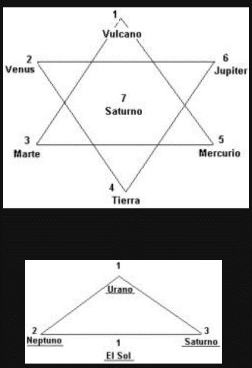

# SEGUNDA PARTE

# SECCIÓN B

# MANAS COMO FACTOR CÓSMICO, HUMANO Y DEL SISTEMA

<pin lang="es">294</pin> <pin lang="en">342</pin>

1. IEL ORIGEN DE MANAS O MENTE
   1. Manas Cósmico.
      1. El proceso de la individualización.
      2. Método para la iniciación.
   2. Manas Planetario.
      1. Conciencia y existencia.
      2. Voluntad y propósito ordenado.
   3. Manas Humano.
      1. El hombre y el Logos planetario.
      2. El Logos del esquema terrestre.
      3. Venus y la cadena terrestre.
   4. Manas y La Cadena Terrestre.
      1. La cadena terrestre y las mónadas encarnantes.
      2. El cuarto reino y la Jerarquía planetaria.
      3. Una profecía.
      4. Resumen.
2. II. LA POSICIÓN DE MANAS
   1. Manas y el karma.
   2. Manas y el propósito kármico.
3. III. LA ACTUAL ETAPA DE DESARROLLO MANÁSICO
   1. En los planetas.
   2. En el sistema.
   3. En la Tierra. <pin lang="en">343</pin>
4. IV. EL FUTURO DE MANAS
   1. Las Características de Manas o Mente.
      1. Discriminación
      2. Actividad ordenada.
      3. Adaptabilidad. <pin lang="es">295</pin>
   2. Desarrollo de la Mente Humana.
      1. Los efectos de los rayos.
      2. Los animales, los hombres y los rayos.
      3. Tipos de karma.
   3. Manas en las Rondas Finales.
      1. El proceso transmutador.
      2. Síntesis.

## I. EL ORIGEN DE MANAS O MENTE

Ahora nos ocuparemos (tomando los tres factores mencionados anteriormente) del fuego de la mente en conexión con un Logos solar. Se ha dicho que el Hombre celestial había desarrollado la mente: por consiguiente, se puede decir respecto al Logos solar, que Su principal característica es la mente cósmica o quinto Principio, perfeccionado por Este en un sistema anterior. Por lo tanto entraremos a considerar la primera subdivisión:

### 1. Manas Cósmico.

¿De dónde proviene dicho fuego? ¿Dónde se origina este calor vital o actividad vibratoria, característica que predomina en todos los Seres concebibles? ¿Hasta dónde podemos retroceder en el pasado? ¿Podremos concebir su origen? ¿Qué es este afluyente fuego, que anima la oscuridad de la materia?

a. **El proceso de la Individualización**. Quizás sea una ayuda considerar la INDIVIDUALIZACIÓN o el proceso de autorrealización inteligente <pin lang="en">345</pin> que, en forma tan notable, diferencia al hombre del animal. En el momento de la individualización los dos polos se aproximan, y al encontrarse fluye la luz, irradiando en la caverna de la materia e iluminando el camino que el Peregrino ha de seguir cuando retorna a su fuente de origen. En lo que respecta al hombre, dicha irradiación produce:

1. Autorrealización
2. Propósito
3. Separación de los demás yoes individualizados o esferas
4. Conciencia, ante todo
5. Capacidad para evolucionar
6. Capacidad para “brillar cada vez más hasta que el día sea perfecto”

Lo que antecede también es verdad para el Logos solar y para el Hombre celestial.

 

La individualización es, literalmente, la unión (en la oscuridad de la abstracción) de los dos factores, Espíritu y materia, por medio <pin lang="es">296</pin> <pin lang="es">297</pin> de un tercer factor, la voluntad inteligente, el propósito o acción de una Entidad. Gracias a la aproximación de esos dos polos se produce la luz, surge una llama y se percibe una esfera de gloria radiante, cuya intensidad de Luz, calor e irradiación aumentan gradualmente hasta llegar a su máxima capacidad o a aquello que llamamos perfección. Se ha de observar que luz, calor e irradiación, caracterizan a todos los entes individualizados, desde los dioses hasta los hombres.

El Hombre comienza parcialmente a descifrar el enigma de este fenómeno gracias a su capacidad de producir, mediante el conocimiento científico, lo que se llama luz eléctrica, utilizada para iluminar, calentar y curar. A medida que los investigadores del plano físico hagan más descubrimientos sobre esta materia, se irá esclareciendo la cuestión de la existencia y de la actividad creadora.

Referente al origen del fuego de la mente algo <pin lang="en">346</pin> más puede aprenderse estudiando los diversos métodos de individualización En relación con el hombre, por lo que sabemos, dichos métodos son tres, aunque probablemente haya otros inconcebibles para la comprensión finita del hombre. Estos son:

Primero. El método aplicado durante la cadena lunar (manifestación planetaria anterior a la nuestra), cuando, por medio de la fuerza y la energía innatas, se produjo la conjunción de los tres fuegos, entonces el fuego de la materia estableció contacto con el del Espíritu gracias a la presencia latente de la chispa ígnea de la mente. Esta chispa de la mente, actuando por el instinto, impulsó a la forma material o sustancia, a tal actividad que pudo elevarse hasta hacer contacto con su polo opuesto. Entonces el hombre animal llegó a sentir aspiración; el Espíritu respondió; la vibración del germen de la mentalidad, como levadura, había compenetrado la sustancia. Así se despertó la conciencia. Tal fue el método empleado por los Hombres celestiales en el sistema solar anterior, y estos avanzados Seres cósmicos adquirieron conciencia y dominaron los tres planos inferiores del físico cósmico -los mismos planos que el hombre está tratando de dominar ahora. Se individualizaron como resultado del trabajo efectuado durante inconcebibles eones de esfuerzo. [^1] El sistema solar actual será de menor duración que el anterior, pues en él se generó la fuerza de la materia por la progresión de las épocas, periodo en que se produjo la vitalización de las espirillas del átomo físico permanente del Logos.

En este método de individualización se recalca el hecho de <pin lang="es">298</pin> que el principio manas forma parte del carácter logoico y de Su naturaleza. Por lo tanto, se origina en su Ser o Yo; forma <pin lang="en">347</pin> parte del contenido del Cuerpo causal logoico, en consecuencia, compenetra toda manifestación que se origina en Él. He aquí la veracidad de la afirmación de que el manas cósmico tiene su origen en el plano mental cósmico y es parte del fuego que anima a ese plano.

Segundo. En el segundo sistema solar y en conexión con el método empleado, otro punto merece nuestra atención. El fuego de la mente se origina en una constelación que hasta hace poco la ciencia exotérica no le adjudicaba una íntima relación con nuestro sistema solar, debido a su enorme distancia. El sol “Sirio” es la fuente de origen del manas logoico, así como las Pléyades están vinculadas a la evolución de manas de los siete Hombres celestiales y Venus fue responsable de que se implantara la mente en la cadena terrestre. Cada uno constituyó el primario del otro o el agente que produjo el primer destello de conciencia en los determinados grupos implicados. En todos los casos el lento crecimiento evolutivo fue el método empleado, hasta que repentinamente resplandeció la conciencia en virtud de la interposición de la fuerza proveniente de una fuente extraña:

|                              |                    |          |
| ---------------------------- | ------------------ | -------- |
| 1. Logos                     | Sistema solar      | Sirio.   |
| 2. Siete Hombres celestiales | Esquema planetario | Pléyades |
| 3. Hombre celestial          | Cadena terrestre   | Venus.   |

Por lo tanto, el segundo método se lleva a cabo acelerando el proceso evolutivo por medio de influencias externas que tienden a despertar la conciencia y a unir los polos. El primer método, ya mencionado, fue empleado en el sistema solar anterior. El método que consideramos ahora caracteriza a este sistema solar y persistirá hasta que finalice el Mahamanvantara.

El solo hecho de que el primer método se llevara a cabo en la cadena lunar evidencia la inmutabilidad de la Ley de Repetición, de acuerdo con la cual todo ciclo mayor incluye, en sus primeras <pin lang="en">348</pin> etapas, a todos los menores, repitiendo los procesos anteriores. Por ejemplo, éste es un hecho conocido en la formación del cuerpo físico del hombre, pues en el feto se reproducen todas las etapas y formas anteriores hasta alcanzar la humana. Similarmente, como ya se sabe, la cuarta ronda reproduce brevemente las otras tres, pero posee su propia cualidad característica.

b. **Método para la Iniciación**. En este segundo método se utilizan los “Cetros de Iniciación”, para producir ciertos resultados. Estos Cetros son cuatro:

1. El Cósmico, utilizado por un Logos solar en las <pin lang="es">299</pin> iniciaciones de un Logos solar y de los tres Logos planetarios mayores.
2. El del Sistema. Utilizado por el Logos solar en las iniciaciones de un Logos planetario.
3. El Planetario. Utilizado por el Logos planetario para propósitos iniciáticos e iniciaciones mayores, la tercera, cuarta y quinta, conjuntamente con las dos superiores.
4. El Jerárquico. Utilizado por la Jerarquía oculta para iniciaciones menores y por el Bodhisattva [^2] para las dos primeras iniciaciones de manas.

La individualización del hombre en la época lemuriana (hace aproximadamente diez y ocho millones de años) fue producida por la aplicación del Cetro de Iniciación al Logos de nuestra cadena terrestre que puso en actividad ciertos centros de Su cuerpo con sus correspondientes grupos. La aplicación del Cetro, que despierta la conciencia en algún plano, puede decirse literalmente que despierta las vidas implicadas para que participen inteligentemente en el trabajo del plano mental. El hombre animal era consciente en los planos físico y astral. Debido al estimulo recibido por el Cetro eléctrico, este hombre animal despertó su conciencia en el plano mental. Así se coordinaron los tres cuerpos y el Pensador pudo actuar en ellos.

<pin lang="en">349</pin> Todos los Cetros de Iniciación producen ciertos efectos:

1. Estimulan los fuegos latentes hasta convertirlos en llama.
2. Sintetizan los fuegos, mediante una actividad oculta, poniendo a cada uno dentro del radio del otro.
3. Activan la vibración radiante de algún centro, ya sea en un hombre, en un Hombre celestial o en un Logos solar.
4. Expanden todos los cuerpos, principalmente el causal -también a los tres tipos de Entidades.

Estos resultados se observaron cuando el Hombre celestial de nuestro esquema recibió la iniciación hace diez y ocho millones de años. Dicha iniciación resultó, como ya se dijo, en virtud de una yuxtaposición peculiar de cadenas, globos y esquemas, la cual estimuló de tal manera a todas las unidades manásicas de Su cuerpo que posibilitó el descenso de manas puro, a través del antakarana planetario, procedente del átomo manásico permanente planetario -este canal existe en lo que respecta al Logos planetario, y tendrá que construirse como en el caso del hombre. Conjuntamente con la <pin lang="es">300</pin> yuxtaposición mencionada, se produjo un alineamiento similar con una de las Pléyades, permitiendo la influencia manásica desde esa fuente. [^3] [^4]

Tercero. El tercer método de individualización se adoptará en el próximo sistema solar, aunque se iniciará tenuemente en el actual. No se funda en la actividad latente como en el primer caso, ni en la polaridad eléctrica como en el segundo, sino en un proceso peculiar de “abstracción oculta” (dando a la palabra “abstracción” el significado de “extraer” de la esencia). Esta abstracción oculta se produce por un esfuerzo de la voluntad, incomprensible actualmente. El primer método de individualización <pin lang="en">350</pin> corresponde al tercer aspecto o actividad latente, y sigue la línea de menor resistencia bajo la Ley de Economía; el segundo método es puramente eléctrico y actúa bajo la Ley de Atracción; el tercer método, se halla oculto en la voluntad dinámica y es todavía algo imposible e incomprensible.

### 2. Manas Planetario.

En lo que antecede hemos tratado de comprender algo sobre el origen de manas, ya sea cósmico o de cualquier otro tipo, al considerar la individualización humana y los métodos empleados. Vimos que la individualización es la comprensión consciente, por parte del Yo, de su relación con todo cuanto constituye el no-yo, evocado de tres maneras, de las cuales sólo dos son vagamente comprensibles. En cada caso este despertar de la conciencia va precedido de un período de gradual desenvolvimiento, siendo instantáneo en el momento de la Autorrealización, al cual le sigue otro período de gradual evolución. Este último periodo lleva a otra crisis denominada iniciación. En un caso, se inicia en la existencia consciente, en el otro, en la existencia espiritual o identificación grupal.

Para un Logos solar, la individualización se remonta a etapas muy anteriores a la triplicidad de los sistemas solares que constituye para este el Eterno Ahora, pero, desde el punto de vista del hombre, contiene el pasado, el presente y el futuro. Un Logos planetario se individualizó en un sistema anterior; el hombre se individualiza en el actual sistema; las entidades planetarias que se encuentran ahora en el arco de involución se individualizarán en el siguiente. <pin lang="es">301</pin>

a. **Conciencia y Existencia.** Desde un punto de vista más amplio los términos iniciación e individualización son sinónimos: ambos expresan la idea de expansión de conciencia, o la entrada en un nuevo reino de la naturaleza. La facultad de adquirir conocimiento <pin lang="en">351</pin> se ha de interpretar como paralela al desenvolvimiento del sentido de la vista o visión, como ya se indicó. El fuego de la mente brilló e iluminó al hombre animal en la época lemuriana. Durante ese vasto ciclo en que el sentido de la vista le abrió el plano físico. La relación que existe entre vista y mente es muy estrecha y siempre debe ser recordada. En la primera ronda y en su primera raza raíz se desarrolló el sentido del oído; en la segunda ronda y en la segunda raza raíz el sentido del tacto; en la tercera ronda y en la correspondiente raza raíz el sentido de la vista se agregó a los otros dos. Así se relacionan y vinculan por medio de la vista el Yo que oye, y el no-yo que se toca o es tangible -analogía de la inteligencia que vincula. De esta manera, se produce la fusión de los tres fuegos y tenemos la iluminación. Pero a través de todo este desarrollo evolutivo, el UNO que oye, toca y ve, persiste e interpreta de acuerdo al grado de evolución que ha alcanzado el principio manásico en Él. Este Interprete básico es esa Entidad que no depende de una existencia que necesita siempre de la forma. Suya es la vida que hace vibrar a la materia, por consiguiente, es “fuego por fricción”. Suya es la vida del Espíritu puro que quiere ser y utiliza una forma, siendo en consecuencia el impulso eléctrico del plano físico cósmico o “fuego eléctrico”. Suya es la vida que no sólo anima a los átomos y los electrifica con Su propia naturaleza, sino que, igualmente, se conoce como uno con todo y no obstante separado de todo -ese algo que piensa, discrimina y es autoconsciente, denominado MENTE o Fuego solar. Mente o manas universal compenetra todo; es también esa Entidad individualizada, conocedora de Sí misma, Cuyo cuerpo contiene a nuestro Logos solar y también a otros Logos solares; Cuyo fuego, calor y radiación abarcan otros sistemas solares y los unifica con el nuestro de manera que un solo cuerpo vital constituye la manifestación de este poderoso Ser cósmico. <pin lang="en">352</pin> Vórtices de fuerza en el plano etérico cósmico constituyen la estructura etérica de siete sistemas solares así como los cuerpos de los siete Hombres celestiales constituyen los centros etéricos de un Logos solar y los siete centros del hombre (existentes en materia etérica), son el impulso eléctrico animador de su vida.

Resulta imposible expresar el origen de manas como separado de la manifestación de un conglomerado de sistemas, de un sistema solar o de un hombre. Sólo a medida que se capte el hecho de que cada esquema planetario, sirve por ejemplo de cuerpo a un <pin lang="es">302</pin> Hombre celestial, mente rectora de ese esquema y principio animador manásico o facultad activa discriminadora evidenciada en todo átomo de ese esquema; sólo cuando se comprenda que un Logos solar constituye similarmente el principio manásico de la totalidad de esos grandes átomos que denominamos esquema; sólo cuando se comprenda que un Logos cósmico es también la mente instigadora de átomos aún mayores que denominamos sistemas; sólo cuando se acepte que el hombre es la facultad discriminadora animante de las minúsculas esferas que forman su cuerpo de manifestación y, por último, sólo cuando se reflexione sobre todo esto y se acepte la verdad, entonces esta cuestión sobre el origen de manas asumirá un carácter menos abstruso, y la dificultad de comprenderlas se disipará en parte.

El Hombre, el Pensador, el Conocedor, el principio manásico que se halla en el centro de las diversas esferas que forman sus cuerpos, manipula fuerza eléctrica en tres sectores (sus cuerpos físico, astral y mental) por medio de siete centros que son puntos focales de fuerza, y la distribuye inteligentemente a través de su pequeño sistema a millares de átomos menores, células de tales esferas.

El Hombre celestial, que también en sentido más amplio es el Pensador, el Conocedor, el principio manásico y mental, además del principio búdico o crístico, manipula fuerza eléctrica por medio de tres vehículos o globos principales en materia átmica, búdica y manásica, y la distribuye <pin lang="en">353</pin> a millares de células, que corresponden a los entes humanos y dévicos.

EL Logos solar, en un sentido aún más amplio, es la Mente universal compenetrante, el principio manásico, además del principio búdico y el de la voluntad, que actúa en tres esquemas mayores por medio de siete centros de fuerza y a través de millares de grupos que constituyen las células de Su cuerpo, así como los seres humanos son las células del cuerpo de un Hombre celestial.

El Logos cósmico de nuestro sistema actúa, similarmente, por medio de tres sistemas mayores (de los cuales el nuestro no es uno de ellos), utilizando siete sistemas solares (de los cuales el nuestro es uno de ellos) para distribuir Su fuerza y teniendo como células de Su cuerpo millares de grupos séptuples.

b. Voluntad y propósito ordenado. Todo lo que podemos realmente decir, respecto al origen de manas, es que constituye la actividad unificada de la voluntad, o la expresión intencionada de la conocida Identidad de algún gran Ser que cobra la vida y hace que todos los entes menores, incluidos en Su esfera de influencia, colaboren inteligentemente. Cada uno de nosotros, por ejemplo, <pin lang="es">303</pin> es la Entidad pensante e intencionada que actúa como principio manásico, y el resorte de acción para todas las unidades comprendidas en nuestros tres cuerpos. Cada uno de nosotros las doblega a voluntad; actuamos y, al actuar, las obligamos a colaborar como creemos conveniente. El Logos hace lo mismo en escala mucho mayor. Esta idea proyecta luz sobre la cuestión del karma, del libre albedrío y de la responsabilidad. *Manas es, realmente, VOLUNTAD actuando en el plano físico; la verdad de esto se comprenderá cuando nos demos cuenta que todos nuestros planos componen el plano físico cósmico, donde una Entidad -inconcebiblemente más grande que nuestro Logos- por medio del Logos, de nosotros y de toda sustancia espiritual incluida en su esfera de actividad irradiante, está desarrollando un propósito ya establecido*.

:::note Recuerda

**Manas es, realmente, VOLUNTAD actuando en el plano físico**; la verdad de esto se comprenderá cuando nos demos cuenta que todos nuestros planos componen el plano físico cósmico, donde una Entidad -inconcebiblemente más grande que nuestro Logos- por medio del Logos, de nosotros y de toda sustancia espiritual incluida en su esfera de actividad irradiante, está desarrollando un propósito ya establecido

:::

Sólo algunos problemas de verdadero interés se presentarán en nuestra mente, que servirán para desarrollar el pensamiento abstracto <pin lang="en">354</pin> y expandir la conciencia, pues aún son insolubles y continuarán siéndolo. Algunos podrían enumerarse de la manera siguiente:

1. ¿Quién es la Entidad cósmica en Cuyo esquema nuestro Logos desempeña Su pequeña parte?
2. ¿Cuál es la naturaleza del gran propósito que desarrolla?
3. ¿Qué centro de Su cuerpo representa a nuestro sistema solar?
4. ¿De qué naturaleza es la encarnación en la que se encuentra Él ahora?
5. ¿Cuáles son los diez sistemas -los tres y los siete- de los cuales nuestro sistema solar es uno? ¿Hemos de buscar los tres mayores entre los siete, o fuera de éstos?
6. ¿Cuál es la coloración o cualidad fundamental de esta Entidad cósmica?
7. Para que pueda corresponder con nuestro cuarto éter físico ¿es azul o violeta la coloración del cuarto éter cósmico (el plano búdico)? ¿Por qué se considera exotéricamente a budi de color amarillo?
8. ¿Cuáles son los tres centros primarios en el cuerpo de nuestro Logos solar, y cuáles los cuatro secundarios?
9. ¿Cuál es el karma de los diferentes esquemas?
10. ¿Cuál es el karma desequilibrador del Logos Mismo que afecta a los diez esquemas de Su sistema?

Todas estas preguntas y muchas más surgirán en la mente del estudiante interesado, pero sólo podrá formulárselas y nada más, aunque en la quinta ronda, los hombres comprenderán la naturaleza kármica del Logos de nuestra cadena. Las palabras, como se ha dicho repetidas veces, ciegan y confunden.

<pin lang="es">304</pin> Resumiendo, la cualidad manásica será comprendida, hasta cierto punto, si el estudiante la considera como voluntad <pin lang="en">355</pin> inteligente, propósito activo o idea fija de alguna Entidad que produce la existencia utiliza la forma y desarrolla los efectos de las causas mediante la discriminación de la materia, separándola y construyéndola en una forma, e impulsando a todos los entes dentro de Su esfera de influencia, a cumplir ese propósito establecido con respecto a la materia de sus vehículos, el hombre es la fuente que origina la mente y el impulso manásico latente en los mismos. Así también sucede con el Hombre celestial en Su esfera mayor de influencia, y además con el Logos solar. Cada uno discriminó y formó su “círculo no se pasa”; cada uno tenía un propósito determinado para cada encarnación; cada uno continúa activamente y trabaja inteligentemente para fines determinados, y cada uno es el originador de manas en su esquema; cada uno es el fuego que anima la inteligencia de su sistema; cada uno, por medio del principio manásico, se individualiza y expande gradualmente esta autorrealización, hasta que incluye el “círculo no se pasa” de la Entidad mediante la cual le llega el quinto principio; cada uno alcanza la iniciación y, con el tiempo, evade la forma.

### 3. Manas Humano.

Ahora encararemos especialmente al hombre y al principio manásico, su desarrollo en la cuarta Jerarquía creadora, las Mónadas humanas, refiriéndonos principalmente a nuestra cadena terrestre.

Hemos visto que para toda idea y propósito manas constituye la voluntad activa de una Entidad que se desarrolla por medio de todas las vidas menores contenidas dentro del “círculo no se pasa” o esfera de influencia de la Existencia inmanente. Por lo tanto -en lo que concierne al hombre de esta cadena- sólo expresa el propósito y la voluntad activa del Logos planetario, de cuyo cuerpo es una célula o vida menor.

En consecuencia se presentan a nuestra consideración ciertos enigmas relacionados con los ciclos de vida del Hombre celestial de nuestro esquema, y especialmente con Su encarnación particular, el denominado ciclo <pin lang="en">356</pin> de manifestación en el globo físico denso, la Tierra. Utiliza el cuerpo planetario, así como el hombre emplea como vestidura el cuerpo físico; por medio de esta forma objetiva desarrolla Sus propósitos en el plano físico y por medio de la mente logra ciertas metas. Incidentalmente las células de Su cuerpo se adaptan a la mente que actúa sobre ellas; de la misma manera que en el hombre, el principio inteligente de la encarnación en el plano físico, hace que los átomos de su cuerpo se adapten a su <pin lang="es">305</pin> propósito, y estimula cada vez más las espirillas de tales átomos aplicando sobre ellos la fuerza de su mente.

Aquí se presenta la oportunidad de aclarar algo que frecuentemente se pierde de vista en la nebulosidad general que rodea a este tema. Los entes humanos y dévicos que se hallan en el arco ascendente, son las células de Su cuerpo que forman los centros, y no el resto de la sustancia vital celular de Sus vehículos. El hombre posee un cuerpo compuesto de materia aplicable a diversos usos, sin embargo, constituye una unidad. En ella existen zonas de mayor importancia que otras, desde el punto de vista de la fuerza energetizadora. Tales zonas, como la del corazón por ejemplo, puede ser considerada y comparada en este sentido de acuerdo a su fuerza, con una zona como la de la pantorrilla. El ente hombre utiliza ambas, pero la del corazón es de mayor importancia. Lo mismo ocurre con el Hombre celestial. Las dos grandes Jerarquías, dévica y humana, constituyen centros de fuerza en el cuerpo del Logos planetario: las otras evoluciones de naturaleza involutiva que existen en el esquema, y el resto de la sustancia activa de los globos y todo lo que ellos contienen, forman el contenido del resto de Su cuerpo.

a. **El hombre y el Logos planetario**. Nada tenemos que hacer con la evolución dévica. Sólo trato de concentrar la atención sobre el hombre, a medida que actúa en la tierra. A fin de que resulte más clara la idea de manas y su relación con el ser humano, es necesario señalar ciertas cosas, <pin lang="en">357</pin> relacionadas con el Hombre celestial, que deben tenerse presentes.

*Primero*, cada Hombre celestial ocupa el lugar de un centro en el cuerpo de un Logos solar por lo tanto, el Logos de un esquema personificará alguna característica sobresaliente. Los diez esquemas constituyen los siete y los tres sintetizadores -no los siete y los tres inferiores. Los centros inferiores fueron vitales en el último sistema solar (desde el punto de vista esotérico) y no se cuentan en el actual: fueron sintetizados y absorbidos durante el proceso de oscuración del Primer sistema.

*Segundo*, cada Hombre celestial es, en consecuencia, la personificación de un tipo especial de fuerza eléctrica, que fluye por Su esquema como la fuerza del hombre fluye a través de uno de los centros etéricos de su cuerpo. Cada esquema, así como cada centro humano

1. vibrará a cierto tono;
2. tendrá su propio color;
3. se asemejará, visto desde los planos superiores, a un inmenso loto; <pin lang="es">306</pin>
4. poseerá, según su capacidad vibratoria, un número determinado de pétalos;
5. estará conectado, en formación geométrica, con otros centros de los Hombres celestiales, formando los triángulos [^5] del sistema; y
6. estará caracterizado por diferentes etapas de actividad de acuerdo a la Iniciación que el Logos trata de obtener. Así en un período dado, un centro u Hombre celestial, será objeto de la atención y del estímulo especial logoico y, otro periodo, un esquema totalmente distinto podrá ser objeto de vitalización. Ya hace tiempo que el Logos ha dirigido Su atención al Esquema de la Tierra y a Saturno mientras que Urano recibe <pin lang="en">358</pin> estímulo. De esta manera algunas tendencia son acentuadas, y como consecuencia esta atención divina se acrecienta el desarrollo evolutivo.

Si se tienen en cuenta estos hechos, se observará que la interacción y la complejidad son de vastas proporciones y el hombre sólo puede aceptarlas, dejando la explicación para cuando su conciencia tenga mayor alcance.

Tercero, uno de los misterios revelados en la iniciación es del centro logoico que nuestro esquema representa y el tipo o fuego eléctrico que fluye a través de él. Los “Siete Hermanos, los siete tipos de fuerza fohática, se expresan por medio de siete centros, y Aquel que anima nuestro esquema es revelado en la tercera iniciación. Gracias al conocimiento de la naturaleza y calidad de la fuerza eléctrica de nuestro centro y a la comprensión del lugar que nuestro centro ocupa en el cuerpo logoico, la Jerarquía logra los objetivos de la evolución. Se evidenciará que Hombre celestial, que representa al centro kundalínico por ejemplo, trabajará en forma diferente y tendrá un propósito y método distintos al de Su Hermano que representa al centro cardíaco en el cuerpo logoico, o al del Hombre celestial que personifica el plexo solar logoico. De esto se deduce que

1. el tipo de fuerza eléctrica,
2. la acción vibratoria,
3. el propósito,
4. el desarrollo evolutivo,
5. la doble y triangular interacción

de los Hombres celestiales diferirán, así como también las evoluciones que forman las células de Sus cuerpos. Poco se ha revelado <pin lang="es">307</pin> acerca de los tipos de evolución que existen en otros esquemas de nuestro sistema. Basta decir que en algún <pin lang="en">359</pin> globo de cada esquema y en todos los esquemas existen seres humanos o entes autoconscientes. Las condiciones de vida, el medio ambiente y la forma son distintas, pero la Jerarquía humana actúa en todos los esquemas.

Se ha de recordar también que, así como los siete Hombres Celestiales se encuentran en el cuerpo logoico, y están bajo la influencia de los siete Logos solares (usando la palabra “influencia” en sentido astrológico), también en un esquema planetario con sus siete globos, cada uno está, astrológicamente, bajo la influencia de los siete Hombres celestiales. Un esquema no es más que la réplica de un sistema. Cada uno de los Hombres celestiales emite su radiación o influencia y estimula, de igual manera, a otro centro o globo. En otras palabras, Su magnetismo es sentido por Sus Hermanos, en grado mayor o menor, según la tarea emprendida en determinado tiempo. Actualmente, en los Hombres celestiales que presentan centros de distintos grados de estimulación y no están equilibradamente desarrollados ni síquicamente unificados, esta interacción magnética es muy poco comprendida, y la afluencia psíquica de un esquema a otro también es muy poco empleada y comprendida. A medida que transcurra el tiempo esta interacción de fuerzas se hará más evidente y se utilizará conscientemente. Cuando los hombres conozcan, por ejemplo,

1. la cualidad de la fuerza que fluye por su esquema particular;
2. el propósito y el nombre del centro dentro del cual se encuentran
3. el centro u Hombre celestial con quien el Logos de su esquema está vinculado;
4. cuales son los dos esquemas, que con el propio, forman un triángulo de fuerza logoica en determinada etapa de desarrollo evolutivo
5. el secreto de los ciclos o los períodos de estímulo u oscuración, entonces el cuerpo logoico empezará a lograr su propósito, <pin lang="en">360</pin> el Logos de nuestro sistema comenzará a mezclar, fusionar y coordinar todos Sus vehículos, fluirá la fuerza por todos los centros, sin entorpecimientos, la gloria resplandecerá, y cada célula de todo cuerpo: logoico, planetario, dévico y humano, brillará con resplandor perfecto, vibrará con ajustada exactitud y recibirá una iniciación cósmica mayor.

b. **El Logos del esquema terrestre**. Podemos considerar al Hombre celestial o Logos planetario del esquema terrestre, de diversas maneras. Siguiendo nuestra costumbre clasificaremos <pin lang="es">308</pin> sencillamente las afirmaciones hechas respecto al mismo, y al ser consideradas extensamente por el estudiante individual deberán servir para que la REALIDAD de la Personalidad esencial de esa gran Entidad, el trabajo que trata de realizar, la relación que tiene y la Jerarquía humana, sean una realidad mayor. Al estudiar este tema debemos tener presente que no es posible revelar al público detalles respecto a Su Identidad específica, a Su número y al alcance de Su desenvolvimiento consciente. Tales misterios, como ya se ha indicado, se reservan para ser revelados a quienes se han comprometido a guardar silencio. Pero puede transmitirse una idea general antes de que tratemos específicamente de la cadena y de la ronda actuales.

Aquí cabría preguntar, ¿Qué utilidad y finalidad tiene esta información en esta hora de necesidad mundial? Aparte de que la transmisión cíclica de la verdad se hace bajo la ley, y no puede ser negada, se sugiere que cuando un gran número de hombres conciban el propósito de las manifestaciones específicas, cuando comprendan que todas las formas son modos de expresión de ciertas Entidades o Seres que las ocupan durante ciclos de duración determinada, con el objeto de obtener el propósito de que cada vida, grande o pequeña, sirve sus propios fines y a la vez contribuye a los fines más amplios del Ser de Cuyo cuerpo es parte integrante, mucho se habrá logrado. Los detalles del plan no pueden ser revelados. <pin lang="en">361</pin> Se puede sugerir el delineamiento general, solar, planetario y jerárquico y, gracias a esta sugerencia, poner en orden los pensamientos de los hombres al contemplar el aparente caos actual. No olvidemos que cuando se establece el orden y se logra también un pensamiento unido en el plano mental, entonces se manifiesta oportunamente el orden en el plano físico.

El Logos planetario de este esquema es uno de los cuatro Logos o Señores de los Rayos menores; por consiguiente, se ocupa en desarrollar especialmente uno de los atributos de manas. Cada uno de los cuatro Rayos menores, como ya sabemos, con el tiempo se sintetiza en, o es absorbido por, ese Rayo que se halla representado en nuestra tierra por el Mahachoan. Es el Señor del tercer Rayo o Aspecto mayor, y sintetiza a los cuatro. Estos cuatro Rayos, con su Rayo sintetizador. constituyen los cincos rayos de Manas o Mente. Podemos considerarlos como:

1. El quíntuple Aspecto de Brahma.
2. Los cinco Rayos de primordial importancia en el primer sistema solar, y los cinco Hombres celestiales individualizados, llamados los Hijos nacidos de la Mente de Brahma. Mediante la individualización de los cuatro, en dicho sistema, se produjo la individualización de la gran Entidad <pin lang="es">309</pin> cósmica denominada Brahma. Al individualizarse, contuvo a los cuatro en su cuerpo.
3. Están representados en nuestra tierra por los cinco Kumaras, quienes, en obediencia a la Ley, tomaron forma humana; H. B. P. [^6] lo indica en varios párrafos de La Doctrina Secreta.

Este esquema está considerado como el cuarto y más importante del sistema, durante este ciclo particular, por las siguientes razones

Considerados nuestro sistema solar como de cuarto <pin lang="en">362</pin> orden y nuestro esquema el cuarto, proporcionan, en consecuencia, un momento de oportunidad especial a nuestro Logos planetario en virtud del alineamiento producido. Ello da por resultado que la atención del fuego del kundalini logoico se dirija hacia este centro, nuestro esquema, con los resultados consiguientes en proceso de desarrollo.

La cadena terrestre, cuarta en el orden dentro del esquema, la que más nos concierne y temporariamente es de mayor importancia vital para el Logos planetario, produce así otro alineamiento de gran importancia. Esto ofrece especial oportunidad, y permite la entrada de fuerza o vitalidad eléctrica proveniente de fuerza del sistema o del Cosmos mismo. Este sobre estímulo da por resultado los aparentes cataclismos y la tremenda destrucción de formas; siendo simplemente la necesaria consecuencia de la vitalización de la vida en la forma y el quebrantamiento de la forma limitadora, incapaz de soportar la acción cósmica.

Así también el globo que dentro de la cadena recibe, en el presente, polarización planetaria, o que en la actualidad personifica en sentido especial la vida del Logos planetario, es la Tierra, cuarta en orden. Esto produce otro alineamiento más.

Agréguese a los hechos mencionados, el conocimiento aceptado de que ésta es la cuarta ronda y tendremos un quinto alineamiento, lo cual es de suprema importancia para todos nosotros; no obstante, tuvo aún mayor significación y fuerza en la cuarta raza raíz y produjo ese estupendo acontecimiento síquico, abrir la puerta de la Iniciación para la Jerarquía humana.

Hechos tan importantes merecen la cuidadosa atención y consideración de todos los estudiantes ocultistas. Contienen la clave mediante la cual podrá obtenerse alguna comprensión respecto a manas y a la evolución planetaria. ¿Qué tenemos, por lo tanto, en este alineamiento especial cíclico? <pin lang="en">363</pin>

1. Un sistema solar de cuarto orden.
2. El cuarto esquema del sistema. <pin lang="es">310</pin>
3. La cuarta cadena del esquema.
4. El cuarto globo de la cadena.
5. La cuarta ronda. [^7]

Todos ellos están activos en el mismo ciclo y, por consiguiente, traen un alineamiento simultáneo, cuyo resultado será abrir un canal directo desde el corazón de nuestro esquema, a través de cada “círculo no se pasa”, hasta la analogía cósmica, que se halla fuera de la esfera solar.

Al conocimiento anterior debemos agregar otro hecho más, y es que estamos considerando la evolución de la cuarta Jerarquía creadora, y será evidente, aún para el estudiante más superficial que en dichos conceptos se oculta la clave, no sólo respecto al enigma del hombre, sino también de toda evolución cíclica en la que toma parte.

La cuarta Jerarquía creadora es, esencialmente, la Jerarquía de manas. Éste no es un juego de palabras, sino una afirmación de profundo significado oculto. Se ha hecho la afirmación, con toda veracidad, de que cinco de las doce Jerarquías han desaparecido y quedan siete. De estas siete, nuestra Jerarquía humana es la cuarta; lo cual hace que ésta sea la novena dentro de las doce. A este respecto es bueno vincular las afirmaciones hechas en el sentido de que los cinco Kumaras u Hombres celestiales, que definidamente personifican el principio manásico (o los cinco rayos presididos por la analogía del Mahachoan en el sistema), desarrollaron <pin lang="en">364</pin> manas en un sistema anterior; desapareciendo en la oleada de influencia manásica concerniente a Su propia naturaleza.

Se ha de recordar también que nueve es el número de la Iniciación o de las Iniciaciones mayores de Manas, donde el hombre llega a ser un Nueve perfecto o el número de su Jerarquía. Esto ocurre desde el punto de vista de los tres sistemas, aunque el cuatro podría ser su número actual en el sistema.

Al ocuparnos de las diversas afirmaciones respecto a nuestro esquema y su Regente, hemos visto que en este ciclo particular, <pin lang="es">311</pin> Su encarnación, es de gran importancia no sólo para Él sino también para todo el sistema. El Logos planetario de este esquema se ocupa principalmente de un grupo particular de entes o esas Mónadas que vibran de acuerdo a Su nota, están coloreadas por Su mismo color, responden al mismo número y son conocidas esotéricamente por Su mismo nombre. Es necesario aquí hacer resaltar un punto: todas las Mónadas, en distintos períodos, son influenciadas por los diferentes Logos planetarios y, en determinado momento, todas pasarán por cada esquema. Esto no significa que todos los entes humanos pasen un periodo de encarnación en cada esquema, sino que en algún globo de cada esquema habrá entes humanos, ya sea antes de encarnar físicamente, entre distintos ciclos egoicos y (cosa totalmente distinta a los períodos existentes entre las vidas físicas) diferentes rondas o manvantaras o entre diversas razas raíces y subrazas. Según se expresa en varios libros ocultistas, la mayoría de la actual humanidad avanzada se individualizó en la cadena lunar, y sólo tomó cuerpo físico en la cadena terrestre durante la cuarta raza raíz, evadiendo así la encarnación durante las tres primeras rondas y las dos primeras razas de la cuarta ronda. Mientras tanto quedaron bajo la influencia planetaria de un Logos de otro esquema, y durante un inmenso período se ocuparon de vivificar la llama manásica y de desarrollar <pin lang="en">365</pin> los atributos de manas; la raza raíz atlante los encontró adecuadamente equipados para hacer frente a las condiciones de la vida.

Esta participación en la vida e influencia de los diferentes esquemas se efectúa de cuatro maneras distintas:

Primero, pasando el intervalo que media entre ciclo egoicos de encarnación física, en un determinado globo de su esquema que numéricamente coincide con el otro esquema particular cuya influencia se desea, ya sea por decisión deliberada o necesidad kármica. Cada globo de una cadena está ocultamente vinculado con la cadena de su mismo número y con el esquema de número similar. Por ejemplo: globo 2, cadena 2 y esquema 2, durante la ronda 2, están vinculados y vitalizados especialmente, y son el punto focal de atención peculiar de parte del Logos de ese esquema. Similarmente (también como ilustración) el globo 2, la cadena 2, durante la ronda 2 de cualquier esquema, tal como el quinto, por ejemplo, están alineados o conectados esotéricamente con el segundo esquema. Esto ofrece la oportunidad a los entes del cuerpo de cualquier Logos. de ponerse bajo la influencia de otros Logos y dentro de su radiación vibratoria.

Segundo, mediante la transferencia directa a algún globo de otro esquema de los entes encarnados de cualquier esquema en el que estarán sometidos (durante un intervalo) al estímulo y a la <pin lang="es">312</pin> vibración peculiares de ese esquema. Ambos métodos son los más comunes. Esta transferencia parecerá misteriosamente imposible, salvo que el estudiante procure darse cuenta que se trata de la transferencia de las vidas individualizadas y no de la transferencia de las formas que ellas ocupan. Toda la cuestión es síquica, y se funda en la unidad del Ánima Mundi. Esto sólo es posible durante esos períodos en que dos Hombres celestiales se unen bajo la Ley de Atracción, entrando así cada uno en el radio magnético del otro.

Tercero, cuando el Iniciado pasa conscientemente <pin lang="en">366</pin> la iniciación, de un esquema a otro. Esto sucede frecuentemente; distintos escritores y pensadores lo han insinuado, aunque algunos han confundido los globos de su propia cadena con el esquema del mismo número, o han confundido otra cadena del esquema, por otro esquema.

Cuarto, aplicando el método de transferir la conciencia y poner los entes bajo el poder focal de un Señor de Rayo, lo cual se puede lograr mediante el conocimiento de ciertos mántram y fórmulas. No podemos extendernos más sobre estos mántram porque son esotéricos y su empleo implica muchos peligros para quien no es iniciado.

El Logos planetario de este período es denominado “Primer Kumara”, el Único Iniciador, y se afirma que vino de Venus a este planeta; Venus es el “primario de la Tierra”. Es necesario dar alguna explicación sobre esto, aunque sólo es permitido hacer muy pocas insinuaciones acerca de la verdad. Es una de las cosas que guarda mayor misterio acerca del desarrollo de nuestro esquema y oculta el enigma de este ciclo mundial. No es fácil expresar la verdad, porque las palabras ocultan y velan.

Quizás podría darse un indicio si decimos que existe una analogía entre la entrada en pleno auge del Ego y el dominio que ejerce durante ciertos períodos en la vida del ser humano. Se dice que a los siete años y también en la adolescencia el Ego “se afirma”, a los veintiún años ese aferramiento es cada vez mayor. Análogamente, a medida que pasan las vidas, el Ego (en relación con un ser humano) se aferra a sus vehículos y los doblega a su propósito en forma más eficaz y plena. El mismo procedimiento puede observarse en relación con el Hombre celestial y Su cuerpo de manifestación, un esquema. Se ha de recordar que cada esquema tiene siete cadenas, cada cadena siete globos, totalizando cuarenta y nueve globos; <pin lang="en">367</pin> que cada globo a su vez es ocupado por la vida del Logos durante lo que llamamos siete rondas, textualmente, trescientas cuarenta y tres encarnaciones o nuevos impulsos para manifestarse. Hemos de agregar a estas manifestaciones mayores otras menores, como las llamadas razas raíces, subrazas y ramificaciones de raza, <pin lang="es">313</pin> y nos hallamos en una complejidad capaz de confundir al estudiante medio. La rueda planetaria de la vida hace girar, en su escala menor, la rueda de la vida del pequeño peregrino denominado hombre a medida que gira, impele la vida del Logos planetario evolucionante a nuevas formas y experiencias, hasta que el fuego del Espíritu quema todos los fuegos menores.

Como se indicó anteriormente, cada Hombre celestial está vinculado con uno de Sus Hermanos bajo la Ley de Atracción Mutua, la cual todavía se manifiesta en forma muy degradada en el plano físico, por medio de la vida del ente humano aprisionada en la forma física. Síquicamente, el vínculo es de naturaleza distinta; dicho vínculo existe entre el Logos planetario del esquema denominado Venus y el Logos de nuestro esquema. Esta interacción síquica tiene su flujo y reflujo cíclicos, así como fluye y refluye toda la fuerza de la vida. En la época lemuriana hubo un periodo de íntima interacción que produjo, en el planeta físico del Logos de nuestro esquema, una encarnación, el Guía de la Jerarquía, el único Iniciador. Esto no hubiera ocurrido si el Logos planetario del esquema de Venus no hubiese estado en situación de vincularse íntimamente con el nuestro.

c. Venus y la cadena terrestre. La cuestión de la llegada de los Señores de la Llama al planeta Tierra está profundamente involucrada, como ya se dijo, en la relación existente entre el Hombre celestial del esquema terrestre y el Señor del esquema venusiano. Mientras no se permita publicar información más detallada acerca de estas dos grandes Entidades, poco puede hacerse, aparte de indicar algunas probabilidades y señalar ciertos factores que los estudiantes deberán recordar. Se ha afirmado <pin lang="en">368</pin> que (por encontrarse el esquema venusiano en su quinta ronda) la humanidad de dicho planeta se halla más avanzada que la nuestra y que puede ayudarnos, como ya lo hizo en la época lemuriana. Éste es un ejemplo de una verdad expuesta parcialmente y mal interpretada. El esquema venusiano se encuentra (según dice La Doctrina Secreta [^8]) en su quinta y última ronda; en ciertos aspectos su humanidad se halla mucho más avanzada que la nuestra, pero el importante acontecimiento ocurrido durante la tercera raza raíz no se debió a que ciertos seres humanos estaban más evolucionados, sino a las causas siguientes:

Primero, el Esquema venusiano, considerado como centro logoico, es mucho más activo que el nuestro, por consiguiente, su magnetismo irradia en forma mucho más amplia. Su irradiación es de tal magnitud que en el plano búdico atrajo a su radio <pin lang="es">314</pin> magnético a la cadena de nuestro esquema compuesta predominantemente de materia búdica. Luego, por medio de esa cadena magnetizó el globo correspondiente de nuestra cadena, lo cual dio por resultado un vitalización específica del planeta denso mismo.

Segundo, como ocurre en el caso del hombre, ciertos triángulos de fuerza se encuentran en diferentes etapas de evolución, o (para expresarlo en otras palabras) distintos centros se vinculan geométricamente, como por ejemplo

1. la base de la columna vertebral
2. el plexo solar
3. el corazón

o sino

1. el plexo solar
2. el corazón
3. la garganta

de la misma manera en el Hombre celestial o en el Logos solar ocurre un hecho similar. Tal acontecimiento tuvo lugar en esta ronda en conexión con el centro personificado de nuestro Logos <pin lang="en">369</pin> planetario. Este centro se vinculó geométricamente con otros dos centros de los cuales Venus fue uno, y el Kundalini logoico –circulando con enorme fuerza por este triángulo- produjo la intensificación de la vibración de la familia humana, dando por resultado la individualización. Enumeraremos ahora los esquemas, como fundamento de nuestro trabajo futuro:

Los siete planetas, centros o esquemas

1. Vulcano (el Sol, considerado exotéricamente)
2. Venus
3. Marte
4. Tierra
5. Mercurio
6. Júpiter
7. Saturno

Los tres planetas sintetizadores

1. Urano
2. Neptuno
3. Saturno

El único resolvente

EL SOL

Quisiera advertirles que no se ha de atribuir importancia alguna al orden consecutivo en que se han enumerado estos siete esquemas, ni a la secuencia de su desarrollo o importancia, ni tampoco <pin lang="es">315</pin> al lugar que ocupan entre sí con respecto al planeta central, el Sol. Sólo dos se han de considerar como numéricamente exactos en esta etapa y en esta ronda: por ejemplo, nuestra Tierra, el cuarto esquema, y Venus, el segundo. Venus indistintamente es el esquema segundo o el sexto, según se cuenten en forma mística u ocultista. A la inversa, Júpiter sería segundo o sexto, y se ha de tener en cuenta que: <pin lang="en">370</pin>

1. Los planetas Venus y Júpiter están muy estrechamente conectados con la Tierra y forman, oportunamente, un triángulo esotérico.
2. Saturno es el esquema que sintetiza los cuatro planetas que personifican única y exclusivamente a manas o es el principal resolvente de los cuatro menores y, con el tiempo, de los siete.

a. Mercurio, la estrella de la intuición o manas trasmutado, en esta etapa se lo considera el quinto esquema.

Por lo tanto, los Hombres celestiales de Venus y Júpiter están vinculados magnéticamente con el Hombre celestial de nuestro esquema. La relación con el Logos de Júpiter y Su influencia no serán comprendidas ni sentidas hasta que la sexta <pin lang="en">371</pin> ronda esté en <pin lang="es">316</pin> todo su apogeo; aunque durante la sexta raza raíz su vibración será conocida y sentida; a mitad de la quinta ronda, el Logos de Mercurio con el Logos del esquema venusiano y el de nuestra Tierra formarán un triángulo temporario de fuerza. Tenemos aquí una información que hasta ahora sólo ha sido insinuada pero, en esta quinta subraza y en esta cuarta ronda, el mundo ya está preparado para recibirla, pues en ella se encuentra la solución del misterio de esta ronda.

Tercero, la afirmación de que el gran Kumara o el Único Iniciador vino a este planeta desde Venus, es verídica, debido a que expresa el hecho de su llegada a este planeta denso (el cuarto) durante la cuarta cadena, desde esa cadena de nuestro esquema (denominada “venusiana”), la cual es la segunda. Vino por medio del segundo globo de nuestra cadena; Su vibración fue apenas perceptible (esotéricamente percibida) en la segunda ronda; pero únicamente en la tercera raza raíz de la cuarta ronda las condiciones permitieron que encarnara físicamente y que viniera como el Avatar. Con toda reverencia podría decirse que las primeras tres rondas y las dos razas raíces subsiguientes de esta cadena corresponden al periodo prenatal; Su llegada a esta cuarta ronda, con el consiguiente despertar de manas en los entes humanos, tiene su analogía en el despertar del principio vida en el cuarto mes de la criatura nonata.

La analogía es exacta, pues el Hombre celestial llega a la plena madurez al final de la séptima ronda, pero necesita el proceso final de formación y perfeccionamiento, alcanzado durante los períodos finales

1. de sintetización en los tres períodos mayores y
2. de resolución en el último,

constituyendo nuevamente (dígase con reverencia) los nueve ciclos que abarca la gestación de un Hombre celestial y preceden a Su nacimiento en mundos aún más elevados. Tenemos aquí mucho tema para reflexionar, siendo de suma importancia <pin lang="en">372</pin> para el estudioso investigador. Conjuntamente con estas sugerencias hemos de recordar que estamos hablando únicamente del Logos de nuestro propio esquema y debemos diferenciar cuidadosamente los ciclos de otros Logos -algo aún imposible para nosotros. A medida que se estudie y reflexione esto, la maravilla y la belleza del plan se pondrán de manifiesto.

 

También nos dará una idea de lo que será el Avatar final. Muchas encarnaciones temporarias anteceden a la encarnación culminante, donde el Hombre celestial, con toda la belleza que le otorga el completamiento de Sus siete ciclos y antes de fusionarse con Su meta sintetizadora, se manifestará como personificación de <pin lang="es">317</pin> <pin lang="es">318</pin> esa cualidad perfeccionada o aspecto logoico, que Él principalmente representa. Como centro en el cuerpo del Logos será vitalizado plenamente y el kundalini logoico habrá estimulado y llevado a la perfección el Loto de Su sistema. Durante un breve período resplandecerá radiante como el Sol en Su gloria; luego el fuego kundalínico ascenderá en espirales progresivas y gradualmente, se enfocará en el correspondiente centro coronario logoico, el triángulo superior o los tres esquemas mayores. Podemos ilustrarlos por medio del ser humano, el microcosmos: el hombre alcanza el período de elevado desenvolvimiento donde se perfeccionan y vitalizan sus centros cardíaco y laríngeo; éstos se convierten en radiantes remolinos de fuego de acción cuatridimensional, aliados entre sí y con algún otro centro; llegan a ser también objeto de atención para el kundalini humano, este es un periodo de gran actividad y de utilidad magnética, al cual sigue otro, donde los tres centros de la cabeza sintetizan sus siete analogías menores, y la fuerza kundalínica se transfiere allí. Como es arriba, así es abajo.

He mencionado especialmente estos dos centros del microcosmos porque están estrechamente relacionados (en escala más amplia) con esos ciclos particulares que nuestro <pin lang="en">373</pin> <pin lang="en">374</pin> Logos planetario está pasando, y porque representan los aspectos tercero y segundo.

Hemos de tener presente que el estimulo de los centros es de tres tipos, y su diferenciación ha de establecerse con toda claridad.

Primeramente, la vitalización de los centros logoicos o la afluencia del kundalini logoico a través de los siete esquemas, durante grandiosos ciclos.

Luego, la vitalización de los centros planetarios o la afluencia del kundalini planetario a través de las siete cadenas de un esquema.

Finalmente, la vitalización de los centros de un Logos planetario, durante una determinada encarnación mayor, o la afluencia del kundalini a través de los siete globos de una cadena.

Aquí he de declarar que:

Encarnación mayor es aquella en que el Logos planetario recibe una iniciación. Puede pasar y pasa por muchas encarnaciones en las que no recibe iniciación alguna. Resulta interesante observar que le es otorgada en alguna encarnación donde se posesiona de un vehículo de materia etérica, como sucede en la actualidad.

El Logos de nuestro esquema se está preparando para recibir la iniciación; ello explica las terribles pruebas y experiencias incidentales, en la vida de nuestro planeta, durante este ciclo.

Sanat Kumara, el Logos de nuestro esquema recibirá una <pin lang="es">319</pin> iniciación mayor en la mitad de la quinta ronda, pero se prepara ahora para recibir una menor.

El Logos de nuestro esquema se halla en encarnación física (en un cuerpo de materia etérica) desde la mitad de la raza raíz Lemuriana, y permanecerá con nosotros hasta lo que ha sido llamado el “día del juicio' en la ronda siguiente. En este punto de Su carrera, habrá logrado vitalizar debidamente el centro particular que ocupa Su atención; habrá “percibido el afán de Su Alma” en relación con los entes de la Jerarquía <pin lang="en">375</pin> humana que componen tal centro; abandonará Su forma actual, dirigiendo Su atención a un centro más elevado, y dará Su fuerza a entes de índole distinta, quienes provienen de otra rama de la Jerarquía humana y responden a la vibración de ese centro.

Será conveniente elucidar un poco más la conexión que existe entre Venus y la Tierra, insinuada en algunos libros ocultistas y considerada brevemente en este tratado. He dicho que la interacción de los dos esquemas se debe, en gran parte, a su polaridad positiva y negativa; he indicado que una relación similar subyace entre las Pléyades y los siete esquemas de nuestro sistema solar, entre Sirio y el sistema mismo. Esto, por consiguiente, pone en estrecha interactividad a tres grandes sistemas:

1. El sistema de Sirio.
2. El sistema de las Pléyades.
3. El sistema del cual nuestro Sol es el punto focal,

formando como se habrá observado, un triángulo cósmico. Dentro de nuestro sistema tenemos dichos triángulos, que varían en las distintas etapas; de acuerdo a la relación que existe entre sí, la fuerza diferenciada de los distintos esquemas puede pasar de uno a otro, y de esta manera las unidades de vida que pertenecen a distintos rayos o corrientes de fuerza se entremezclan momentáneamente. En dichos triángulos (cósmico, del sistema, planetario y humano) dos puntos del triángulo representan una polaridad diferente y el tercero, el punto de equilibrio, de síntesis o de fusión. Esto se ha de tener en cuenta al estudiar los centros macro y microcósmicos, porque explica la diversidad en la manifestación, en las formas y en la cualidad.

También puede indicarse aquí una analogía, que <pin lang="en">376</pin> podría servir para iluminar a quienes tengan ojos para ver:

El esquema venusiano, por hallarse en la quinta ronda, desarrolló y coordinó el principio manas, sintetizado en los cuatro aspectos manásicos menores, y se proporcionó al aspecto búdico un instrumento para expresarse por medio del quinto aspecto perfeccionado. Nuestro Hombre celestial, en la quinta ronda, habrá <pin lang="es">320</pin> alcanzado un punto paralelo de evolución, y el quinto principio, como ya se ha dicho, no será objeto de Su atención en lo que atañe a los entes humanos.

Cinco etapas de actividad marcan el desarrollo y utilización del principio mente; tres etapas son de adquisición y dos de utilización de lo adquirido. Este cálculo es muy complicado y sólo puede hacerlo un iniciado, porque implica la capacidad de estudiar los ciclos del sistema solar anterior, pero lógicamente (a juzgar por el microcosmos del planeta Tierra) esto era de suponerse. El hombre desarrolló manas en esta ronda durante la tercera, cuarta y quinta razas raíces, y lo utiliza para desarrollar la intuición y la conciencia superior durante las sexta y séptima. En el transcurso de la encarnación de un Logos planetario, en una cadena, durante una ronda, manifiesta a manas en tres de Sus siete centros o globos, utilizándolo para fines específicos en los dos finales. Éste constituye un ciclo menor que aquel en el cual observamos las siete cadenas como Sus siete centros. Estas palabras han sido seleccionadas con cuidado; no digo que “adquiere a manas”, sólo produce lo que le es inherente. Se ha de recordar que, así como los planos de un sistema solar representan propósitos diferentes, vibran en una clave diferente y sirven a sus propios fines específicos, así los globos llenan una función análoga.

1. Globo 1. es donde se produce el origen y la abstracción final y se inicia la manifestación. <pin lang="en">377</pin>
2. Globo 2. es la primera envoltura con la que el Hombre celestial toma cuerpo.
3. Globos 3, 4 y 5, por medio de los cuales Él demuestra poseer el principio manásico.
4. Globos 6 y 7. por medio de los cuales Él manifiesta a budi, mediante formas construidas valiéndose del principio manásico.

Esto mismo puede decirse de una cadena pero en mayor escala. El estudiante avanzado podrá desarrollar una interesante analogía, de naturaleza muy esotérica, respecto a los siete esquemas. Dos de éstos pueden considerarse principalmente arquetípicos, causales o que implican abstracción; tres donde se manifiesta manas y dos donde budi ya se está manifestando manásicamente. De estos dos, Venus es uno; tenemos así los tres y los dos, formando los cinco esquemas de los cinco Kumaras, quienes constituyen Brahma. [^9]

<pin lang="es">321</pin> Así como Venus constituye el polo negativo para el esquema terrestre, las siete estrellas de las Pléyades son los polos negativos de nuestros siete esquemas.

Cabria formularse una pregunta muy atinada. Podríamos interrogar sobre el punto de la polarización negativa de Venus y las Pléyades: ¿Por qué se los clasifica como negativos, si son dadores y no receptores, puesto que negativo es, lógicamente, ser receptivo? En efecto, así es, pero el interrogante surge en nuestra mente debido a la falta de información y a la consiguiente incomprensión. Venus habrá tenido mucho que ver con el estímulo que dio por resultado grandes acontecimientos en la Tierra, por medio de la cadena venusiana de nuestro esquema, pero en forma misteriosa nuestro esquema dio más de lo que recibió, aunque lo <pin lang="en">378</pin> dado no fue de la misma naturaleza. El advenimiento de la influencia venusiana a nuestra cadena y a nuestro planeta, y el consiguiente estímulo a ciertos grupos de la cuarta Jerarquía creadora, la humana, produjo un acontecimiento paralelo de magnitud aún mayor en el esquema venusiano, el cual afectó a la sexta Jerarquía, una de las Jerarquías de los Devas, que moran en el esquema de Venus. Este estímulo emanó a través de nuestra sexta cadena (o segunda, según el punto de vista) afectando a la correspondiente cadena en el esquema venusiano. La magnitud de la diferencia podemos verla en el hecho de que en nuestro caso, solamente un globo fue afectado, mientras que la influencia de nuestro esquema sobre el venusiano fue tal, que toda una cadena quedó estimulada. Esto se produjo gracias a la polaridad positiva del Hombre celestial del esquema terrestre.

Por lo tanto, ampliando el concepto, podemos observar el hecho de que nuestros Hombres celestiales son los transmisores, por medio de Sus siete esquemas, para las siete estrellas de las Pléyades. Nuestro sistema solar está polarizado negativamente con respecto al sol Sirio, el cual influye síquicamente sobre todo nuestro sistema por medio de los tres esquemas sintetizadores, Urano, Neptuno y Saturno: este último es el punto focal que transmite manas cósmico a los siete esquemas.

### 4. Manas y la Cadena terrestre.

Cuando abordamos el primer punto -el tema del origen de manas cósmico y manas del sistema- quedó resumido a ciertos aspectos que conciernen a nuestra cadena, y recapitulamos muy brevemente el aspecto esencial de la pregunta. Primero, hemos tratado el tema del manas cósmico en lo que respecta a nuestro Logos y a los Hombres celestiales; luego nos ocupamos, en forma más específica su relación con los Hombres celestiales <pin lang="es">322</pin> individualmente y, por último, lo hemos estudiado en lo que nos concierne más de cerca: <pin lang="en">379</pin> manas y el Hombre celestial de nuestro esquema. Llegado a este punto, hemos considerado el estímulo de manas en nuestra cadena y vimos que, en relación con nuestra Tierra, fue obtenido:

1. Por medio de la cadena venusiana de nuestro esquema.
2. Como resultado de un estímulo originado en el esquema venusiano.
3. Debido a que el kundalini logoico había vitalizado uno de los triángulos de fuerza del sistema, del cual (temporariamente) Venus y la Tierra formaban dos puntos.
4. Esto produjo la individualización de aquellos que forman (particularmente la Jerarquía humana) un centro determinado en el cuerpo del Logos planetario.

a. **La cadena terrestre y las Mónadas encarnantes**. Por lo tanto, hemos llegado a un punto donde podemos entrar definitivamente a considerar (después de la concisa aclaración del origen de manas cósmico y manas del sistema planetario) nuestra cadena terrestre dentro del esquema de la Tierra y comenzar a percibir algo del origen del principio manásico que corresponde al grupo actual de Egos encarnantes, entes de la cuarta Jerarquía creadora. Es necesario que los estudiantes recuerden que únicamente un solo grupo de la cuarta Jerarquía fue afectado por la implantación de manas en la tercera raza raíz y, por lo tanto, los que han encarnado actualmente en el planeta son parte integrante de dos grupos: un grupo recibió el estímulo manásico durante el período mundial y el otro lo recibió durante la cadena anterior. Sus componentes están viniendo a la existencia, huellan el Sendero de Probación y constituyen los entes avanzados de la raza, siendo considerados como notabilidades entre los hombres. Gran parte de la intranquilidad mundial puede atribuirse a la diferencia existente entre estos dos grupos. Dicha diferencia estriba en diversos <pin lang="en">380</pin> factores que, para mayor claridad, podemos clasificarlos de la manera siguiente:

1. Cada grupo forma un centro distinto en el cuerpo del Hombre celestial.
2. Difieren los métodos empleados en la individualización.
3. Difieren los grados de vibración de los dos centros.
4. El Logos planetario recibe en cada cadena una iniciación distinta que afecta a diferentes centros, trayendo a la manifestación diversas entidades menores.

Cuando el estudiante considera estas cosas debe contemplarlas desde diversos puntos de vista -algunos de las cuales constituyen <pin lang="es">323</pin> para nosotros posibles líneas de acercamiento, mientras que otros lo pueden ser presentidos vagamente. La realidad oculta, expresada por el poeta inglés Pope, “de que para estudiar debidamente la humanidad hay que estudiar al hombre”, se halla involucrada en la investigación de estos vastos ciclos.

**El punto de vista cósmico**. Implica el estudio del lugar que ocupa el Logos solar dentro de Su esfera mayor; el estudio de la ultra sicología y la astronomía del sistema, más la consideración de la relación existente entre nuestro sistema y otras constelaciones y nuestro tránsito en el vasto arco del firmamento. Tiene que ver con la relación que existe entre los diferentes soles, sus satélites circulantes y los planetas entre sí; concierne al estudio de su polarización individual y su interacción con sus polos opuestos. Ello aducirá al estudiante a regiones de especulación logoica y al estudio de la electricidad cósmica y de la Ley universal de atracción, todo lo cual está aún más allá de la comprensión de los estudiantes más avanzados. convirtiéndose en una ciencia (reducida a fórmulas y libros de texto, si puede expresarlo así) recién al finalizar la próxima ronda.

**El punto de vista del sistema**. Se refiere al lugar que ocupan los Hombres celestiales en el cuerpo logoico, a Su interacción, <pin lang="en">381</pin> a Su interdependencia racional y a los ciclos en que cada uno, por turno o de a pares, recibe fuerza logoica. Esto requiere el estudio del sistema solar como unidad y la relación astronómica y orbital entre el Sol y los planetas. Los triángulos del sistema, con el tiempo serán tema de especulación popular, luego de investigación y comprobación científica, y finalmente se conocerán como un hecho demostrado y comprobado, aunque todavía no ha llegado el momento. Se estudiarán las diferentes polaridades de los esquemas, y la información que hoy se suministra únicamente a los iniciados de tercera iniciación con el tiempo será exotérica. En el transcurso del tiempo, la información acerca del sistema en lo referente a:

1. La vitalización de los esquemas.
2. La interacción entre los esquemas.
3. Los períodos de encarnación, en el plano físico, de un Logos planetario.
4. La iniciación del Logos planetario,

se convertirán en ley u orden. Por ahora únicamente pueden hacerse vagas conjeturas e indicaciones que atraen únicamente al espiritual y al intuitivo. A principios de la próxima ronda se difundirá más el conocimiento y habrá mayor interés sobre este tema.

<pin lang="es">324</pin> <b>El punto de vista planetario.</b> Se refiere a la historia del esquema individual y a la conciencia y evolución de algún Hombre celestial determinado. El estudiante ha de procurar visualizar el esquema como una unidad, un cuerpo colectivo con sus siete centros y cuarenta y nueve globos, y el triángulo formado entre ellos Las cadenas separadas pueden

1. ser el objeto del estímulo planetario,
2. ser la esfera de encarnación de un Logos planetario,
3. surgir a la objetividad,<pin lang="en">382</pin>
4. manifestarse,
5. entrar gradualmente en la oscuridad.

Obtener este punto de vista es aún imposible para el pensador común, por cuanto implica una expansión de conciencia inalcanzable para el hombre. No obstante, su esfuerzo por comprenderlo sirve un propósito útil, porque le fija una meta y le permite ampliar sus actuales conceptos.

**El punto de vista de la cadena.** Esto lleva a todo el concepto, dentro del campo de las posibilidades y ha sido indicado en La Doctrina Secreta, T. III y IV. El estudiante se reduce a contemplar los siete globos de la cadena de la cual, aunque microscópica, es parte integrante. Ha de investigar los globos tal como se ven en el tiempo y su interacción; también debe estudiar la función que cada globo desempeña en el gran ciclo del Hombre celestial. Por ejemplo, en la presente cadena terrestre, que nos concierne más de cerca, el cuarto globo es de supremo interés, porque es un vehículo, en el plano físico; para el Hombre celestial en encarnación objetiva densa. Sin embargo, no se ha de olvidar que aunque se manifiesta objetivamente personifica la totalidad de la cadena y del esquema. La idea resultará más clara para el estudiante si decimos que:

Un esquema, en su totalidad, corresponde a la Mónada, o al huevo áurico monádico, en conexión con un ser humano y sus cuarenta y nueve ciclos.

Una cadena [^10], en su totalidad corresponde al cuerpo egoico de un ser humano, al cuerpo causal con sus siete grandes <pin lang="en">383</pin> ciclos, mencionados en estas páginas e insinuados en algunos libros ocultistas. <pin lang="es">325</pin>

Un globo con sus siete razas corresponde a la serie particular de encarnaciones en conexión con el hombre, encarnado desencarnado, porque no todos los globos se hallan en niveles físicos.

Un globo físico, en una cadena, corresponde a una determinada encarnación del hombre. El Logos planetario toma forma física en Su planeta y constituye la vida de éste y lleva a cabo Sus propósitos. Una raza raíz es similar a las “siete partes” (según lo expresa Shakespeare) desempeñadas por el enano, el hombre. En una raza raíz, el Hombre celestial vive simplemente Su vida al pasar por ciertas experiencias en la gran tarea de desarrollar budi o acción colectiva (porque budi es el principio unificador de grupos), y durante el proceso de experimentación y desarrollo atrae dentro de Su vibración a todas las células de Su cuerpo. En el caso de un ser humano las células de su cuerpo (las células materiales) son vidas involutivas, animadas por el tercer Logos, en colaboración con el segundo Logos. En el caso de un Logos planetario las células evolucionantes de Su cuerpo (unidades dévicas y humanas), son animadas por la vida del segundo Logos, en colaboración con el primer Logos, que utiliza las actividades del tercer Logos a los fines de la manifestación.

Después de haber destacado todas estas cosas, el estudiante verá con más claridad la función que la cadena y el globo de la Tierra desempeñan en la evolución del Logos planetario del esquema terrestre.

La rueda gira, y en su rotación lleva a la objetividad a uno de los siete globos, o atrae a la manifestación, en el plano físico, a la gran Entidad cuya vida anima todo el esquema. Se ha de tener en cuenta que así como el hombre está entorpecido por su cuerpo físico <pin lang="en">384</pin> y es incapaz de expresar, por medio del mismo, todo el contenido de su conciencia egoica, así también el Hombre celestial, al tomar un vehículo físico denso en cualquier cadena particular, está Igualmente entorpecido e incapacitado para expresar a la perfección en el globo, la plena belleza de Su Vida o el esplendor de Su Conciencia en manifestación.

Se puede decir aquí, con respecto al Logos planetario de nuestro esquema, que:

1. Se encuentra en encarnación física.
2. Ha recorrido la mitad del Sendero de Iniciación cósmica y, en consecuencia, ha de recibir la cuarta iniciación en esta cadena. Por consiguiente, bien puede considerarse este globo como el del sufrimiento y del dolor, pues nuestro Logos planetario experimenta en éste lo que el místico llama “la Crucifixión”.
3. Las vidas de Su cuerpo, por medio de las cuales siente, <pin lang="es">326</pin> percibe y experimenta, en este periodo mundial son desgarradas por el dolor y el sufrimiento, porque Su conciencia se halla en el centro del Cuerpo, y ellas tienen la capacidad de sufrir, para que por medio de las mismas Él pueda aprender el significado del desapasionamiento del sistema, desligarse de todas las formas y de la sustancia material y, en la cruz de la materia, alcanzar con el tiempo, la liberación y la libertad del Espíritu.

Lo mismo puede decirse de un Logos solar, teniendo en cuenta la interesante correlatividad:

1. El Logos solar tiene como objetivo nueve iniciaciones, siendo Su meta la tercera Iniciación cósmica.
2. Nuestro Logos planetario tiene como objetivo siete iniciaciones, siendo Su meta la segunda Iniciación cósmica.
3. El hombre tiene como objetivo cinco iniciaciones, siendo Su meta la primera Iniciación cósmica. <pin lang="en">385</pin>

<pin lang="en">386</pin> Si relacionamos esto con lo dicho anteriormente sobre la iniciación y el sol Sirio, tendremos un indicio sobre el triple Sendero cósmico.

b. **El cuarto reino y la Jerarquía del planeta**. El estudiante ocultista común que haya reflexionado detenidamente sobre esta enseñanza habrá captado y comprendido ciertos hechos. Se habrá dado cuenta que la conjunción de Espíritu-materia y mente o manas. se efectuó durante la tercera raza raíz, y que la familia humana se hizo presente definitivamente en la tierra desde esa época. Sabe que esto se produjo por el advenimiento, en Presencia corpórea, de ciertas grandes Entidades: ha aprendido que vinieron de la cadena venusiana, que lograron la necesaria conjunción, se hicieron cargo del gobierno del planeta, fundaron la Jerarquía oculta y, aunque algunas permanecen en la cadena, las restantes han vuelto a Su fuente de origen. Esto puede, en muchos sentidos, resumir todo el conocimiento actual. Vamos a ampliarlo brevemente, a corregir ciertas interpretaciones erróneas y a comprobar uno o dos hechos nuevos.

Primero, el estudiante de ocultismo ha de tener presente:

1. Que este advenimiento significó que el Logos planetario tomó un vehículo físico y literalmente constituyó la venida del Avatar.
2. Que dicho advenimiento fue consecuencia de un alineamiento definido del sistema que involucró al esquema venusiano del sistema; a la cadena venusiana del esquema terrestre; al globo venusiano de la cadena terrestre. <pin lang="es">327</pin> <pin lang="es">328</pin>

 

3. Que el Logos planetario no vino del esquema venusiano, sino de la cadena venusiana de Su propio esquema, el terrestre. Debido al alineamiento <pin lang="en">387</pin> del sistema el kundalini logoico pudo circular por un determinado triángulo, del cual Venus y la Tierra fueron dos de sus vértices. Esto hizo acelerar la vibración y permitió al Hombre celestial de nuestro esquema recibir una iniciación menor y comenzar Sus preparativos para una iniciación mayor.

Se ha de recordar también que al considerar esta materia debemos cuidar de visualizarla no sólo en lo que atañe a nuestro globo y a su humanidad actual sino también desde el punto de vista del cosmos y del sistema, y su importancia para un Logos planetario y un Logos solar. De allí la veracidad de que este acontecimiento no sólo fue el resultado de que nuestro Logos terrestre recibiera una iniciación menor, sino que el esquema venusiano se destacó por haber recibido una iniciación mayor el Logos planetario de Venus en Su quinta cadena. En lo que respecta a un Logos solar, ésta tuvo lugar después de ser estimulado uno de Sus centros, y se debió a la progresión geométrica del fuego al circular a través del Triángulo ya mencionado.

Se ha afirmado que ciento cuatro Kumaras vinieron de Venus a la Tierra; literalmente el número es ciento cinco, si a la Unidad sintetizadora, el Señor del Mundo, se la cuenta como una. Permanecen aún con El los tres Budas de Actividad. Quisiera llamarles la atención sobre el doble significado de este nombre “Budas de Actividad”, pues confirma la realidad de que las Entidades que se hallan en Su grado de evolución constituyen amor-sabiduría activa y personifican, en Sí Mismas, los dos aspectos. Los tres Budas de Actividad corresponden a las tres personas de la Trinidad.

Dichas Entidades están divididas en tres grupos de treinta y cinco, personificando en Sí Mismas los tres centros mayores del Logos planetario, esos tres grupos que conocemos como los “tres departamentos”, debiendo recalcarse que cada departamento constituye un centro: <pin lang="en">388</pin>

|     |                     |                                                                                                                                              |
| --- | ------------------- | -------------------------------------------------------------------------------------------------------------------------------------------- |
| a.  | El centro coronario | El Departamento Regente.                                                                                                                     |
| b.  | El centro cardíaco  | El Departamento de Enseñanza.                                                                                                                |
| c.  | El centro laríngeo  | El Departamento del Mahachoan. Este centro sintetiza los cuatro centros menores, así como el tercer Rayo sintetiza los cuatro rayos menores. |

Estos Kumaras (o Sus sustitutos actuales) se pueden dividir también en siete grupos, que corresponden a los siete Rayos, y son <pin lang="es">329</pin> en Sí Mismos la vida del centro que representan. Por consiguiente, quince (otra vez el diez y el cinco) de estas Entidades forman un centro en el cuerpo del Logos planetario, conjuntamente con los tres Kumaras, sobre los cuales (son quíntuples, sumando quince en total) se dice que constituyen las Vidas que convierten en un ente ese centro particular, implicado en la próxima Iniciación del Hombre celestial, al cual pertenecen hoy los entes humanos , y lo harán durante este gran ciclo.

Otro hecho que se ha de observar, respecto a estos grandes Seres, es que, considerados en Sus siete grupos, forman:

1. Puntos focales para la fuerza o influencia que emana de otros centros o esquemas solares.
2. Las siete divisiones de la Jerarquía oculta.

Existen como el Hombre celestial mismo, en materia etérica, y literalmente son grandes Ruedas o Centros de Fuego viviente, fuego manásico y eléctrico; vitalizan el cuerpo del Hombre celestial, manteniéndolo unido como un todo objetivado. Forman un triángulo planetario dentro de la cadena, y cada uno de Ellos vitaliza un globo.

En la presente etapa no se permite dar información exotérica referente a:

1. Qué Rayo o emanación logoica personifica nuestro Logos planetario. <pin lang="en">389</pin>
2. Qué centro en el sistema solar se denomina esquema terrestre,
3. Qué esquema constituye nuestro polo opuesto, y qué Hombre celestial está más estrechamente aliado con el nuestro.
4. Qué centro particular, en el cuerpo del Logos planetario, El trata de vitalizar hoy.

Estos puntos, como se comprenderá, son demasiado peligrosos para darlos a conocer, y los estudiantes, cuya intuición esté suficientemente desarrollada para obtener dicha información, comprenderán por sí solos la necesidad de guardar silencio.

c. Una profecía. Podemos ahora, antes de continuar con el tema, mencionar las diferentes cadenas del esquema terrestre. Debemos tener muy en cuenta que son nombres aplicados a las cadenas y a los globos simplemente para mayor claridad. A medida que el tema se estudie con más amplitud, inevitablemente será conveniente designar las cadenas por su número y prescindir de los nombres que ahora se emplean:

1. Neptuno.
2. Venus. <pin lang="es">330</pin>
3. Saturno.
4. Tierra.
5. Mercurio.
6. Marte.
7. Júpiter.

Aquí aprovecho la oportunidad para advertir a los estudiantes respecto a los diagramas insertados en este tratado.

Describen sólo un ciclo de la evolución logoica y únicamente abarcan el actual período mayor que estamos empeñados en desarrollar. En términos generales podemos decir que el sistema abarca el periodo que empezó para nosotros a mediados de la tercera raza raíz de esta ronda y continuará hasta el período denominado “el Juicio” <pin lang="en">390</pin> en la quinta ronda venidera. Cuando llegue ese momento, nuestro Logos planetario habrá alcanzado esa iniciación que constituye Su meta actual; la quinta ronda del esquema venusiano estará por terminar, comenzando así a entrar en la oscuración, previamente a la transferencia de Su vida al planeta sintetizador con el cual está conectado; Mercurio estará alcanzando la apoteosis de su realización y, con Marte y la Tierra, formará un triángulo en el sistema. Hablamos aquí de esquemas y no de cadenas.

Se ha de reconocer otro triángulo dentro del esquema terrestre, el de las cadenas llamadas “terrestre”, venusiana y mercuriana; pero este triángulo concierne totalmente a los centros del Logos planetario de nuestro esquema. Existe una formación en el sistema, de gran importancia en la próxima ronda, que producirá tres esquemas, el de la Tierra, el de Marte y el de Mercurio relacionados entre si en tal forma, que tendrá como resultado:

1. La formación de un triángulo en el sistema.
2. La libre circulación del kundalini logoico a través de estos tres puntos.
3. La vitalización de ciertos grandes centros logoicos; entonces el kundalini logoico transferirá su atención del actual triángulo en proceso de formación -la Tierra, Venus y un esquema cuyo nombre es conveniente reservar- al siguiente.
4. Un grupo totalmente nuevo de seres humanos vendrán a la encarnación en nuestro esquema terrestre. Tres quintas partes de la humanidad actual, que en esa época se hallarán en el Sendero de Probación o en el de Iniciación, tendrán su centro de conciencia definitivamente en el plano mental, <pin lang="en">391</pin> mientras que las otras dos <pin lang="es">331</pin> quintas partes seguirán enfocadas en el astral. Estas dos quintas partes pasarán a un pralaya temporario antes de ser transferidas a otro esquema, pues el terrestre ya no será un lugar adecuado para nutrirse.
5. Vendrán Entidades de Marte al esquema terrestre y encontraran su necesario campo de esfuerzo,
6. La vida en Mercurio comenzará a sintetizarse y a ser transferida a su planeta sintetizador. En el caso de Mercurio, su planeta sintetizador no es Saturno, sino uno de los dos centros mayores superiores.
7. En el “Día del Juicio” en la quinta ronda o punto de realización de nuestro Hombre celestial, se presenciará un periodo de lucha planetaria en los niveles mentales, que hará que nuestra actual intranquilidad mundial parezca insignificante. Como se indicó anteriormente, la lucha actual se ha producido para poner a prueba la capacidad de los entes en las actuales formas humanas, valorar sus fuerzas mentales y trascender, por el poder de la MENTE, el sentimiento o dolor. La lucha en la quinta ronda se librará entre la mente superior y la inferior, y el campo de batalla será el cuerpo causal [^11]. La <pin lang="en">392</pin> lucha -que ahora se libra en el <pin lang="es">332</pin> planeta, tiene lugar entre unos pocos Egos (o dirigentes de muchas razas, que ocupan necesariamente su lugar y posición en virtud de su polarización egoica) y muchas personalidades, las cuales son atraídas al vértice mediante la asociación grupal- es necesariamente terrible y obliga a destruir la forma. La lucha en la quinta ronda, que se llevará a cabo en niveles mentales, se desarrollará entre Egos y grupos egoicos, trabajando todos conscientemente y con dedicación intelectual a fin de lograr ciertos resultados grupales. La lucha terminará con el triunfo (triunfo final) del Espíritu sobre la materia, excluirá a ciertos grupos incapaces aún de desprenderse de las ataduras de la materia y que prefieren el cautiverio a la vida del Espíritu; marcará el principio de la oscuración de nuestro esquema y la entrada gradual en el pralaya durante las dos rondas y media que resten de nuestras siete cadenas. Es un interesante hecho esotérico de que nuestra Tierra debería estar ahora en su quinta ronda, similarmente al esquema venusiano; pero en la cadena lunar de nuestro esquema hubo una demora momentánea en el proceso evolutivo de nuestro Hombre celestial, trayendo la temporaria lentitud de Sus actividades, lo que causó “pérdida de tiempo”, si reverentemente puede expresarse así. Los Señores de la Faz Oscura o las fuerzas inherentes de la materia, triunfaron por un tiempo, y sólo en la quinta ronda de nuestra cadena se verá su derrota final. El esquema venusiano tuvo también su campo de batalla, pero el Logos planetario de dicho esquema venció a las fuerzas antagónicas, triunfó sobre las formas materiales y, en consecuencia, al llegar el momento oportuno, estuvo en condiciones de aplicar el necesario estimulo o una <pin lang="en">393</pin> creciente vibración ígnea a nuestro esquema terrestre. Se ha de reflexionar sobre el hecho de que se haya pedido ayuda externa durante la tercera raza raíz de esta cadena, y de que la evolución de manas produjera la individualización física del Avatar. El Manasaputra divino, el Señor del Mundo, tomó forma por medio del impulso de manas, inherente a Su naturaleza y en forma misteriosa fue ayudado por el Hombre celestial de otro esquema requiriéndose Su colaboración.

d. Resumen. Al estudiar el origen de manas hemos visto que constituye primeramente la voluntad activa e inteligentemente aplicada por una Entidad; luego, que dicha voluntad activa e inteligente afecta a todas las vidas menores que evolucionan <pin lang="es">333</pin> cíclicamente dentro del Cuerpo de esa Existencia particularmente activa y voluntaria. Esto es verdad en todos los Seres, desde el Logos hacía abajo. Resumiendo, quizás podamos expresarlo de la manera siguiente:

La fuente donde se origina la actividad manásica de un sistema solar es esa gran Entidad cósmica, quien personifica a nuestro Logos solar como centro de su Cuerpo, junto con otros seis Logos solares que en su totalidad constituyen Sus siete centros.

La fuente donde se origina la actividad manásica de los esquemas planetarios es esa Entidad cósmica denominada Logos solar. Es la Inteligencia rectora activa que actúa con propósito definido por medio de Sus siete centros.

La fuente donde se origina el principio manásico de un esquema planetario es esa Entidad cósmica menor denominada Logos planetario. Actúa por medio de Sus siete cadenas, así como lo hace el Logos mediante Sus siete centros planetarios. Es interesante observar aquí que cuando el Logos solar es impelido manásicamente a desarrollar algún propósito de Su fuente superior (AQUEL SOBRE QUIEN NADA PUEDE DECIRSE) puede causar la vivificación de uno u otro de Sus centros, de acuerdo al propósito fijado. Esto ocurrió cuando se formó el triángulo, del cual la Tierra y Venus son dos de sus vértices, y (afectando <pin lang="en">394</pin> a los Hombres celestiales de esos dos esquemas) los estimuló a pasar la iniciación, induciendo al Logos planetario de nuestro esquema a formar un triángulo menor, dentro de Su esfera de actividad, lo cual trajo por resultado que El recibiera una iniciación menor y la impregnación manásica del hombre animal. De esta manera fue llevada a la actividad objetiva ese grupo de mónadas que entran en la composición de un centro determinado.

Similar y micro cósmicamente, un ser humano constituye el incentivo manásico y el origen de la voluntad inteligente y activa de todas las células dentro de su triple cuerpo -mental, astral y físico. Suya es la inteligencia rectora, suya es la fuente de toda acción y esfuerzo dentro de su periferia y, análogamente a como lo hacen sus correspondientes esferas superiores, el Logos solar y el Logos planetario actúan por medio de siete centros.

Hemos trazado así el origen de manas hasta donde es posible hacerlo en la actualidad. El misterio de manas se halla oculto en la existencia misma; guarda el enigma de la vida, y oculta y vela a esas Entidades cuya cualidad y característica sobresaliente es manas. Para la vida de ese diminuto ente que llamamos átomo en el cuerpo físico del hombre, el Pensador en el cuerpo causal o su inteligencia superior rectora, es tan oscura y desconocida como lo es el Logos para el Pensador, el Hombre. No obstante, la analogía <pin lang="es">334</pin> es exacta. [^12] El cuerpo físico del hombre, por ejemplo, considerado <pin lang="en">395</pin> como un todo colectivo, compuesto de muchas vidas menores, sufre o prospera, según obre la Inteligencia rectora con amor-sabiduría o contrariamente. El principio manásico anima todo lo que ocurre dentro del aura del hombre, y éste sufre o progresa de acuerdo a como se aplica dicho principio.

Análogamente puede decirse, con reverencia, del cuerpo del Logos, de un sistema y también del Logos planetario y Su esquema.

## II. LA POSICION DE MANAS

### 1. Manas y el Karma.

Habiendo visto que manas es el propósito inteligente de algún Ser, desarrollándose como activa objetividad, y habiéndonos ocupado de la interrelación que existe entre algunas de estas Entidades, se podrá ahora visualizar, aunque sea superficial y vagamente, la verdadera posición del principio manásico en los tres casos. El misterio de este principio está oculto en dos cosas fundamentales:

El misterio de la disolución de la estrella de seis puntas en la de cinco puntas. [^13] [^14]

<pin lang="es">335</pin> El misterio de los Señores del Karma, que constituyen los únicos receptores de los propósitos mentales <pin lang="en">396</pin> de esa ENTIDAD cósmica que abarca a nuestro Logos solar dentro de Su conciencia.

Por lo tanto, una vez estudiado el aspecto esotérico de la astrología y geometría mística y establecido una alianza entre ambas ciencias, se proyectará gran luz sobre el tema del principio inteligente; cuando se comprenda mejor la actuación interna de la Ley de Causa y Efecto (Ley por la cual los Señores Lipikas gobiernan <pin lang="es">336</pin> todas Sus actividades), sólo entonces los hijos de los hombres podrán estudiar beneficiosamente el lugar que ocupa manas en el esquema evolutivo. En la actualidad, únicamente es posible señalar el camino a seguir, antes de <pin lang="en">397</pin> poder aclarar tan abstrusa materia e indicar ciertas líneas de investigación que, si se siguen científicamente y con empeño, podrían dar como recompensa un conocimiento valioso al estudiante. Hasta que la intuición no esté mejor desarrollada en el hombre común, el principio manas constituye por sí mismo una barrera para ser adecuadamente comprendido.

### 2. Manas y el Propósito Kármico.

Si el estudiante se da cuenta que manas y propósito inteligente son términos prácticamente sinónimos, comprenderá en seguida que el karma y las actividades de los Señores Lipikas están implicados en la cuestión. También comprenderá que a medida que la mente inferior se transmuta en superior o mente abstracta, y ésta en intuición, podrá el hombre comprender el significado de manas. Quizás se preguntarán por qué es así. Porque la mente abstracta es el agente, en los niveles cósmicos, por medio del cual la Entidad implicada formula Sus planes y propósitos. Estos planos y propósitos (concebidos por la mente abstracta), en el curso de la evolución, se cristalizan en forma concreta por medio de la mente inferior. Lo que llamamos el plano arquetípico, en relación con el Logos (el plano en el cual formula Sus ideales, Sus aspiraciones y Sus conceptos abstractos) es la analogía logoica, en los niveles atómicos abstractos, del plano mental, desde el cual se inician los impulsos y propósitos del Espíritu en el hombre -propósitos que oportuna y paralelamente serán llevados a una forma objetiva, a la manifestación logoica. Primeramente, el concepto abstracto; luego, el medio para manifestarse en la forma; finalmente, la forma misma. Tal es el proceso para los Dioses y los hombres; en esto se halla oculto el misterio de la mente y su lugar en la evolución.

Para mayor claridad estudiaremos momentáneamente al microcosmos. Los estudiantes han de comprender que el hombre es Espíritu, o el Yo actuando a través de la materia o <pin lang="en">398</pin> el no-yo por <pin lang="es">337</pin> medio de la inteligencia o manas; a la vez, deben comprender que la afirmación de este hecho (igualmente respecto al Logos solar, al Hombre celestial y al ser humano) implica aceptar ciertas conclusiones basadas en la manifestación misma. Una de éstas consiste en construir la forma por medio del principio manásico. En consecuencia, se ha de estudiar todo el tema referente a los Constructores o Entidades que personifican a la Mente Universal y a las vidas que animan la forma, quienes son los divinos Manasaputras en Su total comprehensión. En la comprensión esotérica de esto se halla el secreto de la estrecha relación que existe entre el hombre y la evolución dévica, siendo el hombre depositario (mediante el Hombre celestial, de cuyo cuerpo es parte) del propósito del Logos, y los devas, en sus grados superiores, el factor atrayente cohesivo que manipula la materia y la moldea en las formas. Son socios indispensables uno del otro; si no trabajaran en estrecha colaboración, este sistema solar objetivo se desintegraría inmediatamente, así como el cuerpo denso y el etérico se desintegran cuando el Espíritu se retira y los Constructores cesan su trabajo.

Tres jerarquías se ocupan particularmente de la manifestación objetiva en materia etérica, la cuarta o jerarquía exclusivamente humana, y las quinta y sexta jerarquías dévicas. Las otras jerarquías llenan otros fines vinculados a la vida del Espíritu en las formas superiores de los éteres cósmicos; pero en relación con nuestro tema, estas tres jerarquías actúan en los niveles inferiores del plano físico cósmico, cuyos subplanos denominamos plano mental, astral y físico. Cuando el cinco y el cuatro estén perfectamente fusionados, habremos alcanzado el nueve de una iniciación mayor, y cuando se añada el seis tendremos la disolución en uno de los grupos personificados por un Kumara, como se ha insinuado anteriormente. <pin lang="en">399</pin> Esto señala la disolución final de la estrella de seis puntas en la de cinco puntas; este gran misterio concierne principalmente al Hombre celestial de nuestro esquema, y sólo incidentalmente a los grupos dentro de Su cuerpo de manifestación etérica.

Es evidente que toda manifestación constituye por lo tanto la incorporación en la forma de un concepto cósmico y su desarrollo en forma concreta; manas o inteligencia es el factor fundamental de progreso y el medio por el cual se vincula lo abstracto con lo concreto. Esto se acepta como verdad en lo que respecta al hombre, y también lo es respecto a las entidades cósmicas. A medida que el hombre se va introduciendo en el corazón del misterio, va comprendiendo que su objetivo en la evolución consiste en construir conscientemente el canal que va desde los niveles que constituyen para él los planos de lo abstracto o de lo ideal, hasta los <pin lang="es">338</pin> concretos, donde actúa habitualmente. Este canal vinculador denominado en forma inadecuada es, literalmente, “EL SENDERO”. El hombre lo construye:

1. Por medio del principio conscientemente aplicado.
2. Por el proceso de trascender las limitaciones kármicas de los tres planos inferiores.
3. Por el método de dominar la materia, o la Personalidad considerada como el no-yo.
4. Por la expansión gradual de la conciencia, hasta abarcar los planos que intenta alcanzar, demostrando así que la afirmación: para hollar el Sendero el hombre se ha de convertir en el Sendero mismo, es verdadera; también es exacta la verdad esotérica: **el antakarana es, en sí mismo, una ilusión.** Reflexionen sobre esto porque iluminará a aquellos que tengan ojos para ver.

En el proceso de hollar el Sendero y alcanzar la meta, el hombre se disuelve en la estrella de cinco puntas y, finalmente, en el triángulo del Espíritu. Entre ambas etapas, <pin lang="en">400</pin> existe una etapa esotérica misteriosa en que se disuelve en el cuatro, pero esta vez, no en el cuatro del cuaternario inferior, sino en un cuatro superior. El hombre llega a ser parte de la conciencia de ese grupo oculto insinuado varias veces como cercano a los tres Logos, los cuatro grandes Maharajáes, los dispensadores del karma, los depositarios del propósito cósmico, reflejados (solamente reflejados) en el cuaternario logoico o en los cuatro Hombres celestiales, quienes personifican (con su tercero sintetizador) al manas logoico. Los cuatro y el sintetizador constituyen en Sí Mismos la suma total de manas, el aspecto Brahma o Inteligencia activa. El karma actúa a través de manas, y sólo cuando la estrella de seis puntas (o la suma total de la mente concreta con sus diversas divisiones) se convierte en la estrella de cinco puntas, la síntesis de lo inferior en lo abstracto o superior, se hace posible la transmutación en el tres, o Triada espiritual, por intermedio de los cuatro, o depositarios amorfos del propósito kármico. Así se logra la liberación, el hombre queda liberado y el microcosmos llega a SER, sin necesidad de tomar forma. Podría aquí insinuarse algo sobre el microcosmos:

Cuando el microcosmos ha trascendido los tres mundos de la materia y se ha convertido en la estrella de cinco puntas, penetra en la conciencia de la Mónada o Espíritu puro, a través del cuarto plano búdico. El plano búdico es para el hombre el plano de la analogía kármica; en dicho plano penetra en la esfera donde colabora conscientemente en el agotamiento del karma del Hombre celestial, una vez que ha agotado completamente su karma <pin lang="es">339</pin> personal en las tres esferas inferiores. El estudiante suficientemente intuitivo, puede dilucidar los planos que corresponden al plano búdico de un Hombre celestial y de un Logos solar. Esto podrá hacerse si se extiende la idea hasta los niveles cósmicos, más allá del sistema.

En virtud de las ideas aquí impartidas, quizás el estudiante dilucide algunos aspectos del <pin lang="en">401</pin> lugar que manas ocupa en la evolución cósmica. Ello requiere poseer un punto de vista algo sintético y mantener firme la idea del PROPOSITO en toda actividad, ya sea cósmica, del sistema, planetaria o microcósmica. Éste es el fuego del impulso divino que impregna todas las formas y las impulsa a cierta actividad y realización.

El fuego de la materia, del que nos hemos ocupado anteriormente, es el fuego dinámico del movimiento, que mantiene en actividad a cada átomo de materia. El fuego de la mente es el impulso y propósito coherentes que impelen a las formas (construidas de materia activa) a ir en dirección específica y a lo largo de ciertas sendas predeterminadas. Por consiguiente, el impulso kármico es causa originante y voluntad activa. Constituye análogamente el resultado o efecto de esta acción en el tiempo, y sólo cuando la Tríada entra en actividad por intermedio de los cuatro esotéricos, se consumen los fuegos de la mente y de la materia y es liberado el fuego del Espíritu.

## III. LA ACTUAL ETAPA DEL DESARROLLO MANÁSICO EN LOS TRES GRUPOS.

Si expresáramos esta frase textualmente podríamos formularla en forma de pregunta respecto al punto alcanzado en el desenvolvimiento activo del propósito de las grandes Entidades involucradas en la manifestación del cosmos y del sistema; también se podría inquirir sobre si la voluntad inteligente del Logos cósmico, del Logos solar y (dentro del sistema) de los distintos Logos planetarios, progresó satisfactoriamente hasta alcanzar la etapa en que pudo ser apreciada, a la vez que en parte comprendida. Estas ideas se hallan involucradas en la consideración de este punto y nos presenta muchas cosas de verdadero interés. Quisiera señalar que el principio manásico (ya sea cósmico, del sistema o humano) se manifiesta de cinco maneras; se transmuta en sabiduría después de su quíntuple manifestación y, con el tiempo, se convierte en voluntad pura o poder. Aquí hay un indicio; en ello se halla oculto todo el despliegue objetivo que vemos a nuestro alrededor, en conexión con los Hombres celestiales y con las células de <pin lang="en">402</pin> Sus cuerpos. Allí también reside el misterio de los cinco Kumaras, que esperan la disolución final; también se oculta el <pin lang="es">340</pin> conocimiento de la alquimia divina, basada en los cinco elementos, y tiene que ver con su transformación en el elemento primario en una etapa intermedia.

### 1. En los Planetas.

El estudiante de ocultismo, al considerar estos puntos, ha de tener muy en cuenta la diferencia que existe entre la transmutación y la final disolución; entre el proceso, esotéricamente comprendido de transformar los cinco elementos y la final disolución de las esencias, transmutadas en sus correspondientes síntesis. Esto tiene una influencia vital sobre nuestro tema, porque la disolución no es aún posible y en la mayoría de los casos sólo ahora está comenzando el proceso. Al estudiar estos tópicos necesariamente debemos limitarnos a los Hombres celestiales, pues los entes humanos, como células de Sus cuerpos, lógicamente están incluidos en todo aquello que se dice acerca de Ellos, y hasta que no se sepa qué Logos cósmico reconoce a nuestro Logos solar como un centro de Su cuerpo y cuáles son los otros seis sistemas que están afiliados al nuestro, no podremos dilucidar la etapa de desarrollo manásico en el sistema. En relación con los Hombres celestiales, ciertos hechos son susceptibles de ser captados teóricamente, aunque todavía no puedan ser comprobados por la mente científica. Como de costumbre, clasificaremos nuestras premisas, así tendremos los puntos que estamos investigando y los visualizaremos con toda claridad:

Primero. Puede decirse que el tercer aspecto conjuntamente con el segundo, Brahma y Vishnu unidos, forman la totalidad de los divinos Manasaputras. Son la Voluntad que utiliza la materia o sustancia inteligente activa, a fin de manifestar Amor-Sabiduría; todo se basa en un propósito y tiene como fundamento la causalidad. Este <pin lang="en">403</pin> aspecto Brahma es quíntuple y, con el aspecto Vishnu, forma el seis o hexágono, teniendo a Mahadeva o Voluntad en el centro de toda manifestación.

Segundo. Este quíntuple aspecto de Brahma o los cinco Kumaras están en plena manifestación y, conjuntamente con el reflejo de los otros dos aspectos, forman el siete de nuestro sistema manifestado.

Tercero. Mercurio y Venus están en proceso de transmutación, y el principio manásico de ambos esquemas, habiendo alcanzado una elevada etapa de desarrollo, se está trasmutando en Amor-Sabiduría. Cuando las tres quintas partes de los entes (dévicos y humanos) que componen los vehículos de cualquiera de los Logos planetarios, entren en el Sendero, se inicia el proceso de transmutación. Entonces la facultad MENTAL se trasforma en instrumento <pin lang="es">341</pin> para crear, no para “matar lo real” ni para obstaculizar la vida libre del Espíritu.

Se ha de observar también que la Tierra, Marte, Júpiter, Saturno y Vulcano están todavía desarrollando manas, y la etapa que cada uno ha alcanzado es distinta; esto no puede divulgarse exotéricamente. Los Hombres celestiales de dichos esquemas no han logrado todavía que Sus cuerpos alcancen la etapa donde es posible la transmutación en gran escala. Se están acercando a tal etapa, cuando lleguen a las tres quintas partes necesarias, comenzará la transmutación en amplia escala. En el esquema terrestre, en la actualidad, hay una quinta parte que está en proceso de transmutarse a uno de los globos, y Vulcano tiene casi dos quintas partes.

Podría decirse aquí que a pesar de interesarnos principalmente del manas de las células humanas en el cuerpo de un Logos planetario, sin embargo debemos tener en cuenta que los entes dévicos predominan en algunos esquemas. Aunque, desde el punto de vista de un ser humano, de ninguna manera se considera que los devas, como comúnmente se comprende, están siendo influenciados por manas, pero desde otro punto de vista son el manas mismo, la fuerza activa creadora, la quinta y la sexta <pin lang="en">404</pin> Jerarquías en pleno auge. Debemos reflexionar sobre la relación (necesariamente íntima) que existe entre la quinta Jerarquía dévica y el quinto principio logoico, y también tener en cuenta que -considerando todo el tema desde el punto de vista de un Hombre celestial- los devas forman parte integrante de Su naturaleza, siendo un Manasaputra, un Constructor creador y el quíntuple aspecto de Brahma. La suma total de manas es esencia puramente dévica, y sólo al realizarse la unión entre este quíntuple tercer aspecto y los otros dos aspectos, viene al ser lo que consideramos el HOMBRE, ya sea celestial o humano. Los devas están unidos con otros dos factores, cuyo resultado es:

1. Un Logos solar.
2. Un Hombre celestial.
3. Un ser humano.

Este es un gran misterio y está ligado al de la electricidad (o vida fohática) sobre lo cual se refiere H. P. B. [^15] Los Mensajeros, los Constructores, los devas, son fuego llameante, materia eléctrica radiante; sólo en tiempo y espacio, únicamente durante la manifestación y exclusivamente a través de los ciclos de objetividad, puede venir a la existencia un ente como el hombre o un Hombre celestial; Fuera del “círculo no se pasa” solar, por ejemplo, y en lo que se refiere a nuestra evolución, tenemos sustancia eléctrica radiante, <pin lang="es">342</pin> éter inteligente activo, animado por la evolución dévica [^16]. Los devas <pin lang="en">405</pin> trabajan ciegamente, regidos por las leyes de la electricidad cósmica. (Tenemos que diferenciar cuidadosamente entre electricidad cósmica y el akasha eléctrico del sistema, que es sustancia eléctrica confinada y sometida a otra serie de leyes por la acción de otro factor, el del Espíritu puro). Fuera del “círculo no se pasa”, tenemos la abstracción que llamamos Espíritu puro. Este “Espíritu puro” o Ser consciente abstracto, en virtud del karma consciente, trata periódicamente de manifestarse y decide desarrollar un propósito bajo las leyes de Su Propio Ser, siendo así impelido por la cualidad atractiva de Su polo opuesto, la sustancia inteligente, a fin de fusionarse con ella. La unión de estos dos polos y su punto de fusión causa esa llamarada en el universo cósmico denominada sol, cuyo resultado es luz u objetividad. Por consiguiente, dentro del “círculo no se pasa”, el fuego eléctrico del Espíritu puro sólo puede manifestarse mediante la fusión o unión con la sustancia eléctrica; por lo tanto, está limitado por ello durante la evolución y en la mayor parte del proceso. En efecto, por incomprensible que parezca, la evolución dévica domina durante la mayor parte de la manifestación, hasta que se inicia el proceso de transmutación. Los devas construyen incesantemente la forma que limita.

Cuando el proceso de transmutación lo efectúan los cinco Hombres celestiales, entonces todo el sistema alcanza un grado muy elevado de evolución, y con los dos esquemas que entrarán en la <pin lang="es">343</pin> etapa de oscuración, se iniciará el proceso de disolución. El plan, considerado en conjunto, será el siguiente:

Los cuatro esquemas que forman el Cuaternario logoico <pin lang="en">406</pin> se fusionarán con su esquema sintetizador, el de Saturno, mientras Venus y Mercurio se fusionarán con Urano y Neptuno. No se ha de atribuir importancia al orden consecutivo de estos nombres. Es necesario comprender el factor dual.

Por consiguiente, Neptuno, Urano y Saturno habrán absorbido la esencia de la manifestación y (en conexión con el Logos solar) serán la correspondencia de los tres átomos permanentes en el cuerpo causal del hombre. Decimos “correspondencia” porque la analogía no es total. Urano y Neptuno son el reflejo de los átomos permanentes astral y mental logoicos. Saturno es, de hecho, la analogía del átomo físico permanente del Logos. Éste es un misterio esotérico y no debe separarse de la verdad similar en el esquema cósmico.

Considerando a manas como la actividad vibratoria de todos los átomos y limitando el concepto a nuestro esquema, es interesante observar que podemos determinar algunas analogías a medida que estudiamos este quinto principio durante la actual ronda, la cuarta. El principio manásico es la base del advenimiento a la actividad y del reconocimiento mental de los siguientes hechos en la naturaleza.

La quinta espirilla del átomo de la materia entrará en actividad. Esta quinta espirilla empieza a vibrar débilmente, mientras que la cuarta, en esta cuarta ronda, está adquiriendo una vibración que traerá la intensa vitalización de los vehículos y, con el tiempo, producirá la desintegración de la forma y la consiguiente salida del Espíritu y su entrada a una forma compuesta de materia que responderá a la vibración de la quinta espirilla.

El cuarto éter ya está siendo reconocido y con ello vendrá el conocimiento de las vidas que personifica. He aquí el éxito del esfuerzo de los espiritistas, debido al gran número de entes comunes desencarnados que desean hacer contacto con el plano físico revestidos con materia de este éter. Los devas <pin lang="en">407</pin> de dicho éter también serán conocidos antes de finalizar esta ronda; se establecerá así una alianza entre la cuarta jerarquía creadora de los hombres y los devas del cuarto éter.

El cuarto plano, el búdico, será conocido gradualmente con la ayuda de manas. Esto ocurrirá a medida que manas se transmute en sabiduría. Para unos pocos, en ésta ronda, el quinto principio será reemplazado por el principio búdico. Desde ahora hasta la mitad de la próxima ronda, se producirá una superposición de los <pin lang="es">344</pin> principios cuarto y quinto, manas y budi, constituyendo así el nueve u hombre perfecto, el Iniciado.

Además podría recalcarse que el control ejercido por el cuarto Kumara se pondrá en evidencia y se sentirá cada vez más. No puedo extenderme sobre esto, pues sólo es permitido mencionarlo.

La conciencia de toda la familia humana pasará gradualmente al cuarto subplano del plano mental y será regida cada vez más por la mente concreta, a no ser que esto vaya acompañado de una constante afluencia de Egos al plano búdico, activamente conscientes, hallándose así pura y simplemente, fuera del control de manas, situación grave que debe ser manejada por la Jerarquía.

La tarea de los cuatro Maharajáes que distribuyen el karma dentro del “círculo no se pasa” alcanzará su culminación en la cuarta ronda. En la próxima ronda se destacará más el trabajo de los Lipikas, quienes se ocupan de todo lo relacionado con nuestro sistema fuera del “círculo no se pasa”. Esto es así, pues los Señores Lipikas aplican la ley a quienes se han fusionado con su principio divino y no están sujetos ya a las formas materiales de los tres mundos. Los Señores del Karma y los Maharajáes trabajan con los hijos de los hombres en los tres mundos y por medio del principio manásico.

### 2. En el Sistema.

<pin lang="en">408</pin> Ahora nos abocaremos a otros puntos del tema respecto al desarrollo manásico en el sistema, para luego entrar a dilucidar el futuro de manas, último subtítulo.

Es evidente que la vastedad del tema y los enormes ciclos de tiempo involucrados contribuyen a oscurecerlo e impiden definirlo con claridad. Sólo se observan los puntos más conspicuos; lo único que puede hacerse en este tratado es exponer conceptos amplios y generales e impartir hechos fundamentales sin entrar en mayores detalles. Ciertas ideas parecen claras sobre un fondo oscuro de planes complicados, ante la confusión aparente causada por la superposición de ciclos mayores y menores y la acumulación de detalles caóticos. Este caos y contradicción aparentes, se deben a nuestra involución imperfecta, a la falta de perspectiva resultante del lugar que ocupamos en el esquema planetario y a lo limitado de nuestra visión. En nuestra posición actual lo único que podemos apreciar son generalidades sobresalientes, que podrían resumirse en tres factores: posición, relación, limitación.

Posición o lugar que ocupa el sistema dentro del conjunto mayor, y la naturaleza colectiva de toda manifestación. Esto involucra el concepto de:

1. <pin lang="es">345</pin> Un sistema cósmico que encierra sistemas menores, a los que mantiene unidos por el poder de una vida unificada. [^17]
2. Un sistema solar, parte de ese sistema mayor de manifestación, <pin lang="en">409</pin> que también encierra formas menores objetivas, a las que mantiene similarmente unidas por el poder de su propia vida.
3. Un esquema planetario o subdivisión de ese sistema solar. Subsiste también como unidad en si mismo, sin embargo no puede existir apartado de otras unidades.
4. Grupos o cuerpos unificados dentro del esquema. Éstos se hallan también individualizados; no obstante, son al mismo tiempo parte del conjunto mayor.
5. Conglomerados o agrupaciones de células, subdivididas en grupos. Éstos deben interpretarse en forma similar.
6. Células o unidades individuales dentro de los grupos. Cada una es un ente consciente; sin embargo ninguna subsiste aparte de su grupo.

Cada una de las divisiones mencionadas se caracteriza por:

1. La *Vida animadora*, que -en lo que nos atañe- emana de AQUEL SOBRE QUIEN NADA PUEDE DECIRSE y anima los siete sistemas solares, descendiendo desde el Señor de un sistema solar, pasando por las Entidades cósmicas, hasta los llamados Hombres celestiales y las Entidades solares que animan a los grupos, y también por la peculiar manifestación central, denominada ser humano, la pequeña célula dentro del cuerpo de ese ser humano, y el átomo que constituye la materia fundamental con la cual se construyen todas las formas en todos los reinos de la naturaleza.
2. La *Actividad inteligente*, o manifestación del propósito, o manas, el quinto principio en todo tipo de manifestación. Como se mencionó anteriormente constituye el Plan inteligente de la Entidad implicada, que lo está desarrollando en tiempo y espacio.
3. El *Poder para evolucionar o progresar*. Constituye literalmente la capacidad característica de la vida animadora dentro de la forma, lo cual permite a ésta progresar inteligentemente, desde las formas inferiores de la manifestación a las superiores. Esto es ante todo el atributo peculiar y perfecto del quinto principio.
4. <pin lang="es">346</pin> *Capacidad de unir*. Capacidad propia de todas las Vidas inteligentes y activas para ajustarse, durante la evolución, a la Ley de Atracción y Repulsión, y así formar parte consciente e inteligente de una vida mayor. Literalmente <pin lang="en">410</pin> constituye la transmutación de manas en sabiduría. Aunque todo lo que ES existe en la forma, poco se halla aún sometido al contralor inteligente del ente que mora dentro de ella, únicamente los Hombres celestiales y Sus superiores y abarcantes vidas actúan consciente e inteligentemente a través de la forma dominándola, pues sólo Ellos son manas perfecto Debajo de Ellos hay muchos grados inferiores de conciencia. El hombre va alcanzando gradualmente el control consciente de la materia en los tres mundos, control alcanzado por sus Prototipos divinos, los Hombres celestiales. Estos, a su vez, están logrando un control similar en los niveles superiores. Hay muchas vidas ciegas e inconscientes inferiores a la del hombre, en el conglomerado o subdivisión de la cual forman parte. Por lo tanto, puede verse en líneas generales el lugar que ocupa manas en la actual etapa.
5. *Relación*. Otra de las características sobresalientes, como resultado de nuestro estudio, es el de la Relación. Su comprensión conducirá, en años venideros, al estudio de las distintas polaridades en las diferentes esferas (desde un esquema planetario a un átomo) dentro del “círculo no se pasa” solar, así como la relación existente entre:
   1. Un esquema y los demás esquemas.
   2. Un esquema y otro.
   3. Una cadena y otra.
   4. Un globo y otro.
   5. Un grupo y otro.
   6. Una subdivisión y otra.
   7. Una unidad y otra. [^18]
   8. Una célula y otra.
 
 La interrelación de estos factores y su profunda interdependencia es uno de los puntos más importantes que debemos comprender, aunque dicha relación está regida por la Ley de Atracción y Repulsión y, <pin lang="en">411</pin> por consiguiente, se halla más sujeta a lo que denominamos segundo aspecto; sin embargo, la autoconciencia es el resultado del principio manásico; y se ha de tener muy en cuenta la estrecha colaboración entre los dos factores. Mente y Amor-Sabiduría, o las dos leyes, de Atracción y Síntesis.
6. <pin lang="es">347</pin> *Limitación*. Éste es un factor primordial que se ha de tener presente al considerar un cosmos, un sistema, un esquema, una cadena o cualquier esfera limitadora, hasta el átomo físico del científico. Tal factor supone:
   1. Capacidad más allá de la manifestada.
   2. Dualidad, o lo que está limitado, y la sustancia que limita.
   3. Propósito, pues en todo esquema ordenado de existencia la limitación continúa todo el tiempo requerido hasta alcanzar ciertos fines. A esto sigue la “abstracción”, de acuerdo al sentido literal y oculto.
 
Cuando estos tres factores:
   1. Posición
   2. Relación
   3. Limitación

sean estudiados en el sistema, se evidenciará la íntima conexión que existe entre todos los grupos dentro del conjunto, y se pondrá de manifiesto el hecho de que cada parte necesita de las demás partes.

Con respecto a la posición, relación y limitación cósmicas poco se puede decir, pues es algo todavía oscuro, incluso para los Hombres celestiales. Se comprenderá que esto debe ser lógicamente así, cuando se conozca el lugar que Les corresponde en el esquema de las cosas, y se comprenda Su relativa importancia. Por lo tanto, sólo podemos aceptar el hecho de la inconcebible magnitud de la EXISTENCIA, manifestada por medio de los siete sistemas solares, y de la extensión de este concepto del Ser que <pin lang="en">412</pin> abarca toda la bóveda celeste. Resulta interesante recordar a este respecto que todo lo que se ve, porque son formas objetivas o Seres en manifestación a través de ciertas esferas de luz, que bien podrían no ser todo lo que EXISTE: pero detrás de todo lo visible puede haber un vasto reino o reinos de Existencias. El cerebro del hombre vacila al considerar tal concepto, no obstante, así como hay decenas de millones de seres humanos desencarnados o fuera de manifestación objetiva en los planos sutiles del sistema solar, así también puede haber entes cósmicos de igual rango al de AQUEL SOBRE QUIEN NADA PUEDE DECIRSE, ya que análogamente están desencarnados y se encuentran en regiones más sutiles que aquellas en que se manifiesta la luz.

### 3. En la Tierra.

a. **Los cinco Kumaras**. Vamos a considerar ahora brevemente el tema de los cinco Kumaras. la suma total de manas en la Tierra ya se dicho que el Señor del Mundo, el primer Kumara <pin lang="es">348</pin> es el Logos planetario de nuestro esquema en encarnación física; pero en ninguna parte se insinúa que los tres Kumaras asociados a Él son otros tres Logos planetarios. Sin embargo, es así. Estos tres, denominados “Budas de Actividad”, no son sino los sub-regentes, en nuestro planeta, de los tres Logos planetarios que, con el nuestro, forman el Cuaternario logoico. Asociados a ellos están los tres Kumaras esotéricos, mencionados en La Doctrina Secreta [^19], que representan a los otros tres Logos, y constituyen puntos focales para todas las fuerzas logoicas dentro de nuestra cadena. En cada cadena se encuentran dichos representantes, seis puntos focales que, abarcando al séptimo, el Logos planetario del esquema los mantiene a todos dentro de su Aura

<pin lang="en">413</pin> El trabajo de Ellos es triple:

Primero. Son los centros del cuerpo del Logos planetario. Cada cadena corresponde a un centro; los globos sólo son ruedas menores dentro de un centro determinado. La vida del Logos, encarnado en la Tierra, fluye a través de tres centros y empieza a estimular a un cuarto; de allí que estén involucrados cuatro globos, y los tres Kumaras (denominados así a falta de mejor término) se hallan vital e inteligentemente activos; tres están pasivos y uno empieza a actuar. Los globos corresponden a las cadenas. Este cuarto Kumara es aún prácticamente desconocido; pero como ya se insinuó, Su día está a punto de amanecer.

Segundo. Transmiten un tipo especial de fuerza a las unidades que componen cualquier centro. De hecho, para la Mónada de cualquier Rayo en encarnación, en cualquier cadena particular y en cualquier globo determinado, constituyen los agentes de los Señores de los Rayos.

Tercero. Son los agentes de:

1. El Señor de un Rayo, como ya se mencionó.
2. Los cuatro Maharajáes.
3. El Logos planetario de Su propio esquema.
4. El gran Deva del planeta Tierra.

Los Kumaras trabajan con la ley; conocen el propósito inteligente del Logos planetario y Sus planes; constituyen la actividad vital del planeta y, sutilmente, no sólo son los representantes del Rayo, sino también el vínculo entre la cadena y el esquema.

Puede decirse aquí que el relativo fracaso ocurrido en la cadena lunar de nuestro esquema ha entorpecido grandemente Su trabajo; fue necesario que Ellos aplicaran medidas drásticas, a fin <pin lang="es">349</pin> de contrarrestar los efectos de tal fracaso. En esto tenemos otro indicio de la perturbación mundial. <pin lang="en">414</pin>

b. **La cadena lunar**. Será conveniente, antes de entrar a otros temas, ocuparnos del muy difícil tópico de la cadena lunar y responder a ciertas preguntas que pueden haber surgido en la mente de los estudiantes.

La enumeración de las cadenas y esquemas, dada en los dos diagramas, corresponde a la actualidad; abarca un período relativamente reciente, e introduce la historia de la evolución hasta mediados de la próxima ronda de nuestra cadena. Si se nos hubieran proporcionado diagramas, que abarcando la época pre-lemuriana se extendieran hasta el insondable pasado, hablando en sentido humano, habríamos visto reproducida la cadena lunar y omitida la cadena de Neptuno. En el diagrama presentado faltan aparentemente dos cadenas, la de la Luna y la de Urano. Las razones son muy complicadas, pero puede indicarse algo en lo siguiente:

La cadena lunar y la terrestre formaron dos unidades o polaridades, negativa positiva. Se alcanzó el punto de fusión y la cadena de la Tierra absorbió o sintetizó a la cadena lunar, así como se fusionarán ciertos esquemas hasta que aparentemente sólo queden tres. En consecuencia, la cadena terrestre es de naturaleza esencialmente dual, siendo la suma total de una cadena masculina y otra femenina. Esto es un misterio imposible de mayor elucidación, tratado en algunos libros ocultistas e insinuado por H. P. B. [^20]

En el transcurso del tiempo ocurrirá otra fusión en el esquema, entonces Urano (la cadena de este nombre en nuestro esquema) surgirá a la objetividad. Recuerden que los esquemas se manifiestan como siete, diez y tres; desde el punto de vista del Eterno Ahora -o el de un Hombre celestial- la manifestación puede describirse de la manera siguiente(3/7). En tiempo y espacio, podría decirse que el orden es 7-3-10, y en otras etapas 10-7-3. A medida que <pin lang="en">415</pin> los opuestos se fusionan, el diez se convierte en siete y en tres; es durante este proceso que cadenas y globos enteros y, con el tiempo esquemas, se desvanecerán aparentemente de la objetividad y se perderán de vista. Serán simplemente absorbidos. Durante el doble proceso de la evolución puede expresarse que:

1. Durante la involución, el orden consecutivo es tres, luego siete y finalmente diez.
2. Durante la evolución, el orden consecutivo es diez, luego siete y finalmente tres.

El proceso involutivo está prácticamente terminado y el evolutivo ha llegado aproximadamente a mitad de camino. Esto será <pin lang="es">350</pin> demostrado por la desaparición o absorción de ciertas cadenas, a medida que encuentren sus opuestos polares y se produzca simultáneamente la aparición de cadenas o globos más sutiles y a medida que el principio manásico permita al hombre percibirlos. La cadena lunar está en proceso de desaparecer; sólo le queda un cuerpo en decadencia; la vida del segundo y del primero Logos se ha retirado de ella y únicamente retiene la vida latente en la materia misma. Simultáneamente Neptuno apareció en el horizonte y ocupó su lugar como una de las siete cadenas en manifestación del Logos planetario. Nos referimos aquí a la cadena de Neptuno del esquema terrestre.

La cadena lunar tiene una curiosa historia oculta, que no puede ser revelada aún. Esto la diferencia de las demás cadenas del esquema y de toda cadena de cualquier esquema. Una situación análoga se producirá en otro esquema planetario dentro del sistema solar. Todo esto está oculto en la historia de uno de los sistemas solares que se halla unido al nuestro dentro del “círculo no se pasa cósmico”. De allí la imposibilidad de extendernos sobre ello. Cada Hombre celestial de un esquema es un punto focal para la fuerza, el poder y la vida vibratoria de siete estupendas Entidades, exactamente <pin lang="en">416</pin> como los siete centros de un ser humano constituyen los puntos focales de la influencia del correspondiente Prototipo celestial. Por lo tanto, nuestro Hombre celestial está esotéricamente aliado a uno de los siete sistemas solares; en esta misteriosa alianza se halla oculto el misterio de la cadena lunar.

Podrían darse ciertas breves indicaciones a fin de que el estudiante reflexione detenidamente sobre ellas:

1. En la cadena lunar se preveía un fracaso del sistema.
2. Dicho fracaso está vinculado a los principios inferiores que, según ha declarado H. P. B., fueron ahora reemplazados.
3. La calamitosa sexualidad que impera en nuestro planeta tiene su origen en el fracaso lunar.
4. La progresión evolutiva en la Luna, fue trastornada e interrumpida súbitamente por la oportuna intervención del Logos solar. El secreto del sufrimiento que impera en la cadena terrestre, que merece el nombre de Esfera del Sufrimiento, y el misterio de la prolongada y dolorosa vigilancia ejercida por el GUARDIAN SILENCIOSO [^21], tienen su <pin lang="es">351</pin> origen en los acontecimientos que llevaron a la cadena lunar a su terrible culminación. La agonía y desesperación experimentados en nuestro planeta no existen en ningún otro esquema.
5. <pin lang="en">417</pin> El abuso del poder vibratorio de un centro, el empleo perverso y deformado de las fuerzas, para ciertos fines equívocos que no están de acuerdo con la línea de evolución, explica gran parte del misterio lunar.
6. Ciertos resultados, tales como encontrar su polo opuesto, fueron indebidamente acelerados en la cadena lunar; la consecuencia fue un desenvolvimiento desigual y el retardo de la evolución de un cierto número de grupos dévicos y humanos.
7. El origen del conflicto entre los Señores de la Faz Oscura y los de la Fraternidad de la Luz, que tuvo su campo de actividad en la época atlante y durante la actual raza raíz, se remonta a la cadena lunar.

Lo antedicho es todo cuanto puede decirse en la actualidad, y mucho de ello no podía ser publicado hasta ahora. Es necesario hacer resaltar nuevamente que no debe atribuírsele importancia a los nombres dados a las cadenas y a los globos, ni a la necesidad de enumerarlos. Si el estudiante decide enumerar las cadenas y los globos ha de tener muy en cuenta que la correlatividad de los números no se refiere al lugar o al tiempo, ni tiene relación con ellos ni tampoco con el orden consecutivo de aparición o de manifestación.

## IV. EL FUTURO DE MANAS

Me propongo encarar este grandioso tema única y principalmente en relación con el HOMBRE, dejando que el estudiante extraiga y deduzca por sí mismo mucho de lo que podría decir, <pin lang="es">352</pin> ampliando el concepto desde la unidad al grupo y del grupo a la totalidad de grupos, dentro del sistema solar. Consideraremos únicamente el desarrollo de la mente del hombre, insinuaremos otros probables desarrollos, trataremos de demostrar que manas, a medida que evoluciona, conduce a ciertas características distintivas que lo <pin lang="en">418</pin> diferencian de otros desarrollos que pudieran ser percibidos. Por lo tanto estudiaremos el tema bajo los subtítulos siguientes:

1. Características de Manas.
2. Probable desarrollo de la mente humana.
3. Manas en las rondas finales.

Al estudiar estos puntos haremos hincapié sobre el futuro, y no me extenderé sobre lo que ya se ha dilucidado.

### 1. Las Características de Manas.

Las características principales de Manas podrían resumirse en tres títulos:

1. Discriminación
2. Actividad ordenada
3. Adaptabilidad

Estudiaremos estos tres aspectos brevemente y observaremos cómo se desarrollarán en días y ciclos futuros.

a. **Discriminación**. Esta parece ser una afirmación muy trillada. Todo estudiante conoce la cualidad discriminativa de la mente y su capacidad selectiva; reconoce la facultad que permite al hombre distinguir inteligentemente entre el Yo y el no-yo. Por lo general tenemos la tendencia a olvidar que esta facultad subsiste en todos los planos y se manifiesta de tres maneras como:

*Primero*. La facultad de discriminar entre lo que es la conciencia del Yo y aquello que se conoce como mundo externo. Constituye la capacidad de saber distinguir entre uno mismo y las otras formas existentes. Está universalmente desarrollada y ha alcanzado un grado bastante elevado de evolución.

*Segundo*. La facultad de discriminar entre el Ego y la Personalidad. Esto restringe el concepto a la esfera de la propia conciencia del hombre, y le permite diferenciar entre su yo subjetivo o alma y los cuerpos que la contienen. Dicha facultad <pin lang="en">419</pin> en manera alguna se halla desarrollada universalmente. La mayoría de los hombres no saben distinguir todavía con exactitud la diferencia que existe entre el hombre, el PENSADOR que persiste en tiempo y espacio y el vehículo de vida efímera y transitoria mediante el cual piensa. El reconocimiento real de esta dualidad esencial y su corroboración científica sólo se manifiesta en el místico, en los <pin lang="es">353</pin> pensadores avanzados de la raza, en los aspirantes conscientes y en aquellos que se acercan al Portal de la Iniciación.

*Tercero*. La facultad de discriminar entre el alma y el Espíritu, o la comprensión de que el hombre no sólo puede decir “Yo Soy”, ni únicamente puede entender “Yo Soy Ese”, sino que puede comprender aún más y decir “Yo Soy Ese Yo Soy”.

En estas expansiones y corroboraciones se utiliza la facultad discriminativa de manas.

Por lo tanto, podemos presentir cuál será el futuro desarrollo y hacia dónde conducirá a la humanidad. El hombre ya se conoce como unidad separada de conciencia, sabe distinguir entre él y otros seres materializados; reconoce que es distinto a otras esferas activas de materia, desde el Logos materializado hasta la célula de su propio cuerpo físico y las células de todos los cuerpos en el plano físico. El instinto separatista y su característica auto centralización han sido la cuna donde el niño, el hombre, se ha aislado hasta llegar a su plena virilidad y poder participar así en el trabajo de su grupo. Lo único de valor que se percibe en el hombre cuando se acerca a las etapas finales del sendero de evolución es la fusión voluntaria de los intereses y objetivos, consecuencia de una etapa anterior de autoafirmación e intensa autorrealización. En esta etapa nos hallamos ahora; señala toda la manifestación y constituye la base mediante la cual se mantiene la identidad. Caracteriza: <pin lang="en">420</pin>

1. Al Logos solar y a todas las formas dentro de Su cuerpo.
2. A los Logos planetarios y a todas las formas dentro de Sus cuerpos.
3. Al hombre y a todas las formas dentro de su cuerpo.

Lo que se ha de hacer resaltar es el concepto, aún poco comprendido, de que esta afirmación de “Yo soy” no sólo distingue al hombre sino que es la palabra mántrica que preserva la integridad de todos los grupos. Cuando el hombre puede decir “Yo soy Ese”, empieza a presentirse uno con su grupo. Cuando los grupos hacen una afirmación similar, comienzan a darse cuenta de su identidad con todos los otros grupos. Cuando un Logos planetario se hace eco de las palabras “Yo soy Ese” se está acercando al momento de síntesis o de absorción. Cuando un Logos solar pronuncia las mismas palabras, se está acercando al término de un día de Brahma, y se aproxima la hora de Su consciente fusión con Su grupo mayor. En términos generales y en relación con el hombre, se puede decir que:

1. “Yo soy” se refiere a la conciencia de la personalidad en los tres planos inferiores, o a todo cuanto se considera inferior <pin lang="es">354</pin> al cuerpo causal. Se relaciona con la comprensión del hombre respecto al lugar que ocupa en el globo dentro de una cadena.
2. “Yo soy Ese” se refiere a su conciencia egoica y a los planos de la Tríada. Concierne a la comprensión del hombre respecto al lugar que ocupa dentro de la cadena, y su relación con el grupo del cual forma parte.
3. “Yo soy Ese Yo soy” se refiere a la conciencia monádica del hombre y a su relación con los planos de abstracción. Concierne al conocimiento que posee de su posición en el esquema.

Cuando el iniciado puede decir “Yo soy Ese Yo soy”, indica que se ha fusionado con su divina esencia y se ha liberado de la forma. La primera aserción esotérica marca su emancipación de los tres reinos inferiores y su actuación <pin lang="en">421</pin> consciente en los tres mundos, que ocurrió al individualizarse por medio de Manas; la segunda señala la emancipación gradual del hombre de los tres reinos inferiores y su liberación dual de la forma inferior, en la quinta iniciación. En la afirmación final el iniciado no sólo distingue entre el Yo y todas las otras formas de manifestación, entre su propia identidad y el alma, lo mismo que la materia en la forma, sino que puede discriminar entre los tres, Espíritu, Alma y Materia. Cuando ha comprendido esto se libera de su manifestación durante este ciclo mayor. Dicha facultad discriminadora, inherente a manas, desplegada en espirales cada vez más elevadas, lleva al hombre

1. a la materia y a la forma,
2. a través de todas las formas de materia en todos los planos, y finalmente produce su eventual abstracción de toda forma y materia, conjuntamente con la acumulación de conocimiento transmutado, proporcionado por el proceso evolutivo.

b. **Actividad ordenada**. Aquí entra el concepto del propósito inteligente que persigue un plan fijo y establecido y desarrolla, en tiempo y espacio, un ideal preconcebido. El microcosmos viene a la encarnación mediante un impulso basado en el propósito inteligente que, en su caso, se originó en el plano mental, el plano del principio manásico. Cabría indicar un punto interesante: Al quinto plano, el mental, se lo puede considerar en amplia escala, en el caso del Hombre celestial, como manteniendo una posición simbólicamente análoga a la que mantienen los cuerpos causales de los entes que pertenecen a Su Rayo. Algunos cuerpos causales se hallan en el tercer subplano y otros en el segundo; su complejidad es excesiva y variada, produciendo formas geométricas, en cierto sentido similares a las descritas en los diagramas. Todo es actividad <pin lang="es">355</pin> ordenada de los entes (cada uno persiguiendo <pin lang="en">422</pin> su propósito auto centrado y siguiendo las inclinaciones del yo inferior cuyo lema es “Yo Soy”). Esto gradualmente cederá su lugar a la actividad ordenada de los grupos, en los cuales los entes reconocen la unidad de sus propios intereses y, por consiguiente, trabajan activa e inteligentemente y con propósito consciente por el bien del grupo colectivo. La vibración que ocultamente acompaña a la palabras “Yo Soy Ese” pronunciadas por los entes en el plano físico, empieza a hacerse sentir, aunque sólo muy débilmente. Muchos entes en distintos y lejanos lugares expresan dichas palabras a través de sus vidas, difundiendo así la vibración y poniéndola en movimiento, para contrarrestar el significado crudo y áspero de las palabras “Yo Soy”.

Durante la sexta y séptima rondas los grupos activos y ordenados, pronunciarán la frase mántrica final, la cual no alcanzará su máxima vibración en este sistema solar. En este sistema dual el significado de las palabras “Yo Soy Ese” será consumado plenamente, porque en la tercera iniciación el iniciado capta su fuerza mántrica. No obstante, los iniciados de la sexta y séptima Iniciaciones no tendrán preponderancia en este sistema. Después de que la quinta ronda y las dos quintas partes de la familia humana hayan pasado la oscuración temporaria, los entes restantes habrán alcanzado aproximadamente los estados siguientes:

1. Una quinta parte pronunciará mántricamente las palabras 'Yo soy Ese Yo soy”.
2. Dos quintas partes alcanzarán la quinta iniciación y se conocerán a si mismo como “Yo soy Ese”. También irán respondiendo a una nota más elevada.
3. Una quinta y media parte alcanzará la tercera iniciación, y se reconocerá, con plena conciencia, como “Yo soy Ese”.
4. Los restantes entes recorrerán el Sendero, y comenzarán a reconocerse como grupo.

<pin lang="en">423</pin> En relación con lo que se ha dicho acerca de la segunda característica de manas, se puede esperar un desarrollo muy interesante durante el siglo próximo. Se trata de la intensificación comercial y de someter a la ley y al orden la vida de:

1. La familia y grupos de familias.
2. Las ciudades y grupos de ciudades.
3. Las naciones y grupos de naciones,

hasta que la raza humana, en todos los aspectos de su vida esotérica, se ajuste a la regla voluntariamente y con la comprensión manásica de la necesidad del grupo. Todo el esfuerzo mental, durante las próximas razas, será dirigido a sintetizar el esfuerzo, <pin lang="es">356</pin> asegurando así el bien del grupo colectivo implicado. Ocurrirán muchos acontecimientos interesantes, y serán necesarios muchos experimentos; unos tendrán éxito, otros fracasarán antes de que manas o actividad intencionada, ordenada e inteligente, controle la vida de los pueblos de este mundo. No es posible ocuparnos de ello más detalladamente, pues el tema es demasiado extenso.

Vamos ahora a tratar el tercer atributo de manas y su manifestación futura.

c. **Adaptabilidad**. Como bien sabemos constituye el primer atributo aplicado al tercer Rayo o aspecto Brahma. Por lo tanto, se lo puede considerar, fundamentalmente, como el atributo de la inteligencia, que adapta el aspecto materia al aspecto Espíritu, y es la característica inherente a la materia misma. Actúa de acuerdo a dos Leyes, la de Economía y la de Atracción y Repulsión; la tarea del Mahachoan se desarrolla principalmente en esta vía. En consecuencia, los cuatro Rayos menores de Atributo, sintetizados en el tercer Rayo de Aspecto, Adaptabilidad o Inteligencia Activa, están implicados fundamentalmente; por lo tanto, el futuro de manas está involucrado en la creciente influencia de estos cuatro Rayos: <pin lang="en">424</pin>

1. Armonía, Belleza, Arte o Unidad.
2. Ciencia o Conocimiento Concreto.
3. Idealismo Abstracto.
4. Magia Ceremonial.

### 2. Desarrollo de La Mente Humana.

[^1]: El período de la individualización de un Logos solar tuvo lugar mucho antes y no nos ocuparemos de ello, excepto para recordar que la Ley de Analogía es exacta.

[^2]: La información sobre los "Cetros" ha sido extraída de Iniciación Humana y Solar pág. 131.

[^3]: "Aún no ha sido revelado el enigma de las Pléyades y su relación con los Siete Rishis de la Osa Mayor y, por lo tanto, con nuestros siete Hombres celestiales. Sólo los Choanes de la Séptima Iniciación lo conocen plenamente, aunque pertenece al conocimiento exotérico la existencia de tal relación." H.P. Blavatsky se refiere a ello en La Doctrina Secreta.

[^4]: Véase D. S. II, 342, 353-355.

[^5]: Un indicio sobre este triángulo de fuerza fue dado en [Cartas sobre Meditación Ocultista, Carta IV, 26-6-1920](/cartas-meditacion-ocultista/carta4#70-26-de-junio-de-1920), donde se habla del hombre y sus centros.

[^6]: D. S. II, 158.

[^7]: Compárense también las siguientes analogías:

     1. La sagrada tetraktys ...... El logos manifestado
     2. La cuarta jerarquia humana .... La humana
     3. El cuarto principio ..... La mente inferior
     4. La cuarta raza ..... Kamamanas
     5. El cuarto elemento ..... Agua D. S. I, 119; II,281
     6. Las cuatro verdades ..... D. S. I, 98
     7. Las cuatro proposiciones ..... D. S. I, 128
     8. Las cuatro iniciaciones ..... D. S. I, 230
     9. El cuarto plano .....  El budico, cuarto éter cósmico
     10. El cuarto sub plano fisico ... El cuarto éter
     11. La cuarta ronda ..... La presente

[^8]: D. S. I, 196; III, 44-47; IV, 158.

[^9]: Se pide a los estudiantes que establezcan una cuidadosa diferencia entre los cinco Hijos de Brahma, nacidos de la Mente, y los cinco Kumaras verdaderos y sus representantes en nuestro planeta Tierra, que se hallan alrededor de Sanat Kumara, de Quien puede afirmarse (entendido esotéricamente) que se representa a Sí Mismo.

[^10]: Cadena -una serie de siete globos o mundos que forman el campo de evolución durante un ciclo planetario o manvantara. Los primeros tres globos -generalmente conocidos como A B y C forman un arco descendente, alcanzando la materia física densa del descenso en el D o Cuarto globo, del cual la Tierra es un ejemplo. El E o quinto globo, en el arco ascendente analogía del C en el arco descendente) generalmente pertenece al plano astral, y el F y G o sexto y séptimo (analogías del A y del B en el arco descendente) a los niveles Rupa y Arupa del plano mental; por lo tanto éstos son invisibles para la vista común.

[^11]: El Cuerpo Causal.

    "Esta influencia, fuerza, resultado o como quieran llamarlo, ejercida por los antecedentes del hombre, constituye, por así decirlo, una semilla de la cual germina la planta que ha de dar frutos bunos o malos, y el hombre ha de ingerir durante su existencia posterior. (Vishnu Purana T. I, XIX, 5.) Técnicamente dicha semilla se denomina Karana Sarira o cuerpo causal (Paingala Upanishad T. II), causa de la alegría y del sufrimiento del hombre. Dicho Karana Sarira está compuesto por el quinto Kosa (Anandamaya) del hombre y se adhiere al alma durante todo el tiempo en que se halla envuelta por el cuerpo grosero o por el sutil (Sthula o Sukshama Sarira); desaparece totalmente cuando el alma se libera de ambas ataduras; entonces el alma adquiere su pureza primitiva y quema, por así decirlo, todo vestigio que quede de su alianza con el cuerpo, incluso el cuerpo causal (Karana Sarira). Esto sucede cuando el alma ya está preparada para su emancipación final, Moksha. Es lógico que hasa ese momento Karana Sarira, la semilla resultado de actividades anteriores sea eficaz y ejerza una fuerte y controladora influencia sobre los actos del hombre." Extraído de The Theosophist, T. VII, III, 59.

    "Por medio de Vasana (aroma u olor) la persona común repetirá (durante Jagra, estao vigílico) la vieja historia que tuvo en un sueño ya olvidado. Lo mismo hará aquel que habiendo investigado la verdadera lnaturaleza del yo adquirió un cabal conocimiento y puede expresarse a sí mismo, pero a pesar de ello, no puede llegar a ser Chidabhasa (el reflejo de atma en el Karana Sarira y constituye el vehículo de la ignorancia). Aquel que se ha convertido en un ser celestial seguirá sin embargo llamándose "hombre" hasta la muerte del cuerpo causal (mediante el nacimiento de Pragma o sabiduría), consumido totalmente por el fuego predominante de la sabiduría." Kaivalyanavanita, 2da. Parte, 31.

    "Por la acción del raro fuego de la verdadera Sabiduría quedará reducido a cenizas el cuerpo de avidya (cuerpo causal). "Kaivalyanavanita, 1ra. Parte, 98. Extraido de The Theosophist, T. VIII.

[^12]: Formas.

    El Veda Atharva, nos instruye acerca de los principios que fundamentan equitativamente los métodos de los procesos del mundo y del átomo -un mundo en miniatura. Pueden ser considerados como procesos del mundo o del átomo, según el criterio y punto de vista de quien expone. Así como todos los mántram de este Veda reflejan la actividad del proceso mundial, también nos revela el conocimiento dentro del conocimiento, la memoria dentro de la memoria, el poder dentro del poder, el mundo dentro del mundo, el hecho dentro del hecho, la acción dentro de la acción, el deber dentro del deber, el pecado dentro del pecado, la individualidad dentro de la individualidad, ascendiendo y descendiento constante e incesantemente desde todo punto del espacio. Los átomos constituyen las moléculas; las moléculas los compuestos; los compuestos las células; las células los tejidos; los tejidos los órganos; los órganos los cuerpos; los cuerpos las comunidades; las comunidades las clases y las razas; las clases y las razas los reinos; los reinos de innumerables grados y variados círculos constituyen un planeta; los planetas un sistema solar; los sistemas solares un sistema más vasto, y así infinitamente; en ninguna parte existe la simplicidad indivisible ni tampoco la complejidad final. Todo es relativo. Pranava Vada, págs. 334-335.

[^13]: Sería interesante observar la analogía existente entre estas seis fuerzas y los "shaktis" de la filosofía hindú. Se dice en La Doctrina Secreta que:

    Los Seis constituyen las seis fuerzas de la Naturaleza.

    ¿Qué son estas fuerzas? D. S. I, 302. D. S. I, 302.

    1. Son tipos de energía.
    2. La cualidad característica de un Logos planetario.
    3. La fuerza vital del Hombre celestial dirigida en una dirección determinada

    Estos "shaktis" son los siguientes:

    1. Parashakti- literalmente, la fuerza suprema, energía y radiación en la sustancia, y proveniente de ella.
    2. Jnanashakti- la fuerza del intelecto o mente.
    3. Ichchhashakti- el poder de la voluntad, o fuerza para producir la manifestación.
    4. Kriyashakti- la fuerza que materializa al ideal
    5. Kundalini shakti- la fuerza que reajusta las relaciones internas con las externas
    6. Mantrikashakti- la fuerza latente en el sonido, en la palabra y en la música.

    El Séptimo, el Primario, sintetiza a los seis.

[^14]: En La Doctrina Secreta se dice que:

    El enigma del universo se fundamenta en dichas Jerarquías y en la cantidad correcta de estas Entidades.

    |       |                                                                                              |                                                 |
    | ----- | -------------------------------------------------------------------------------------------- | ----------------------------------------------- |
    | Diez  | La línea y el círculo.                                                                       | Símbolo de los Hombres celestiales	D. S. I, 144 |
    |       | Los diez constituyen el universo arupa                                                       | D. S. II, 136                                   |
    |       | Los diez constituyen la existencia manifestada                                               | D. S. II, 103                                   |
    |       | Los diez constituyen la suma total                                                           | D. S. II, 103                                   |
    | Seis  | La estrella de seis puntas. La vida subjetiva y la forma objetiva, superada por el Espíritu. |                                                 |
    |       | Los seis constituyen las seis fuerzas de la naturaleza                                       | D. S. I, 237                                    |
    |       | Los seis Hombres celestiales                                                                 | D. S. II, 83                                    |
    |       | Los seis planos                                                                              | D. S. I, 237                                    |
    |       | Fuerza o energía, materia o sustancia y Espíritu.                                            |                                                 |
    |       | Los seis constituyen el doble triángulo                                                      | D. S. I, 159                                    |
    |       | Los seis constituyen el símbolo de la objetividad                                            | D. S. IV, 157                                   |
    |       | Constituyen el aspecto dévico de la manifestación                                            | D. S. I, 242                                    |
    | Cinco | El pentágono, el Makara, la Estrella de cinco puntas                                         | compárese   D.S. I, 221-223                 |
    |       | Cinco es el símbolo del Logos planetario                                                     | D. S. IV, 151                                   |
    |       | Cinco es el símbolo del microcosmos                                                          | D. S. IV, 142                                   |
    |       | Cinco es el símbolo de la creación                                                           | D. S. IV, 147                                   |
    |       | Constituye el segundo y tercer Logos unidos en la manifestación                              |                                                 |

    En la fusión del cinco y el seis tenemos la totalidad de la manifestación, lo masculino y lo femenino fusionados en el divino Hermafrodita. Resumiento: D. S. I, 236-240; IV, 145, 168-169.

    |                 |                      |          |                        |
    | --------------- | -------------------- | -------- | ---------------------- |
    | El primer orden | Las Vidas esenciales | Espíritu | El Yo                  |
    | El sexto orden  | La forma objetiva.   | Materia  | El No-Yo               |
    | El quinto orden | Inteligencia         | Manas    | La relación intermedia |

[^15]: D. S. I, 128.

[^16]: Pitris

    "Lo que denominé constitución espíritu-ideal es aquello que se conoce como swarga en nuestras obras sánscritas, y las entidades que allí actúan son conocidas como Pitris, que lógicamente quiere decir padres. Estos Pitris en nuestros puranas están descritos como si fueran la antítesis de los Devas, lo cual ha conducido a algunos hindúes incluso a muchos teósofos, a creer que los Devas y los Pitris constituyen dos esferas distintas de vida. Los Pitris y los Devas siempre existen juntos; los devas proporcionan la conciencia, y los Pitris forman el cuerpo. Ambos son términos relativos. Si los Pitris son el agua, los Devas son el fuego en el agua. Si los Pitris son el fuego, los Devas son las llamas de ese fuego. Si los Pitris son las llamas, los Devas son el principio consciente que activa esa llama y le proporciona el poder de iluminar al mundo y hacerlo existir como un factor en nuestra conciencia. Desde el plano de la vida más elevado hasta el más inferior, los Pitris constituyen el aspecto objetivo y los Devas el aspecto subjetivo; la vida misma constituye la corriente que forma la línea intermedia...Cuando el cosmos en lugar de estar dividido en tres lokas está dividido con mayor exactitud en siete, podrán adjudicársele las tres superiores a los Devas y las inferiores a los Pitris, y la intermedia a la corriente de la vida, la cual puede concebirse como el punto donde la esencia dévica se convierte en esencia pítrica, o lo que no es loka se capacita para aparecer como loka en lo inferior, o lo inmanifestado se convierte en lo manifestado." Some Thoughts on the Gita, pág. 56.

[^17]: Diversidad que surge de la unidad.

    "Según los Adeptos de la antigua Aryavarta, siete principios surgen de estas tres entidades primarias. El Álgebra enseña que el sin fin de combinaciones de cosas, ya sea una, dos, tres, etc., por vez es igual a 2n-1. Aplicando esta fórmula al caso actual, la cantidad de entidades surgidas de las diferentes combinaciones de estas tres causa primarias, es la siguiente: 23-1=8-1=7. Por regla general cuando se mencionan siete entidades en las antiguas ciencias ocultas de la India, en la relación que sea, se ha de suponer que vienen a la existencia provenientes de tres entidades primarias, que a su vez surgen de una sola entidad o Mónada." The Theosophist. T. VIII, pág. 449.

[^18]: Empleo la palabra "unidad" en relación con todo aquello que posee cierto grado de autoconciencia o individualidad. Por lo tanto, deben recordar que esta palabra no se refiere a nada inferior al reino humano.

[^19]: D.S. II, 158.

[^20]: D. S. II, 251; I, 185-206.

[^21]: "...también Él domina espiritualmente a los Adeptos iniciados de todo el mundo; es, como se dice, "El Innominado" que posee muchos nombres, sin embargo sus nombres y su propia naturaleza son desconocidos. Es el "Iniciador", denominado el "Gran Sacrificio". Porque sentado en el Umbral de la Luz mira hacia allí desde dentro del círculo de Oscuridad, el cual no atravesará ni abandonará su puesto hasta el último Día de este Ciclo de Vida. ¿Por qué este Solitario Observador no abandona su puesto autoelegido? ¿Por qué se sienta al lado de la Fuente de la Primordial Sabiduría, de la cual ya no bebe porque nada le queda por conocer -ni en esta Tierra ni en los Cielos? Porque los solitarios Peregrinos de lacerados pies que recorren el camino de retorno a su Hogar jamás están seguros, hasta el último instante, de que no extraviarán el camino en este ilimitado desierto de Ilusión y Materia, denominado Vida terrenal. Porque alegremente le indicaría el camino que conduce a esa región de liberación y Luz -de la cual se ha exilado voluntariamente- a todo prisionero que ha logrado liberarse de las ataduras de la carne y de la ilusión. Abreviando, porque se ha sacrificado en bien de la humanidad, aunque sólo unos pocos seres selectos se beneficien por el Gran Sacrificio" D. S. I, 231.
